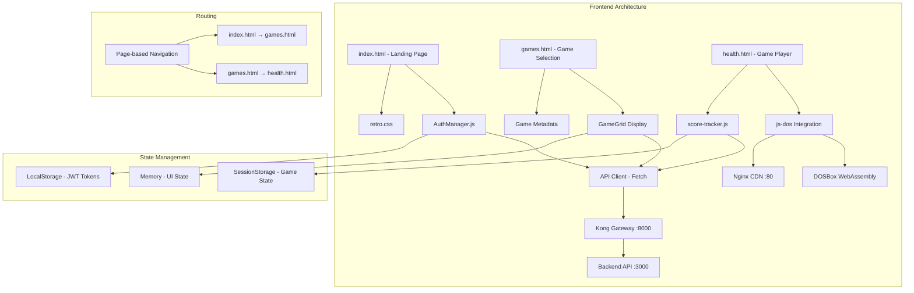
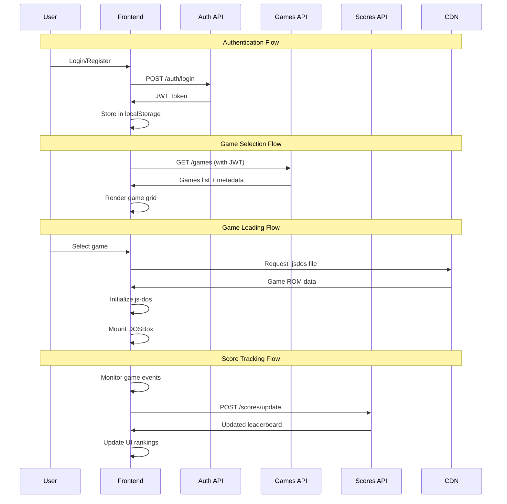
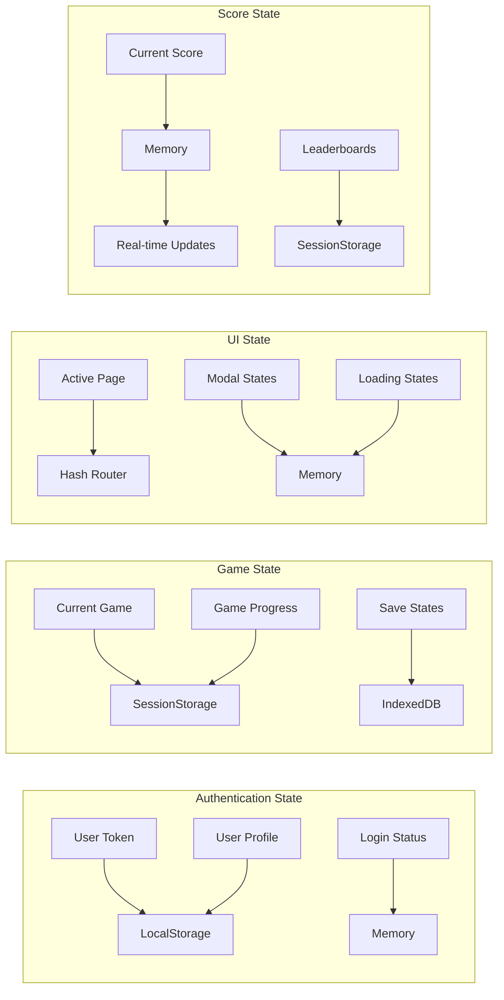
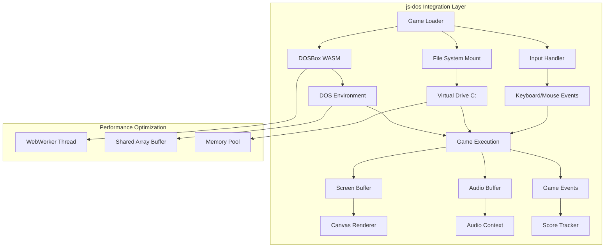

## Arquitectura del Frontend

El frontend de Retro Game Hub es una aplicación web estática con diseño retro años 80, construida con HTML/CSS/JS vanilla, enfocada en proporcionar una experiencia nostálgica de terminal para jugar juegos clásicos de DOS.

### Características Principales

<CardGroup cols={2}>
  <Card title="Diseño Retro" icon="terminal">
    Estética de terminal CRT años 80 con CSS personalizado
  </Card>
  <Card title="js-dos Integration" icon="gamepad">
    Emulador DOSBox WebAssembly en el navegador
  </Card>
  <Card title="Autenticación JWT" icon="key">
    Sistema seguro de login/registro con tokens
  </Card>
  <Card title="Rankings en Vivo" icon="trophy">
    Leaderboards actualizados dinámicamente
  </Card>
</CardGroup>

## Stack Tecnológico

```yaml
Frontend:
  - HTML5/CSS3/JavaScript vanilla (sin frameworks)
  - js-dos 7.x (DOSBox WebAssembly)
  - Font: VT323 (Google Fonts) para estética retro
  - Score tracker modular (score-tracker.js)

Servidor Frontend:
  - Node.js + Express
  - Puerto: 8080
  - Sirve archivos estáticos
  - Proxy requests a Kong Gateway

CDN Local:
  - Nginx para juegos (.jsdos)
  - Puerto: 80
  - Sirve ROMs e imágenes
  - Cache de assets estáticos
```

## Arquitectura de Componentes



## Flujo de Datos y API Calls



## Gestión de Estado



## Integración js-dos



## Estructura de Archivos

```

frontend/
├── server.js              # Express server
├── package.json          # Dependencias
├── Dockerfile           # Contenedor para K8s
├── index.html          # Landing page + Auth
├── games.html         # Game selection grid
├── health.html       # Health check page
├── retro.css        # Estilos retro globales
├── js/
│   ├── auth-manager.js    # Gestión de autenticación
│   ├── game-loader.js     # Carga y inicialización de juegos
│   ├── api-client.js      # Cliente para APIs
│   ├── router.js          # Enrutamiento hash-based
│   ├── ui-components.js   # Componentes UI reutilizables
│   └── state-manager.js   # Gestión de estado global
├── score-tracker.js # Gestión de puntuaciones
└── jsdos/          # js-dos library
    ├── js-dos.js
    ├── wdosbox.js
    └── emulators/

```

## Páginas Principales

### Landing Page (index.html)

<Accordion title="Ver detalles de index.html">

La página principal incluye:

* *Características:**

- Sistema de login/registro con JWT

- Validación de formularios en tiempo real

- Diseño responsive con grid animado

- Efecto CRT con scanlines

- Transiciones suaves entre estados

* *Componentes:**

- `AuthForm`: Formularios de login/registro

- `WelcomeScreen`: Pantalla de bienvenida

- `LoadingSpinner`: Indicadores de carga retro

</Accordion>

### Game Selection (games.html)

<Accordion title="Ver detalles de games.html">

Grid de selección de juegos con:

* *Características:**

- Filtros por categoría y año

- Búsqueda en tiempo real

- Thumbnails animados

- Información detallada de cada juego

- Leaderboards por juego

* *Componentes:**

- `GameGrid`: Cuadrícula de juegos

- `GameCard`: Tarjeta individual de juego

- `FilterPanel`: Panel de filtros

- `SearchBar`: Barra de búsqueda

</Accordion>

### Game Player

<Accordion title="Ver detalles del reproductor">

Interfaz de juego con:

* *Características:**

- Emulador js-dos embebido

- Controles de pantalla completa

- Sistema de guardado/carga

- Tracker de puntuaciones en vivo

- Chat opcional entre jugadores

* *Componentes:**

- `DosEmulator`: Wrapper del emulador

- `GameControls`: Controles de juego

- `ScoreDisplay`: Visualización de puntuación

- `SaveStateManager`: Gestión de partidas guardadas

</Accordion>

## Routing y Navegación

El sistema utiliza routing basado en hash para navegación SPA:

```javascript
// Rutas principales
#/                    // Landing page
#/games              // Selección de juegos
#/play/:gameId       // Reproductor de juego
#/leaderboards       // Rankings globales
#/profile           // Perfil de usuario

```

## Optimizaciones de Rendimiento

- **Lazy Loading**: Carga bajo demanda de componentes js-dos

- **Service Workers**: Cache de assets y juegos

- **WebAssembly**: DOSBox compilado para máximo rendimiento

- **Memory Management**: Gestión cuidadosa de memoria en emulación

- **Asset Compression**: Compresión de ROMs y recursos estáticos