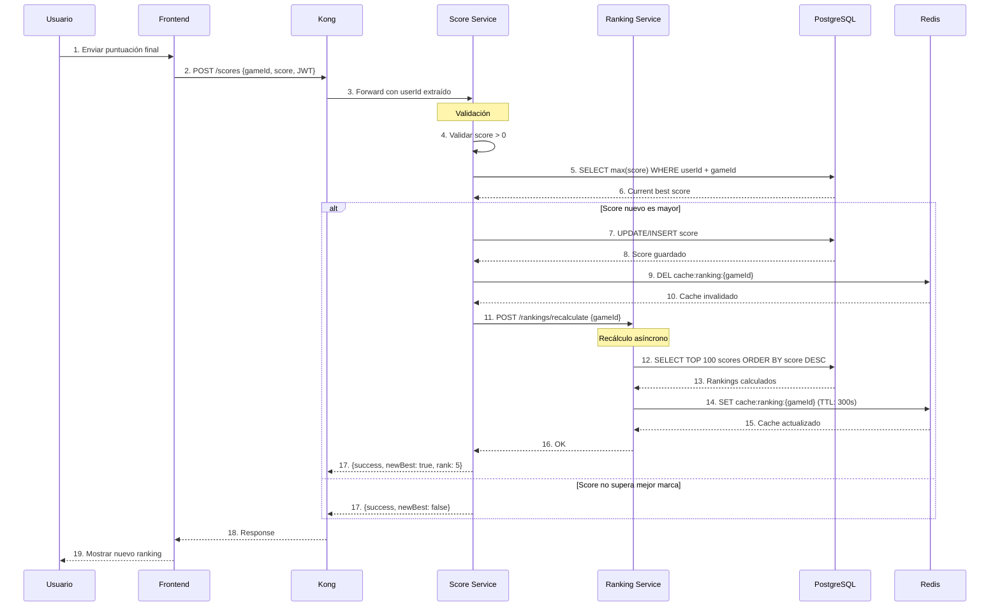

# 6.10. Flujo de Datos de Puntuaciones y Ranking

## Visión General del Flujo

El proceso de guardado de puntuaciones y actualización de rankings es uno de los flujos más críticos de RetroGameCloud. Involucra múltiples servicios y requiere una coordinación precisa para mantener la consistencia de datos y el rendimiento del sistema.

<Note>
Este flujo se ejecuta cada vez que un usuario completa una partida y se registra una nueva puntuación, siendo fundamental para la experiencia de usuario y la integridad del sistema de rankings.
</Note>

## Componentes Involucrados

<Tabs>
<Tab title="Servicios Backend">
- **Score Service**: Gestiona el almacenamiento y validación de puntuaciones
- **Ranking Service**: Calcula y mantiene los rankings actualizados
- **Kong API Gateway**: Enruta peticiones y extrae información del JWT
</Tab>
<Tab title="Almacenamiento">
- **PostgreSQL**: Base de datos principal para persistencia de scores
- **Redis**: Caché de rankings para optimización de rendimiento
- **TTL de caché**: 300 segundos (5 minutos)
</Tab>
<Tab title="Frontend">
- **React App**: Interfaz de usuario que envía las puntuaciones
- **JS-DOS Emulator**: Genera los eventos de finalización de partida
</Tab>
</Tabs>

## Diagrama de Secuencia Completo



## Fases del Procesamiento

### 1. Recepción y Autenticación

<Card title="Validación de Entrada" icon="shield-check">
- Kong extrae el `userId` del JWT token
- Validación de parámetros: `gameId`, `score`, y token válido
- Rate limiting aplicado para prevenir spam
</Card>

### 2. Validación de Puntuación

```javascript
// Ejemplo de validación en Score Service
const validateScore = async (userId, gameId, newScore) => {
  // Validar que el score sea positivo
  if (newScore <= 0) {
    throw new ValidationError('Score debe ser mayor que 0');
  }
  
  // Obtener mejor puntuación actual
  const currentBest = await db.query(
    'SELECT MAX(score) as best_score FROM scores WHERE user_id = ? AND game_id = ?',
    [userId, gameId]
  );
  
  return {
    isNewBest: newScore > (currentBest?.best_score || 0),
    currentBest: currentBest?.best_score
  };
};
```

### 3. Persistencia de Datos

<Tabs>
<Tab title="Nuevo Récord">
```sql
-- Query para actualizar/insertar nueva mejor puntuación
INSERT INTO scores (user_id, game_id, score, created_at)
VALUES (?, ?, ?, NOW())
ON CONFLICT (user_id, game_id)
DO UPDATE SET 
  score = EXCLUDED.score,
  updated_at = NOW()
WHERE scores.score < EXCLUDED.score;
```
</Tab>
<Tab title="Score Inferior">
```sql
-- Query para registrar score que no es récord personal
INSERT INTO score_history (user_id, game_id, score, created_at)
VALUES (?, ?, ?, NOW());
```
</Tab>
</Tabs>

### 4. Invalidación de Caché

<Warning>
La invalidación del caché es crítica para mantener la consistencia. Se ejecuta inmediatamente después del guardado exitoso en base de datos.
</Warning>

```javascript
// Invalidación del caché de rankings
const invalidateRankingCache = async (gameId) => {
  const cacheKey = `cache:ranking:${gameId}`;
  await redis.del(cacheKey);
  
  // Log para auditoría
  logger.info(`Cache invalidated for game ${gameId}`, {
    key: cacheKey,
    timestamp: new Date().toISOString()
  });
};
```

### 5. Recálculo Asíncrono

El Ranking Service procesa la solicitud de recálculo:

```javascript
// Recálculo de rankings top 100
const recalculateRankings = async (gameId) => {
  const rankings = await db.query(`
    SELECT 
      u.username,
      s.score,
      s.updated_at,
      ROW_NUMBER() OVER (ORDER BY s.score DESC) as rank
    FROM scores s
    JOIN users u ON s.user_id = u.id
    WHERE s.game_id = ?
    ORDER BY s.score DESC
    LIMIT 100
  `, [gameId]);
  
  // Actualizar caché con TTL de 5 minutos
  await redis.setex(
    `cache:ranking:${gameId}`,
    300,
    JSON.stringify(rankings)
  );
  
  return rankings;
};
```

## Manejo de Errores

### Errores Comunes y Resolución

<Tabs>
<Tab title="Errores de Validación">
- **Score inválido**: Valores negativos o no numéricos
- **Game ID inexistente**: Validación contra catálogo de juegos
- **Usuario no autenticado**: JWT token inválido o expirado

**Respuesta**: `400 Bad Request` con detalles del error
</Tab>
<Tab title="Errores de Base de Datos">
- **Conexión perdida**: Reintento automático con backoff exponencial
- **Constraint violations**: Manejo de concurrencia en updates
- **Timeout de queries**: Límite de 5 segundos por operación

**Respuesta**: `500 Internal Server Error` con log detallado
</Tab>
<Tab title="Errores de Caché">
- **Redis no disponible**: Degradación graceful, rankings desde DB
- **Cache miss**: Recálculo automático en background
- **TTL expirado**: Regeneración transparente para el usuario
</Tab>
</Tabs>

## Optimizaciones de Rendimiento

### Estrategias Implementadas

1. **Caché con TTL**: Rankings cacheados por 5 minutos
2. **Recálculo asíncrono**: No bloquea la respuesta al usuario
3. **Índices de base de datos**: Optimización de queries de ranking
4. **Lazy loading**: Rankings se cargan bajo demanda

### Métricas de Monitoreo

<Note>
Las siguientes métricas se monitorizan en Prometheus para detectar problemas de rendimiento:
</Note>

- **Latencia p95** del flujo completo: < 500ms objetivo
- **Rate de cache hit** en Redis: > 80% objetivo  
- **Tiempo de recálculo** de rankings: < 2s objetivo
- **Errores de validación**: < 1% de las requests

## Consideraciones de Escalabilidad

### Puntos de Optimización Futura

1. **Particionado de rankings**: Por región geográfica o categoría de juego
2. **Background jobs**: Queue system para recálculos masivos
3. **Read replicas**: Separar lecturas de rankings de escrituras de scores
4. **CDN caching**: Cache de rankings populares a nivel de CDN

<Warning>
En picos de tráfico (lanzamientos de juegos nuevos), considerar incrementar el TTL del caché a 10 minutos y usar batching para los recálculos.
</Warning>