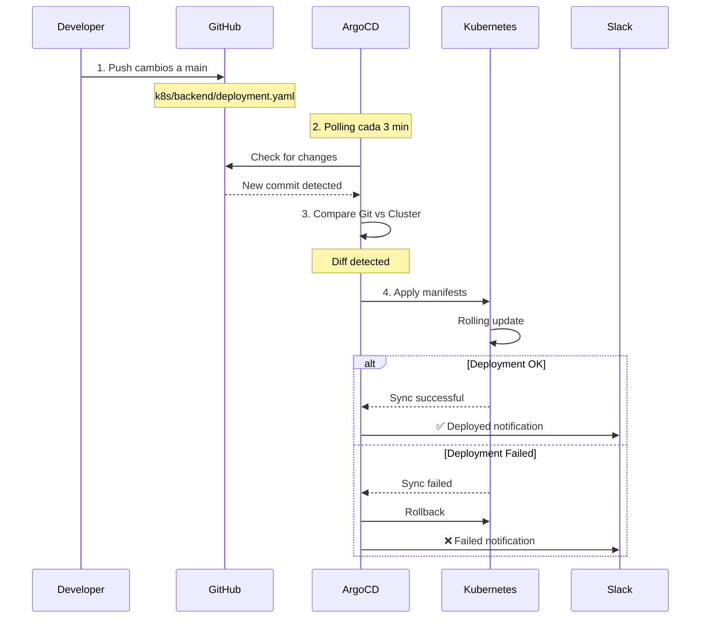

## 🎯 Descripción General

ArgoCD es la herramienta de **GitOps** que gestiona el despliegue continuo de aplicaciones en el cluster EKS. Garantiza que el estado del cluster siempre refleje lo definido en Git.

<Info>
**GitOps**: Git como única fuente de verdad. Cualquier cambio en los manifiestos se aplica automáticamente al cluster.
</Info>

## 📦 Versión Instalada

- **ArgoCD**: v2.9.3
- **Instalación**: Helm Chart
- **Namespace**: `argocd`
- **Acceso**: https://retrogamehub.games/argocd

## 🔐 Autenticación

### OAuth2 con GitHub
ArgoCD está protegido con autenticación OAuth2 usando GitHub:

```yaml
server:
  ingress:
    annotations:
      nginx.ingress.kubernetes.io/auth-signin: "https://oauth2.retrogamehub.games/oauth2/start"
      nginx.ingress.kubernetes.io/auth-url: "https://oauth2.retrogamehub.games/oauth2/auth"
```

**Usuarios autorizados**: Definidos en OAuth2 Proxy ConfigMap

### Credenciales Admin

<Warning>
Credenciales solo para emergencias. Usa GitHub OAuth2 para acceso normal.
</Warning>

```bash
# Usuario
admin

# Password (obtener)
kubectl get secret argocd-initial-admin-secret -n argocd \
  -o jsonpath="{.data.password}" | base64 -d
```

## 🏗️ Aplicaciones Desplegadas

### Backend Application
```yaml
# argocd/apps/backend-app.yaml
apiVersion: argoproj.io/v1alpha1
kind: Application
metadata:
  name: backend
  namespace: argocd
spec:
  project: default
  source:
    repoURL: https://github.com/retrogamecloud/infrastructure.git
    targetRevision: main
    path: k8s/backend
  destination:
    server: https://kubernetes.default.svc
    namespace: retrogame
  syncPolicy:
    automated:
      prune: true
      selfHeal: true
    syncOptions:
      - CreateNamespace=true
  ignoreDifferences:
    - group: apps
      kind: Deployment
      jsonPointers:
        - /spec/replicas
```

**Características**:
- ✅ Auto-sync habilitado (polling cada 3 minutos)
- ✅ Self-heal: Revierte cambios manuales
- ✅ Prune: Elimina recursos borrados del Git
- ✅ Ignora diferencias en réplicas (permite escalado manual temporal)

### Frontend Application
```yaml
# argocd/apps/frontend-app.yaml
metadata:
  name: frontend
spec:
  source:
    path: k8s/frontend
  # Resto similar a backend
```

### Kong Gateway Application
```yaml
# argocd/apps/kong-app.yaml
metadata:
  name: kong
spec:
  source:
    path: k8s/kong
  # Resto similar a backend
```

## 🏥 Health Checks Personalizados

ArgoCD usa health checks personalizados para detectar mejor el estado de los Deployments:

```yaml
# argocd/health-checks/argocd-cm-health.yaml
data:
  resource.customizations.health.apps_Deployment: |
    hs = {}
    hs.status = "Progressing"
    
    if obj.status.conditions then
      for i, condition in ipairs(obj.status.conditions) do
        -- Detectar fallo de deployment
        if condition.type == "Progressing" and 
           condition.reason == "ProgressDeadlineExceeded" then
          hs.status = "Degraded"
          hs.message = condition.message
          return hs
        end
        
        -- Detectar deployment exitoso
        if condition.type == "Progressing" and 
           condition.reason == "NewReplicaSetAvailable" then
          hs.status = "Healthy"
          return hs
        end
      end
    end
    
    -- Verificar que todas las réplicas están listas
    if obj.status.replicas == obj.status.updatedReplicas and
       obj.status.availableReplicas == obj.status.replicas then
      hs.status = "Healthy"
      hs.message = "All replicas are ready"
    end
    
    return hs
    
  timeout.reconciliation: "180s"
```

**Mejoras**:
- ✅ Detecta `ProgressDeadlineExceeded` → Estado `Degraded`
- ✅ Verifica que todas las réplicas estén realmente listas
- ✅ Timeout de 180s para deployments lentos

## 📢 Notificaciones a Slack

ArgoCD envía notificaciones automáticas al canal `#argocdretrogame`:

### Configuración
```yaml
# argocd/notifications/argocd-notifications-cm.yaml
data:
  service.slack: |
    apiURL: https://hooks.slack.com/services/T09UHLJLU1E/B09UJS3DR6Y/...
  
  # 3 Triggers configurados
  trigger.on-deployed: |
    - send: [app-deployed]
      when: app.status.operationState.phase == 'Succeeded' and 
            app.status.health.status == 'Healthy'
  
  trigger.on-sync-failed: |
    - send: [app-sync-failed]
      when: app.status.operationState.phase in ['Error', 'Failed']
  
  trigger.on-health-degraded: |
    - send: [app-health-degraded]
      when: app.status.health.status == 'Degraded'
```

### Tipos de Notificaciones

<CardGroup cols={3}>
  <Card title="✅ Deployed" icon="check" color="#2eb886">
    Aplicación desplegada exitosamente
  </Card>
  <Card title="❌ Sync Failed" icon="xmark" color="#e01e5a">
    Fallo en la sincronización
  </Card>
  <Card title="⚠️ Degraded" icon="triangle-exclamation" color="#ecb22e">
    Aplicación en estado degradado
  </Card>
</CardGroup>

## 🔄 Flujo GitOps



## 📁 Estructura de Repositorio

```bash
infrastructure/
├── argocd/
│   ├── apps/
│   │   ├── backend-app.yaml       # Backend application
│   │   ├── frontend-app.yaml      # Frontend application
│   │   └── kong-app.yaml          # Kong gateway application
│   ├── health-checks/
│   │   └── argocd-cm-health.yaml  # Custom health checks
│   └── notifications/
│       ├── argocd-notifications-cm.yaml    # Slack config
│       └── README.md                       # Setup guide
└── k8s/
    ├── backend/
    │   ├── deployment.yaml
    │   ├── service.yaml
    │   └── secrets.yaml
    ├── frontend/
    │   ├── deployment.yaml
    │   └── service.yaml
    └── kong/
        ├── deployment.yaml
        ├── service.yaml
        └── configmap.yaml
```

## 🛠️ Comandos Útiles

### Ver Estado de Aplicaciones
```bash
# CLI
kubectl get applications -n argocd

# Salida
# NAME       SYNC STATUS   HEALTH STATUS
# backend    Synced        Healthy
# frontend   Synced        Healthy
# kong       Synced        Healthy
```

### Forzar Sincronización Manual
```bash
# Desde UI: Click en "SYNC" en la aplicación

# Desde CLI (si instalas argocd CLI)
argocd app sync backend --force
```

### Ver Logs de ArgoCD
```bash
# Application Controller
kubectl logs -n argocd -l app.kubernetes.io/name=argocd-application-controller

# Notifications Controller
kubectl logs -n argocd -l app.kubernetes.io/name=argocd-notifications-controller

# Server
kubectl logs -n argocd -l app.kubernetes.io/name=argocd-server
```

### Reiniciar Componentes
```bash
# Restart all ArgoCD
kubectl rollout restart deployment -n argocd

# Solo server (UI)
kubectl rollout restart deployment argocd-server -n argocd

# Solo notifications
kubectl rollout restart deployment argocd-notifications-controller -n argocd
```

## 🔧 Configuración vs Terraform

<Warning>
Los recursos de Kubernetes antes gestionados por Terraform ahora están **comentados** en `terraform/eks/kubernetes.tf` para evitar conflictos con ArgoCD.
</Warning>

### Recursos Comentados (Gestionados por ArgoCD)
- ✅ `kubernetes_deployment.backend`
- ✅ `kubernetes_service.backend`
- ✅ `kubernetes_deployment.frontend`
- ✅ `kubernetes_service.frontend`
- ✅ `kubernetes_deployment.kong`
- ✅ `kubernetes_service.kong`

### Recursos en Terraform (No gestionados por ArgoCD)
- ✅ `kubernetes_namespace.retrogame`
- ✅ `kubernetes_secret.jwt_secret`
- ✅ `kubernetes_config_map.frontend_replacer`
- ✅ Ingresses y Route53
- ✅ RDS, S3, CloudFront

**Rollback**: Descomentar recursos en `kubernetes.tf` y ejecutar:
```bash
cd terraform/eks
terraform apply
```

## 🎯 Ventajas de GitOps con ArgoCD

<CardGroup cols={2}>
  <Card title="🔄 Sincronización Automática" icon="arrows-rotate">
    Cambios en Git se aplican automáticamente cada 3 minutos
  </Card>
  <Card title="🔙 Rollback Fácil" icon="clock-rotate-left">
    Revert del commit = rollback automático
  </Card>
  <Card title="👁️ Visibilidad Completa" icon="eye">
    UI visual del estado real vs deseado
  </Card>
  <Card title="🔐 Auditoría" icon="file-shield">
    Todo cambio queda registrado en Git
  </Card>
  <Card title="🛡️ Self-Healing" icon="shield">
    Revierte cambios manuales no autorizados
  </Card>
  <Card title="📢 Notificaciones" icon="bell">
    Alertas en Slack de cada deployment
  </Card>
</CardGroup>

## 🐛 Troubleshooting

### Aplicación OutOfSync

**Problema**: La aplicación muestra estado `OutOfSync`

**Solución**:
```bash
# Ver diferencias
kubectl get application backend -n argocd -o yaml

# Sincronizar manualmente
kubectl patch application backend -n argocd \
  --type merge -p '{"operation":{"sync":{"revision":"HEAD"}}}'
```

### Self-Heal No Funciona

**Verificar sync policy**:
```bash
kubectl get application backend -n argocd -o jsonpath='{.spec.syncPolicy.automated}'
# Debe mostrar: {"prune":true,"selfHeal":true}
```

### Notificaciones No Llegan

**Ver logs**:
```bash
kubectl logs -n argocd -l app.kubernetes.io/name=argocd-notifications-controller --tail=50
```

**Probar webhook manualmente**:
```bash
curl -X POST https://hooks.slack.com/services/... \
  -H 'Content-Type: application/json' \
  -d '{"text":"Test desde ArgoCD"}'
```

## 📚 Referencias

- [ArgoCD Documentation](https://argo-cd.readthedocs.io/)
- [GitOps Principles](https://opengitops.dev/)
- [Health Assessment](https://argo-cd.readthedocs.io/en/stable/operator-manual/health/)
- [Notifications Catalog](https://argo-cd.readthedocs.io/en/stable/operator-manual/notifications/catalog/)

<Note>
**Próximas mejoras**: ApplicationSets para gestionar múltiples aplicaciones, Argo Rollouts para progressive delivery.
</Note>
