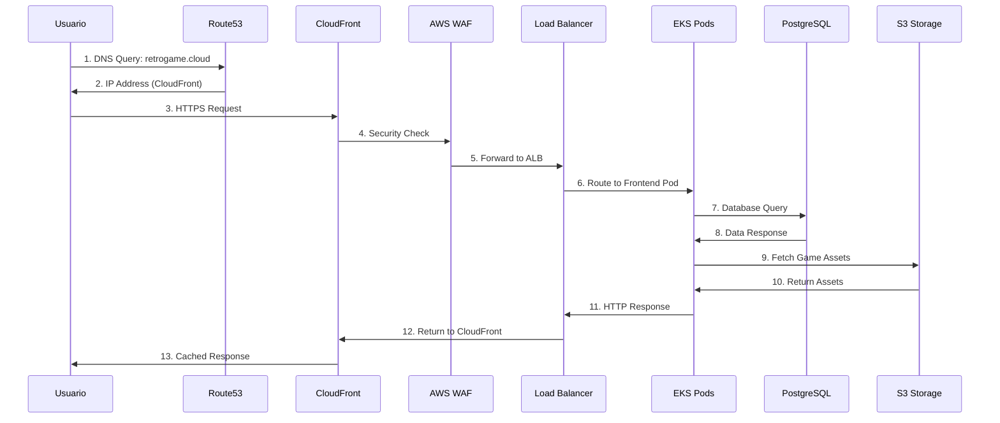
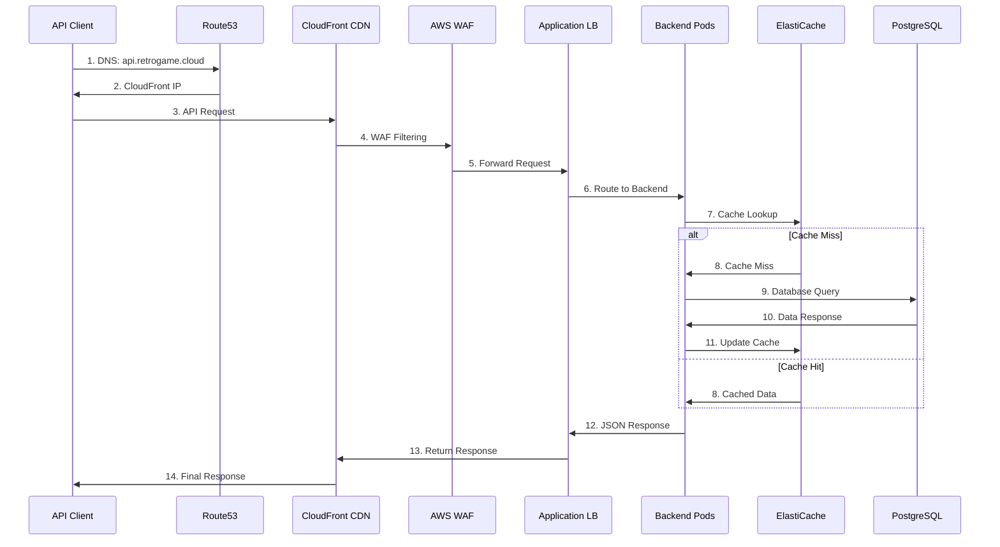
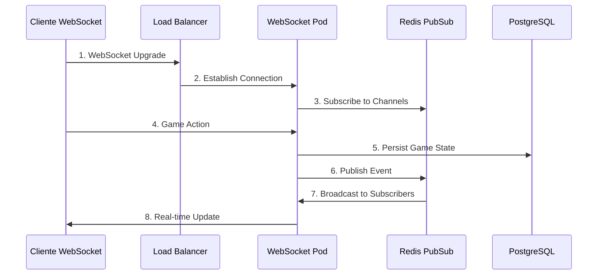

# Topología de Infraestructura AWS

Esta página documenta la arquitectura completa de AWS para la plataforma RetroGameCloud, mostrando todos los componentes de infraestructura distribuidos en múltiples zonas de disponibilidad, sus interconexiones y flujos de tráfico.

## Diagrama de Topología Completa

```mermaid
graph TB
    subgraph Internet[🌐 Internet]
        U[👥 Usuarios Globales]
        API_EXT[🔌 APIs Externas]
        DEV[👨‍💻 Desarrolladores]
    end

    subgraph Route53[📍 Route 53 DNS]
        DNS_MAIN[retrogame.cloud]
        DNS_API[api.retrogame.cloud]
        DNS_CDN[cdn.retrogame.cloud]
        DNS_ADMIN[admin.retrogame.cloud]
    end

    subgraph CloudFront[⚡ CloudFront Global CDN]
        CF_WEB[Web Distribution<br/>Static Assets]
        CF_API[API Distribution<br/>Dynamic Content]
        CF_ASSETS[Assets Distribution<br/>Game Files]
    end

    subgraph WAF[🛡️ AWS WAF]
        WAF_RULES[DDoS Protection<br/>Rate Limiting<br/>SQL Injection]
    end

    subgraph Region[🌍 us-east-1 Virginia]
        subgraph VPC[🏢 VPC RetroGameCloud<br/>CIDR: 10.0.0.0/16]

            subgraph IGW_ZONE[Internet Gateway Zone]
                IGW[🌐 Internet Gateway]
            end

            subgraph AZ1[📍 Availability Zone us-east-1a]
                subgraph PUB1[🌐 Public Subnet<br/>10.0.1.0/24]
                    ALB1[⚖️ Application Load Balancer<br/>Primary]
                    NAT1[🔄 NAT Gateway 1<br/>Elastic IP]
                    BASTION1[🔐 Bastion Host 1]
                end

                subgraph PRIV1[🔒 Private Subnet<br/>10.0.11.0/24]
                    subgraph EKS1[☸️ EKS Node Group 1<br/>t3.large instances]
                        subgraph PODS1[Pod Network]
                            FE1[🎮 Frontend Pods]
                            BE1[⚙️ Backend Pods]
                            GA1[🎯 Game API Pods]
                            WS1[🔌 WebSocket Pods]
                        end
                    end
                end

                subgraph DATA1[💾 Data Subnet<br/>10.0.21.0/24]
                    RDS1[🗄️ RDS Primary<br/>PostgreSQL Multi-AZ]
                    REDIS1[⚡ ElastiCache Primary<br/>Redis Cluster]
                end
            end

            subgraph AZ2[📍 Availability Zone us-east-1b]
                subgraph PUB2[🌐 Public Subnet<br/>10.0.2.0/24]
                    ALB2[⚖️ Application Load Balancer<br/>Secondary]
                    NAT2[🔄 NAT Gateway 2<br/>Elastic IP]
                    BASTION2[🔐 Bastion Host 2]
                end

                subgraph PRIV2[🔒 Private Subnet<br/>10.0.12.0/24]
                    subgraph EKS2[☸️ EKS Node Group 2<br/>t3.large instances]
                        subgraph PODS2[Pod Network]
                            FE2[🎮 Frontend Pods]
                            BE2[⚙️ Backend Pods]
                            GA2[🎯 Game API Pods]
                            WS2[🔌 WebSocket Pods]
                        end
                    end
                end

                subgraph DATA2[💾 Data Subnet<br/>10.0.22.0/24]
                    RDS2[🗄️ RDS Standby<br/>Read Replica]
                    REDIS2[⚡ ElastiCache Secondary<br/>Redis Replica]
                end
            end

            subgraph AZ3[📍 Availability Zone us-east-1c]
                subgraph PUB3[🌐 Public Subnet<br/>10.0.3.0/24]
                    NAT3[🔄 NAT Gateway 3<br/>Elastic IP]
                end

                subgraph PRIV3[🔒 Private Subnet<br/>10.0.13.0/24]
                    subgraph EKS3[☸️ EKS Node Group 3<br/>t3.medium instances]
                        subgraph PODS3[Pod Network]
                            BE3[⚙️ Backend Pods]
                            GA3[🎯 Game API Pods]
                        end
                    end
                end
            end

            subgraph STORAGE[📦 Storage Services]
                S3_GAMES[🎮 S3 Games Bucket<br/>Game ROMs & Assets]
                S3_STATIC[📄 S3 Static Bucket<br/>Web Assets]
                S3_BACKUP[💾 S3 Backup Bucket<br/>Database Backups]
            end

            subgraph CONTROL[🎛️ Control Plane]
                EKS_CP[☸️ EKS Control Plane<br/>Managed Service]
                ECR[📦 ECR Registry<br/>Container Images]
                SECRETS[🔐 Secrets Manager<br/>API Keys & Passwords]
            end

        end
    end

    %% Traffic Flow Connections
    U --> DNS_MAIN
    DEV --> DNS_ADMIN
    API_EXT --> DNS_API

    DNS_MAIN --> CF_WEB
    DNS_API --> CF_API
    DNS_CDN --> CF_ASSETS

    CF_WEB --> WAF_RULES
    CF_API --> WAF_RULES
    CF_ASSETS --> S3_STATIC

    WAF_RULES --> IGW
    IGW --> ALB1
    IGW --> ALB2

    ALB1 --> EKS1
    ALB2 --> EKS2

    PODS1 --> NAT1
    PODS2 --> NAT2
    PODS3 --> NAT3

    NAT1 --> IGW
    NAT2 --> IGW
    NAT3 --> IGW

    PODS1 --> RDS1
    PODS2 --> RDS1
    PODS3 --> RDS1
    RDS1 --> RDS2

    PODS1 --> REDIS1
    PODS2 --> REDIS1
    PODS3 --> REDIS1
    REDIS1 --> REDIS2

    PODS1 --> S3_GAMES
    PODS2 --> S3_GAMES
    PODS3 --> S3_GAMES

    EKS1 --> EKS_CP
    EKS2 --> EKS_CP
    EKS3 --> EKS_CP

    BASTION1 --> PRIV1
    BASTION2 --> PRIV2

    classDef internet fill:#e1f5fe
    classDef aws fill:#ff9800
    classDef vpc fill:#4caf50
    classDef public fill:#2196f3
    classDef private fill:#9c27b0
    classDef data fill:#f44336
    classDef storage fill:#ff5722
    classDef control fill:#607d8b

    class Internet,U,API_EXT,DEV internet
    class Route53,CloudFront,WAF aws
    class VPC,IGW_ZONE vpc
    class PUB1,PUB2,PUB3,ALB1,ALB2,NAT1,NAT2,NAT3,BASTION1,BASTION2 public
    class PRIV1,PRIV2,PRIV3,EKS1,EKS2,EKS3,PODS1,PODS2,PODS3 private
    class DATA1,DATA2,RDS1,RDS2,REDIS1,REDIS2 data
    class STORAGE,S3_GAMES,S3_STATIC,S3_BACKUP storage
    class CONTROL,EKS_CP,ECR,SECRETS control
```



## Flujos de Tráfico Principal

### 1. Flujo de Usuario Web



### 2. Flujo de API REST



### 3. Flujo WebSocket Tiempo Real



## Configuración de Red Detallada

### Virtual Private Cloud (VPC)

| Componente | CIDR | Descripción |
|------------|------|-------------|
| **VPC Principal** | `10.0.0.0/16` | Red privada principal (65,536 IPs) |
| **Subnets Públicas** | `10.0.1-3.0/24` | 3 subnets públicas (256 IPs c/u) |
| **Subnets Privadas** | `10.0.11-13.0/24` | 3 subnets privadas para aplicaciones |
| **Subnets de Datos** | `10.0.21-23.0/24` | 3 subnets para bases de datos |

### Routing Tables

#### Public Subnet Route Table
```bash
Destination         Target
10.0.0.0/16        Local
0.0.0.0/0          Internet Gateway (igw-xxx)
```

#### Private Subnet Route Table
```bash
Destination         Target
10.0.0.0/16        Local
0.0.0.0/0          NAT Gateway (nat-xxx)
```

#### Database Subnet Route Table
```bash
Destination         Target
10.0.0.0/16        Local
# No internet access for security
```

## Security Groups Detallados

### ALB Security Group
```yaml
Name: retrogame-alb-sg
Ingress Rules:
  - Port: 80 (HTTP) from 0.0.0.0/0
  - Port: 443 (HTTPS) from 0.0.0.0/0
Egress Rules:
  - Port: 3000-3010 to EKS Security Group
  - Port: 8080 to EKS Security Group
```

### EKS Nodes Security Group
```yaml
Name: retrogame-eks-nodes-sg
Ingress Rules:
  - Port: 3000-3010 from ALB Security Group
  - Port: 8080 from ALB Security Group
  - Port: 22 from Bastion Security Group
  - All traffic from self (inter-node communication)
Egress Rules:
  - Port: 5432 to RDS Security Group
  - Port: 6379 to Redis Security Group
  - Port: 443 to 0.0.0.0/0 (HTTPS)
  - Port: 80 to 0.0.0.0/0 (HTTP)
```

### RDS Security Group
```yaml
Name: retrogame-rds-sg
Ingress Rules:
  - Port: 5432 from EKS Nodes Security Group
  - Port: 5432 from Bastion Security Group
Egress Rules:
  - None (database doesn't need outbound)
```

### ElastiCache Security Group
```yaml
Name: retrogame-redis-sg
Ingress Rules:
  - Port: 6379 from EKS Nodes Security Group
Egress Rules:
  - None (cache doesn't need outbound)
```

### Bastion Security Group
```yaml
Name: retrogame-bastion-sg
Ingress Rules:
  - Port: 22 from Admin IP ranges
Egress Rules:
  - Port: 22 to EKS Nodes Security Group
  - Port: 5432 to RDS Security Group
  - Port: 443 to 0.0.0.0/0
```

## Servicios AWS por Zona de Disponibilidad

### us-east-1a (Zona Principal)
- **Compute**: EKS Node Group (3 x t3.large)
- **Database**: RDS Primary Instance (db.r6g.large)
- **Cache**: ElastiCache Primary (cache.r6g.large)
- **Network**: ALB Primary, NAT Gateway, Bastion Host

### us-east-1b (Zona Secundaria)
- **Compute**: EKS Node Group (3 x t3.large)
- **Database**: RDS Standby (Automatic Failover)
- **Cache**: ElastiCache Read Replica
- **Network**: ALB Secondary, NAT Gateway, Bastion Host

### us-east-1c (Zona Adicional)
- **Compute**: EKS Node Group (2 x t3.medium)
- **Network**: NAT Gateway
- **Purpose**: Burst capacity y disaster recovery

## Configuración de EKS Detallada

### Node Groups Configuration

```yaml
NodeGroup-Primary:
  AvailabilityZones: [us-east-1a, us-east-1b]
  InstanceTypes: [t3.large]
  MinSize: 2
  MaxSize: 10
  DesiredCapacity: 6
  
NodeGroup-Burst:
  AvailabilityZones: [us-east-1c]
  InstanceTypes: [t3.medium, t3.large]
  MinSize: 0
  MaxSize: 5
  DesiredCapacity: 2
```

### Pod Distribution

| Servicio | AZ-1a | AZ-1b | AZ-1c | Total Pods |
|----------|-------|-------|-------|------------|
| **Frontend** | 2 | 2 | 0 | 4 |
| **Backend API** | 3 | 3 | 2 | 8 |
| **Game Service** | 2 | 2 | 1 | 5 |
| **WebSocket** | 2 | 2 | 0 | 4 |
| **Worker Jobs** | 1 | 1 | 1 | 3 |

## Base de Datos Multi-AZ

### PostgreSQL Configuration

```yaml
Engine: PostgreSQL 15.4
Instance Class: db.r6g.large
Multi-AZ: true
Primary AZ: us-east-1a
Standby AZ: us-east-1b
Storage: 500GB gp3 (3000 IOPS)
Backup Retention: 7 days
Maintenance Window: Sunday 03:00-04:00 UTC

Read Replicas:
  - Instance: db.r6g.medium
  - Location: us-east-1b
  - Purpose: Read-only queries
```

### ElastiCache Redis Cluster

```yaml
Engine: Redis 7.0
Node Type: cache.r6g.large
Num Cache Nodes: 2
Replication Groups: 1
Multi-AZ: true
Automatic Failover: Enabled
Backup Window: 02:00-03:00 UTC
Maintenance Window: Sunday 04:00-05:00 UTC
```

## Storage Distribution

### S3 Buckets Structure

```
retrogame-games-prod/
├── roms/
│   ├── nes/
│   ├── snes/
│   ├── gameboy/
│   └── genesis/
├── saves/
│   ├── user-1/
│   └── user-2/
└── screenshots/

retrogame-static-prod/
├── css/
├── js/
├── images/
└── fonts/

retrogame-backups-prod/
├── database/
├── user-data/
└── configs/
```

### CloudFront Distributions

| Distribution | Origin | Cache Behavior |
|--------------|--------|----------------|
| **Web Assets** | S3 Static Bucket | TTL: 24h, Gzip: Yes |
| **Game Files** | S3 Games Bucket | TTL: 7d, Range Requests: Yes |
| **API Calls** | ALB | TTL: 0, Forward Headers: Yes |

## Monitoreo y Logging

### CloudWatch Metrics

- **EKS Cluster**: CPU, Memory, Pod Count
- **RDS**: CPU, Connections, IOPS
- **ElastiCache**: CPU, Memory, Commands/sec
- **ALB**: Request Count, Latency, Error Rate
- **NAT Gateway**: Bandwidth, Packet Count

### Log Groups

```bash
/aws/eks/retrogame-cluster/cluster
/aws/rds/instance/retrogame-db-primary/postgresql
/aws/elasticache/retrogame-redis
/aws/applicationelb/retrogame-alb
/aws/lambda/retrogame-*
```

## Costos Estimados

### Compute Services
- **EKS Control Plane**: $73/month
- **EC2 Instances**: ~$400/month (8 nodes)
- **NAT Gateways**: $135/month (3 gateways)

### Database & Cache
- **RDS Multi-AZ**: $350/month
- **ElastiCache**: $200/month

### Storage & CDN
- **S3 Storage**: $50/month (1TB)
- **CloudFront**: $100/month
- **Data Transfer**: $90/month

**Total Estimado**: ~$1,398/month

## Consideraciones de Seguridad

### Network Security
- **VPC Flow Logs**: Habilitados para auditoría
- **Security Groups**: Principio de menor privilegio
- **NACLs**: Reglas adicionales de red
- **VPC Endpoints**: Para servicios AWS internos

### Data Protection
- **Encryption at Rest**: RDS, ElastiCache, S3
- **Encryption in Transit**: TLS 1.2+ obligatorio
- **Secrets Manager**: Rotación automática de credenciales
- **IAM Roles**: Permisos granulares por servicio

### Compliance
- **AWS Config**: Monitoreo de configuraciones
- **CloudTrail**: Auditoría de API calls
- **GuardDuty**: Detección de amenazas
- **AWS Security Hub**: Dashboard centralizado

Esta topología asegura alta disponibilidad, escalabilidad y seguridad para la plataforma RetroGameCloud, con redundancia automática y capacidad de recuperación ante fallos.