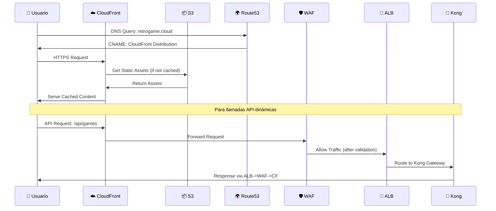
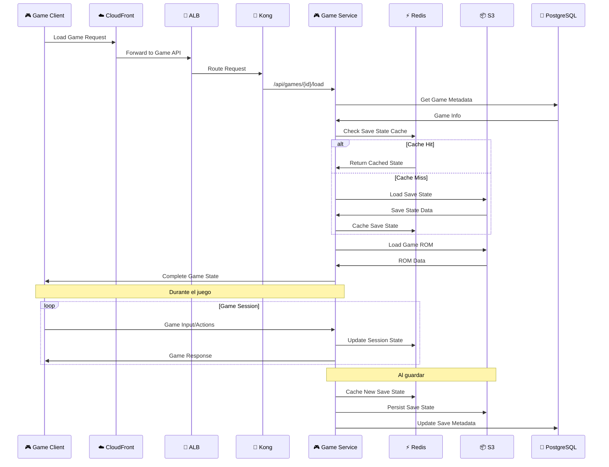

# Topología de Infraestructura AWS

Esta página documenta la arquitectura completa de AWS para la plataforma RetroGameCloud, mostrando todos los componentes de infraestructura distribuidos en múltiples zonas de disponibilidad y sus interconexiones.

## Diagrama de Topología Completa

```mermaid
graph TB
    subgraph Internet[Internet]
        U[👥 Usuarios Globales]
        API_EXT[🌐 APIs Externas]
        DEV[👨‍💻 Desarrolladores]
    end

    subgraph Route53[🌍 Route 53]
        DNS_MAIN[retrogame.cloud]
        DNS_API[api.retrogame.cloud]
        DNS_CDN[cdn.retrogame.cloud]
        DNS_HEALTH[Health Checks]
    end

    subgraph CloudFront[☁️ CloudFront Global]
        CF_WEB[Web Distribution<br/>Origin: S3/ALB]
        CF_API[API Distribution<br/>Origin: ALB]
        CF_ASSETS[Assets Distribution<br/>Origin: S3]
        CF_EDGE[Edge Locations<br/>Worldwide]
    end

    subgraph WAF[🛡️ AWS WAF]
        WAF_WEB[Web ACL<br/>DDoS Protection]
        WAF_API[API Protection<br/>Rate Limiting]
    end

    subgraph Region[🏢 us-east-1 Virginia]
        subgraph S3Global[📦 S3 Buckets]
            S3_WEB[Static Web Assets]
            S3_GAMES[Game ROMs/Files]
            S3_SAVES[Save States]
            S3_LOGS[Access Logs]
            S3_BACKUP[Database Backups]
        end

        subgraph VPC[🏠 VPC 10.0.0.0/16]
            subgraph IGW_SEC[Internet Gateway & Security]
                IGW[Internet Gateway]
                NACL[Network ACLs]
            end

            subgraph AZ1[📍 Availability Zone 1a]
                subgraph PUB1[🌐 Public Subnet 10.0.1.0/24]
                    ALB1[🔄 ALB Primary<br/>Target Groups]
                    NAT1[🚪 NAT Gateway 1<br/>Elastic IP]
                    BASTION1[🖥️ Bastion Host]
                end
                subgraph PRIV1[🔒 Private Subnet 10.0.11.0/24]
                    EKS1[⚙️ EKS Node Group 1<br/>t3.large instances]
                    subgraph PODS1[📦 Pods AZ-1a]
                        KONG1[🦍 Kong Gateway<br/>Replicas: 2]
                        AUTH1[🔐 Auth Service<br/>Replicas: 3]
                        GAME1[🎮 Game Service<br/>Replicas: 5]
                        PROFILE1[👤 Profile Service<br/>Replicas: 2]
                        NOTIFICATION1[📢 Notification<br/>Replicas: 2]
                    end
                end
                subgraph DATA1[🗄️ Data Subnet 10.0.21.0/24]
                    RDS1[🐘 RDS Primary<br/>PostgreSQL 15<br/>db.r6g.large]
                    REDIS1[⚡ Redis Primary<br/>cache.r6g.large]
                end
            end

            subgraph AZ2[📍 Availability Zone 1b]
                subgraph PUB2[🌐 Public Subnet 10.0.2.0/24]
                    ALB2[🔄 ALB Secondary]
                    NAT2[🚪 NAT Gateway 2<br/>Elastic IP]
                    BASTION2[🖥️ Bastion Host]
                end
                subgraph PRIV2[🔒 Private Subnet 10.0.12.0/24]
                    EKS2[⚙️ EKS Node Group 2<br/>t3.large instances]
                    subgraph PODS2[📦 Pods AZ-1b]
                        KONG2[🦍 Kong Gateway<br/>Replicas: 2]
                        AUTH2[🔐 Auth Service<br/>Replicas: 2]
                        GAME2[🎮 Game Service<br/>Replicas: 5]
                        PROFILE2[👤 Profile Service<br/>Replicas: 2]
                        NOTIFICATION2[📢 Notification<br/>Replicas: 2]
                    end
                end
                subgraph DATA2[🗄️ Data Subnet 10.0.22.0/24]
                    RDS2[🐘 RDS Standby<br/>Read Replica]
                    REDIS2[⚡ Redis Replica<br/>Read-only]
                end
            end

            subgraph AZ3[📍 Availability Zone 1c]
                subgraph PUB3[🌐 Public Subnet 10.0.3.0/24]
                    NAT3[🚪 NAT Gateway 3<br/>Elastic IP]
                end
                subgraph PRIV3[🔒 Private Subnet 10.0.13.0/24]
                    EKS3[⚙️ EKS Node Group 3<br/>t3.large instances]
                    subgraph PODS3[📦 Pods AZ-1c]
                        KONG3[🦍 Kong Gateway<br/>Replicas: 1]
                        AUTH3[🔐 Auth Service<br/>Replicas: 2]
                        GAME3[🎮 Game Service<br/>Replicas: 3]
                        BATCH[⚙️ Batch Jobs<br/>Game Processing]
                    end
                end
                subgraph DATA3[🗄️ Data Subnet 10.0.23.0/24]
                    BACKUP[💾 Backup Storage<br/>Cross-Region]
                end
            end

            subgraph EKS_CONTROL[☸️ EKS Control Plane]
                EKS_API[Kubernetes API<br/>Multi-AZ]
                EKS_ETCD[etcd Cluster<br/>Managed]
            end

            subgraph MONITORING[📊 Monitoring & Logging]
                CW_LOGS[CloudWatch Logs]
                CW_METRICS[CloudWatch Metrics]
                XRAY[X-Ray Tracing]
            end

        end

        subgraph EXTERNAL_SERVICES[🔌 External AWS Services]
            SES[📧 SES<br/>Email Service]
            SNS[📱 SNS<br/>Notifications]
            SQS[📬 SQS<br/>Message Queues]
            SECRETS[🔐 Secrets Manager]
            PARAM[⚙️ Parameter Store]
            KMS[🔑 KMS<br/>Encryption Keys]
        end

    end

    %% Conexiones principales
    U --> DNS_MAIN
    U --> CF_WEB
    API_EXT --> CF_API
    DEV --> BASTION1

    DNS_MAIN --> CF_WEB
    DNS_API --> CF_API
    DNS_CDN --> CF_ASSETS

    CF_WEB --> WAF_WEB
    CF_API --> WAF_API
    WAF_WEB --> ALB1
    WAF_API --> ALB1

    ALB1 --> KONG1
    ALB1 --> KONG2
    ALB2 --> KONG3

    KONG1 --> AUTH1
    KONG1 --> GAME1
    KONG1 --> PROFILE1

    AUTH1 --> RDS1
    GAME1 --> RDS1
    GAME1 --> REDIS1
    PROFILE1 --> RDS1

    RDS1 --> RDS2
    REDIS1 --> REDIS2

    GAME1 --> S3_GAMES
    GAME1 --> S3_SAVES
    CF_ASSETS --> S3_WEB

    EKS1 --> NAT1
    EKS2 --> NAT2
    EKS3 --> NAT3

    NAT1 --> IGW
    NAT2 --> IGW
    NAT3 --> IGW

    %% Estilo de nodos
    classDef aws fill:#FF9900,stroke:#232F3E,stroke-width:2px,color:#fff
    classDef data fill:#4CAF50,stroke:#2E7D32,stroke-width:2px,color:#fff
    classDef security fill:#F44336,stroke:#C62828,stroke-width:2px,color:#fff
    classDef compute fill:#2196F3,stroke:#1565C0,stroke-width:2px,color:#fff
    classDef network fill:#9C27B0,stroke:#6A1B9A,stroke-width:2px,color:#fff

    class CF_WEB,CF_API,CF_ASSETS,DNS_MAIN,DNS_API,DNS_CDN aws
    class RDS1,RDS2,REDIS1,REDIS2,S3_WEB,S3_GAMES,S3_SAVES data
    class WAF_WEB,WAF_API,BASTION1,BASTION2,KMS,SECRETS security
    class EKS1,EKS2,EKS3,KONG1,KONG2,KONG3,AUTH1,AUTH2,GAME1,GAME2 compute
    class ALB1,ALB2,NAT1,NAT2,NAT3,IGW network
```



## Security Groups y Reglas de Tráfico

### Matriz de Security Groups

```mermaid
graph TB
    subgraph SecurityGroups[🛡️ Security Groups Matrix]
        subgraph ALB_SG[ALB Security Group]
            ALB_IN[⬇️ Inbound<br/>Port 80,443 from 0.0.0.0/0<br/>Health Check ports]
            ALB_OUT[⬆️ Outbound<br/>To EKS Worker SG<br/>Port 30000-32767]
        end
        
        subgraph EKS_SG[EKS Worker Nodes SG]
            EKS_IN[⬇️ Inbound<br/>From ALB SG: 30000-32767<br/>From Control Plane: 443,10250<br/>Inter-node: All traffic]
            EKS_OUT[⬆️ Outbound<br/>To RDS SG: 5432<br/>To Redis SG: 6379<br/>Internet: 80,443]
        end
        
        subgraph RDS_SG[RDS Security Group]
            RDS_IN[⬇️ Inbound<br/>From EKS SG: 5432<br/>From Bastion SG: 5432]
            RDS_OUT[⬆️ Outbound<br/>None (implicit deny)]
        end
        
        subgraph REDIS_SG[Redis Security Group]
            REDIS_IN[⬇️ Inbound<br/>From EKS SG: 6379]
            REDIS_OUT[⬆️ Outbound<br/>None (implicit deny)]
        end
        
        subgraph BASTION_SG[Bastion Security Group]
            BASTION_IN[⬇️ Inbound<br/>SSH: 22 from Admin IPs<br/>VPN: 1194 from Developers]
            BASTION_OUT[⬆️ Outbound<br/>To RDS: 5432<br/>To EKS: 22,443<br/>Internet: 80,443]
        end
    end
    
    ALB_SG --> EKS_SG
    EKS_SG --> RDS_SG
    EKS_SG --> REDIS_SG
    BASTION_SG --> RDS_SG
    BASTION_SG --> EKS_SG
```

## Flujos de Tráfico por Casos de Uso

### 1. Flujo de Usuario Web



### 2. Flujo de Juego en Tiempo Real



### 3. Flujo de Datos de Monitoreo

```mermaid
graph LR
    subgraph SOURCES[📊 Data Sources]
        ALB_LOGS[ALB Access Logs]
        EKS_LOGS[EKS Container Logs]
        APP_METRICS[Application Metrics]
        RDS_METRICS[RDS Performance]
    end
    
    subgraph COLLECTION[📥 Collection Layer]
        CW_AGENT[CloudWatch Agent]
        FLUENT[Fluentd DaemonSet]
        PROM[Prometheus]
    end
    
    subgraph STORAGE[💾 Storage & Processing]
        CW_LOGS[CloudWatch Logs]
        CW_METRICS[CloudWatch Metrics]
```