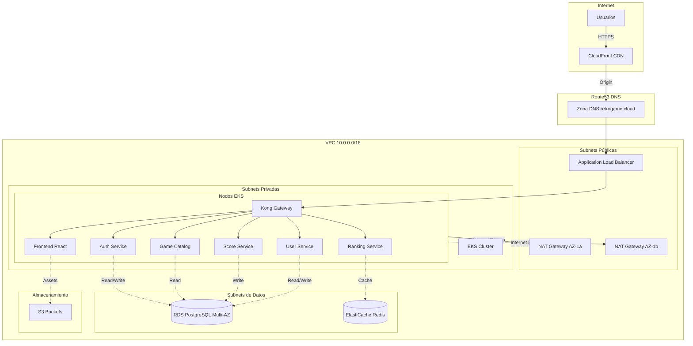
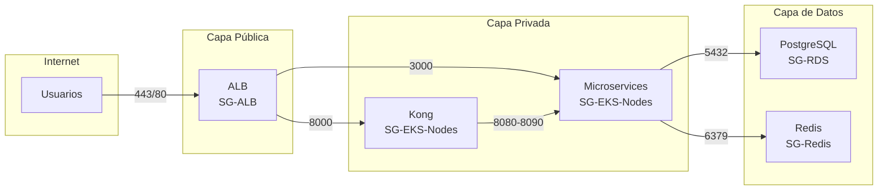

# Diagrama de Infraestructura AWS Completo

Esta página documenta la arquitectura completa de AWS para la plataforma RetroGameCloud, mostrando todos los componentes de infraestructura y sus interconexiones.

## Diagrama de Arquitectura General



## Componentes de la Infraestructura

<Tabs>
<Tab title="Servicios Públicos">
### CloudFront CDN
- **Propósito**: Distribución global de contenido
- **Configuración**: Edge locations en Europa y América
- **Caché**: Assets estáticos y API responses con TTL optimizado

### Route53 DNS
- **Zona**: retrogame.cloud
- **Registros**:
  - A: api.retrogame.cloud → ALB
  - CNAME: www.retrogame.cloud → CloudFront
  - A: retrogame.cloud → CloudFront
</Tab>
<Tab title="Red VPC">
### VPC Principal
- **CIDR**: 10.0.0.0/16
- **Región**: eu-west-1 (Irlanda)
- **Zonas de Disponibilidad**: eu-west-1a, eu-west-1b

### Subnets Públicas
- **Public-1a**: 10.0.1.0/24
- **Public-1b**: 10.0.2.0/24
- **Componentes**: ALB, NAT Gateways

### Subnets Privadas
- **Private-1a**: 10.0.10.0/24
- **Private-1b**: 10.0.20.0/24
- **Componentes**: Nodos EKS, Kong Gateway

### Subnets de Datos
- **Data-1a**: 10.0.100.0/24
- **Data-1b**: 10.0.200.0/24
- **Componentes**: RDS, ElastiCache
</Tab>
<Tab title="Compute EKS">
### EKS Cluster
- **Versión**: 1.28
- **Nodos**: t3.medium (2-10 instancias)
- **Networking**: AWS VPC CNI

### Microservicios Desplegados
- **Kong Gateway**: Proxy y autenticación
- **Auth Service**: JWT y OAuth2
- **User Service**: Gestión de usuarios
- **Game Catalog**: Catálogo de juegos retro
- **Score Service**: Puntuaciones y records
- **Ranking Service**: Rankings y leaderboards
- **Frontend**: React con JS-DOS emulator
</Tab>
</Tabs>

## Security Groups Detallados

<Note>
Los security groups actúan como firewalls virtuales controlando el tráfico entrante y saliente de cada componente.
</Note>

### SG-ALB (Application Load Balancer)
```yaml
Inbound Rules:
  - Port 443 (HTTPS): 0.0.0.0/0
  - Port 80 (HTTP): 0.0.0.0/0 → Redirect to 443

Outbound Rules:
  - Port 8000: → SG-Kong (Kong Gateway)
  - Port 3000: → SG-EKS-Nodes (Frontend)
```

### SG-EKS-Nodes (Nodos Kubernetes)
```yaml
Inbound Rules:
  - Port 8000: SG-ALB → Kong Gateway
  - Port 3000: SG-ALB → Frontend React
  - Port 8080-8090: SG-Kong → Microservices
  - All traffic: SG-EKS-Control-Plane

Outbound Rules:
  - Port 5432: → SG-RDS (PostgreSQL)
  - Port 6379: → SG-Redis (ElastiCache)
  - Port 443: → 0.0.0.0/0 (Internet via NAT)
```

### SG-RDS (Base de Datos)
```yaml
Inbound Rules:
  - Port 5432: SG-EKS-Nodes → PostgreSQL

Outbound Rules:
  - None (Database no necesita salida)
```

### SG-Redis (Caché)
```yaml
Inbound Rules:
  - Port 6379: SG-EKS-Nodes → Redis

Outbound Rules:
  - None (Cache no necesita salida)
```

## Diagrama de Security Groups



## Configuración de Networking

<Warning>
Las tablas de rutas son críticas para el correcto funcionamiento del tráfico entre subnets.
</Warning>

### Tabla de Rutas - Subnets Públicas
| Destino | Target | Propósito |
|---------|--------|-----------|
| 10.0.0.0/16 | Local | Tráfico interno VPC |
| 0.0.0.0/0 | Internet Gateway | Acceso público |

### Tabla de Rutas - Subnets Privadas
| Destino | Target | Propósito |
|---------|--------|-----------|
| 10.0.0.0/16 | Local | Tráfico interno VPC |
| 0.0.0.0/0 | NAT Gateway | Salida a Internet |

### Tabla de Rutas - Subnets de Datos
| Destino | Target | Propósito |
|---------|--------|-----------|
| 10.0.0.0/16 | Local | Solo tráfico interno |

## Alta Disponibilidad y Resiliencia

<Tabs>
<Tab title="Multi-AZ Deployment">
### Distribución por Zona
**Zona eu-west-1a:**
- Public Subnet: 10.0.1.0/24
- Private Subnet: 10.0.10.0/24
- Data Subnet: 10.0.100.0/24
- NAT Gateway 1
- RDS Primary Instance

**Zona eu-west-1b:**
- Public Subnet: 10.0.2.0/24
- Private Subnet: 10.0.20.0/24
- Data Subnet: 10.0.200.0/24
- NAT Gateway 2
- RDS Standby Instance
</Tab>
<Tab title="Load Balancing">
### Application Load Balancer
```yaml
Configuración:
  - Scheme: Internet-facing
  - IP Address Type: IPv4
  - Listeners:
    - Port 443: SSL Termination
    - Port 80: Redirect to 443
  
Target Groups:
  - kong-gateway: Port 8000
  - frontend-react: Port 3000
  
Health Checks:
  - Path: /health
  - Interval: 30 segundos
  - Timeout: 5 segundos
```
</Tab>
<Tab title="Auto Scaling">
### EKS Node Groups
```yaml
Auto Scaling Configuration:
  - Min Size: 2 nodes
  - Max Size: 10 nodes
  - Desired: 3 nodes
  
Scaling Policies:
  - Scale Out: CPU > 70% durante 5 min
  - Scale In: CPU < 30% durante 10 min
  
Instance Types:
  - Primary: t3.medium
  - Backup: t3.large, m5.large
```
</Tab>
</Tabs>

## Monitoreo de Red

### CloudWatch Metrics Clave

<Card title="Métricas de ALB" icon="chart-line">
- **RequestCount**: Número de peticiones por minuto
- **TargetResponseTime**: Latencia promedio
- **HTTPCode_Target_2XX_Count**: Respuestas exitosas
- **UnHealthyHostCount**: Instancias no saludables
</Card>

<Card title="Métricas de VPC" icon="network-wired">
- **NetworkIn/Out**: Tráfico de red por instancia
- **NetworkPacketsIn/Out**: Paquetes procesados
- **NAT Gateway**: Bytes procesados y conexiones activas
</Card>

### Alarmas Configuradas
```yaml
ALB-HighLatency:
  Metric: TargetResponseTime
  Threshold: > 2 segundos
  Action: SNS Notification

NAT-HighUtilization:
  Metric: BytesOutToDestination
  Threshold: > 1 GB/hora
  Action: Scale EKS Nodes

RDS-ConnectionCount:
  Metric: DatabaseConnections
  Threshold: > 80% of max
  Action: Alert DevOps Team
```

## Costos de Infraestructura

| Componente | Tipo | Coste Mensual (€) |
|------------|------|-------------------|
| EKS Cluster | Control Plane | 73 |
| EC2 Instances | t3.medium x3 | 95 |
| RDS PostgreSQL | db.t3.micro Multi-AZ | 35 |
| ElastiCache Redis | cache.t3.micro | 18 |
| Application Load Balancer | Standard | 23 |
| NAT Gateways | 2 instancias | 46 |
| CloudFront | CDN | 15 |
| Route53 | Hosted Zone | 0.5 |
| **Total Estimado** |  | **≈ 305€/mes** |

<Note>
Los costes son estimaciones basadas en la región eu-west-1. El coste real puede variar según el uso y tráfico.
</Note>

## Próximos Pasos

1. **Implementar VPC Endpoints** para servicios AWS (S3, ECR)
2. **Configurar AWS WAF** en CloudFront y ALB
3. **Establecer VPC Flow Logs** para auditoría de red
4. **Implementar AWS Config** para compliance
5. **Configurar Cross-Region Backup** para disaster recovery