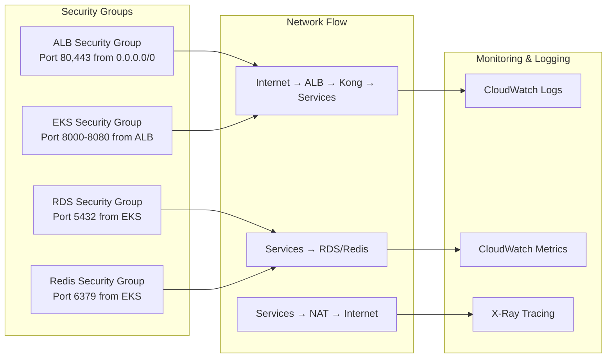

# Topología de Infraestructura AWS

Esta página documenta la arquitectura completa de AWS para la plataforma RetroGameCloud, mostrando todos los componentes de infraestructura distribuidos en múltiples zonas de disponibilidad y sus interconexiones.

## Diagrama de Topología Completa

```mermaid
graph TB
    subgraph Internet[Internet]
        U[Usuarios Globales]
        API_EXT[APIs Externas]
    end

    subgraph Route53[Route 53]
        DNS_MAIN[retrogame.cloud]
        DNS_API[api.retrogame.cloud] 
        DNS_CDN[cdn.retrogame.cloud]
    end

    subgraph CloudFront[CloudFront Global]
        CF_WEB[Web Distribution]
        CF_API[API Distribution]
        CF_ASSETS[Assets Distribution]
    end

    subgraph Region[us-east-1 Virginia]
        subgraph VPC[VPC 10.0.0.0/16]
            
            subgraph AZ1[Availability Zone 1a]
                subgraph PUB1[Public Subnet 10.0.1.0/24]
                    ALB1[ALB Primary]
                    NAT1[NAT Gateway 1]
                end
                subgraph PRIV1[Private Subnet 10.0.11.0/24]
                    EKS1[EKS Node Group 1]
                    subgraph PODS1[Pods AZ-1a]
                        KONG1[Kong Gateway]
                        AUTH1[Auth Service]
                        GAME1[Game Service]
                    end
                end
                subgraph DATA1[Data Subnet 10.0.21.0/24]
                    RDS1[(RDS Primary)]
                    REDIS1[(Redis Primary)]
                end
            end

            subgraph AZ2[Availability Zone 1b] 
                subgraph PUB2[Public Subnet 10.0.2.0/24]
                    ALB2[ALB Secondary]
                    NAT2[NAT Gateway 2]
                end
                subgraph PRIV2[Private Subnet 10.0.12.0/24]
                    EKS2[EKS Node Group 2]
                    subgraph PODS2[Pods AZ-1b]
                        KONG2[Kong Gateway]
                        SCORE1[Score Service]
                        RANK1[Ranking Service]
                    end
                end
                subgraph DATA2[Data Subnet 10.0.22.0/24]
                    RDS2[(RDS Standby)]
                    REDIS2[(Redis Replica)]
                end
            end

            subgraph AZ3[Availability Zone 1c]
                subgraph PUB3[Public Subnet 10.0.3.0/24]
                    NAT3[NAT Gateway 3]
                end
                subgraph PRIV3[Private Subnet 10.0.13.0/24]
                    EKS3[EKS Node Group 3]
                    subgraph PODS3[Pods AZ-1c]
                        USER1[User Service]
                        FRONTEND1[Frontend Apps]
                    end
                end
                subgraph DATA3[Data Subnet 10.0.23.0/24]
                    REDIS3[(Redis Replica)]
                end
            end

            subgraph Storage[Almacenamiento]
                S3_ASSETS[S3 Assets Bucket]
                S3_BACKUPS[S3 Backups Bucket]
                S3_LOGS[S3 Logs Bucket]
            end

            IGW[Internet Gateway]
        end
    end

    %% Conexiones externas
    U -->|HTTPS Global| CF_WEB
    U -->|API Calls| CF_API
    CF_WEB -->|Origin| DNS_MAIN
    CF_API -->|Origin| DNS_API
    CF_ASSETS -->|Origin| DNS_CDN

    %% DNS Resolution
    DNS_MAIN --> ALB1
    DNS_API --> ALB1
    DNS_CDN --> S3_ASSETS

    %% Load Balancer Distribution
    ALB1 -.->|Health Check| ALB2
    ALB1 --> KONG1
    ALB1 --> KONG2
    ALB2 --> KONG1
    ALB2 --> KONG2

    %% Service Mesh
    KONG1 --> AUTH1
    KONG1 --> GAME1
    KONG2 --> SCORE1
    KONG2 --> RANK1
    KONG1 --> USER1
    KONG2 --> FRONTEND1

    %% Database Connections
    AUTH1 -.->|Read/Write| RDS1
    GAME1 -.->|Read| RDS1
    SCORE1 -.->|Write| RDS1
    USER1 -.->|Read/Write| RDS1
    RDS1 -.->|Sync| RDS2

    %% Cache Connections
    RANK1 -.->|Cache| REDIS1
    AUTH1 -.->|Session| REDIS1
    REDIS1 -.->|Replication| REDIS2
    REDIS1 -.->|Replication| REDIS3

    %% Storage Connections
    FRONTEND1 -.->|Assets| S3_ASSETS
    GAME1 -.->|Game Files| S3_ASSETS
    RDS1 -.->|Backups| S3_BACKUPS

    %% Internet Access
    EKS1 --> NAT1
    EKS2 --> NAT2
    EKS3 --> NAT3
    NAT1 --> IGW
    NAT2 --> IGW
    NAT3 --> IGW
    ALB1 --> IGW
    ALB2 --> IGW

    %% External APIs
    AUTH1 -.->|External Auth| API_EXT
```

## Detalles de Configuración por Zona

<Tabs>
<Tab title="Availability Zone 1a">

### Zona de Disponibilidad us-east-1a

**Subnets:**
- **Pública**: `10.0.1.0/24` - ALB principal y NAT Gateway
- **Privada**: `10.0.11.0/24` - Nodos EKS principales
- **Datos**: `10.0.21.0/24` - RDS primario y Redis master

**Servicios Críticos:**
- Application Load Balancer primario
- Kong Gateway (instancia principal)
- Auth Service (servicio crítico)
- Game Catalog Service
- RDS PostgreSQL (instancia primaria)
- ElastiCache Redis (nodo master)

**Características:**
- Alta disponibilidad para servicios críticos
- Conexión directa con CloudFront
- Backup automático a AZ secundarias

</Tab>
<Tab title="Availability Zone 1b">

### Zona de Disponibilidad us-east-1b

**Subnets:**
- **Pública**: `10.0.2.0/24` - ALB secundario y NAT Gateway
- **Privada**: `10.0.12.0/24` - Nodos EKS para servicios específicos
- **Datos**: `10.0.22.0/24` - RDS standby y Redis replica

**Servicios Distribuidos:**
- Application Load Balancer secundario
- Kong Gateway (instancia secundaria)
- Score Service (escritura intensiva)
- Ranking Service (lectura intensiva)
- RDS PostgreSQL (standby automático)
- ElastiCache Redis (réplica de lectura)

**Características:**
- Failover automático para RDS
- Distribución de carga para servicios Kong
- Optimizada para operaciones de scoring

</Tab>
<Tab title="Availability Zone 1c">

### Zona de Disponibilidad us-east-1c

**Subnets:**
- **Pública**: `10.0.3.0/24` - NAT Gateway únicamente
- **Privada**: `10.0.13.0/24` - Nodos EKS para aplicaciones frontend
- **Datos**: `10.0.23.0/24` - Redis replica adicional

**Servicios Especializados:**
- User Service (gestión de usuarios)
- Frontend Applications (React apps)
- ElastiCache Redis (réplica adicional)

**Características:**
- Optimizada para aplicaciones frontend
- Réplica adicional de cache para redundancia
- Menor latencia para servicios de usuario

</Tab>
<Tab title="Servicios Globales">

### Servicios AWS Globales

**CloudFront Distributions:**
- **Web**: Distribución global para aplicaciones web
- **API**: Aceleración global para APIs
- **Assets**: CDN para archivos estáticos y juegos

**Route 53 Hosted Zones:**
- `retrogame.cloud` - Dominio principal
- `api.retrogame.cloud` - Subdominio para APIs
- `cdn.retrogame.cloud` - Subdominio para CDN

**S3 Buckets:**
- **Assets**: Archivos estáticos y ROMs de juegos
- **Backups**: Respaldos automáticos de bases de datos
- **Logs**: Logs centralizados de aplicaciones

</Tab>
</Tabs>

## Diagrama de Conectividad de Red



## Configuración de Alta Disponibilidad

### Estrategia Multi-AZ

1. **Load Balancers**: ALB en múltiples AZ con health checks
2. **EKS Cluster**: Node groups distribuidos en 3 AZ
3. **RDS**: Multi-AZ con failover automático
4. **ElastiCache**: Cluster mode con réplicas cross-AZ
5. **NAT Gateways**: Uno por AZ para redundancia

### Puntos de Falla y Recuperación

- **Zona completa**: Tráfico redirigido automáticamente
- **Base de datos**: Failover RDS < 60 segundos
- **Cache**: Redis cluster mantiene disponibilidad
- **Aplicaciones**: EKS reschedule automático de pods

### Métricas de Disponibilidad

- **Objetivo SLA**: 99.9% uptime
- **RTO**: Recovery Time Objective < 5 minutos
- **RPO**: Recovery Point Objective < 1 minuto

## Consideraciones de Seguridad

### Network Security

- VPC con subnets aisladas por función
- Security Groups con principio de menor privilegio
- NACLs como capa adicional de seguridad
- VPC Flow Logs habilitados

### Data Security

- Encryption en tránsito (TLS 1.3)
- Encryption en reposo (KMS)
- Secrets Manager para credenciales
- IAM roles con políticas específicas

Esta topología garantiza alta disponibilidad, escalabilidad y seguridad para la plataforma RetroGameCloud, con distribución inteligente de servicios y redundancia en todos los niveles críticos.