# Topología de Infraestructura AWS

Esta página documenta la arquitectura completa de AWS para la plataforma RetroGameCloud, mostrando todos los componentes de infraestructura distribuidos en múltiples zonas de disponibilidad, sus interconexiones y flujos de tráfico.

## Diagrama de Topología Completa

```mermaid
graph TB
    subgraph Internet[🌐 Internet]
        U[👥 Usuarios Globales]
        API_EXT[🔌 APIs Externas]
        DEV[👨‍💻 Desarrolladores]
    end

    subgraph Route53[📍 Route 53 DNS]
        DNS_MAIN[retrogame.cloud]
        DNS_API[api.retrogame.cloud]
        DNS_CDN[cdn.retrogame.cloud]
        DNS_ADMIN[admin.retrogame.cloud]
    end

    subgraph CloudFront[⚡ CloudFront Global CDN]
        CF_WEB[Web Distribution<br/>Static Assets]
        CF_API[API Distribution<br/>Dynamic Content]
        CF_ASSETS[Assets Distribution<br/>Game Files]
    end

    subgraph WAF[🛡️ AWS WAF]
        WAF_RULES[DDoS Protection<br/>Rate Limiting<br/>SQL Injection]
    end

    subgraph Region[🌍 us-east-1 Virginia]
        subgraph VPC[🏢 VPC RetroGameCloud<br/>CIDR: 10.0.0.0/16]

            subgraph IGW_ZONE[Internet Gateway Zone]
                IGW[🌐 Internet Gateway]
            end

            subgraph AZ1[📍 Availability Zone us-east-1a]
                subgraph PUB1[🌐 Public Subnet<br/>10.0.1.0/24]
                    ALB1[⚖️ Application Load Balancer<br/>Primary]
                    NAT1[🔄 NAT Gateway 1<br/>Elastic IP]
                    BASTION1[🔐 Bastion Host 1]
                end

                subgraph PRIV1[🔒 Private Subnet<br/>10.0.11.0/24]
                    subgraph EKS1[☸️ EKS Node Group 1<br/>t3.large instances]
                        subgraph PODS1[Pod Network]
                            API1[🚀 API Gateway Pod]
                            AUTH1[🔐 Auth Service Pod]
                            GAME1[🎮 Game Service Pod]
                            USER1[👤 User Service Pod]
                            WS1[🔌 WebSocket Pod]
                        end
                    end
                end

                subgraph DB1[💾 Database Subnet<br/>10.0.21.0/24]
                    RDS1[🗄️ RDS Primary<br/>PostgreSQL 14<br/>db.t3.medium]
                    REDIS1[⚡ ElastiCache Redis<br/>cache.t3.micro<br/>Primary Node]
                end
            end

            subgraph AZ2[📍 Availability Zone us-east-1b]
                subgraph PUB2[🌐 Public Subnet<br/>10.0.2.0/24]
                    ALB2[⚖️ Application Load Balancer<br/>Secondary]
                    NAT2[🔄 NAT Gateway 2<br/>Elastic IP]
                    BASTION2[🔐 Bastion Host 2]
                end

                subgraph PRIV2[🔒 Private Subnet<br/>10.0.12.0/24]
                    subgraph EKS2[☸️ EKS Node Group 2<br/>t3.large instances]
                        subgraph PODS2[Pod Network]
                            API2[🚀 API Gateway Pod]
                            AUTH2[🔐 Auth Service Pod]
                            GAME2[🎮 Game Service Pod]
                            USER2[👤 User Service Pod]
                            WS2[🔌 WebSocket Pod]
                        end
                    end
                end

                subgraph DB2[💾 Database Subnet<br/>10.0.22.0/24]
                    RDS2[🗄️ RDS Replica<br/>PostgreSQL 14<br/>db.t3.medium]
                    REDIS2[⚡ ElastiCache Redis<br/>cache.t3.micro<br/>Replica Node]
                end
            end

            subgraph AZ3[📍 Availability Zone us-east-1c]
                subgraph PUB3[🌐 Public Subnet<br/>10.0.3.0/24]
                    NAT3[🔄 NAT Gateway 3<br/>Elastic IP]
                end

                subgraph PRIV3[🔒 Private Subnet<br/>10.0.13.0/24]
                    subgraph EKS3[☸️ EKS Node Group 3<br/>t3.large instances]
                        subgraph PODS3[Pod Network]
                            API3[🚀 API Gateway Pod]
                            BATCH3[⚙️ Batch Jobs Pod]
                            MONITOR3[📊 Monitoring Pod]
                        end
                    end
                end

                subgraph STORAGE3[💽 Storage Subnet<br/>10.0.23.0/24]
                    EFS[📁 Elastic File System<br/>Game Assets Storage]
                end
            end

            subgraph EKS_CONTROL[☸️ EKS Control Plane]
                EKS_MASTER[EKS Master Nodes<br/>Managed by AWS]
                EKS_API[Kubernetes API Server]
                EKS_ETCD[etcd Cluster]
            end

            subgraph S3_ZONE[☁️ S3 Storage Services]
                S3_ASSETS[🎮 S3 Game Assets<br/>retrogame-assets]
                S3_BACKUP[💾 S3 Backups<br/>retrogame-backups]
                S3_LOGS[📝 S3 Logs<br/>retrogame-logs]
                S3_STATIC[🌐 S3 Static Web<br/>retrogame-web]
            end

            subgraph MONITORING[📊 Monitoring & Logging]
                CW[☁️ CloudWatch<br/>Metrics & Logs]
                CW_ALARMS[🚨 CloudWatch Alarms]
                SNS[📧 SNS Notifications]
                XRAY[🔍 X-Ray Tracing]
            end
        end
    end

    subgraph EXTERNAL[🔗 Servicios Externos]
        GITHUB[🐙 GitHub<br/>CI/CD Webhooks]
        STRIPE[💳 Stripe<br/>Payment Processing]
        TWILIO[📱 Twilio<br/>SMS/Email]
        SOCIAL[📱 OAuth Providers<br/>Google, Discord]
    end

    %% Conexiones de Red
    U --> DNS_MAIN
    U --> DNS_API
    U --> DNS_CDN
    DEV --> DNS_ADMIN

    DNS_MAIN --> CF_WEB
    DNS_API --> CF_API
    DNS_CDN --> CF_ASSETS
    DNS_ADMIN --> ALB1

    CF_WEB --> WAF_RULES
    CF_API --> WAF_RULES
    WAF_RULES --> ALB1
    WAF_RULES --> ALB2

    IGW --> ALB1
    IGW --> ALB2
    IGW --> NAT1
    IGW --> NAT2
    IGW --> NAT3

    ALB1 --> API1
    ALB1 --> API2
    ALB1 --> API3
    ALB2 --> API1
    ALB2 --> API2

    NAT1 --> PRIV1
    NAT2 --> PRIV2
    NAT3 --> PRIV3

    %% Comunicación entre Pods
    API1 --> AUTH1
    API1 --> GAME1
    API1 --> USER1
    API2 --> AUTH2
    API2 --> GAME2
    API2 --> USER2

    %% Conexiones a Base de Datos
    PODS1 --> RDS1
    PODS1 --> REDIS1
    PODS2 --> RDS2
    PODS2 --> REDIS2
    PODS3 --> RDS1

    RDS1 -.-> RDS2
    REDIS1 -.-> REDIS2

    %% Conexiones a Storage
    PODS1 --> EFS
    PODS2 --> EFS
    PODS3 --> EFS

    PODS1 --> S3_ASSETS
    PODS2 --> S3_ASSETS
    PODS3 --> S3_ASSETS

    %% EKS Control Plane
    EKS_MASTER --> PODS1
    EKS_MASTER --> PODS2
    EKS_MASTER --> PODS3

    %% Monitoring
    PODS1 --> CW
    PODS2 --> CW
    PODS3 --> CW
    RDS1 --> CW
    RDS2 --> CW
    ALB1 --> CW
    ALB2 --> CW

    CW --> CW_ALARMS
    CW_ALARMS --> SNS

    %% External Services
    PODS1 --> STRIPE
    PODS1 --> TWILIO
    PODS1 --> SOCIAL
    GITHUB --> PODS1

    %% CDN to S3
    CF_WEB --> S3_STATIC
    CF_ASSETS --> S3_ASSETS

    classDef internet fill:#e1f5fe
    classDef aws fill:#ff9800
    classDef compute fill:#4caf50
    classDef storage fill:#9c27b0
    classDef network fill:#2196f3
    classDef security fill:#f44336
    classDef monitoring fill:#ff5722

    class U,API_EXT,DEV internet
    class CF_WEB,CF_API,CF_ASSETS,DNS_MAIN,DNS_API,DNS_CDN aws
    class EKS1,EKS2,EKS3,PODS1,PODS2,PODS3 compute
    class RDS1,RDS2,REDIS1,REDIS2,S3_ASSETS,S3_BACKUP,EFS storage
    class ALB1,ALB2,NAT1,NAT2,NAT3,IGW network
    class WAF_RULES,BASTION1,BASTION2 security
    class CW,CW_ALARMS,SNS,XRAY monitoring

```



## Arquitectura de Red Detallada

### VPC y Subnetting

La infraestructura utiliza una VPC con CIDR `10.0.0.0/16` distribuida en 3 zonas de disponibilidad:

| Zona | Subnet Pública | Subnet Privada | Subnet Database |
|------|---------------|----------------|-----------------|
| us-east-1a | 10.0.1.0/24 | 10.0.11.0/24 | 10.0.21.0/24 |
| us-east-1b | 10.0.2.0/24 | 10.0.12.0/24 | 10.0.22.0/24 |
| us-east-1c | 10.0.3.0/24 | 10.0.13.0/24 | 10.0.23.0/24 |

### Flujos de Tráfico

```mermaid
sequenceDiagram
    participant User as 👥 Usuario
    participant CF as ⚡ CloudFront
    participant WAF as 🛡️ WAF
    participant ALB as ⚖️ ALB
    participant EKS as ☸️ EKS Pods
    participant RDS as 🗄️ RDS
    participant Redis as ⚡ Redis
    participant S3 as ☁️ S3

    User->>CF: 1. Request
    CF->>WAF: 2. Security Check
    WAF->>ALB: 3. Forward (if valid)
    ALB->>EKS: 4. Route to Pod
    EKS->>RDS: 5. Database Query
    EKS->>Redis: 6. Cache Check
    EKS->>S3: 7. Asset Request
    S3-->>EKS: 8. Asset Response
    Redis-->>EKS: 9. Cache Response
    RDS-->>EKS: 10. DB Response
    EKS-->>ALB: 11. API Response
    ALB-->>CF: 12. Response
    CF-->>User: 13. Final Response

```



## Componentes Principales

### 1. Capa de Red Global

#### Route 53

- **Dominios**: retrogame.cloud, api.retrogame.cloud, cdn.retrogame.cloud

- **Health Checks**: Monitoreo de endpoints críticos

- **Routing Policies**: Latency-based para mejor performance

#### CloudFront CDN

- **Web Distribution**: Assets estáticos, cache 24h

- **API Distribution**: Contenido dinámico, cache 5min

- **Assets Distribution**: Archivos de juego, cache 7 días

#### AWS WAF

- **Rate Limiting**: 1000 requests/5min por IP

- **SQL Injection Protection**: Pattern matching

- **DDoS Mitigation**: Integración con Shield

### 2. Capa de Compute

#### EKS Cluster

```yaml
Cluster Configuration:
  Version: 1.24
  Endpoint: Private
  Logging: API, Audit, Authenticator

Node Groups:
  - Name: primary-nodes
    Instance Type: t3.large
    Min Size: 2
    Max Size: 10
    Desired: 3

  - Name: batch-nodes
    Instance Type: c5.xlarge
    Min Size: 0
    Max Size: 5
    Desired: 1

```

#### Pod Distribution
| Service | AZ-1a | AZ-1b | AZ-1c | Total |
|---------|-------|-------|-------|--------|
| API Gateway | 2 | 2 | 1 | 5 |
| Auth Service | 1 | 1 | 0 | 2 |
| Game Service | 2 | 2 | 0 | 4 |
| User Service | 1 | 1 | 0 | 2 |
| WebSocket | 1 | 1 | 0 | 2 |
| Batch Jobs | 0 | 0 | 1 | 1 |

### 3. Capa de Datos

#### RDS PostgreSQL

```yaml
Primary (us-east-1a):
  Engine: PostgreSQL 14.6
  Instance: db.t3.medium
  Storage: 100GB GP2
  Multi-AZ: true
  Backup: 7 días

Read Replica (us-east-1b):
  Engine: PostgreSQL 14.6
  Instance: db.t3.medium
  Lag: < 100ms
  Auto Failover: enabled

```

#### ElastiCache Redis

```yaml
Primary Node (us-east-1a):
  Engine: Redis 7.0
  Instance: cache.t3.micro
  Memory: 1GB

Replica Node (us-east-1b):
  Engine: Redis 7.0
  Instance: cache.t3.micro
  Replication:

```