# Topología de Infraestructura AWS

Esta página documenta la arquitectura completa de AWS para la plataforma RetroGameCloud, mostrando todos los componentes de infraestructura distribuidos en múltiples zonas de disponibilidad, sus interconexiones y flujos de tráfico.

## Diagrama de Topología Completa

```mermaid
graph TB
    subgraph Internet[🌐 Internet]
        U[👥 Usuarios Globales]
        API_EXT[🔌 APIs Externas]
        DEV[👨‍💻 Desarrolladores]
    end

    subgraph Route53[📍 Route 53 DNS]
        DNS_MAIN[retrogame.cloud]
        DNS_API[api.retrogame.cloud]
        DNS_CDN[cdn.retrogame.cloud]
        DNS_ADMIN[admin.retrogame.cloud]
    end

    subgraph CloudFront[⚡ CloudFront Global CDN]
        CF_WEB[Web Distribution<br/>Static Assets]
        CF_API[API Distribution<br/>Dynamic Content]
        CF_ASSETS[Assets Distribution<br/>Game Files]
    end

    subgraph WAF[🛡️ AWS WAF]
        WAF_RULES[DDoS Protection<br/>Rate Limiting<br/>SQL Injection]
    end

    subgraph Region[🌍 us-east-1 Virginia]
        subgraph VPC[🏢 VPC RetroGameCloud<br/>CIDR: 10.0.0.0/16]

            subgraph IGW_ZONE[Internet Gateway Zone]
                IGW[🌐 Internet Gateway]
            end

            subgraph AZ1[📍 Availability Zone us-east-1a]
                subgraph PUB1[🌐 Public Subnet<br/>10.0.1.0/24]
                    ALB1[⚖️ Application Load Balancer<br/>Primary]
                    NAT1[🔄 NAT Gateway 1<br/>Elastic IP]
                    BASTION1[🔐 Bastion Host 1]
                end

                subgraph PRIV1[🔒 Private Subnet<br/>10.0.11.0/24]
                    subgraph EKS1[☸️ EKS Node Group 1<br/>t3.large instances]
                        subgraph PODS1[Pod Network]
                            API_POD1[🚀 API Gateway Pods<br/>3 replicas]
                            AUTH_POD1[🔐 Auth Service Pods<br/>2 replicas]
                            GAME_POD1[🎮 Game Service Pods<br/>3 replicas]
                            USER_POD1[👤 User Service Pods<br/>2 replicas]
                        end
                    end
                end

                subgraph DB1[🗄️ Database Subnet<br/>10.0.21.0/24]
                    RDS_PRIMARY[📊 RDS Primary<br/>PostgreSQL 14<br/>db.r5.large]
                    REDIS_PRIMARY[⚡ ElastiCache Primary<br/>cache.r6g.large]
                end
            end

            subgraph AZ2[📍 Availability Zone us-east-1b]
                subgraph PUB2[🌐 Public Subnet<br/>10.0.2.0/24]
                    ALB2[⚖️ Application Load Balancer<br/>Secondary]
                    NAT2[🔄 NAT Gateway 2<br/>Elastic IP]
                    BASTION2[🔐 Bastion Host 2]
                end

                subgraph PRIV2[🔒 Private Subnet<br/>10.0.12.0/24]
                    subgraph EKS2[☸️ EKS Node Group 2<br/>t3.large instances]
                        subgraph PODS2[Pod Network]
                            API_POD2[🚀 API Gateway Pods<br/>3 replicas]
                            AUTH_POD2[🔐 Auth Service Pods<br/>2 replicas]
                            GAME_POD2[🎮 Game Service Pods<br/>3 replicas]
                            USER_POD2[👤 User Service Pods<br/>2 replicas]
                        end
                    end
                end

                subgraph DB2[🗄️ Database Subnet<br/>10.0.22.0/24]
                    RDS_STANDBY[📊 RDS Standby<br/>PostgreSQL 14<br/>db.r5.large]
                    REDIS_REPLICA[⚡ ElastiCache Replica<br/>cache.r6g.large]
                end
            end

            subgraph AZ3[📍 Availability Zone us-east-1c]
                subgraph PUB3[🌐 Public Subnet<br/>10.0.3.0/24]
                    NAT3[🔄 NAT Gateway 3<br/>Elastic IP]
                end

                subgraph PRIV3[🔒 Private Subnet<br/>10.0.13.0/24]
                    subgraph EKS3[☸️ EKS Node Group 3<br/>t3.large instances]
                        subgraph PODS3[Pod Network]
                            API_POD3[🚀 API Gateway Pods<br/>2 replicas]
                            WORKER_POD3[⚙️ Worker Pods<br/>Background Jobs]
                            MONITOR_POD3[📊 Monitoring Pods<br/>Prometheus/Grafana]
                        end
                    end
                end

                subgraph DB3[🗄️ Database Subnet<br/>10.0.23.0/24]
                    REDIS_BACKUP[⚡ ElastiCache Backup<br/>cache.r6g.large]
                end
            end

            subgraph STORAGE[💾 Storage Layer]
                S3_ASSETS[🪣 S3 Games Assets<br/>Versioned/Encrypted]
                S3_BACKUPS[🪣 S3 Database Backups<br/>Cross-Region Replication]
                S3_LOGS[🪣 S3 Application Logs<br/>Lifecycle Policies]
                EFS[📁 EFS Shared Storage<br/>Cross-AZ Access]
            end

            subgraph CONTROL_PLANE[🎛️ EKS Control Plane]
                EKS_API[☸️ Kubernetes API Server]
                EKS_ETCD[💾 etcd Cluster]
                EKS_SCHEDULER[⚙️ Scheduler]
            end

        end
    end

    subgraph EXTERNAL[🌐 External Services]
        GITHUB[📦 GitHub Container Registry]
        DATADOG[📊 Datadog APM]
        SENDGRID[📧 SendGrid Email]
    end

    %% Conexiones principales
    U --> Route53
    Route53 --> CloudFront
    CloudFront --> WAF
    WAF --> IGW
    
    IGW --> ALB1
    IGW --> ALB2
    
    ALB1 --> API_POD1
    ALB1 --> API_POD2
    ALB2 --> API_POD3
    
    API_POD1 --> AUTH_POD1
    API_POD1 --> GAME_POD1
    API_POD1 --> USER_POD1
    
    API_POD2 --> AUTH_POD2
    API_POD2 --> GAME_POD2
    API_POD2 --> USER_POD2
    
    GAME_POD1 --> RDS_PRIMARY
    USER_POD1 --> RDS_PRIMARY
    AUTH_POD1 --> REDIS_PRIMARY
    
    RDS_PRIMARY --> RDS_STANDBY
    REDIS_PRIMARY --> REDIS_REPLICA
    
    NAT1 --> IGW
    NAT2 --> IGW
    NAT3 --> IGW
    
    PODS1 --> NAT1
    PODS2 --> NAT2
    PODS3 --> NAT3
    
    PODS1 --> S3_ASSETS
    PODS2 --> S3_ASSETS
    PODS3 --> S3_ASSETS
    
    DEV --> BASTION1
    DEV --> BASTION2
    
    BASTION1 --> EKS1
    BASTION2 --> EKS2
    
    PODS1 --> GITHUB
    PODS2 --> GITHUB
    PODS3 --> GITHUB
    
    MONITOR_POD3 --> DATADOG
    USER_POD1 --> SENDGRID
    USER_POD2 --> SENDGRID

    style Internet fill:#e1f5fe
    style Route53 fill:#f3e5f5
    style CloudFront fill:#fff3e0
    style WAF fill:#ffebee
    style VPC fill:#e8f5e8
    style AZ1 fill:#fff8e1
    style AZ2 fill:#f1f8e9
    style AZ3 fill:#fce4ec
```



## Componentes de Red y Seguridad

### VPC y Subnetting

```mermaid
graph TB
    subgraph VPC[VPC RetroGameCloud - 10.0.0.0/16]
        subgraph PUBLIC[Public Subnets]
            PUB1[us-east-1a<br/>10.0.1.0/24]
            PUB2[us-east-1b<br/>10.0.2.0/24]
            PUB3[us-east-1c<br/>10.0.3.0/24]
        end
        
        subgraph PRIVATE[Private Subnets]
            PRIV1[us-east-1a<br/>10.0.11.0/24]
            PRIV2[us-east-1b<br/>10.0.12.0/24]
            PRIV3[us-east-1c<br/>10.0.13.0/24]
        end
        
        subgraph DATABASE[Database Subnets]
            DB1[us-east-1a<br/>10.0.21.0/24]
            DB2[us-east-1b<br/>10.0.22.0/24]
            DB3[us-east-1c<br/>10.0.23.0/24]
        end
        
        subgraph ROUTING[Route Tables]
            RT_PUB[Public Route Table<br/>0.0.0.0/0 → IGW]
            RT_PRIV1[Private RT AZ-1a<br/>0.0.0.0/0 → NAT-1]
            RT_PRIV2[Private RT AZ-1b<br/>0.0.0.0/0 → NAT-2]
            RT_PRIV3[Private RT AZ-1c<br/>0.0.0.0/0 → NAT-3]
            RT_DB[Database Route Table<br/>Local VPC Only]
        end
    end
```



### Security Groups


## Servicios de Infraestructura

### EKS Cluster Configuration


### Database Architecture

```mermaid
graph TB
    subgraph RDS_CLUSTER[RDS PostgreSQL Multi-AZ]
        subgraph PRIMARY[Primary Instance - us-east-1a]
            RDS_P[PostgreSQL 14.7<br/>db.r5.large<br/>2 vCPU, 16 GB RAM<br/>100 GB gp3 Storage]
        end
        
        subgraph STANDBY[Standby Instance - us-east-1b]
            RDS_S[PostgreSQL 14.7<br/>db.r5.large<br/>2 vCPU, 16 GB RAM<br/>100 GB gp3 Storage<br/>Synchronous Replication]
        end
        
        subgraph BACKUP[Backup Strategy]
            AUTO_BACKUP[Automated Backups<br/>7 days retention<br/>Daily at 03:00 UTC]
            SNAPSHOT[Manual Snapshots<br/>Before deployments]
        end
    end
    
    subgraph REDIS_CLUSTER[ElastiCache Redis Cluster]
        subgraph REDIS_PRIMARY[Primary - us-east-1a]
            REDIS
```