# Topología de Infraestructura AWS

Esta página documenta la arquitectura completa de AWS para la plataforma RetroGameCloud, mostrando todos los componentes de infraestructura distribuidos en múltiples zonas de disponibilidad, sus interconexiones y flujos de tráfico.

## Diagrama de Topología Completa

```mermaid
graph TB
    subgraph Internet[🌐 Internet]
        U[👥 Usuarios Globales]
        API_EXT[🔌 APIs Externas]
        DEV[👨‍💻 Desarrolladores]
    end

    subgraph Route53[📍 Route 53 DNS]
        DNS_MAIN[retrogame.cloud]
        DNS_API[api.retrogame.cloud]
        DNS_CDN[cdn.retrogame.cloud]
        DNS_ADMIN[admin.retrogame.cloud]
    end

    subgraph CloudFront[⚡ CloudFront Global CDN]
        CF_WEB[Web Distribution<br/>Static Assets]
        CF_API[API Distribution<br/>Dynamic Content]
        CF_ASSETS[Assets Distribution<br/>Game Files]
    end

    subgraph WAF[🛡️ AWS WAF]
        WAF_RULES[DDoS Protection<br/>Rate Limiting<br/>SQL Injection]
    end

    subgraph Region[🌍 us-east-1 Virginia]
        subgraph VPC[🏢 VPC RetroGameCloud<br/>CIDR: 10.0.0.0/16]

            subgraph IGW_ZONE[Internet Gateway Zone]
                IGW[🌐 Internet Gateway]
            end

            subgraph AZ1[📍 Availability Zone us-east-1a]
                subgraph PUB1[🌐 Public Subnet<br/>10.0.1.0/24]
                    ALB1[⚖️ Application Load Balancer<br/>Primary]
                    NAT1[🔄 NAT Gateway 1<br/>Elastic IP]
                    BASTION1[🔐 Bastion Host 1]
                end

                subgraph PRIV1[🔒 Private Subnet<br/>10.0.11.0/24]
                    subgraph EKS1[☸️ EKS Node Group 1<br/>t3.large instances]
                        subgraph PODS1[Pod Network]
                            KONG1[🦍 Kong Gateway<br/>API Gateway]
                            AUTH1[🔐 Auth Service<br/>JWT/OAuth]
                            GAME1[🎮 Game Service<br/>Emulation]
                            USER1[👤 User Service<br/>Profiles]
                            WS1[🔄 WebSocket Service<br/>Real-time]
                        end
                    end
                end

                subgraph DATA1[💾 Data Subnet<br/>10.0.21.0/24]
                    RDS1[(🗄️ RDS PostgreSQL<br/>Primary Instance<br/>Multi-AZ)]
                    REDIS1[(⚡ ElastiCache Redis<br/>Primary Node<br/>Cluster Mode)]
                end
            end

            subgraph AZ2[📍 Availability Zone us-east-1b]
                subgraph PUB2[🌐 Public Subnet<br/>10.0.2.0/24]
                    ALB2[⚖️ Application Load Balancer<br/>Secondary]
                    NAT2[🔄 NAT Gateway 2<br/>Elastic IP]
                    BASTION2[🔐 Bastion Host 2]
                end

                subgraph PRIV2[🔒 Private Subnet<br/>10.0.12.0/24]
                    subgraph EKS2[☸️ EKS Node Group 2<br/>t3.large instances]
                        subgraph PODS2[Pod Network]
                            KONG2[🦍 Kong Gateway<br/>API Gateway]
                            AUTH2[🔐 Auth Service<br/>JWT/OAuth]
                            GAME2[🎮 Game Service<br/>Emulation]
                            USER2[👤 User Service<br/>Profiles]
                            WS2[🔄 WebSocket Service<br/>Real-time]
                        end
                    end
                end

                subgraph DATA2[💾 Data Subnet<br/>10.0.22.0/24]
                    RDS2[(🗄️ RDS PostgreSQL<br/>Read Replica)]
                    REDIS2[(⚡ ElastiCache Redis<br/>Replica Node)]
                end
            end

            subgraph AZ3[📍 Availability Zone us-east-1c]
                subgraph PUB3[🌐 Public Subnet<br/>10.0.3.0/24]
                    NAT3[🔄 NAT Gateway 3<br/>Elastic IP]
                end

                subgraph PRIV3[🔒 Private Subnet<br/>10.0.13.0/24]
                    subgraph EKS3[☸️ EKS Node Group 3<br/>t3.medium instances]
                        subgraph PODS3[Pod Network]
                            MONITOR[📊 Monitoring<br/>Prometheus/Grafana]
                            LOG[📝 Logging<br/>ELK Stack]
                        end
                    end
                end
            end

            subgraph STORAGE[💽 Storage Layer]
                S3_GAMES[🪣 S3 Games Bucket<br/>Game ROMs & Assets]
                S3_SAVES[🪣 S3 Saves Bucket<br/>Game Save States]
                S3_STATIC[🪣 S3 Static Bucket<br/>Web Assets]
                S3_LOGS[🪣 S3 Logs Bucket<br/>Application Logs]
                EFS[📁 EFS<br/>Shared Storage]
            end

        end
    end

    subgraph SECURITY[🛡️ Security Groups]
        SG_ALB[ALB Security Group<br/>80, 443 from Internet]
        SG_EKS[EKS Security Group<br/>8000-8080 from ALB]
        SG_RDS[RDS Security Group<br/>5432 from EKS]
        SG_REDIS[Redis Security Group<br/>6379 from EKS]
        SG_BASTION[Bastion Security Group<br/>22 from Admin IPs]
    end

    subgraph EXTERNAL[🔌 External Services]
        SES[📧 AWS SES<br/>Email Service]
        SNS[📱 AWS SNS<br/>Notifications]
        COGNITO[🔐 AWS Cognito<br/>User Pool]
        SECRETS[🔒 AWS Secrets Manager<br/>API Keys & Passwords]
    end

    %% Traffic Flow Connections
    U --> DNS_MAIN
    U --> DNS_API
    U --> DNS_CDN

    DNS_MAIN --> CF_WEB
    DNS_API --> CF_API
    DNS_CDN --> CF_ASSETS

    CF_WEB --> WAF
    CF_API --> WAF

    WAF --> IGW
    IGW --> ALB1
    IGW --> ALB2

    ALB1 --> KONG1
    ALB2 --> KONG2
    ALB1 --> KONG2
    ALB2 --> KONG1

    KONG1 --> AUTH1
    KONG1 --> GAME1
    KONG1 --> USER1
    KONG1 --> WS1

    KONG2 --> AUTH2
    KONG2 --> GAME2
    KONG2 --> USER2
    KONG2 --> WS2

    AUTH1 --> RDS1
    AUTH1 --> REDIS1
    AUTH2 --> RDS1
    AUTH2 --> REDIS2

    GAME1 --> S3_GAMES
    GAME1 --> S3_SAVES
    GAME2 --> S3_GAMES
    GAME2 --> S3_SAVES

    USER1 --> RDS1
    USER2 --> RDS1

    RDS1 --> RDS2
    REDIS1 --> REDIS2

    DEV --> BASTION1
    DEV --> BASTION2
    BASTION1 --> EKS1
    BASTION2 --> EKS2

    PODS1 --> NAT1
    PODS2 --> NAT2
    PODS3 --> NAT3

    NAT1 --> IGW
    NAT2 --> IGW
    NAT3 --> IGW

    %% Monitoring connections
    MONITOR --> PODS1
    MONITOR --> PODS2
    LOG --> S3_LOGS

    %% External service connections
    AUTH1 --> SES
    AUTH2 --> SES
    AUTH1 --> SNS
    AUTH2 --> SNS
    KONG1 --> COGNITO
    KONG2 --> COGNITO
    PODS1 --> SECRETS
    PODS2 --> SECRETS

    classDef publicSubnet fill:#e1f5fe
    classDef privateSubnet fill:#f3e5f5
    classDef dataSubnet fill:#fff3e0
    classDef storage fill:#e8f5e8
    classDef security fill:#ffebee
    classDef external fill:#fafafa

    class PUB1,PUB2,PUB3 publicSubnet
    class PRIV1,PRIV2,PRIV3 privateSubnet
    class DATA1,DATA2 dataSubnet
    class STORAGE storage
    class SECURITY security
    class EXTERNAL external

```



## Flujos de Tráfico Principales

### 1. Flujo de Tráfico Web (Usuarios Finales)

```mermaid
sequenceDiagram
    participant User as 👤 Usuario
    participant R53 as 📍 Route 53
    participant CF as ⚡ CloudFront
    participant WAF as 🛡️ WAF
    participant ALB as ⚖️ ALB
    participant Kong as 🦍 Kong Gateway
    participant Service as 🎮 Game Service
    participant DB as 🗄️ PostgreSQL

    User->>R53: DNS Query (retrogame.cloud)
    R53->>CF: Resolve to CloudFront
    User->>CF: HTTPS Request
    CF->>WAF: Security Check
    WAF->>ALB: Forward Clean Traffic
    ALB->>Kong: Load Balance
    Kong->>Service: Route API Call
    Service->>DB: Database Query
    DB->>Service: Return Data
    Service->>Kong: Response
    Kong->>ALB: API Response
    ALB->>CF: Response
    CF->>User: Cached/Fresh Content

```



### 2. Flujo de Tráfico de API

```mermaid
sequenceDiagram
    participant App as 📱 Mobile/Web App
    participant DNS as 📍 Route 53
    participant CF as ⚡ CloudFront API
    participant ALB as ⚖️ ALB
    participant Kong as 🦍 Kong Gateway
    participant Auth as 🔐 Auth Service
    participant Redis as ⚡ Redis
    participant Game as 🎮 Game Service
    participant S3 as 🪣 S3

    App->>DNS: Resolve api.retrogame.cloud
    DNS->>CF: CloudFront Edge
    App->>CF: API Request + JWT
    CF->>ALB: Forward to Origin
    ALB->>Kong: Load Balance
    Kong->>Auth: Validate JWT
    Auth->>Redis: Check Session
    Redis->>Auth: Session Valid
    Auth->>Kong: Token Valid
    Kong->>Game: Route to Service
    Game->>S3: Fetch Game Asset
    S3->>Game: Return Asset
    Game->>Kong: Response
    Kong->>ALB: Response
    ALB->>CF: Response
    CF->>App: API Response

```



## Arquitectura de Red Detallada

### VPC y Subnetting

| Componente | CIDR | Propósito | Recursos |
|------------|------|-----------|----------|
| **VPC Principal** | `10.0.0.0/16` | Red principal | 65,536 IPs disponibles |
| **Public Subnet AZ-1a** | `10.0.1.0/24` | Internet-facing | ALB, NAT Gateway, Bastion |
| **Public Subnet AZ-1b** | `10.0.2.0/24` | Internet-facing | ALB, NAT Gateway, Bastion |
| **Public Subnet AZ-1c** | `10.0.3.0/24` | Internet-facing | NAT Gateway |
| **Private Subnet AZ-1a** | `10.0.11.0/24` | Aplicaciones | EKS Nodes, Pods |
| **Private Subnet AZ-1b** | `10.0.12.0/24` | Aplicaciones | EKS Nodes, Pods |
| **Private Subnet AZ-1c** | `10.0.13.0/24` | Monitoring | Prometheus, Grafana, ELK |
| **Data Subnet AZ-1a** | `10.0.21.0/24` | Bases de datos | RDS Primary, Redis Primary |
| **Data Subnet AZ-1b** | `10.0.22.0/24` | Bases de datos | RDS Replica, Redis Replica |

### Security Groups Configuration

#### ALB Security Group

```yaml
Inbound Rules:
  - Port 80 (HTTP): 0.0.0.0/0
  - Port 443 (HTTPS): 0.0.0.0/0
Outbound Rules:
  - Port 8000-8080: EKS Security Group

```

#### EKS Security Group

```yaml
Inbound Rules:
  - Port 8000-8080: ALB Security Group
  - Port 22: Bastion Security Group
  - All Traffic: EKS Security Group (self)
Outbound Rules:
  - All Traffic: 0.0.0.0/0

```

#### RDS Security Group

```yaml
Inbound Rules:
  - Port 5432: EKS Security Group
  - Port 5432: Bastion Security Group
Outbound Rules:
  - None

```

#### Redis Security Group

```yaml
Inbound Rules:
  - Port 6379: EKS Security Group
Outbound Rules:
  - None

```

## Distribución de Servicios por AZ

### Availability Zone 1a (Primary)

- **Compute**: EKS Node Group con 3 instancias t3.large

- **Services**: Kong Gateway, Auth Service, Game Service, User Service

- **Database**: RDS PostgreSQL Primary (Multi-AZ)

- **Cache**: ElastiCache Redis Primary

- **Network**: Primary ALB, NAT Gateway

### Availability Zone 1b (Secondary)

- **Compute**: EKS Node Group con 3 instancias t3.large

- **Services**: Kong Gateway, Auth Service, Game Service, User Service

- **Database**: RDS Read Replica

- **Cache**: ElastiCache Redis Replica

- **Network**: Secondary ALB, NAT Gateway

### Availability Zone 1c (Monitoring)

- **Compute**: EKS Node Group con 2 instancias t3.medium

- **Services**: Prometheus, Grafana, ElasticSearch, Logstash, Kibana

- **Network**: NAT Gateway