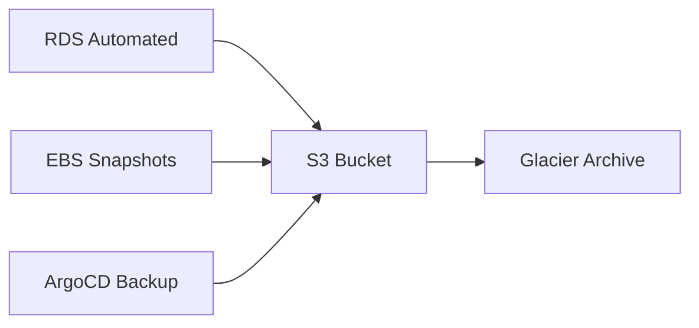

# Backup y Recuperación

Estrategias de backup automatizadas y procedimientos de recuperación.

## Estrategia de Backup



## RDS Automated Backups

```yaml
RDSInstance:
  Type: AWS::RDS::DBInstance
  Properties:
    BackupRetentionPeriod: 7
    PreferredBackupWindow: "03:00-04:00"
    CopyTagsToSnapshot: true
    DeleteAutomatedBackups: false
```

## Manual Snapshots

```bash
# Crear snapshot manual
aws rds create-db-snapshot \
  --db-instance-identifier gamedb-prod \
  --db-snapshot-identifier gamedb-$(date +%Y%m%d)

# Listar snapshots
aws rds describe-db-snapshots \
  --db-instance-identifier gamedb-prod

# Restaurar desde snapshot
aws rds restore-db-instance-from-db-snapshot \
  --db-instance-identifier gamedb-restored \
  --db-snapshot-identifier gamedb-20240101
```

## Application Data Backup

```bash
#!/bin/bash
# backup-app-data.sh

DATE=$(date +%Y%m%d_%H%M%S)
BACKUP_DIR="/backups/$DATE"

# Backup configurations
kubectl get configmaps -n game-system -o yaml > $BACKUP_DIR/configmaps.yaml
kubectl get secrets -n game-system -o yaml > $BACKUP_DIR/secrets.yaml

# Backup ArgoCD apps
kubectl get applications -n argocd -o yaml > $BACKUP_DIR/argocd-apps.yaml

# Upload to S3
aws s3 sync $BACKUP_DIR s3://game-backups/k8s/$DATE/

# Encrypt and archive
tar czf - $BACKUP_DIR | openssl enc -aes-256-cbc -pbkdf2 -out $BACKUP_DIR.tar.gz.enc
```

## Recovery Time Objectives (RTO)

| Componente | RTO | RPO | Strategy |
|-----------|-----|-----|----------|
| Base de Datos | 30 min | 5 min | RDS Automated Backup |
| Kubernetes | 15 min | 1 hr | ArgoCD GitOps |
| Configuración | 5 min | Real-time | Git Repository |
| Logs | N/A | 24 hrs | CloudWatch Retention |

## Point-in-Time Recovery

```bash
# Restaurar RDS a punto específico
aws rds restore-db-instance-to-point-in-time \
  --source-db-instance-identifier gamedb-prod \
  --target-db-instance-identifier gamedb-pitr \
  --restore-time 2024-01-01T10:00:00Z
```

## Disaster Recovery Playbook

### 1. Database Failure

```bash
# Paso 1: Verificar estado
aws rds describe-db-instances --db-instance-identifier gamedb-prod

# Paso 2: Restaurar desde snapshot más reciente
aws rds restore-db-instance-from-db-snapshot \
  --db-instance-identifier gamedb-dr \
  --db-snapshot-identifier $(aws rds describe-db-snapshots \
    --db-instance-identifier gamedb-prod \
    --query 'DBSnapshots[0].DBSnapshotIdentifier' \
    --output text)

# Paso 3: Actualizar DNS
aws route53 change-resource-record-sets \
  --hosted-zone-id Z1234567890ABC \
  --change-batch file://update-dns.json

# Paso 4: Validar conexión
psql -h new-endpoint.amazonaws.com -U admin -d gamedb
```

### 2. Kubernetes Cluster Failure

```bash
# Paso 1: Provisionar nuevo cluster
eksctl create cluster -f cluster-config.yaml

# Paso 2: Restaurar desde ArgoCD
kubectl apply -f argocd-apps.yaml

# Paso 3: Sincronizar aplicaciones
argocd app sync --all

# Paso 4: Verificar pods
kubectl get pods -A
```

## Backup Monitoring

```promql
# Último backup exitoso (horas)
(time() - rds_last_backup_timestamp) / 3600

# Tamaño de backups
sum(aws_s3_bucket_size_bytes{bucket="game-backups"})

# Tasa de crecimiento
rate(aws_s3_bucket_size_bytes[7d])
```

## Pruebas de Recuperación

```bash
# Ejecutar test de DR mensualmente
./scripts/dr-test.sh

# Checklist:
# - Restaurar DB desde snapshot
# - Validar integridad de datos
# - Probar aplicaciones contra DB restaurada
# - Medir tiempo de recuperación
# - Documentar lecciones aprendidas
```

---

Los backups regulares y pruebas de recuperación garantizan la continuidad del negocio.
