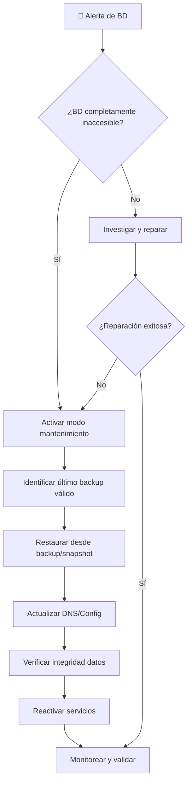

# Estrategia de Respaldo y Recuperación ante Desastres

<Note>
Esta documentación cubre la estrategia completa de backup y disaster recovery (DR) para la plataforma RetroGameCloud, incluyendo objetivos de recuperación, procedimientos automatizados y runbooks de emergencia.
</Note>

## Objetivos de Recuperación

### RPO (Recovery Point Objective)

- **Base de Datos Principal**: 15 minutos máximo

- **Archivos de Juegos (S3)**: 24 horas máximo

- **Configuraciones de Kubernetes**: 1 hora máximo

### RTO (Recovery Time Objective)

- **Servicios Críticos**: 30 minutos máximo

- **Base de Datos**: 15 minutos máximo

- **Frontend y CDN**: 10 minutos máximo

## Configuración de Backups Automatizados

### Base de Datos RDS PostgreSQL

<Tabs>
<Tab title="Configuración Terraform">

```hcl
resource "aws_db_instance" "retrogamecloud_db" {
  identifier = "retrogamecloud-prod"

  # Configuración de backups automatizados
  backup_retention_period = 30
  backup_window          = "03:00-04:00"
  maintenance_window     = "sun:04:00-sun:05:00"

  # Snapshots finales
  final_snapshot_identifier = "retrogamecloud-final-snapshot"
  skip_final_snapshot      = false

  # Cifrado
  storage_encrypted = true

  # Multi-AZ para alta disponibilidad
  multi_az = true

  # Monitoreo mejorado
  monitoring_interval = 60
  monitoring_role_arn = aws_iam_role.rds_enhanced_monitoring.arn

  tags = {
    Environment = "production"
    Backup      = "automated"
  }
}

# Snapshots manuales programados
resource "aws_lambda_function" "db_snapshot" {
  filename      = "db_snapshot.zip"
  function_name = "retrogamecloud-manual-snapshot"
  role         = aws_iam_role.lambda_snapshot_role.arn
  handler      = "index.handler"
  runtime      = "python3.9"
}

resource "aws_cloudwatch_event_rule" "weekly_snapshot" {
  name                = "weekly-db-snapshot"
  description         = "Trigger manual snapshot weekly"
  schedule_expression = "cron(0 2 ? * SUN *)"
}

```

</Tab>
<Tab title="Script de Snapshot Manual">

```python
import boto3
import datetime
import json

def handler(event, context):
    rds = boto3.client('rds')

    # Generar identificador único
    timestamp = datetime.datetime.now().strftime("%Y%m%d-%H%M%S")
    snapshot_id = f"retrogamecloud-manual-{timestamp}"

    try:
        response = rds.create_db_snapshot(
            DBSnapshotIdentifier=snapshot_id,
            DBInstanceIdentifier='retrogamecloud-prod',
            Tags=[
                {'Key': 'Type', 'Value': 'Manual'},
                {'Key': 'Environment', 'Value': 'Production'},
                {'Key': 'CreatedBy', 'Value': 'Lambda'}
            ]
        )

        return {
            'statusCode': 200,
            'body': json.dumps(f'Snapshot {snapshot_id} creado exitosamente')
        }

    except Exception as e:
        print(f'Error creando snapshot: {str(e)}')
        return {
            'statusCode': 500,
            'body': json.dumps(f'Error: {str(e)}')
        }

```

</Tab>
</Tabs>

### Backups de S3 (Archivos de Juegos)

```yaml

# s3-backup-policy.yaml
apiVersion: v1
kind: ConfigMap
metadata:
  name: s3-backup-config
data:
  backup-policy.json: |
    {
      "Rules": [
        {
          "ID": "GameFilesBackup",
          "Status": "Enabled",
          "Transitions": [
            {
              "Days": 30,
              "StorageClass": "STANDARD_IA"
            },
            {
              "Days": 90,
              "StorageClass": "GLACIER"
            },
            {
              "Days": 365,
              "StorageClass": "DEEP_ARCHIVE"
            }
          ]
        }
      ]
    }

```

<Warning>
Los archivos de juegos en DEEP_ARCHIVE requieren 12 horas para restauración. Planifica en consecuencia para el cumplimiento del RTO.
</Warning>

## Procedimientos de Restauración

### Restauración de Base de Datos

<Tabs>
<Tab title="Desde Backup Automatizado">

```bash
#!/bin/bash

# restore-from-automated-backup.sh

DB_INSTANCE="retrogamecloud-prod"
RESTORE_TIME="2024-01-15T10:30:00.000Z"
NEW_INSTANCE="retrogamecloud-restore-$(date +%Y%m%d%H%M)"

echo "🔄 Iniciando restauración Point-in-Time..."

# Crear nueva instancia desde backup automatizado
aws rds restore-db-instance-to-point-in-time \
    --source-db-instance-identifier $DB_INSTANCE \
    --target-db-instance-identifier $NEW_INSTANCE \
    --restore-time $RESTORE_TIME \
    --db-subnet-group-name retrogamecloud-subnet-group \
    --multi-az \
    --publicly-accessible false

echo "✅ Restauración iniciada. Instancia: $NEW_INSTANCE"

# Monitorear progreso
while true; do
    STATUS=$(aws rds describe-db-instances \
        --db-instance-identifier $NEW_INSTANCE \
        --query 'DBInstances[0].DBInstanceStatus' \
        --output text)

    echo "📊 Estado: $STATUS"

    if [ "$STATUS" = "available" ]; then
        echo "✅ Base de datos restaurada y disponible"
        break
    fi

    sleep 30
done

# Obtener endpoint de la nueva instancia
ENDPOINT=$(aws rds describe-db-instances \
    --db-instance-identifier $NEW_INSTANCE \
    --query 'DBInstances[0].Endpoint.Address' \
    --output text)

echo "🔗 Endpoint de la DB restaurada: $ENDPOINT"

```

</Tab>
<Tab title="Desde Snapshot Manual">

```bash
#!/bin/bash

# restore-from-snapshot.sh

SNAPSHOT_ID=$1
NEW_INSTANCE="retrogamecloud-restore-$(date +%Y%m%d%H%M)"

if [ -z "$SNAPSHOT_ID" ]; then
    echo "❌ Error: Proporciona el ID del snapshot"
    echo "Uso: $0 <snapshot-id>"
    exit 1
fi

echo "🔄 Restaurando desde snapshot: $SNAPSHOT_ID"

# Restaurar desde snapshot
aws rds restore-db-instance-from-db-snapshot \
    --db-instance-identifier $NEW_INSTANCE \
    --db-snapshot-identifier $SNAPSHOT_ID \
    --db-instance-class db.t3.medium \
    --multi-az \
    --publicly-accessible false

echo "✅ Restauración desde snapshot iniciada"
echo "📋 Nueva instancia: $NEW_INSTANCE"

```

</Tab>
</Tabs>

### Actualización de Configuración de Microservicios

```yaml

# db-config-update.yaml
apiVersion: v1
kind: ConfigMap
metadata:
  name: database-config
  namespace: retrogamecloud
data:
  DATABASE_HOST: "retrogamecloud-restore-20240115.cluster-xyz.eu-west-1.rds.amazonaws.com"
  DATABASE_PORT: "5432"
  DATABASE_NAME: "retrogamecloud"

- --
apiVersion: apps/v1
kind: Deployment
metadata:
  name: auth-service
spec:
  template:
    spec:
      containers:
      - name: auth-service
        env:
        - name: DATABASE_HOST
          valueFrom:
            configMapKeyRef:
              name: database-config
              key: DATABASE_HOST

```

## Pruebas de Disaster Recovery

### Programa de Pruebas Mensuales

<Card title="Cronograma de Pruebas DR" icon="calendar">

- **Primera semana**: Prueba de restauración de BD (ambiente de staging)

- **Segunda semana**: Prueba de failover de aplicación

- **Tercera semana**: Prueba de restauración completa de S3

- **Cuarta semana**: Simulacro completo de DR
</Card>

### Script de Prueba Automatizada

```python
#!/usr/bin/env python3

# dr-test.py

import boto3
import time
import subprocess
import logging
from datetime import datetime

logging.basicConfig(level=logging.INFO)
logger = logging.getLogger(__name__)

class DRTester:
    def __init__(self):
        self.rds = boto3.client('rds')
        self.s3 = boto3.client('s3')

    def test_db_backup_restore(self):
        """Prueba la restauración de base de datos"""
        logger.info("🧪 Iniciando prueba de restauración de BD")

        # Crear snapshot de prueba
        test_snapshot = f"dr-test-{datetime.now().strftime('%Y%m%d%H%M')}"

        try:
            self.rds.create_db_snapshot(
                DBSnapshotIdentifier=test_snapshot,
                DBInstanceIdentifier='retrogamecloud-staging'
            )

            # Esperar a que se complete
            waiter = self.rds.get_waiter('db_snapshot_completed')
            waiter.wait(DBSnapshotIdentifier=test_snapshot)

            logger.info(f"✅ Snapshot de prueba creado: {test_snapshot}")

            # Restaurar desde snapshot
            restore_instance = f"dr-test-restore-{int(time.time())}"
            self.rds.restore_db_instance_from_db_snapshot(
                DBInstanceIdentifier=restore_instance,
                DBSnapshotIdentifier=test_snapshot
            )

            # Verificar restauración
            waiter = self.rds.get_waiter('db_instance_available')
            waiter.wait(DBInstanceIdentifier=restore_instance)

            logger.info(f"✅ Instancia restaurada: {restore_instance}")

            # Cleanup
            self.rds.delete_db_instance(
                DBInstanceIdentifier=restore_instance,
                SkipFinalSnapshot=True
            )

            self.rds.delete_db_snapshot(
                DBSnapshotIdentifier=test_snapshot
            )

            return True

        except Exception as e:
            logger.error(f"❌ Error en prueba de BD: {e}")
            return False

    def test_application_failover(self):
        """Prueba el failover de aplicación"""
        logger.info("🧪 Iniciando prueba de failover de aplicación")

        try:
            # Simular fallo escalando a 0 réplicas
            subprocess.run([
                "kubectl", "scale", "deployment", "game-catalog-service",
                "--replicas=0", "-n", "retrogamecloud-staging"
            ], check=True)

            time.sleep(10)

            # Restaurar servicio
            subprocess.run([
                "kubectl", "scale", "deployment", "game-catalog-service",
                "--replicas=3", "-n", "retrogamecloud-staging"
            ], check=True)

            # Verificar que los pods estén ready
            subprocess.run([
                "kubectl", "wait", "--for=condition=ready", "pod",
                "-l", "app=game-catalog-service",
                "-n", "retrogamecloud-staging",
                "--timeout=300s"
            ], check=True)

            logger.info("✅ Failover de aplicación completado")
            return True

        except Exception as e:
            logger.error(f"❌ Error en failover: {e}")
            return False

    def run_full_test(self):
        """Ejecuta suite completa de pruebas DR"""
        results = {
            'db_restore': self.test_db_backup_restore(),
            'app_failover': self.test_application_failover()
        }

        logger.info(f"📊 Resultados de pruebas DR: {results}")
        return all(results.values())

if __name__ == "__main__":
    tester = DRTester()
    success = tester.run_full_test()
    exit(0 if success else 1)

```

## Runbook de Recuperación de Desastres

### Escenario 1: Fallo de Base de Datos



#### Checklist de Recuperación de BD

<Note>
Tiempo estimado: 15-30 minutos
</Note>

1. **Detección y Evaluación** (2 min)
   - [ ] Confirmar alerta en Grafana/Prometheus
   - [ ] Verificar conectividad de red
   - [ ] Evaluar gravedad del incidente

2. **Activación del Plan DR** (3 min)
   - [ ] Notificar al equipo de guardia
   - [ ] Activar página de mantenimiento
   - [ ] Documentar inicio del incidente

3. **Restauración de Datos** (10-20 min)
   ```bash
   # Comando de emergencia - usar con precaución
   ./scripts/emergency-db-restore.sh --latest-snapshot
   ```

   - [ ] Ejecutar script de restauración
   - [ ] Monitorear progreso de restauración
   - [ ] Verificar integridad de datos restaurados

4. **Reactivación de Servicios** (5 min)
   - [ ] Actualizar configuración de microservicios
   - [ ] Reiniciar servicios afectados
   - [ ] Verificar health checks
   - [ ] Desactivar página de mantenimiento

5. **Validación Post-Restauración** (5 min)
   - [ ] Ejecutar smoke tests
   - [ ] Verificar funcionalidad crítica
   - [ ] Monitorear métricas de performance
   - [ ] Confirmar resolución con stakeholders

### Escenario 2: Fallo Completo de Región AWS

<Warning>
Este escenario requiere arquitectura multi-región. Actualmente RetroGameCloud opera en una sola región.
</Warning>

#### Plan de Contingencia