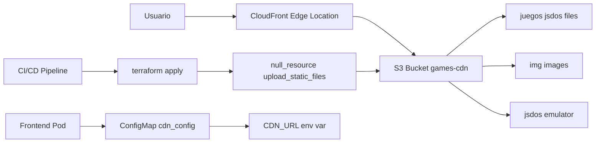

## Arquitectura CDN

Retro Game Hub utiliza **Amazon S3** como almacenamiento origen y **CloudFront** como CDN global para distribuir juegos retro (.jsdos), imágenes y assets del emulador js-dos.

<CardGroup cols={3}>
  <Card title="S3 Bucket" icon="bucket">
    **Almacenamiento**
    
    Origin para CloudFront
  </Card>
  
  <Card title="CloudFront" icon="cloud">
    **CDN Global**
    
    Edge locations worldwide
  </Card>
  
  <Card title="OAC" icon="shield">
    **Seguridad**
    
    Origin Access Control
  </Card>
</CardGroup>

## Diagrama de Arquitectura



## Buckets S3

### Bucket Principal: games-cdn

Almacena todos los assets estáticos del proyecto.

```hcl
resource "aws_s3_bucket" "games_cdn" {
  bucket        = "retrogame-games-cdn"
  force_destroy = true
}
```

**Contenido:**
- `/juegos/*.jsdos` - ROMs de juegos retro empaquetados
- `/img/*.jpg,png,gif` - Imágenes de portadas de juegos
- `/jsdos/*.js,wasm` - Emulador js-dos (DOSBox compilado a WebAssembly)

**Características de Seguridad:**
- ✅ Acceso público bloqueado
- ✅ Solo accesible vía CloudFront (OAC)
- ✅ HTTPS obligatorio (bucket policy)
- ✅ Versionado habilitado
- ✅ Logging habilitado

<CodeGroup>
```hcl Bloqueo de acceso público
resource "aws_s3_bucket_public_access_block" "games_cdn" {
  bucket = aws_s3_bucket.games_cdn.id

  block_public_acls       = true
  block_public_policy     = true
  ignore_public_acls      = true
  restrict_public_buckets = true
}
```

```hcl Política HTTPS obligatorio
resource "aws_s3_bucket_policy" "games_cdn" {
  bucket = aws_s3_bucket.games_cdn.id

  policy = jsonencode({
    Version = "2012-10-17"
    Statement = [
      {
        Sid    = "AllowCloudFrontServicePrincipal"
        Effect = "Allow"
        Principal = {
          Service = "cloudfront.amazonaws.com"
        }
        Action   = "s3:GetObject"
        Resource = "${aws_s3_bucket.games_cdn.arn}/*"
        Condition = {
          StringEquals = {
            "AWS:SourceArn" = aws_cloudfront_distribution.games_cdn.arn
          }
        }
      },
      {
        Sid       = "DenyInsecureTransport"
        Effect    = "Deny"
        Principal = "*"
        Action    = "s3:*"
        Resource = [
          aws_s3_bucket.games_cdn.arn,
          "${aws_s3_bucket.games_cdn.arn}/*"
        ]
        Condition = {
          Bool = {
            "aws:SecureTransport" = "false"
          }
        }
      }
    ]
  })
}
```

```hcl Versionado
resource "aws_s3_bucket_versioning" "games_cdn" {
  bucket = aws_s3_bucket.games_cdn.id
  versioning_configuration {
    status = "Enabled"
  }
}
```

```hcl CORS para acceso web
resource "aws_s3_bucket_cors_configuration" "games_cdn" {
  bucket = aws_s3_bucket.games_cdn.id

  cors_rule {
    allowed_headers = ["*"]
    allowed_methods = ["GET", "HEAD"]
    allowed_origins = ["*"]
    expose_headers  = ["ETag"]
    max_age_seconds = 3600
  }
}
```
</CodeGroup>

### Bucket de Logs: cdn-logs

Almacena logs de acceso de S3 y CloudFront.

```hcl
resource "aws_s3_bucket" "cdn_logs" {
  bucket        = "retrogame-cdn-logs"
  force_destroy = true
}
```

**Contenido:**
- `s3-access-logs/` - Logs de acceso al bucket principal
- `cloudfront-logs/` - Logs de distribución CloudFront (opcional)

**Configuración de logging:**
```hcl
resource "aws_s3_bucket_logging" "games_cdn" {
  bucket = aws_s3_bucket.games_cdn.id

  target_bucket = aws_s3_bucket.cdn_logs.id
  target_prefix = "s3-access-logs/"
}
```

## CloudFront Distribution

### Configuración

<Table>
  <thead>
    <tr>
      <th>Parámetro</th>
      <th>Valor</th>
      <th>Descripción</th>
    </tr>
  </thead>
  <tbody>
    <tr>
      <td>**Origin**</td>
      <td>S3: retrogame-games-cdn</td>
      <td>Bucket como origen</td>
    </tr>
    <tr>
      <td>**Protocol**</td>
      <td>HTTPS only</td>
      <td>Redirect HTTP → HTTPS</td>
    </tr>
    <tr>
      <td>**Compression**</td>
      <td>Enabled</td>
      <td>Gzip automático</td>
    </tr>
    <tr>
      <td>**IPv6**</td>
      <td>Enabled</td>
      <td>Soporte dual-stack</td>
    </tr>
    <tr>
      <td>**Root Object**</td>
      <td>index.html</td>
      <td>Default file</td>
    </tr>
    <tr>
      <td>**Price Class**</td>
      <td>All (default)</td>
      <td>Global distribution</td>
    </tr>
  </tbody>
</Table>

### Origin Access Control (OAC)

CloudFront utiliza **OAC** (reemplazo moderno de OAI) para acceder al bucket S3 de forma segura.

```hcl
resource "aws_cloudfront_origin_access_control" "games_cdn" {
  name                              = "retrogame-games-oac"
  description                       = "OAC for games CDN"
  origin_access_control_origin_type = "s3"
  signing_behavior                  = "always"
  signing_protocol                  = "sigv4"
}
```

**Ventajas de OAC vs OAI:**
- ✅ Firma de solicitudes con AWS Signature Version 4
- ✅ Soporte para todas las regiones de S3
- ✅ Soporte para cifrado SSE-KMS
- ✅ Mejor integración con bucket policies

### Cache Behaviors

CloudFront aplica diferentes políticas de caché según el tipo de contenido.

<Tabs>
  <Tab title="Default Behavior">
    **Path**: `/*` (todos los archivos)
    
    **TTL**:
    - Min: 0 segundos
    - Default: 1 hora (3600s)
    - Max: 24 horas (86400s)
    
    **Métodos permitidos**: GET, HEAD, OPTIONS
    
    **Compresión**: Sí
    
    **Viewer Protocol**: Redirect to HTTPS
    
    ```hcl
    default_cache_behavior {
      allowed_methods  = ["GET", "HEAD", "OPTIONS"]
      cached_methods   = ["GET", "HEAD"]
      target_origin_id = "S3-retrogame-games-cdn"

      forwarded_values {
        query_string = false
        headers      = ["Origin", "Access-Control-Request-Headers", 
                        "Access-Control-Request-Method"]
        cookies {
          forward = "none"
        }
      }

      viewer_protocol_policy = "redirect-to-https"
      min_ttl                = 0
      default_ttl            = 3600
      max_ttl                = 86400
      compress               = true
    }
    ```
  </Tab>
  
  <Tab title="Juegos .jsdos">
    **Path**: `/juegos/*.jsdos`
    
    **TTL**:
    - Min: 1 día (86400s)
    - Default: 7 días (604800s)
    - Max: 30 días (2592000s)
    
    **Razón**: Los juegos cambian raramente, caché agresivo
    
    ```hcl
    ordered_cache_behavior {
      path_pattern     = "/juegos/*.jsdos"
      allowed_methods  = ["GET", "HEAD", "OPTIONS"]
      cached_methods   = ["GET", "HEAD"]
      target_origin_id = "S3-retrogame-games-cdn"

      forwarded_values {
        query_string = false
        headers      = ["Origin", "Access-Control-Request-Headers",
                        "Access-Control-Request-Method"]
        cookies {
          forward = "none"
        }
      }

      viewer_protocol_policy = "redirect-to-https"
      min_ttl                = 86400
      default_ttl            = 604800  # 7 días
      max_ttl                = 2592000 # 30 días
      compress               = true
    }
    ```
  </Tab>
  
  <Tab title="Imágenes">
    **Path**: `/img/*`
    
    **TTL**:
    - Min: 1 día (86400s)
    - Default: 7 días (604800s)
    - Max: 30 días (2592000s)
    
    **Razón**: Las imágenes cambian raramente
    
    ```hcl
    ordered_cache_behavior {
      path_pattern     = "/img/*"
      allowed_methods  = ["GET", "HEAD", "OPTIONS"]
      cached_methods   = ["GET", "HEAD"]
      target_origin_id = "S3-retrogame-games-cdn"

      forwarded_values {
        query_string = false
        headers      = ["Origin", "Access-Control-Request-Headers",
                        "Access-Control-Request-Method"]
        cookies {
          forward = "none"
        }
      }

      viewer_protocol_policy = "redirect-to-https"
      min_ttl                = 86400
      default_ttl            = 604800
      max_ttl                = 2592000
      compress               = true
    }
    ```
  </Tab>
</Tabs>

### Invalidación de Caché

Para forzar actualización de contenido:

```bash
# Invalidar todo el contenido
aws cloudfront create-invalidation \
  --distribution-id E1234EXAMPLE \
  --paths "/*"

# Invalidar solo juegos
aws cloudfront create-invalidation \
  --distribution-id E1234EXAMPLE \
  --paths "/juegos/*"

# Invalidar archivo específico
aws cloudfront create-invalidation \
  --distribution-id E1234EXAMPLE \
  --paths "/juegos/doom.jsdos"
```

<Warning>
  Las primeras 1,000 invalidaciones por mes son gratis. Después: $0.005 por path.
</Warning>

## Subida Automática de Assets

Terraform despliega automáticamente los archivos estáticos al bucket S3.

### Null Resource: upload_static_files

```hcl
resource "null_resource" "upload_static_files" {
  triggers = {
    bucket_id = aws_s3_bucket.games_cdn.id
    always_run = timestamp()  # Forzar en cada apply
  }

  provisioner "local-exec" {
    command = <<-EOT
      echo "📦 Subiendo juegos (.jsdos) al CDN..."
      aws s3 sync ${path.root}/../../../infrastructure/cdn/juegos/ \
        s3://${aws_s3_bucket.games_cdn.id}/juegos/ \
        --region ${var.aws_region} \
        --profile ${var.aws_profile} \
        --delete \
        --exclude "*" \
        --include "*.jsdos"
      
      echo "🖼️  Subiendo imágenes al CDN..."
      aws s3 sync ${path.root}/../../../infrastructure/cdn/img/ \
        s3://${aws_s3_bucket.games_cdn.id}/img/ \
        --region ${var.aws_region} \
        --profile ${var.aws_profile} \
        --delete \
        --exclude "*" \
        --include "*.jpg" \
        --include "*.png" \
        --include "*.gif"
      
      echo "🎮 Subiendo emulador js-dos al CDN..."
      aws s3 sync ${path.root}/../../../frontend/jsdos/ \
        s3://${aws_s3_bucket.games_cdn.id}/jsdos/ \
        --region ${var.aws_region} \
        --profile ${var.aws_profile} \
        --delete \
        --exclude "*" \
        --include "*.js" \
        --include "*.css" \
        --include "*.wasm" \
        --include "*.html" \
        --include "*.symbols"
      
      echo "✅ Todos los archivos estáticos subidos al CDN"
    EOT
  }

  depends_on = [
    aws_s3_bucket.games_cdn,
    aws_cloudfront_distribution.games_cdn
  ]
}
```

**Características:**
- ✅ Se ejecuta automáticamente en cada `terraform apply`
- ✅ Sincronización incremental (solo archivos nuevos/modificados)
- ✅ `--delete` elimina archivos obsoletos del bucket
- ✅ Filtros por extensión para cada tipo de contenido

### Subida Manual

También puedes subir archivos manualmente:

```bash
# Subir un juego nuevo
aws s3 cp ./doom2.jsdos s3://retrogame-games-cdn/juegos/ \
  --region eu-west-1

# Subir una imagen
aws s3 cp ./doom2-cover.jpg s3://retrogame-games-cdn/img/ \
  --region eu-west-1

# Sincronizar directorio completo
aws s3 sync ./local-games/ s3://retrogame-games-cdn/juegos/ \
  --region eu-west-1
```

## Integración con Frontend

### ConfigMap de Kubernetes

La URL de CloudFront se inyecta automáticamente en el frontend vía ConfigMap.

```hcl
resource "kubernetes_config_map" "cdn_config" {
  metadata {
    name      = "cdn-config"
    namespace = kubernetes_namespace.retrogame.metadata[0].name
  }

  data = {
    CDN_URL          = "https://${aws_cloudfront_distribution.games_cdn.domain_name}"
    CDN_DISTRIBUTION = aws_cloudfront_distribution.games_cdn.id
    S3_BUCKET        = aws_s3_bucket.games_cdn.id
  }
}
```

### Uso en el Frontend

El frontend consume la variable de entorno `CDN_URL`:

```javascript
// score-tracker.js
const CDN_URL = window.CDN_URL || 'https://d1234example.cloudfront.net';

// Cargar juego desde CDN
const gameUrl = `${CDN_URL}/juegos/${gameSlug}.jsdos`;
Dos(canvas).run(gameUrl);

// Cargar imagen desde CDN
const coverUrl = `${CDN_URL}/img/${gameSlug}-cover.jpg`;
document.getElementById('cover').src = coverUrl;
```

### Deployment con CDN_URL

El deployment del frontend incluye la variable de entorno:

```yaml
apiVersion: apps/v1
kind: Deployment
metadata:
  name: frontend
spec:
  template:
    spec:
      containers:
      - name: frontend
        image: frontend:latest
        env:
        - name: CDN_URL
          valueFrom:
            configMapKeyRef:
              name: cdn-config
              key: CDN_URL
```

## Costos

<Table>
  <thead>
    <tr>
      <th>Componente</th>
      <th>Precio</th>
      <th>Estimación Mensual</th>
    </tr>
  </thead>
  <tbody>
    <tr>
      <td>**S3 Storage**</td>
      <td>$0.023/GB</td>
      <td>**$2.30** (100GB)</td>
    </tr>
    <tr>
      <td>**S3 GET Requests**</td>
      <td>$0.0004/1000</td>
      <td>**$0.40** (1M requests)</td>
    </tr>
    <tr>
      <td>**CloudFront Data Transfer**</td>
      <td>$0.085/GB (primeros 10TB)</td>
      <td>**$8.50** (100GB)</td>
    </tr>
    <tr>
      <td>**CloudFront Requests**</td>
      <td>$0.01/10,000</td>
      <td>**$1.00** (1M requests)</td>
    </tr>
    <tr>
      <td>**S3 Logging**</td>
      <td>$0.023/GB</td>
      <td>**$0.23** (10GB logs)</td>
    </tr>
    <tr>
      <td>**TOTAL**</td>
      <td>-</td>
      <td>**~$12.43/mes**</td>
    </tr>
  </tbody>
</Table>

### Comparación con Alternativas

<CardGroup cols={2}>
  <Card title="CloudFront + S3" icon="aws">
    **$12.43/mes** (100GB, 1M requests)
    
    ✅ Edge locations globales
    
    ✅ Caché configurable
    
    ✅ Integración AWS
  </Card>
  
  <Card title="S3 sin CloudFront" icon="bucket">
    **$25.00/mes** (100GB egress)
    
    ❌ Sin caché
    
    ❌ Latencia mayor
    
    ✅ Más simple
  </Card>
</CardGroup>

## Monitoreo

### Métricas de CloudFront

Ver métricas en CloudWatch:

```bash
# Requests por minuto
aws cloudwatch get-metric-statistics \
  --namespace AWS/CloudFront \
  --metric-name Requests \
  --dimensions Name=DistributionId,Value=E1234EXAMPLE \
  --start-time 2024-11-20T00:00:00Z \
  --end-time 2024-11-20T23:59:59Z \
  --period 3600 \
  --statistics Sum

# Bytes descargados
aws cloudwatch get-metric-statistics \
  --namespace AWS/CloudFront \
  --metric-name BytesDownloaded \
  --dimensions Name=DistributionId,Value=E1234EXAMPLE \
  --start-time 2024-11-20T00:00:00Z \
  --end-time 2024-11-20T23:59:59Z \
  --period 3600 \
  --statistics Sum
```

### Métricas Clave

<CardGroup cols={2}>
  <Card title="Cache Hit Ratio" icon="bullseye">
    **Meta**: > 85%
    
    Porcentaje de requests servidas desde caché
  </Card>
  
  <Card title="4xx Error Rate" icon="triangle-exclamation">
    **Meta**: < 1%
    
    Archivos no encontrados (404)
  </Card>
  
  <Card title="5xx Error Rate" icon="circle-exclamation">
    **Meta**: < 0.1%
    
    Errores del origen (S3)
  </Card>
  
  <Card title="Origin Latency" icon="clock">
    **Meta**: < 100ms
    
    Tiempo de respuesta de S3
  </Card>
</CardGroup>

## Troubleshooting

<AccordionGroup>
  <Accordion title="403 Forbidden al acceder a archivos">
    **Causa**: OAC no configurado correctamente o bucket policy incorrecta
    
    ```bash
    # Verificar bucket policy
    aws s3api get-bucket-policy --bucket retrogame-games-cdn
    
    # Verificar OAC en CloudFront
    aws cloudfront get-distribution-config --id E1234EXAMPLE
    
    # Verificar que CloudFront tenga permisos
    # La bucket policy debe incluir:
    # Principal.Service = "cloudfront.amazonaws.com"
    # Condition.StringEquals."AWS:SourceArn" = distribution ARN
    ```
  </Accordion>
  
  <Accordion title="Archivos no se actualizan">
    **Causa**: Caché de CloudFront no invalidada
    
    ```bash
    # Invalidar caché
    aws cloudfront create-invalidation \
      --distribution-id E1234EXAMPLE \
      --paths "/*"
    
    # Ver estado de invalidación
    aws cloudfront get-invalidation \
      --distribution-id E1234EXAMPLE \
      --id I1234EXAMPLE
    ```
  </Accordion>
  
  <Accordion title="CORS errors en el navegador">
    **Causa**: CORS no configurado en S3 o CloudFront no forwarding headers
    
    ```bash
    # Verificar CORS en S3
    aws s3api get-bucket-cors --bucket retrogame-games-cdn
    
    # Debe incluir:
    # - allowed_origins: ["*"]
    # - allowed_methods: ["GET", "HEAD"]
    # - allowed_headers: ["*"]
    
    # CloudFront debe forward headers CORS en cache behavior
    ```
  </Accordion>
  
  <Accordion title="Subida de archivos falla en terraform apply">
    **Causa**: Credenciales AWS incorrectas o permisos insuficientes
    
    ```bash
    # Verificar credenciales
    aws sts get-caller-identity --profile retrogamecloud-terraform
    
    # Verificar permisos del usuario
    aws iam get-user-policy --user-name terraform-user --policy-name S3Upload
    
    # El usuario debe tener permisos:
    # - s3:PutObject
    # - s3:GetObject
    # - s3:DeleteObject
    # - s3:ListBucket
    ```
  </Accordion>
</AccordionGroup>

## Outputs de Terraform

```bash
# URL del CDN
terraform output cdn_url
# https://d1234example.cloudfront.net

# Nombre del bucket
terraform output s3_games_bucket
# retrogame-games-cdn

# ID de distribución CloudFront
terraform output cloudfront_distribution_id
# E1234EXAMPLE

# Comando para subir juegos
terraform output upload_games_command
# aws s3 sync ./infrastructure/cdn/juegos/ s3://retrogame-games-cdn/juegos/ ...
```

## Próximos Pasos

<CardGroup cols={2}>
  <Card title="Route53 y SSL" icon="certificate" href="/infrastructure/route53-ssl">
    Configurar dominio personalizado
  </Card>
  
  <Card title="Monitoreo" icon="chart-line" href="/infrastructure/monitoring">
    Métricas y alertas de CDN
  </Card>
  
  <Card title="Frontend" icon="desktop" href="/frontend/overview">
    Integración del emulador js-dos
  </Card>
  
  <Card title="Infraestructura General" icon="server" href="/infrastructure/overview">
    Vista general de toda la infra
  </Card>
</CardGroup>
