## 4.8.1. Descripción General

El CDN de RetroGameCloud es un servidor Nginx optimizado para servir contenido estático, específicamente archivos de juegos DOS empaquetados en formato `.jsdos` (archivos ZIP) y recursos multimedia (imágenes, thumbnails).

<CardGroup cols={3}>
  <Card title="Archivos .jsdos" icon="gamepad">
    **Juegos DOS**
    
    Archivos ZIP empaquetados con ROMs y configuración js-dos
  </Card>

  <Card title="Imágenes" icon="image">
    **Multimedia**
    
    Thumbnails, portadas y screenshots de juegos
  </Card>

  <Card title="Alto Rendimiento" icon="gauge">
    **Optimizado**
    
    Caché agresivo, CORS, compresión Gzip
  </Card>
</CardGroup>

## 4.8.2. Arquitectura del CDN

```mermaid
graph LR
    A[Usuario Web] -->|GET /cdn/juegos/doom.jsdos| B[Kong Gateway]
    B -->|strip_path| C[CDN Service :80]
    C --> D[Nginx Container]
    D --> E[Volume /juegos]
    D --> F[Volume /img]
    
    E --> G[doom.jsdos<br/>duke3d.jsdos<br/>wolf.jsdos]
    F --> H[doom.png<br/>duke3d.png<br/>wolf.png]
    
    style D fill:#009639
    style B fill:#003366
```



### Flujo de Petición

1. **Cliente** solicita: `GET https://retrogamehub.games/cdn/juegos/doom.jsdos`
2. **Kong Gateway** recibe la petición y aplica `strip_path: true`
3. **Upstream** a CDN: `GET http://cdn:80/juegos/doom.jsdos`
4. **Nginx** sirve el archivo desde `/usr/share/nginx/html/juegos/doom.jsdos`
5. **Response** con headers CORS y cache control

## 4.8.3. Configuración Nginx

### Archivo: `cdn.conf`

```nginx
server {
    listen 80;
    server_name localhost;

    root /usr/share/nginx/html;
    index index.html;

    # Añadir tipo MIME .jsdos
    types {
        application/zip jsdos;
    }

    # Cabeceras CORS
    add_header 'Access-Control-Allow-Origin' '*' always;
    add_header 'Access-Control-Allow-Methods' 'GET, HEAD, OPTIONS' always;
    add_header 'Access-Control-Allow-Headers' 'DNT,User-Agent,X-Requested-With,If-Modified-Since,Cache-Control,Content-Type,Range' always;

    # Manejar peticiones OPTIONS
    if ($request_method = 'OPTIONS') {
        return 204;
    }

    # Cachear recursos estáticos
    location ~* \.(jpg|jpeg|png|gif|ico|css|js)$ {
        expires 1d;
        add_header Cache-Control "public, immutable";
    }

    # Archivos .jsdos - servir como application/zip
    location ~* \.jsdos$ {
        add_header 'Access-Control-Allow-Origin' '*' always;
        add_header 'Cache-Control' 'public, max-age=86400' always;
    }

    # Comprobación de salud
    location /health {
        access_log off;
        return 200 "healthy\n";
        add_header Content-Type text/plain;
    }
}
```

### Características Clave

<AccordionGroup>
  <Accordion title="Tipo MIME Personalizado">
    Los archivos `.jsdos` se sirven con `Content-Type: application/zip`:
    
    ```nginx
    types {
        application/zip jsdos;
    }
    ```
    
    Esto permite que los navegadores descarguen correctamente los archivos empaquetados.
  </Accordion>

  <Accordion title="CORS Permisivo">
    Headers CORS configurados para permitir cualquier origen:
    
    ```nginx
    add_header 'Access-Control-Allow-Origin' '*' always;
    add_header 'Access-Control-Allow-Methods' 'GET, HEAD, OPTIONS' always;
    ```
    
    **Razón:** Los juegos se cargan desde el frontend y requieren acceso cross-origin.
  </Accordion>

  <Accordion title="Caché Agresivo">
    **Imágenes:** 1 día de caché
    ```nginx
    expires 1d;
    add_header Cache-Control "public, immutable";
    ```
    
    **Archivos .jsdos:** 24 horas de caché
    ```nginx
    add_header 'Cache-Control' 'public, max-age=86400' always;
    ```
    
    **Beneficio:** Reduce ancho de banda y mejora latencia en descargas repetidas.
  </Accordion>

  <Accordion title="Health Check">
    Endpoint para verificación de salud:
    
    ```bash
    curl http://cdn/health
    # Response: healthy
    ```
    
    Usado por Kubernetes readiness/liveness probes.
  </Accordion>
</AccordionGroup>

## 4.8.4. Estructura de Directorios

```
infrastructure/cdn/
├── Dockerfile              # Imagen Docker del CDN
├── cdn.conf                # Configuración Nginx
├── juegos/                 # Archivos .jsdos (50-100MB cada uno)
│   ├── dangerousdave2.jsdos
│   ├── digger.jsdos
│   ├── doom.jsdos
│   ├── duke3d.jsdos
│   ├── heroesofmightandmagic2.jsdos
│   ├── lostvikings.jsdos
│   ├── mortalkombat.jsdos
│   ├── streetfighter2.jsdos
│   ├── tetris.jsdos
│   └── wolf.jsdos
└── img/                    # Thumbnails (PNG, <500KB cada uno)
    ├── dangerousdave2.png
    ├── digger.png
    ├── doom.png
    ├── duke3d.png
    └── ...
```

### Tamaños de Archivos

| Tipo | Tamaño Promedio | Total Aprox. |
|------|----------------|--------------|
| **Juegos .jsdos** | 50-100 MB | ~800 MB (10 juegos) |
| **Thumbnails PNG** | 200-500 KB | ~4 MB (10 imágenes) |
| **Total** | - | **~804 MB** |

## 4.8.5. Despliegue Kubernetes

### Deployment: `kubernetes/03-cdn.yaml`

```yaml
apiVersion: apps/v1
kind: Deployment
metadata:
  name: cdn-deployment
  namespace: retrogame
spec:
  replicas: 2
  selector:
    matchLabels:
      app: cdn
  template:
    metadata:
      labels:
        app: cdn
    spec:
      containers:
        - name: cdn
          image: retrogamehub/gamescdn:sha-0f69884
          imagePullPolicy: IfNotPresent
          ports:
            - containerPort: 80
          resources:
            requests:
              cpu: 50m
              memory: 64Mi
            limits:
              cpu: 200m
              memory: 128Mi
          readinessProbe:
            httpGet:
              path: /health
              port: 80
            initialDelaySeconds: 5
            periodSeconds: 5
          livenessProbe:
            httpGet:
              path: /health
              port: 80
            initialDelaySeconds: 10
            periodSeconds: 10
```

### Service

```yaml
apiVersion: v1
kind: Service
metadata:
  name: cdn
  namespace: retrogame
spec:
  type: ClusterIP
  ports:
    - port: 80
      targetPort: 80
      protocol: TCP
  selector:
    app: cdn
```

### Recursos Asignados

| Recurso | Request | Limit | Justificación |
|---------|---------|-------|---------------|
| **CPU** | 50m | 200m | Servir archivos estáticos es ligero |
| **Memoria** | 64Mi | 128Mi | Nginx con caché pequeña |
| **Réplicas** | 2 | - | Alta disponibilidad |

<Note>
Los archivos se incluyen en la imagen Docker, **no se usan volúmenes persistentes** en Kubernetes.
</Note>

## 4.8.6. Rutas Expuestas

### Via Kong Gateway

| Ruta Externa | Upstream CDN | Descripción |
|--------------|--------------|-------------|
| `/cdn/juegos/doom.jsdos` | `/juegos/doom.jsdos` | Descarga juego DOOM |
| `/cdn/img/doom.png` | `/img/doom.png` | Thumbnail de DOOM |

### Configuración Kong

```yaml
services:
  - name: cdn
    url: http://cdn:80
    routes:
      - name: cdn-games
        paths: [/cdn/juegos]
        strip_path: true
      
      - name: cdn-images
        paths: [/cdn/img]
        strip_path: true
```

**strip_path: true** elimina el prefijo `/cdn` antes de enviar al upstream:

```
Cliente:  GET /cdn/juegos/doom.jsdos
Kong:     GET http://cdn:80/juegos/doom.jsdos
Nginx:    Busca /usr/share/nginx/html/juegos/doom.jsdos
```

## 4.8.7. Build y Despliegue

### Dockerfile

```dockerfile
FROM nginx:1.25-alpine

# Copiar configuración Nginx
COPY cdn.conf /etc/nginx/conf.d/default.conf

# Copiar archivos estáticos
COPY juegos /usr/share/nginx/html/juegos
COPY img /usr/share/nginx/html/img

# Health check
HEALTHCHECK --interval=30s --timeout=3s --start-period=5s --retries=3 \
  CMD wget --quiet --tries=1 --spider http://localhost/health || exit 1

EXPOSE 80
```

### GitHub Actions CI/CD

```yaml
name: Build and Push CDN

on:
  push:
    paths:
      - 'infrastructure/cdn/**'

jobs:
  build:
    runs-on: ubuntu-latest
    steps:
      - uses: actions/checkout@v4
      
      - name: Build CDN image
        run: |
          cd infrastructure/cdn
          docker build -t retrogamehub/gamescdn:${{ github.sha }} .
      
      - name: Push to Docker Hub
        run: |
          echo "${{ secrets.DOCKERHUB_TOKEN }}" | docker login -u ${{ secrets.DOCKERHUB_USERNAME }} --password-stdin
          docker push retrogamehub/gamescdn:${{ github.sha }}
```

## 4.8.8. Monitoreo y Métricas

### Logs de Acceso

Nginx registra todas las peticiones en stdout (capturados por Kubernetes):

```
10.0.11.54 - - [07/Dec/2025:10:30:45 +0000] "GET /juegos/doom.jsdos HTTP/1.1" 200 54857321 "-" "Mozilla/5.0"
10.0.11.54 - - [07/Dec/2025:10:31:12 +0000] "GET /img/doom.png HTTP/1.1" 200 342156 "-" "Mozilla/5.0"
```

### Consultar Logs

```bash
# Ver últimos logs del CDN
kubectl logs -n retrogame deployment/cdn-deployment --tail=100

# Seguir logs en tiempo real
kubectl logs -n retrogame deployment/cdn-deployment -f

# Filtrar solo archivos .jsdos
kubectl logs -n retrogame deployment/cdn-deployment | grep '\.jsdos'
```

### Métricas Prometheus

<Tip>
Para métricas avanzadas, considera instalar **nginx-prometheus-exporter** como sidecar.
</Tip>

Métricas básicas disponibles via Kubernetes:

- `container_cpu_usage_seconds_total{pod=~"cdn-.*"}`
- `container_memory_working_set_bytes{pod=~"cdn-.*"}`
- `kube_pod_status_ready{pod=~"cdn-.*"}`

## 4.8.9. Testing Local

### Docker Compose

```yaml
services:
  cdn:
    build: ./infrastructure/cdn
    container_name: retro-cdn
    ports:
      - "8086:80"
    volumes:
      - ./infrastructure/cdn/cdn.conf:/etc/nginx/conf.d/default.conf:ro
      - ./infrastructure/cdn/juegos:/usr/share/nginx/html/juegos:ro
      - ./infrastructure/cdn/img:/usr/share/nginx/html/img:ro
```

### Pruebas

```bash
# Health check
curl http://localhost:8086/health

# Descargar juego
curl -I http://localhost:8086/juegos/doom.jsdos

# Verificar headers CORS
curl -I http://localhost:8086/juegos/doom.jsdos -H "Origin: https://retrogamehub.games"

# Verificar caché
curl -I http://localhost:8086/img/doom.png | grep -i cache
```

**Respuestas esperadas:**

```http
HTTP/1.1 200 OK
Content-Type: application/zip
Content-Length: 54857321
Access-Control-Allow-Origin: *
Cache-Control: public, max-age=86400
```

## 4.8.10. Troubleshooting

<AccordionGroup>
  <Accordion title="Error 404 - Archivo no encontrado">
    **Síntoma:** `GET /cdn/juegos/doom.jsdos` devuelve 404
    
    **Causas posibles:**
    1. Archivo no existe en la imagen Docker
    2. Kong no está haciendo strip_path correctamente
    3. Ruta incorrecta en la base de datos
    
    **Solución:**
    ```bash
    # Verificar archivos en pod
    kubectl exec -it deployment/cdn-deployment -n retrogame -- ls -lh /usr/share/nginx/html/juegos/
    
    # Verificar configuración Kong
    kubectl get configmap kong-declarative-config -n kong -o yaml
    
    # Verificar rutas en BD
    psql $DATABASE_URL -c "SELECT name, file_path FROM games;"
    ```
  </Accordion>

  <Accordion title="CORS Error en navegador">
    **Síntoma:** `Access to fetch at 'http://cdn/juegos/doom.jsdos' from origin 'https://retrogamehub.games' has been blocked by CORS policy`
    
    **Solución:**
    Verificar headers CORS en Nginx:
    ```bash
    kubectl exec -it deployment/cdn-deployment -n retrogame -- cat /etc/nginx/conf.d/default.conf | grep CORS
    ```
    
    Debe incluir:
    ```nginx
    add_header 'Access-Control-Allow-Origin' '*' always;
    ```
  </Accordion>

  <Accordion title="Descarga lenta de .jsdos">
    **Síntoma:** Archivos de 50MB tardan más de 10 segundos
    
    **Causas:**
    1. Límites de recursos muy bajos
    2. Sin compresión Gzip
    3. Red congestionada
    
    **Solución:**
    ```bash
    # Verificar recursos del pod
    kubectl top pod -n retrogame -l app=cdn
    
    # Aumentar límites si necesario
    kubectl set resources deployment/cdn-deployment -n retrogame \
      --limits=cpu=500m,memory=256Mi \
      --requests=cpu=100m,memory=128Mi
    ```
  </Accordion>

  <Accordion title="Pod crasheando (CrashLoopBackOff)">
    **Síntoma:** CDN pod en estado CrashLoopBackOff
    
    **Diagnóstico:**
    ```bash
    kubectl logs -n retrogame deployment/cdn-deployment --previous
    kubectl describe pod -n retrogame -l app=cdn
    ```
    
    **Causas comunes:**
    - Configuración Nginx inválida
    - Puerto 80 ocupado
    - Permisos incorrectos en archivos
  </Accordion>
</AccordionGroup>

## 4.8.11. Optimizaciones Futuras

<CardGroup cols={2}>
  <Card title="CDN Externo" icon="cloud">
    **CloudFront / CloudFlare**
    
    Migrar a CDN global para reducir latencia mundial
  </Card>

  <Card title="S3 Backend" icon="database">
    **Almacenamiento Externo**
    
    Mover archivos .jsdos a S3 y servir via CloudFront
  </Card>

  <Card title="Compresión Brotli" icon="file-zipper">
    **Mejor Compresión**
    
    Implementar Brotli para reducir tamaño de transferencia
  </Card>

  <Card title="HTTP/2 Push" icon="rocket">
    **Preload Assets**
    
    Push proactivo de thumbnails junto con HTML
  </Card>
</CardGroup>

### Comparación de Arquitecturas

| Aspecto | Actual (Nginx) | CloudFront + S3 |
|---------|----------------|-----------------|
| **Latencia** | 50-200ms (según región) | 10-50ms (edge locations) |
| **Costos** | $0 (incluido en cluster) | ~$10-50/mes |
| **Escalabilidad** | Limitada por cluster | Ilimitada |
| **Mantenimiento** | Manual (actualizar imagen) | Automático |
| **Complejidad** | Baja | Media |

## 4.8.12. Referencias

- [Nginx Documentation](https://nginx.org/en/docs/)
- [js-dos Format](https://js-dos.com/)
- [Kubernetes Volumes](https://kubernetes.io/docs/concepts/storage/volumes/)
- [CORS Headers](https://developer.mozilla.org/en-US/docs/Web/HTTP/CORS)
