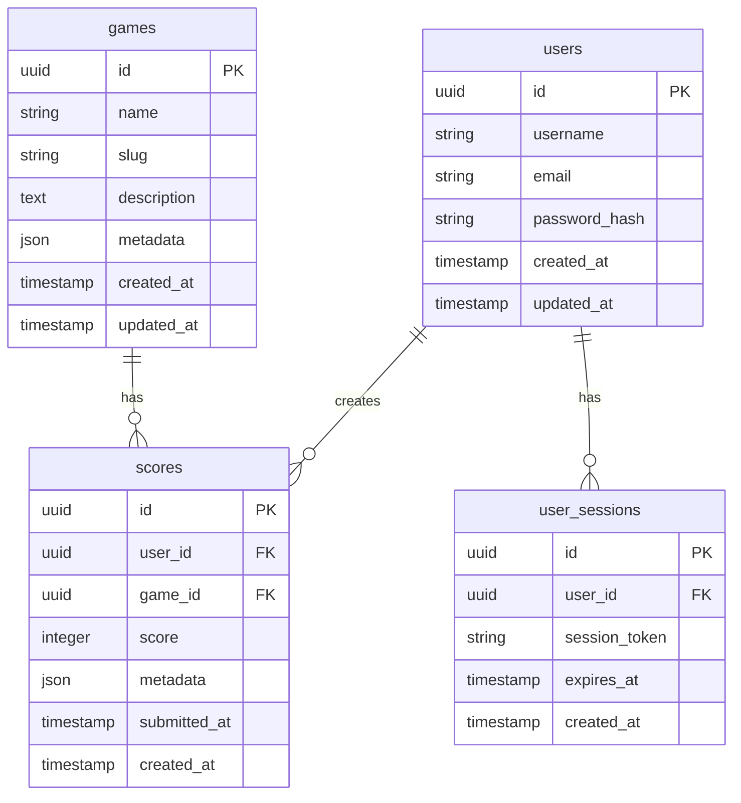

# Guía Completa de Base de Datos

Administración avanzada, esquema de datos, optimización y troubleshooting de PostgreSQL en RDS.

## Schema de Base de Datos

### Diagrama ERD



### Tablas Principales

#### Users

```sql
CREATE TABLE users (
    id UUID PRIMARY KEY DEFAULT gen_random_uuid(),
    username VARCHAR(50) UNIQUE NOT NULL,
    email VARCHAR(255) UNIQUE NOT NULL,
    password_hash TEXT NOT NULL,
    created_at TIMESTAMP DEFAULT CURRENT_TIMESTAMP,
    updated_at TIMESTAMP DEFAULT CURRENT_TIMESTAMP
);

-- Índices
CREATE UNIQUE INDEX idx_users_username ON users(username);
CREATE UNIQUE INDEX idx_users_email ON users(email);
CREATE INDEX idx_users_created_at ON users(created_at);
```

#### Games

```sql
CREATE TABLE games (
    id UUID PRIMARY KEY DEFAULT gen_random_uuid(),
    name VARCHAR(100) NOT NULL,
    slug VARCHAR(100) UNIQUE NOT NULL,
    description TEXT,
    metadata JSONB DEFAULT '{}',
    created_at TIMESTAMP DEFAULT CURRENT_TIMESTAMP,
    updated_at TIMESTAMP DEFAULT CURRENT_TIMESTAMP
);

-- Índices
CREATE UNIQUE INDEX idx_games_slug ON games(slug);
CREATE INDEX idx_games_name ON games(name);
CREATE INDEX idx_games_metadata ON games USING gin(metadata);
```

#### Scores

```sql
CREATE TABLE scores (
    id UUID PRIMARY KEY DEFAULT gen_random_uuid(),
    user_id UUID NOT NULL REFERENCES users(id) ON DELETE CASCADE,
    game_id UUID NOT NULL REFERENCES games(id) ON DELETE CASCADE,
    score INTEGER NOT NULL,
    metadata JSONB DEFAULT '{}',
    submitted_at TIMESTAMP DEFAULT CURRENT_TIMESTAMP,
    created_at TIMESTAMP DEFAULT CURRENT_TIMESTAMP
);

-- Índices
CREATE INDEX idx_scores_user_id ON scores(user_id);
CREATE INDEX idx_scores_game_id ON scores(game_id);
CREATE INDEX idx_scores_score ON scores(score DESC);
CREATE INDEX idx_scores_submitted_at ON scores(submitted_at DESC);
```

#### User Sessions

```sql
CREATE TABLE user_sessions (
    id UUID PRIMARY KEY DEFAULT gen_random_uuid(),
    user_id UUID NOT NULL REFERENCES users(id) ON DELETE CASCADE,
    session_token TEXT UNIQUE NOT NULL,
    expires_at TIMESTAMP NOT NULL,
    created_at TIMESTAMP DEFAULT CURRENT_TIMESTAMP
);

-- Índices
CREATE UNIQUE INDEX idx_sessions_token ON user_sessions(session_token);
CREATE INDEX idx_sessions_user_id ON user_sessions(user_id);
CREATE INDEX idx_sessions_expires_at ON user_sessions(expires_at);
```

## Optimización de Queries

### EXPLAIN ANALYZE

```sql
-- Análisis completo de query
EXPLAIN (ANALYZE, BUFFERS, VERBOSE)
SELECT s.score, u.username, g.name
FROM scores s
JOIN users u ON s.user_id = u.id
JOIN games g ON s.game_id = g.id
WHERE g.slug = 'pacman'
ORDER BY s.score DESC
LIMIT 10;
```

### Índices Compuestos

```sql
-- Para búsquedas por juego y ordenamiento
CREATE INDEX idx_scores_game_score ON scores(game_id, score DESC);

-- Para búsquedas por usuario y fecha
CREATE INDEX idx_scores_user_date ON scores(user_id, submitted_at DESC);

-- Índice parcial para scores recientes
CREATE INDEX idx_recent_scores ON scores(game_id, score DESC)
WHERE submitted_at > CURRENT_DATE - INTERVAL '30 days';

-- Índice compuesto para leaderboards
CREATE INDEX idx_leaderboard ON scores(game_id, score DESC, submitted_at DESC)
INCLUDE (user_id);
```

### Queries Optimizadas

```sql
-- Leaderboard global eficiente
WITH ranked_scores AS (
    SELECT 
        s.score,
        u.username,
        g.name as game_name,
        ROW_NUMBER() OVER (PARTITION BY g.id ORDER BY s.score DESC) as rank
    FROM scores s
    JOIN users u ON s.user_id = u.id
    JOIN games g ON s.game_id = g.id
    WHERE s.submitted_at > CURRENT_DATE - INTERVAL '30 days'
)
SELECT score, username, game_name, rank
FROM ranked_scores
WHERE rank <= 10;

-- Top usuarios por juego
SELECT 
    u.username,
    MAX(s.score) as best_score,
    COUNT(s.id) as total_games,
    AVG(s.score) as avg_score
FROM users u
JOIN scores s ON u.id = s.user_id
JOIN games g ON s.game_id = g.id
WHERE g.slug = $1
GROUP BY u.id, u.username
ORDER BY best_score DESC
LIMIT 10;
```

## Tuning de PostgreSQL

### Configuración Principal

```conf
# postgresql.conf - RDS optimizado
max_connections = 200
shared_buffers = 2GB
effective_cache_size = 6GB
maintenance_work_mem = 512MB
checkpoint_completion_target = 0.9
wal_buffers = 16MB
default_statistics_target = 100
random_page_cost = 1.1  # Para SSD
effective_io_concurrency = 200
work_mem = 10485kB
min_wal_size = 1GB
max_wal_size = 4GB

# Logging optimizado
log_min_duration_statement = 1000  # Log queries > 1s
log_checkpoints = on
log_connections = off
log_disconnections = off
log_lock_waits = on
```

### Configuración por Carga

```conf
# Para alta concurrencia
max_connections = 400
shared_buffers = 4GB
work_mem = 4MB

# Para análisis/reportes
max_connections = 50
shared_buffers = 8GB
work_mem = 256MB
maintenance_work_mem = 2GB
```

## Particionamiento

### Particionamiento por Fecha

```sql
-- Tabla particionada por fecha
CREATE TABLE scores_partitioned (
    id UUID DEFAULT gen_random_uuid(),
    user_id UUID NOT NULL,
    game_id UUID NOT NULL,
    score INTEGER NOT NULL,
    metadata JSONB DEFAULT '{}',
    submitted_at TIMESTAMP NOT NULL,
    created_at TIMESTAMP DEFAULT CURRENT_TIMESTAMP
) PARTITION BY RANGE (submitted_at);

-- Particiones mensuales automáticas
CREATE TABLE scores_2024_01 PARTITION OF scores_partitioned
    FOR VALUES FROM ('2024-01-01') TO ('2024-02-01');

CREATE TABLE scores_2024_02 PARTITION OF scores_partitioned
    FOR VALUES FROM ('2024-02-01') TO ('2024-03-01');

-- Función para crear particiones automáticamente
CREATE OR REPLACE FUNCTION create_monthly_partitions()
RETURNS void AS $$
DECLARE
    start_date date;
    end_date date;
    table_name text;
BEGIN
    start_date := date_trunc('month', CURRENT_DATE);
    end_date := start_date + INTERVAL '1 month';
    table_name := 'scores_' || to_char(start_date, 'YYYY_MM');
    
    EXECUTE format('CREATE TABLE IF NOT EXISTS %I PARTITION OF scores_partitioned
                    FOR VALUES FROM (%L) TO (%L)',
                   table_name, start_date, end_date);
END;
$$ LANGUAGE plpgsql;
```

## Vacuum y Mantenimiento

### Mantenimiento Manual

```sql
-- Vacuum completo con analyze
VACUUM (ANALYZE, VERBOSE) scores;

-- Vacuum solo índices
VACUUM (INDEX_CLEANUP ON) scores;

-- Reindex específico
REINDEX INDEX CONCURRENTLY idx_scores_game_score;

-- Reindex tabla completa
REINDEX TABLE CONCURRENTLY scores;
```

### Estadísticas de Mantenimiento

```sql
-- Verificar bloat en tablas
SELECT 
    schemaname,
    tablename,
    n_tup_ins as inserts,
    n_tup_upd as updates,
    n_tup_del as deletes,
    n_dead_tup as dead_tuples,
    last_vacuum,
    last_autovacuum,
    last_analyze,
    last_autoanalyze
FROM pg_stat_user_tables 
WHERE schemaname = 'public'
ORDER BY n_dead_tup DESC;

-- Tamaño de tablas e índices
SELECT 
    t.tablename,
    pg_size_pretty(pg_total_relation_size('"'||t.tablename||'"')) as total_size,
    pg_size_pretty(pg_relation_size('"'||t.tablename||'"')) as table_size,
    pg_size_pretty(pg_indexes_size('"'||t.tablename||'"')) as index_size
FROM pg_tables t
WHERE t.schemaname = 'public'
ORDER BY pg_total_relation_size('"'||t.tablename||'"') DESC;
```

### Automatización de Mantenimiento

```sql
-- Configuración de autovacuum
ALTER TABLE scores SET (
    autovacuum_vacuum_scale_factor = 0.1,
    autovacuum_analyze_scale_factor = 0.05,
    autovacuum_vacuum_cost_limit = 1000
);

-- Para tablas de alta frecuencia
ALTER TABLE user_sessions SET (
    autovacuum_vacuum_scale_factor = 0.02,
    autovacuum_analyze_scale_factor = 0.01
);
```

## Monitoreo y Troubleshooting

### Queries de Diagnóstico

```sql
-- Conexiones activas
SELECT 
    pid,
    usename,
    application_name,
    client_addr,
    state,
    query_start,
    query
FROM pg_stat_activity 
WHERE state = 'active'
ORDER BY query_start;

-- Locks bloqueantes
SELECT 
    blocked_locks.pid AS blocked_pid,
    blocked_activity.usename AS blocked_user,
    blocking_locks.pid AS blocking_pid,
    blocking_activity.usename AS blocking_user,
    blocked_activity.query AS blocked_statement,
    blocking_activity.query AS current_statement_in_blocking_process
FROM pg_catalog.pg_locks blocked_locks
JOIN pg_catalog.pg_stat_activity blocked_activity ON blocked_activity.pid = blocked_locks.pid
JOIN pg_catalog.pg_locks blocking_locks ON blocking_locks.locktype = blocked_locks.locktype
JOIN pg_catalog.pg_stat_activity blocking_activity ON blocking_activity.pid = blocking_locks.pid
WHERE NOT blocked_locks.GRANTED;

-- Queries lentas (requiere pg_stat_statements)
SELECT 
    query,
    calls,
    total_time,
    mean_time,
    rows,
    100.0 * shared_blks_hit / nullif(shared_blks_hit + shared_blks_read, 0) AS hit_percent
FROM pg_stat_statements 
ORDER BY total_time DESC 
LIMIT 10;
```

## Backup y Recovery

### Configuración de Backup

```sql
-- Backup completo
pg_dump --host=localhost --port=5432 --username=postgres --format=custom --file=backup.dump database_name

-- Backup solo schema
pg_dump --host=localhost --port=5432 --username=postgres --schema-only --file=schema.sql database_name

-- Restore
pg_restore --host=localhost --port=5432 --username=postgres --dbname=database_name backup.dump
```

### Point-in-Time Recovery

```sql
-- Configuración para PITR
archive_mode = on
archive_command = 'cp %p /backup/archive/%f'
wal_level = replica
max_wal_senders = 3
```

## Extensiones Recomendadas

```sql
-- UUID generation
CREATE EXTENSION IF NOT EXISTS "uuid-ossp";

-- Better statistics
CREATE EXTENSION IF NOT EXISTS pg_stat_statements;

-- Full text search
CREATE EXTENSION IF NOT EXISTS pg_trgm;

-- Crypto functions
CREATE EXTENSION IF NOT EXISTS pgcrypto;
```