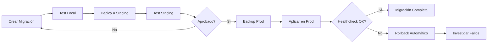

# 8.5. Migraciones de Base de Datos

Esta guía proporciona un proceso completo para gestionar migraciones de base de datos de forma segura, incluyendo estrategias para migraciones zero-downtime y procedimientos de rollback.

## Flujo de Migraciones



## Herramientas de Migración por Servicio

<Tabs>
<Tab title="TypeORM (User Service)">

```typescript
// src/migrations/1234567890123-AddUserPreferences.ts
import { MigrationInterface, QueryRunner, TableColumn } from 'typeorm';

export class AddUserPreferences1234567890123 implements MigrationInterface {
    name = 'AddUserPreferences1234567890123';

    public async up(queryRunner: QueryRunner): Promise<void> {
        await queryRunner.addColumn('users', new TableColumn({
            name: 'preferences',
            type: 'jsonb',
            isNullable: true,
            default: "'{}'::jsonb"
        }));

        // Agregar índice GIN para búsquedas eficientes en JSONB
        await queryRunner.query(
            `CREATE INDEX "IDX_users_preferences" ON "users" USING gin ("preferences")`
        );
    }

    public async down(queryRunner: QueryRunner): Promise<void> {
        await queryRunner.query(`DROP INDEX "IDX_users_preferences"`);
        await queryRunner.dropColumn('users', 'preferences');
    }
}

```

* *Generación de migraciones:**

```bash

# Generar migración automáticamente
npm run migration:generate -- -n AddUserPreferences

# Crear migración vacía
npm run migration:create -- -n CustomMigration

# Ejecutar migraciones
npm run migration:run

# Revertir última migración
npm run migration:revert

```

</Tab>
<Tab title="Sequelize (Game Catalog)">

```javascript
// migrations/20231201-add-game-tags.js
'use strict';

module.exports = {
  async up(queryInterface, Sequelize) {
    await queryInterface.addColumn('games', 'tags', {
      type: Sequelize.ARRAY(Sequelize.STRING),
      allowNull: true,
      defaultValue: []
    });

    await queryInterface.addIndex('games', ['tags'], {
      using: 'gin',
      name: 'games_tags_gin_idx'
    });

    // Migración de datos existentes
    await queryInterface.sequelize.query(`
      UPDATE games
      SET tags = ARRAY[category]
      WHERE tags IS NULL AND category IS NOT NULL
    `);
  },

  async down(queryInterface, Sequelize) {
    await queryInterface.removeIndex('games', 'games_tags_gin_idx');
    await queryInterface.removeColumn('games', 'tags');
  }
};

```

* *Comandos Sequelize:**

```bash

# Crear migración
npx sequelize-cli migration:generate --name add-game-tags

# Ejecutar migraciones
npx sequelize-cli db:migrate

# Revertir migración
npx sequelize-cli db:migrate:undo

```

</Tab>
<Tab title="Raw SQL (Analytics)">

```sql

- - migrations/20231201_001_add_user_activity_partitioning.sql
BEGIN;

- - Crear tabla particionada por fecha
CREATE TABLE user_activity_new (
    id BIGSERIAL,
    user_id INTEGER NOT NULL,
    activity_type VARCHAR(50) NOT NULL,
    metadata JSONB,
    created_at TIMESTAMP WITH TIME ZONE NOT NULL DEFAULT NOW()
) PARTITION BY RANGE (created_at);

- - Crear particiones mensuales
CREATE TABLE user_activity_2023_12 PARTITION OF user_activity_new
    FOR VALUES FROM ('2023-12-01') TO ('2024-01-01');

CREATE TABLE user_activity_2024_01 PARTITION OF user_activity_new
    FOR VALUES FROM ('2024-01-01') TO ('2024-02-01');

- - Migrar datos existentes
INSERT INTO user_activity_new
SELECT * FROM user_activity WHERE created_at >= '2023-12-01';

- - Crear índices
CREATE INDEX ON user_activity_new (user_id, created_at);
CREATE INDEX ON user_activity_new USING gin (metadata);

- - Intercambiar tablas
ALTER TABLE user_activity RENAME TO user_activity_old;
ALTER TABLE user_activity_new RENAME TO user_activity;

COMMIT;

```

* *Script de aplicación:**

```bash
#!/bin/bash

# apply-migration.sh
set -e

MIGRATION_FILE=$1
DATABASE_URL=$2

echo "Aplicando migración: $MIGRATION_FILE"
psql $DATABASE_URL -f $MIGRATION_FILE

echo "Migración completada exitosamente"

```

</Tab>
</Tabs>

## Patrones de Migración Zero-Downtime

### 1. Agregar Columnas

<Tabs>
<Tab title="Columnas Opcionales">

```typescript
// Paso 1: Agregar columna nullable
export class AddEmailColumn implements MigrationInterface {
    async up(queryRunner: QueryRunner): Promise<void> {
        await queryRunner.addColumn('users', new TableColumn({
            name: 'email',
            type: 'varchar',
            length: '255',
            isNullable: true // Importante: inicialmente nullable
        }));
    }
}

// Paso 2 (en siguiente release): Poblar datos
export class PopulateEmailColumn implements MigrationInterface {
    async up(queryRunner: QueryRunner): Promise<void> {
        await queryRunner.query(`
            UPDATE users
            SET email = username || '@example.com'
            WHERE email IS NULL
        `);
    }
}

// Paso 3 (en siguiente release): Hacer NOT NULL
export class MakeEmailNotNull implements MigrationInterface {
    async up(queryRunner: QueryRunner): Promise<void> {
        await queryRunner.query(
            `ALTER TABLE users ALTER COLUMN email SET NOT NULL`
        );
    }
}

```

</Tab>
<Tab title="Columnas con Valores por Defecto">

```sql

- - Migración segura con valor por defecto
ALTER TABLE games
ADD COLUMN status VARCHAR(20)
DEFAULT 'active'
NOT NULL;

- - Crear índice de forma concurrente (PostgreSQL)
CREATE INDEX CONCURRENTLY idx_games_status ON games(status);

```

</Tab>
</Tabs>

### 2. Eliminar Columnas

```typescript
// Paso 1: Deprecar uso en código (sin migración de BD)
// Paso 2: Después de deploy, eliminar columna
export class DropDeprecatedColumn implements MigrationInterface {
    async up(queryRunner: QueryRunner): Promise<void> {
        // Verificar que la columna no está siendo usada
        const result = await queryRunner.query(`
            SELECT COUNT(*) as count
            FROM information_schema.columns
            WHERE table_name = 'users' AND column_name = 'old_field'
        `);

        if (result[0].count > 0) {
            await queryRunner.dropColumn('users', 'old_field');
        }
    }

    async down(queryRunner: QueryRunner): Promise<void> {
        await queryRunner.addColumn('users', new TableColumn({
            name: 'old_field',
            type: 'varchar',
            isNullable: true
        }));
    }
}

```

### 3. Renombrar Tablas/Columnas

```sql

- - Estrategia de vistas para renombrar tablas
BEGIN;

- - Crear nueva tabla con estructura deseada
CREATE TABLE user_profiles AS SELECT * FROM users WHERE false;

- - Crear vista con nombre antiguo
CREATE VIEW users AS SELECT * FROM user_profiles;

- - Migrar datos en lotes
DO $$
DECLARE
    batch_size INTEGER := 10000;
    offset_val INTEGER := 0;
    row_count INTEGER;
BEGIN
    LOOP
        INSERT INTO user_profiles
        SELECT * FROM users_old
        ORDER BY id
        LIMIT batch_size OFFSET offset_val;

        GET DIAGNOSTICS row_count = ROW_COUNT;
        EXIT WHEN row_count = 0;

        offset_val := offset_val + batch_size;
        PERFORM pg_sleep(0.1); -- Pausa para no sobrecargar
    END LOOP;
END $$;

COMMIT;

```

## Migraciones de Datos Grandes

### Migración por Lotes

```typescript
export class MigrateUserDataInBatches implements MigrationInterface {
    async up(queryRunner: QueryRunner): Promise<void> {
        const batchSize = 10000;
        let offset = 0;
        let hasMoreData = true;

        while (hasMoreData) {
            const result = await queryRunner.query(`
                UPDATE users
                SET normalized_email = LOWER(email)
                WHERE id IN (
                    SELECT id FROM users
                    WHERE normalized_email IS NULL
                    ORDER BY id
                    LIMIT ${batchSize}
                )
            `);

            hasMoreData = result.affectedRows === batchSize;

            // Pausa para no sobrecargar la base de datos
            await new Promise(resolve => setTimeout(resolve, 100));

            console.log(`Procesados ${offset + result.affectedRows} registros`);
            offset += batchSize;
        }
    }
}

```

### Migración Asíncrona con Cola

```typescript
// migration-worker.ts
export class DataMigrationWorker {
    async processUserMigration(batchId: number): Promise<void> {
        const batchSize = 1000;
        const offset = batchId * batchSize;

        await this.queryRunner.query(`
            UPDATE users
            SET profile_data = jsonb_build_object(
                'preferences', old_preferences,
                'settings', old_settings
            )
            WHERE id >= ${offset} AND id < ${offset + batchSize}
            AND profile_data IS NULL
        `);
    }
}

// Encolar trabajos de migración
export class QueueDataMigration implements MigrationInterface {
    async up(queryRunner: QueryRunner): Promise<void> {
        // Contar total de registros
        const result = await queryRunner.query(`
            SELECT COUNT(*) as count FROM users WHERE profile_data IS NULL
        `);

        const totalRecords = result[0].count;
        const batchSize = 1000;
        const totalBatches = Math.ceil(totalRecords / batchSize);

        // Encolar trabajos
        for (let i = 0; i < totalBatches; i++) {
            await this.messageQueue.send('data-migration', {
                type: 'user-profile-migration',
                batchId: i
            });
        }
    }
}

```

## Procedimientos de Rollback

### Rollback Automático

```bash
#!/bin/bash

# rollback-migration.sh
set -e

MIGRATION_NAME=$1
SERVICE_NAME=$2

echo "Iniciando rollback de migración: $MIGRATION_NAME"

# Verificar salud del servicio
if ! curl -f http://localhost:3000/health; then
    echo "Servicio no responde, iniciando rollback..."

    # Rollback de base de datos
    case $SERVICE_NAME in
        "user-service")
            cd /app/user-service && npm run migration:revert
            ;;
        "game-catalog")
            cd /app/game-catalog && npx sequelize-cli db:migrate:undo
            ;;
        *)
            echo "Servicio no reconocido"
            exit 1
            ;;
    esac

    # Reiniciar servicio
    systemctl restart $SERVICE_NAME

    # Verificar recuperación
    sleep 10
    if curl -f http://localhost:3000/health; then
        echo "Rollback exitoso"
    else
        echo "Rollback falló, intervención manual requerida"
        exit 1
    fi
fi

```

### Rollback Manual con Punto de Restauración

```sql

- - Crear punto de restauración antes de migración
BEGIN;
SAVEPOINT before_migration;

- - Aplicar migración
ALTER TABLE games ADD COLUMN rating_avg DECIMAL(3,2);
UPDATE games SET rating_avg = (
    SELECT AVG(rating) FROM game_reviews WHERE game_id = games.id
);

- - En caso de problemas, rollback al punto de restauración
ROLLBACK TO SAVEPOINT before_migration;

- - Si todo está bien, confirmar cambios
COMMIT;

```

## Monitoreo y Alertas

### Script de Verificación Post-Migración

```typescript
// post-migration-check.ts
interface MigrationCheck {
    name: string;
    query: string;
    expectedResult?: any;
    validator: (result: any) => boolean;
}

const migrationChecks: MigrationCheck[] = [
    {
        name: 'Verificar nueva columna',
        query: `
            SELECT COUNT(*) as count
            FROM information_schema.columns
            WHERE table_name = 'users' AND column_name = 'preferences'
        `,
        validator: (result) => result[0].count === 1
    },
    {
        name: 'Verificar datos migrados',
        query: `
            SELECT COUNT(*) as count
            FROM users
            WHERE preferences IS NOT NULL
        `,
        validator: (result) => result[0].count > 0
    },
    {
        name: 'Verificar índice creado',
        query: `
            SELECT COUNT(*) as count
            FROM pg_indexes
            WHERE tablename = 'users'
            AND indexname = 'IDX_users_preferences'
        `,
        validator: (result) => result[0].count === 1
    }
];

async function runPostMigrationChecks(): Promise<boolean> {
    for (const check of migrationChecks) {
        try {
            const result = await queryRunner.query(check.query);
            if (!check.validator(result)) {
                console.error(`❌ Check failed: ${check.name}`);
                return false;
            }
            console.log(`✅ Check passed: ${check.name}`);
        } catch (error) {
            console.error(`❌ Check error: ${check.name}`, error);
            return false;
        }
    }
    return true;
}

```

### Métricas de Migración

```typescript
// migration-metrics.ts
export class MigrationMetrics {
    async recordMigrationStart(migrationName: string): Promise<void> {
        await this.metricsService.increment('database.migration.started', {
            migration: migrationName,
            service: process.env.SERVICE_NAME
        });
    }

    async recordMigrationSuccess(migrationName: string, duration: number): Promise<void> {
        await this.metricsService.increment('database.migration.completed', {
            migration: migrationName,
            service: process.env.SERVICE_NAME
        });

        await this.metricsService.histogram('database.migration.

```