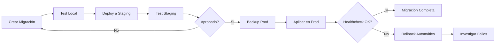

# 8.5. Migraciones de Base de Datos

Esta guía proporciona un proceso completo para gestionar migraciones de base de datos de forma segura, incluyendo estrategias para migraciones zero-downtime y procedimientos de rollback.

## Flujo de Migraciones



## Herramientas de Migración por Servicio

<Tabs>
<Tab title="TypeORM (User Service)">

```typescript
// src/migrations/1234567890123-AddUserPreferences.ts
import { MigrationInterface, QueryRunner, TableColumn } from 'typeorm';

export class AddUserPreferences1234567890123 implements MigrationInterface {
    name = 'AddUserPreferences1234567890123';

    public async up(queryRunner: QueryRunner): Promise<void> {
        await queryRunner.addColumn('users', new TableColumn({
            name: 'preferences',
            type: 'jsonb',
            isNullable: true,
            default: "'{}'::jsonb"
        }));
    }

    public async down(queryRunner: QueryRunner): Promise<void> {
        await queryRunner.dropColumn('users', 'preferences');
    }
}

```

</Tab>
<Tab title="Sequelize (Game Catalog)">

```javascript
// migrations/20231201-add-game-tags.js
'use strict';

module.exports = {
  async up(queryInterface, Sequelize) {
    await queryInterface.addColumn('games', 'tags', {
      type: Sequelize.ARRAY(Sequelize.STRING),
      allowNull: true,
      defaultValue: []
    });

    await queryInterface.addIndex('games', ['tags'], {
      using: 'gin',
      name: 'games_tags_gin_idx'
    });
  },

  async down(queryInterface, Sequelize) {
    await queryInterface.removeIndex('games', 'games_tags_gin_idx');
    await queryInterface.removeColumn('games', 'tags');
  }
};

```

</Tab>
<Tab title="Knex (Score Service)">

```javascript
// migrations/20231201_add_score_metadata.js
exports.up = function(knex) {
  return knex.schema.alterTable('scores', function(table) {
    table.jsonb('metadata').nullable().defaultTo('{}');
    table.index(['metadata'], 'scores_metadata_gin_idx', 'gin');
  });
};

exports.down = function(knex) {
  return knex.schema.alterTable('scores', function(table) {
    table.dropIndex(['metadata'], 'scores_metadata_gin_idx');
    table.dropColumn('metadata');
  });
};

```

</Tab>
</Tabs>

## Estrategias para Cambios Breaking

### Patrón Expand-Contract

<Warning>
Los cambios breaking deben realizarse en múltiples fases para mantener zero-downtime.
</Warning>

#### Fase 1: Expand (Añadir nueva estructura)

```sql

- - Migración 001: Añadir nueva columna nullable
ALTER TABLE users ADD COLUMN email_verified BOOLEAN DEFAULT NULL;

- - Crear índice para mejorar performance
CREATE INDEX CONCURRENTLY idx_users_email_verified ON users(email_verified);

```

#### Fase 2: Migrate (Poblar datos y actualizar aplicación)

```typescript
// Migración de datos progresiva
import { MigrationInterface, QueryRunner } from 'typeorm';

export class MigrateEmailVerification implements MigrationInterface {
    public async up(queryRunner: QueryRunner): Promise<void> {
        // Migrar datos en lotes para evitar locks largos
        const batchSize = 1000;
        let offset = 0;
        let hasMore = true;

        while (hasMore) {
            const result = await queryRunner.query(`
                UPDATE users
                SET email_verified = CASE
                    WHEN verification_token IS NULL THEN true
                    ELSE false
                END
                WHERE email_verified IS NULL
                AND id IN (
                    SELECT id FROM users
                    WHERE email_verified IS NULL
                    ORDER BY id
                    LIMIT $1 OFFSET $2
                )
            `, [batchSize, offset]);

            hasMore = result.affectedRows === batchSize;
            offset += batchSize;

            // Pausa para no saturar la base de datos
            await new Promise(resolve => setTimeout(resolve, 100));
        }
    }

    public async down(queryRunner: QueryRunner): Promise<void> {
        await queryRunner.query(`UPDATE users SET email_verified = NULL`);
    }
}

```

#### Fase 3: Contract (Eliminar estructura antigua)

```sql

- - Migración 003: Hacer campo obligatorio y limpiar
ALTER TABLE users ALTER COLUMN email_verified SET NOT NULL;
ALTER TABLE users ALTER COLUMN email_verified SET DEFAULT false;

- - Eliminar campos antiguos (en siguiente release)

- - ALTER TABLE users DROP COLUMN verification_token;

```

## Testing de Migraciones

### Testing Local

```bash

# Script: scripts/test-migration.sh
#!/bin/bash
set -e

echo "🧪 Iniciando testing de migración..."

# Crear snapshot de datos de prueba
docker exec retro-postgres pg_dump -U postgres -d retro_dev > ./backup/before_migration.sql

# Ejecutar migración
npm run migration:run

# Verificar integridad de datos
npm run migration:verify

# Ejecutar tests de integración
npm test -- --testNamePattern="migration"

echo "✅ Testing de migración completado"

```

### Testing en Staging

<Tabs>
<Tab title="Verificación Automática">

```typescript
// tests/migrations/verify-migration.test.ts
import { DataSource } from 'typeorm';
import { User } from '../entities/User';

describe('Migration Verification', () => {
    let dataSource: DataSource;

    beforeAll(async () => {
        dataSource = await AppDataSource.initialize();
    });

    test('should maintain data integrity after migration', async () => {
        const userCount = await dataSource.getRepository(User).count();
        expect(userCount).toBeGreaterThan(0);

        const usersWithNullEmail = await dataSource.getRepository(User)
            .count({ where: { emailVerified: null } });
        expect(usersWithNullEmail).toBe(0);
    });

    test('should have proper indexes', async () => {
        const indexes = await dataSource.query(`
            SELECT indexname FROM pg_indexes
            WHERE tablename = 'users'
            AND indexname = 'idx_users_email_verified'
        `);
        expect(indexes).toHaveLength(1);
    });
});

```

</Tab>
<Tab title="Performance Test">

```typescript
// tests/migrations/performance.test.ts
describe('Migration Performance', () => {
    test('should complete within acceptable time', async () => {
        const startTime = Date.now();

        // Simular consulta típica después de migración
        const users = await dataSource.getRepository(User)
            .find({
                where: { emailVerified: true },
                take: 100
            });

        const executionTime = Date.now() - startTime;
        expect(executionTime).toBeLessThan(1000); // Max 1 segundo
        expect(users).toBeDefined();
    });
});

```

</Tab>
</Tabs>

## Aplicación en Producción

### Preparación Pre-migración

<Note>
Utiliza este checklist antes de cada migración en producción.
</Note>

```yaml

# .github/workflows/migration-checklist.yml
name: Pre-Migration Checklist
on:
  workflow_dispatch:
    inputs:
      migration_name:
        description: 'Nombre de la migración'
        required: true

jobs:
  pre-migration:
    runs-on: ubuntu-latest
    steps:
      - name: Backup Database
        run: |
          kubectl exec -n retro-prod postgres-0 -- pg_dump \
            -U postgres retro_prod > backup-$(date +%Y%m%d-%H%M%S).sql
          aws s3 cp backup-*.sql s3://retro-backups/migrations/

      - name: Dry Run Migration
        run: |
          # Ejecutar migración en modo dry-run
          kubectl exec -n retro-prod deployment/user-service -- \
            npm run migration:dry-run

      - name: Verify Maintenance Window
        run: |
          # Verificar que estamos en ventana de mantenimiento
          current_hour=$(date +%H)
          if [ $current_hour -lt 2 ] || [ $current_hour -gt 6 ]; then
            echo "❌ Fuera de ventana de mantenimiento (02:00-06:00 UTC)"
            exit 1
          fi

```

### Migración Zero-Downtime

```bash
#!/bin/bash

# scripts/zero-downtime-migration.sh

set -e

MIGRATION_NAME=${1:-"unknown"}
NAMESPACE=${2:-"retro-prod"}

echo "🚀 Iniciando migración zero-downtime: $MIGRATION_NAME"

# Paso 1: Verificar health inicial
kubectl get pods -n $NAMESPACE -l app=user-service
kubectl exec -n $NAMESPACE deployment/user-service -- curl -f localhost:3000/health

# Paso 2: Aplicar migración de esquema
echo "📊 Aplicando migración de esquema..."
kubectl exec -n $NAMESPACE deployment/user-service -- npm run migration:run

# Paso 3: Rolling update con nueva imagen
echo "🔄 Actualizando aplicación..."
kubectl set image deployment/user-service \
  user-service=retro/user-service:${GITHUB_SHA} -n $NAMESPACE

# Paso 4: Esperar rollout
kubectl rollout status deployment/user-service -n $NAMESPACE --timeout=300s

# Paso 5: Verificar health después de migración
sleep 30
kubectl exec -n $NAMESPACE deployment/user-service -- curl -f localhost:3000/health

# Paso 6: Verificar métricas
kubectl exec -n $NAMESPACE deployment/user-service -- curl -f localhost:3000/metrics

echo "✅ Migración completada exitosamente"

```

## Plan de Rollback Automático

### Configuración de Health Checks

```typescript
// src/health/migration-health.ts
import { HealthIndicator, HealthIndicatorResult } from '@nestjs/terminus';
import { Injectable } from '@nestjs/common';
import { DataSource } from 'typeorm';

@Injectable()
export class MigrationHealthIndicator extends HealthIndicator {
    constructor(private dataSource: DataSource) {
        super();
    }

    async isHealthy(key: string): Promise<HealthIndicatorResult> {
        try {
            // Verificar que las migraciones se ejecutaron correctamente
            const migrations = await this.dataSource.runMigrations({
                transaction: 'none',
                fake: true // Solo verificar, no ejecutar
            });

            const isHealthy = migrations.length === 0; // No hay migraciones pendientes

            const result = this.getStatus(key, isHealthy, {
                pendingMigrations: migrations.length
            });

            if (!isHealthy) {
                throw new Error(`Pending migrations: ${migrations.length}`);
            }

            return result;
        } catch (error) {
            throw new Error(`Migration health check failed: ${error.message}`);
        }
    }
}

```

### Script de Rollback Automático

```bash
#!/bin/bash

# scripts/auto-rollback.sh

NAMESPACE=${1:-"retro-prod"}
MAX_RETRIES=5
RETRY_INTERVAL=30

echo "🔍 Verificando health después de migración..."

for i in $(seq 1 $MAX_RETRIES); do
    echo "Intento $i/$MAX_RETRIES..."

    if kubectl exec -n $NAMESPACE deployment/user-service -- \
       curl -f localhost:3000/health/migration; then
        echo "✅ Health check exitoso"
        exit 0
    fi

    echo "❌ Health check falló, esperando $RETRY_INTERVAL segundos..."
    sleep $RETRY_INTERVAL
done

echo "🚨 INICIANDO ROLLBACK AUTOMÁTICO"

# Rollback de Kubernetes deployment
kubectl rollout undo deployment/user-service -n $NAMESPACE
kubectl rollout status deployment/user-service -n $NAMESPACE --timeout=300s

# Rollback de migración de base de datos
echo "⏪ Ejecutando rollback de migración..."
kubectl exec -n $NAMESPACE deployment/user-service -- npm run migration:revert

# Verificar que el rollback funcionó
if kubectl exec -n $NAMESPACE deployment/user-service -- \
   curl -f localhost:3000/health; then
    echo "✅ Rollback completado exitosamente"

    # Notificar al equipo
    curl -X POST $SLACK_WEBHOOK_URL -H 'Content-type: application/json' \
      --data "{\"text\":\"🚨 Rollback automático ejecutado en $NAMESPACE para migración fallida\"}"
else
    echo "❌ ROLLBACK FALLÓ - INTERVENCIÓN MANUAL REQUERIDA"
    exit 1
fi

```

## Monitorización de Migraciones

### Métricas de Migración

```typescript
// src/metrics/migration-metrics.ts
import { Injectable } from '@nestjs/common';
import { PrometheusService } from './prometheus.service';

@Injectable()
export class MigrationMetrics {
    private migrationDuration = this.prometheus.createHistogram({
        name: 'migration_duration_seconds',
        help: 'Duration of database migrations',
        labelNames: ['migration_name', 'status']
    });

    private migrationCounter = this.prometheus.createCounter({
        name: 'migrations_total',
        help: 'Total number of migrations executed',
        labelNames: ['migration_name', 'status']
    });

    constructor(private prometheus: PrometheusService) {}

    recordMigrationStart(migrationName: string) {
        return this.migrationDuration.startTimer({
            migration_name: migrationName
        });
    }

    recordMigrationComplete(timer: any, migrationName: string, success: boolean) {
        const status = success ? 'success' : 'failed';
        timer({ migration_name: migrationName, status });

        this.migrationCounter.inc({
            migration_name: migrationName,
            status
        });
    }
}

```

### Dashboard de Migraciones

```yaml

# monitoring/migration-dashboard.yaml
apiVersion: v1
kind: ConfigMap
metadata:
  name: migration-dashboard
data:
  dashboard.json: |
    {
      "dashboard": {
        "title": "Database Migrations",
        "panels": [
          {
            "title": "Migration Duration",
            "targets": [{
              "expr": "migration_duration_seconds"
            }]
          },
          {
            "title": "Migration Success Rate",
            "targets": [{
              "

```