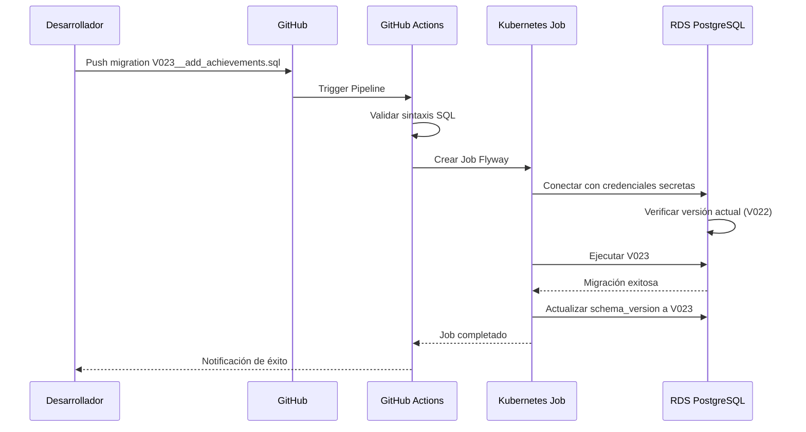

## Introducción

Las migraciones de base de datos en RetroGameCloud requieren un enfoque estructurado para mantener la integridad de datos y minimizar el tiempo de inactividad. Esta guía cubre desde la creación de scripts hasta la ejecución en producción.

<Note>
Todas las migraciones deben probarse exhaustivamente en entornos locales y staging antes del despliegue en producción.
</Note>

## Herramientas de Migración

### Flyway
Utilizamos **Flyway** como herramienta principal para el versionado y ejecución de migraciones de esquema:

- Versionado automático de scripts SQL

- Seguimiento del estado de migraciones

- Validación de checksums

- Soporte para rollbacks

### Configuración Docker
Para desarrollo local, utilizamos un contenedor Flyway configurado:

```yaml
version: '3.8'
services:
  flyway:
    image: flyway/flyway:8.5.13
    command: -url=jdbc:postgresql://postgres:5432/retrogame -user=postgres -password=password -connectRetries=60 migrate
    volumes:
      - ./migrations:/flyway/sql
    depends_on:
      - postgres

```

## Estructura de Migraciones

### Convención de Nomenclatura

Las migraciones siguen una estructura estricta:

<Tabs>
<Tab title="Migraciones hacia adelante">

```

V{version}__{descripción}.sql

Ejemplos:

- V001__initial_schema.sql

- V002__add_user_achievements.sql

- V003__create_game_scores_index.sql

```

</Tab>
<Tab title="Migraciones de rollback">

```

U{version}__{descripción}.sql

Ejemplos:

- U002__remove_user_achievements.sql

- U003__drop_game_scores_index.sql

```

</Tab>
</Tabs>

### Estructura de Directorios

```

migrations/
├── V001__initial_schema.sql
├── V002__add_user_achievements.sql
├── V003__create_game_scores_index.sql
├── U002__remove_user_achievements.sql
└── U003__drop_game_scores_index.sql

```

## Proceso de Migración

### Flujo Completo de Migración



### Pasos Detallados

#### 1. Desarrollo Local

<Tabs>
<Tab title="Crear Migración">

```sql

- - V024__add_game_categories.sql
CREATE TABLE game_categories (
    id SERIAL PRIMARY KEY,
    name VARCHAR(100) NOT NULL UNIQUE,
    description TEXT,
    created_at TIMESTAMP DEFAULT CURRENT_TIMESTAMP
);

CREATE INDEX idx_game_categories_name ON game_categories(name);

- - Insertar categorías por defecto
INSERT INTO game_categories (name, description) VALUES
('Arcade', 'Juegos de arcade clásicos'),
('RPG', 'Juegos de rol'),
('Platform', 'Juegos de plataformas');

```

</Tab>
<Tab title="Probar Localmente">

```bash

# Ejecutar contenedor Flyway local
docker-compose up flyway

# Verificar migración
docker exec -it postgres psql -U postgres -d retrogame -c "\dt"

```

</Tab>
</Tabs>

#### 2. Validación en Staging

```yaml

# kubernetes/jobs/flyway-migration.yaml
apiVersion: batch/v1
kind: Job
metadata:
  name: flyway-migration-v024
  namespace: retrogame-staging
spec:
  template:
    spec:
      containers:
      - name: flyway
        image: flyway/flyway:8.5.13
        command: ["flyway"]
        args: [
          "-url=jdbc:postgresql://$(DB_HOST):5432/$(DB_NAME)",
          "-user=$(DB_USER)",
          "-password=$(DB_PASSWORD)",
          "migrate"
        ]
        env:
        - name: DB_HOST
          valueFrom:
            secretKeyRef:
              name: db-credentials
              key: host
        volumeMounts:
        - name: migrations
          mountPath: /flyway/sql
      restartPolicy: Never

```

#### 3. Despliegue en Producción

<Warning>
Las migraciones en producción requieren ventana de mantenimiento aprobada para cambios destructivos.
</Warning>

```bash

# Ejecutar con ArgoCD
kubectl apply -f kubernetes/jobs/flyway-migration.yaml -n retrogame-prod

# Monitorear progreso
kubectl logs -f job/flyway-migration-v024 -n retrogame-prod

```

## Estrategias de Rollback

### Tipos de Rollback

<Tabs>
<Tab title="Rollback Automático">
Para migraciones que fallan durante la ejecución:

```sql

- - Flyway automáticamente revierte transacciones fallidas

- - No se requiere intervención manual

```

</Tab>
<Tab title="Rollback Manual">
Para migraciones completadas que necesitan revertirse:

```sql

- - U024__remove_game_categories.sql
DROP INDEX IF EXISTS idx_game_categories_name;
DROP TABLE IF EXISTS game_categories;

```

</Tab>
</Tabs>

### Procedimiento de Rollback

#### Rollback de Emergencia

```bash

# 1. Detener aplicaciones que usen las tablas afectadas
kubectl scale deployment user-service --replicas=0 -n retrogame-prod

# 2. Ejecutar script de rollback
kubectl create job flyway-rollback-v024 --image=flyway/flyway:8.5.13 \
  -- flyway -url=jdbc:postgresql://... -locations=filesystem:/rollback undo

# 3. Verificar estado de la base de datos
kubectl exec -it postgres-pod -- psql -c "SELECT * FROM flyway_schema_history ORDER BY installed_rank DESC LIMIT 5;"

# 4. Restaurar aplicaciones
kubectl scale deployment user-service --replicas=3 -n retrogame-prod

```

### Plan de Contingencia

#### Backup Antes de Migración

```bash

# Crear backup automático antes de migraciones críticas
pg_dump -h $DB_HOST -U $DB_USER -d retrogame \
  --file=backup_pre_migration_v024_$(date +%Y%m%d_%H%M%S).sql

```

#### Restauración de Backup

```bash

# En caso de fallo crítico
psql -h $DB_HOST -U $DB_USER -d retrogame < backup_pre_migration_v024.sql

```

## Mejores Prácticas

### Migraciones Seguras

<Card title="✅ Prácticas Recomendadas" icon="check">

- Utilizar transacciones para operaciones atómicas

- Crear índices de forma concurrente

- Añadir columnas como opcionales inicialmente

- Probar con datos de producción en staging

- Mantener scripts de rollback actualizados
</Card>

<Card title="❌ Evitar Estas Prácticas" icon="x">

- DROP COLUMN sin ventana de mantenimiento

- Cambios de tipo de datos destructivos

- Migraciones que requieren más de 5 minutos

- Dependencias entre migraciones no secuenciales
</Card>

### Ejemplos de Migraciones Complejas

#### Cambio de Tipo de Columna Seguro

<Tabs>
<Tab title="Paso 1: Añadir Nueva Columna">

```sql

- - V025__add_score_bigint.sql
ALTER TABLE game_scores
ADD COLUMN score_new BIGINT;

UPDATE game_scores
SET score_new = score::BIGINT;

```

</Tab>
<Tab title="Paso 2: Migrar Aplicación">

```sql

- - Actualizar aplicación para usar score_new

- - Desplegar nueva versión de microservicios

```

</Tab>
<Tab title="Paso 3: Eliminar Columna Antigua">

```sql

- - V026__remove_old_score_column.sql
ALTER TABLE game_scores
DROP COLUMN score;

ALTER TABLE game_scores
RENAME COLUMN score_new TO score;

```

</Tab>
</Tabs>

### Monitoreo de Migraciones

#### Métricas Importantes

```sql

- - Consultar estado de migraciones
SELECT
  installed_rank,
  version,
  description,
  type,
  installed_on,
  execution_time,
  success
FROM flyway_schema_history
ORDER BY installed_rank DESC;

```

#### Alertas de Prometheus

```yaml

# alerts/database-migrations.yaml

- alert: MigrationFailed
  expr: flyway_migration_success == 0
  for: 0m
  labels:
    severity: critical
  annotations:
    summary: "Migración de base de datos falló"
    description: "La migración {{ $labels.version }} ha fallado en {{ $labels.database }}"

```

## Integración con CI/CD

### Pipeline de GitHub Actions

```yaml
name: Database Migration
on:
  push:
    paths:
      - 'migrations/**'
    branches:
      - main

jobs:
  validate:
    runs-on: ubuntu-latest
    steps:
      - uses: actions/checkout@v3

      - name: Validate SQL Syntax
        run: |
          for file in migrations/V*.sql; do
            pg_prove --syntax-check "$file"
          done

      - name: Test Migration in Docker
        run: |
          docker-compose up -d postgres
          docker-compose run flyway migrate
          docker-compose run flyway validate

  deploy-staging:
    needs: validate
    runs-on: ubuntu-latest
    steps:
      - name: Deploy to Staging
        run: |
          kubectl apply -f kubernetes/jobs/flyway-migration.yaml -n retrogame-staging

```

## Casos de Emergencia

### Rollback de Producción

<Warning>
Sólo ejecutar rollbacks de producción con autorización del arquitecto de sistemas y notificación a stakeholders.
</Warning>

#### Checklist de Rollback

1. **Evaluación del Impacto**
   - [ ] Identificar servicios afectados
   - [ ] Estimar tiempo de inactividad
   - [ ] Notificar a equipos relevantes

2. **Preparación**
   - [ ] Verificar existencia de script de rollback
   - [ ] Confirmar backup reciente disponible
   - [ ] Preparar comando de rollback

3. **Ejecución**
   - [ ] Poner aplicaciones en modo mantenimiento
   - [ ] Ejecutar rollback de base de datos
   - [ ] Verificar integridad de datos
   - [ ] Restaurar aplicaciones

4. **Post-Rollback**
   - [ ] Validar funcionalidad completa
   - [ ] Notificar resolución del incidente
   - [ ] Documentar lecciones aprendidas

### Contactos de Emergencia

En caso de problemas críticos con migraciones:

- **Arquitecto de Sistemas**: Escalación inmediata

- **DBA Senior**: Consultas técnicas complejas

- **DevOps Lead**: Problemas de infraestructura

- **Product Owner**: Decisiones de negocio para rollbacks

<Note>
Esta guía debe revisarse trimestralmente y actualizarse según la evolución de la arquitectura de RetroGameCloud.
</Note>