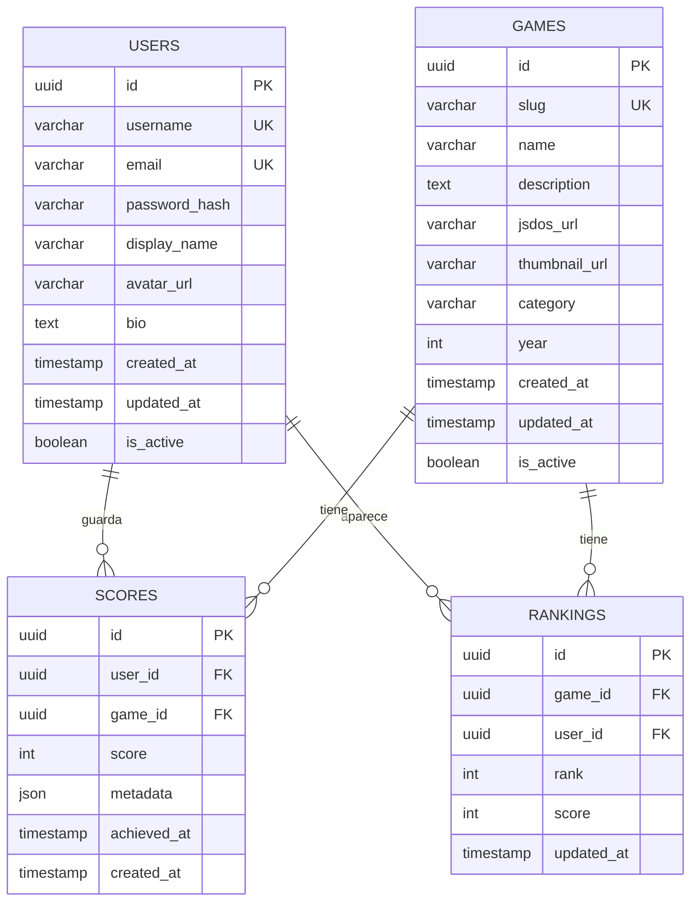

## Visión General

La base de datos PostgreSQL de RetroGameCloud está diseñada para soportar una plataforma de juegos retro escalable con gestión de usuarios, catálogo de juegos, puntuaciones y clasificaciones. Utiliza una arquitectura normalizada con identificadores UUID y está optimizada para consultas de alto rendimiento.

<Note>
  Todas las tablas utilizan identificadores UUID para garantizar la unicidad global y facilitar la distribución futura.
</Note>

## Diagrama del Modelo de Datos



## Esquemas de Tablas

### Tabla: users

<Tabs>
  <Tab title="Estructura">
    ```sql
    CREATE TABLE users (
        id UUID PRIMARY KEY DEFAULT gen_random_uuid(),
        username VARCHAR(50) UNIQUE NOT NULL,
        email VARCHAR(255) UNIQUE NOT NULL,
        password_hash VARCHAR(255) NOT NULL,
        display_name VARCHAR(100),
        avatar_url VARCHAR(500),
        bio TEXT,
        is_active BOOLEAN DEFAULT true,
        created_at TIMESTAMP WITH TIME ZONE DEFAULT CURRENT_TIMESTAMP,
        updated_at TIMESTAMP WITH TIME ZONE DEFAULT CURRENT_TIMESTAMP
    );
    ```

  </Tab>
  <Tab title="Índices">
    ```sql
    -- Índices principales
    CREATE UNIQUE INDEX idx_users_username ON users(username);
    CREATE UNIQUE INDEX idx_users_email ON users(email);
    CREATE INDEX idx_users_is_active ON users(is_active);
    CREATE INDEX idx_users_created_at ON users(created_at);

    -- Índice compuesto para búsquedas activas
    CREATE INDEX idx_users_active_created ON users(is_active, created_at)
    WHERE is_active = true;
    ```

  </Tab>
  <Tab title="Triggers">
    ```sql
    -- Trigger para actualizar updated_at automáticamente
    CREATE OR REPLACE FUNCTION update_updated_at_column()
    RETURNS TRIGGER AS $$
    BEGIN
        NEW.updated_at = CURRENT_TIMESTAMP;
        RETURN NEW;
    END;
    $$ language 'plpgsql';

    CREATE TRIGGER update_users_updated_at
        BEFORE UPDATE ON users
        FOR EACH ROW EXECUTE FUNCTION update_updated_at_column();
    ```

  </Tab>
</Tabs>

* *Descripción**: Almacena información de usuarios registrados en la plataforma.

* *Campos clave**:

- `username`: Identificador único legible por humanos

- `email`: Email único para autenticación

- `password_hash`: Hash seguro de la contraseña (bcrypt)

- `display_name`: Nombre mostrado públicamente

- `avatar_url`: URL de la imagen de perfil almacenada en S3

### Tabla: games

<Tabs>
  <Tab title="Estructura">
    ```sql
    CREATE TABLE games (
        id UUID PRIMARY KEY DEFAULT gen_random_uuid(),
        slug VARCHAR(100) UNIQUE NOT NULL,
        name VARCHAR(255) NOT NULL,
        description TEXT,
        jsdos_url VARCHAR(500) NOT NULL,
        thumbnail_url VARCHAR(500),
        category VARCHAR(50),
        year INTEGER,
        is_active BOOLEAN DEFAULT true,
        created_at TIMESTAMP WITH TIME ZONE DEFAULT CURRENT_TIMESTAMP,
        updated_at TIMESTAMP WITH TIME ZONE DEFAULT CURRENT_TIMESTAMP
    );
    ```

  </Tab>
  <Tab title="Índices">
    ```sql
    -- Índices principales
    CREATE UNIQUE INDEX idx_games_slug ON games(slug);
    CREATE INDEX idx_games_category ON games(category);
    CREATE INDEX idx_games_year ON games(year);
    CREATE INDEX idx_games_is_active ON games(is_active);

    -- Índice para búsqueda de texto completo
    CREATE INDEX idx_games_name_trgm ON games USING gin(name gin_trgm_ops);

    -- Índice compuesto para catálogo activo
    CREATE INDEX idx_games_active_category ON games(is_active, category, year)
    WHERE is_active = true;
    ```

  </Tab>
  <Tab title="Constraints">
    ```sql
    -- Validaciones de dominio
    ALTER TABLE games ADD CONSTRAINT chk_games_year
    CHECK (year >= 1970 AND year <= EXTRACT(YEAR FROM CURRENT_DATE));

    ALTER TABLE games ADD CONSTRAINT chk_games_category
    CHECK (category IN ('arcade', 'adventure', 'action', 'puzzle', 'rpg', 'strategy', 'simulation'));
    ```

  </Tab>
</Tabs>

* *Descripción**: Catálogo de juegos disponibles en la plataforma.

* *Campos clave**:

- `slug`: Identificador URL-friendly único

- `jsdos_url`: URL del archivo de juego en S3 para JS-DOS

- `thumbnail_url`: Miniatura del juego

- `category`: Categoría del juego (enum)

### Tabla: scores

<Tabs>
  <Tab title="Estructura">
    ```sql
    CREATE TABLE scores (
        id UUID PRIMARY KEY DEFAULT gen_random_uuid(),
        user_id UUID NOT NULL REFERENCES users(id) ON DELETE CASCADE,
        game_id UUID NOT NULL REFERENCES games(id) ON DELETE CASCADE,
        score INTEGER NOT NULL CHECK (score >= 0),
        metadata JSONB,
        achieved_at TIMESTAMP WITH TIME ZONE DEFAULT CURRENT_TIMESTAMP,
        created_at TIMESTAMP WITH TIME ZONE DEFAULT CURRENT_TIMESTAMP
    );
    ```

  </Tab>
  <Tab title="Índices">
    ```sql
    -- Índices de clave foránea
    CREATE INDEX idx_scores_user_id ON scores(user_id);
    CREATE INDEX idx_scores_game_id ON scores(game_id);

    -- Índices para rankings
    CREATE INDEX idx_scores_game_score ON scores(game_id, score DESC);
    CREATE INDEX idx_scores_user_game ON scores(user_id, game_id);

    -- Índice para mejor puntuación por usuario/juego
    CREATE UNIQUE INDEX idx_scores_user_game_max ON scores(user_id, game_id, score DESC);

    -- Índice GIN para metadata JSONB
    CREATE INDEX idx_scores_metadata ON scores USING GIN(metadata);
    ```

  </Tab>
</Tabs>

* *Descripción**: Almacena todas las puntuaciones obtenidas por los usuarios.

* *Campos clave**:

- `score`: Puntuación numérica (entero positivo)

- `metadata`: Datos adicionales en JSON (tiempo de juego, nivel alcanzado, etc.)

- `achieved_at`: Momento exacto en que se obtuvo la puntuación

<Warning>
  Las puntuaciones se almacenan de forma incremental. Para obtener la mejor puntuación de un usuario en un juego, usar las vistas materializadas correspondientes.
</Warning>

### Tabla: rankings

<Tabs>
  <Tab title="Estructura">
    ```sql
    CREATE TABLE rankings (
        id UUID PRIMARY KEY DEFAULT gen_random_uuid(),
        game_id UUID NOT NULL REFERENCES games(id) ON DELETE CASCADE,
        user_id UUID NOT NULL REFERENCES users(id) ON DELETE CASCADE,
        rank INTEGER NOT NULL CHECK (rank > 0),
        score INTEGER NOT NULL CHECK (score >= 0),
        updated_at TIMESTAMP WITH TIME ZONE DEFAULT CURRENT_TIMESTAMP,
        UNIQUE(game_id, user_id),
        UNIQUE(game_id, rank)
    );
    ```

  </Tab>
  <Tab title="Índices">
    ```sql
    -- Índice principal para rankings
    CREATE INDEX idx_rankings_game_rank ON rankings(game_id, rank);
    CREATE INDEX idx_rankings_user_id ON rankings(user_id);

    -- Índice para top rankings
    CREATE INDEX idx_rankings_top ON rankings(game_id, rank) WHERE rank <= 100;
    ```

  </Tab>
</Tabs>

* *Descripción**: Tabla desnormalizada con los rankings actuales por juego.

<Note>
  Esta tabla se actualiza mediante un proceso batch que calcula los rankings basándose en las mejores puntuaciones de cada usuario.
</Note>

## Vistas y Consultas Comunes

### Vista: user_best_scores

```sql
CREATE MATERIALIZED VIEW user_best_scores AS
SELECT
    user_id,
    game_id,
    MAX(score) as best_score,
    MIN(achieved_at) as first_achieved,
    MAX(achieved_at) as last_achieved,
    COUNT(*) as total_attempts
FROM scores
GROUP BY user_id, game_id;

- - Índices para la vista materializada
CREATE UNIQUE INDEX idx_user_best_scores_pk ON user_best_scores(user_id, game_id);
CREATE INDEX idx_user_best_scores_game ON user_best_scores(game_id, best_score DESC);

```

### Consultas Frecuentes

<Tabs>
  <Tab title="Top 10 Rankings">
    ```sql
    -- Top 10 jugadores por juego
    SELECT
        u.username,
        u.display_name,
        r.score,
        r.rank
    FROM rankings r
    JOIN users u ON r.user_id = u.id
    WHERE r.game_id = $1 AND r.rank <= 10
    ORDER BY r.rank;
    ```

  </Tab>
  <Tab title="Historial Usuario">
    ```sql
    -- Historial de puntuaciones de un usuario
    SELECT
        g.name as game_name,
        g.slug,
        s.score,
        s.achieved_at,
        s.metadata
    FROM scores s
    JOIN games g ON s.game_id = g.id
    WHERE s.user_id = $1
    ORDER BY s.achieved_at DESC
    LIMIT 50;
    ```

  </Tab>
  <Tab title="Estadísticas Juego">
    ```sql
    -- Estadísticas generales de un juego
    SELECT
        COUNT(DISTINCT user_id) as total_players,
        COUNT(*) as total_scores,
        MAX(score) as highest_score,
        AVG(score) as average_score,
        PERCENTILE_CONT(0.5) WITHIN GROUP (ORDER BY score) as median_score
    FROM scores
    WHERE game_id = $1;
    ```

  </Tab>
</Tabs>

## Configuración de Base de Datos

### Configuración RDS PostgreSQL

```yaml

# terraform/rds.tf
resource "aws_db_instance" "retrogamecloud_db" {
  identifier = "retrogamecloud-prod"

  # Configuración del motor
  engine         = "postgres"
  engine_version = "15.4"
  instance_class = "db.t3.medium"

  # Almacenamiento
  allocated_storage     = 100
  max_allocated_storage = 1000
  storage_encrypted     = true
  storage_type         = "gp3"

  # Base de datos
  db_name  = "retrogamecloud"
  username = var.db_master_username
  password = var.db_master_password

  # Redes y seguridad
  vpc_security_group_ids = [aws_security_group.rds.id]
  db_subnet_group_name   = aws_db_subnet_group.main.name

  # Respaldos
  backup_retention_period = 7
  backup_window          = "03:00-04:00"
  maintenance_window     = "sun:04:00-sun:05:00"

  # Monitorización
  monitoring_interval = 60
  enabled_cloudwatch_logs_exports = ["postgresql", "upgrade"]

  # Protección
  deletion_protection = true
  skip_final_snapshot = false
  final_snapshot_identifier = "retrogamecloud-final-snapshot"

  tags = {
    Name = "RetroGameCloud Production DB"
    Environment = "production"
  }
}

```

### Variables de Conexión

```bash

# Variables de entorno para microservicios
DB_HOST=retrogamecloud-prod.cluster-xyz.eu-west-1.rds.amazonaws.com
DB_PORT=5432
DB_NAME=retrogamecloud
DB_USER=app_user
DB_PASSWORD=${DB_PASSWORD} # Desde AWS Secrets Manager
DB_MAX_CONNECTIONS=20
DB_CONNECTION_TIMEOUT=30

```

## Estrategias de Respaldo y Recuperación

### Respaldos Automáticos

<Card title="Configuración de Respaldos" icon="clock">
  - **Respaldos automáticos**: Cada 24 horas
  - **Ventana de respaldo**: 03:00-04:00 UTC
  - **Retención**: 7 días
  - **Snapshots manuales**: Antes de cada despliegue mayor
</Card>

### Procedimiento de Recuperación

```bash

# Restaurar desde snapshot
aws rds restore-db-instance-from-db-snapshot \
  --db-instance-identifier retrogamecloud-restored \
  --db-snapshot-identifier retrogamecloud-snapshot-2024-01-15

# Verificar integridad de datos
psql -h $DB_HOST -U $DB_USER -d $DB_NAME -c "
SELECT
  schemaname,
  tablename,
  n_tup_ins as inserts,
  n_tup_upd as updates,
  n_tup_del as deletes
FROM pg_stat_user_tables;
"

```

## Migraciones de Base de Datos

### Estructura de Migraciones

```

migrations/
├── 001_initial_schema.up.sql
├── 001_initial_schema.down.sql
├── 002_add_user_profiles.up.sql
├── 002_add_user_profiles.down.sql
├── 003_optimize_indexes.up.sql
└── 003_optimize_indexes.down.sql

```

### Ejemplo de Migración

<Tabs>
  <Tab title="Up Migration">
    ```sql
    -- migrations/004_add_game_categories.up.sql
    BEGIN;

    -- Añadir nueva columna
    ALTER TABLE games ADD COLUMN difficulty_level INTEGER DEFAULT 1;

    -- Añadir constraint
    ALTER TABLE games ADD CONSTRAINT chk_difficulty_level
    CHECK (difficulty_level BETWEEN 1 AND 5);

    -- Crear índice
    CREATE INDEX idx_games_difficulty ON games(difficulty_level);

    -- Actualizar datos existentes
    UPDATE games SET difficulty_level = 2 WHERE category = 'arcade';
    UPDATE games SET difficulty_level = 3 WHERE category =