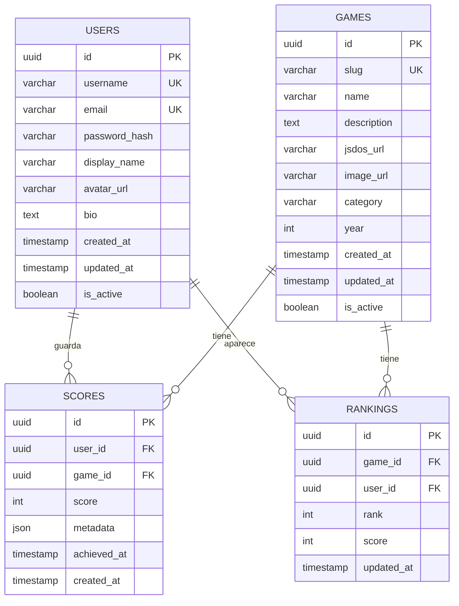

## Visión General

La base de datos PostgreSQL de RetroGameCloud está diseñada para soportar una plataforma de juegos retro escalable con gestión de usuarios, catálogo de juegos, puntuaciones y clasificaciones. Utiliza una arquitectura normalizada con identificadores UUID y está optimizada para consultas de alto rendimiento.

<Note>
  Todas las tablas utilizan identificadores UUID para garantizar la unicidad global y facilitar la distribución futura.
</Note>

## Diagrama del Modelo de Datos



## Esquemas de Tablas

### Tabla: users

<Tabs>
  <Tab title="Estructura">
    ```sql
    CREATE TABLE users (
        id UUID PRIMARY KEY DEFAULT gen_random_uuid(),
        username VARCHAR(50) UNIQUE NOT NULL,
        email VARCHAR(255) UNIQUE NOT NULL,
        password_hash VARCHAR(255) NOT NULL,
        display_name VARCHAR(100),
        avatar_url TEXT,
        bio TEXT,
        created_at TIMESTAMP WITH TIME ZONE DEFAULT CURRENT_TIMESTAMP,
        updated_at TIMESTAMP WITH TIME ZONE DEFAULT CURRENT_TIMESTAMP,
        is_active BOOLEAN DEFAULT true
    );
    ```

  </Tab>
  <Tab title="Índices">
    ```sql
    -- Índices automáticos por PKs y UNIQUEs
    CREATE INDEX idx_users_email ON users(email);
    CREATE INDEX idx_users_username ON users(username);
    CREATE INDEX idx_users_created_at ON users(created_at);
    CREATE INDEX idx_users_is_active ON users(is_active);
    ```

  </Tab>
  <Tab title="Constraints">
    ```sql
    ALTER TABLE users ADD CONSTRAINT chk_username_length
        CHECK (length(username) >= 3);
    ALTER TABLE users ADD CONSTRAINT chk_email_format
        CHECK (email ~* '^[A-Za-z0-9._%+-]+@[A-Za-z0-9.-]+\.[A-Za-z]{2,}$');
    ALTER TABLE users ADD CONSTRAINT chk_display_name_length
        CHECK (length(display_name) >= 1);
    ```

  </Tab>
</Tabs>

### Tabla: games

<Tabs>
  <Tab title="Estructura">
    ```sql
    CREATE TABLE games (
        id UUID PRIMARY KEY DEFAULT gen_random_uuid(),
        name VARCHAR(255) NOT NULL,
        slug VARCHAR(255) UNIQUE NOT NULL,
        description TEXT,
        jsdos_url TEXT NOT NULL,
        image_url TEXT,
        category VARCHAR(100),
        year INTEGER,
        created_at TIMESTAMP WITH TIME ZONE DEFAULT CURRENT_TIMESTAMP,
        updated_at TIMESTAMP WITH TIME ZONE DEFAULT CURRENT_TIMESTAMP,
        is_active BOOLEAN DEFAULT true
    );
    ```

  </Tab>
  <Tab title="Índices">
    ```sql
    CREATE INDEX idx_games_slug ON games(slug);
    CREATE INDEX idx_games_category ON games(category);
    CREATE INDEX idx_games_year ON games(year);
    CREATE INDEX idx_games_is_active ON games(is_active);
    CREATE INDEX idx_games_name_trgm ON games USING gin(name gin_trgm_ops);
    ```

  </Tab>
  <Tab title="Constraints">
    ```sql
    ALTER TABLE games ADD CONSTRAINT chk_slug_format
        CHECK (slug ~* '^[a-z0-9-]+$');
    ALTER TABLE games ADD CONSTRAINT chk_year_range
        CHECK (year >= 1970 AND year <= EXTRACT(YEAR FROM CURRENT_DATE));
    ALTER TABLE games ADD CONSTRAINT chk_name_length
        CHECK (length(name) >= 1);
    ```

  </Tab>
</Tabs>

### Tabla: scores

<Tabs>
  <Tab title="Estructura">
    ```sql
    CREATE TABLE scores (
        id UUID PRIMARY KEY DEFAULT gen_random_uuid(),
        user_id UUID NOT NULL REFERENCES users(id) ON DELETE CASCADE,
        game_id UUID NOT NULL REFERENCES games(id) ON DELETE CASCADE,
        score INTEGER NOT NULL,
        metadata JSONB,
        achieved_at TIMESTAMP WITH TIME ZONE DEFAULT CURRENT_TIMESTAMP,
        created_at TIMESTAMP WITH TIME ZONE DEFAULT CURRENT_TIMESTAMP,
        UNIQUE(user_id, game_id)
    );
    ```

  </Tab>
  <Tab title="Índices">
    ```sql
    -- Índice compuesto para rankings ordenados por juego
    CREATE INDEX idx_scores_game_score_desc ON scores(game_id, score DESC);
    CREATE INDEX idx_scores_user_id ON scores(user_id);
    CREATE INDEX idx_scores_achieved_at ON scores(achieved_at);
    CREATE INDEX idx_scores_metadata ON scores USING gin(metadata);
    ```

  </Tab>
  <Tab title="Constraints">
    ```sql
    ALTER TABLE scores ADD CONSTRAINT chk_score_positive
        CHECK (score >= 0);
    ALTER TABLE scores ADD CONSTRAINT chk_achieved_at_valid
        CHECK (achieved_at <= CURRENT_TIMESTAMP);
    ```

  </Tab>
</Tabs>

### Tabla: rankings

<Tabs>
  <Tab title="Estructura">
    ```sql
    CREATE TABLE rankings (
        id UUID PRIMARY KEY DEFAULT gen_random_uuid(),
        game_id UUID NOT NULL REFERENCES games(id) ON DELETE CASCADE,
        user_id UUID NOT NULL REFERENCES users(id) ON DELETE CASCADE,
        rank INTEGER NOT NULL,
        score INTEGER NOT NULL,
        updated_at TIMESTAMP WITH TIME ZONE DEFAULT CURRENT_TIMESTAMP,
        UNIQUE(game_id, rank),
        UNIQUE(game_id, user_id)
    );
    ```

  </Tab>
  <Tab title="Índices">
    ```sql
    CREATE INDEX idx_rankings_game_rank ON rankings(game_id, rank);
    CREATE INDEX idx_rankings_user_id ON rankings(user_id);
    CREATE INDEX idx_rankings_updated_at ON rankings(updated_at);
    ```

  </Tab>
  <Tab title="Constraints">
    ```sql
    ALTER TABLE rankings ADD CONSTRAINT chk_rank_positive
        CHECK (rank > 0);
    ALTER TABLE rankings ADD CONSTRAINT chk_ranking_score_positive
        CHECK (score >= 0);
    ```

  </Tab>
</Tabs>

## Queries Comunes

### Top 10 Jugadores por Juego

```sql

- - Obtener el ranking de los mejores 10 jugadores para un juego específico
SELECT
    r.rank,
    u.username,
    u.display_name,
    u.avatar_url,
    r.score,
    r.updated_at
FROM rankings r
JOIN users u ON r.user_id = u.id
WHERE r.game_id = $1
    AND u.is_active = true
ORDER BY r.rank
LIMIT 10;

```

### Scores de Usuario

```sql

- - Obtener todos los scores de un usuario con información del juego
SELECT
    g.name as game_name,
    g.slug,
    g.image_url,
    s.score,
    s.achieved_at,
    COALESCE(r.rank, 0) as current_rank
FROM scores s
JOIN games g ON s.game_id = g.id
LEFT JOIN rankings r ON r.game_id = s.game_id AND r.user_id = s.user_id
WHERE s.user_id = $1
    AND g.is_active = true
ORDER BY s.achieved_at DESC;

```

### Búsqueda de Juegos

```sql

- - Búsqueda de juegos por slug exacto
SELECT
    id,
    name,
    slug,
    description,
    jsdos_url,
    image_url,
    category,
    year
FROM games
WHERE slug = $1
    AND is_active = true;

```

```sql

- - Búsqueda de juegos por nombre (fuzzy search)
SELECT
    id,
    name,
    slug,
    description,
    image_url,
    category,
    year,
    similarity(name, $1) as sim_score
FROM games
WHERE name % $1
    AND is_active = true
ORDER BY similarity(name, $1) DESC
LIMIT 20;

```

### Estadísticas de Usuario

```sql

- - Estadísticas completas de un usuario
SELECT
    COUNT(s.id) as total_games_played,
    AVG(s.score) as average_score,
    MAX(s.score) as highest_score,
    COUNT(CASE WHEN r.rank <= 10 THEN 1 END) as top_10_rankings,
    COUNT(CASE WHEN r.rank = 1 THEN 1 END) as first_place_rankings
FROM users u
LEFT JOIN scores s ON u.id = s.user_id
LEFT JOIN rankings r ON u.id = r.user_id
WHERE u.id = $1
GROUP BY u.id;

```

## Triggers y Funciones

### Trigger para Actualizar Rankings

```sql

- - Función para recalcular rankings después de insertar/actualizar scores
CREATE OR REPLACE FUNCTION update_rankings_for_game()
RETURNS TRIGGER AS $$
BEGIN
    -- Eliminar rankings existentes para el juego
    DELETE FROM rankings WHERE game_id = NEW.game_id;

    -- Recalcular rankings
    INSERT INTO rankings (game_id, user_id, rank, score)
    SELECT
        game_id,
        user_id,
        ROW_NUMBER() OVER (ORDER BY score DESC) as rank,
        score
    FROM scores
    WHERE game_id = NEW.game_id;

    RETURN NEW;
END;
$$ LANGUAGE plpgsql;

- - Crear trigger
CREATE TRIGGER trigger_update_rankings
    AFTER INSERT OR UPDATE ON scores
    FOR EACH ROW
    EXECUTE FUNCTION update_rankings_for_game();

```

### Función para Búsqueda Eficiente

```sql

- - Función para búsqueda combinada de juegos
CREATE OR REPLACE FUNCTION search_games(
    search_term TEXT,
    category_filter TEXT DEFAULT NULL,
    year_filter INTEGER DEFAULT NULL,
    limit_count INTEGER DEFAULT 20
)
RETURNS TABLE (
    id UUID,
    name VARCHAR(255),
    slug VARCHAR(255),
    description TEXT,
    image_url TEXT,
    category VARCHAR(100),
    year INTEGER,
    relevance_score REAL
) AS $$
BEGIN
    RETURN QUERY
    SELECT
        g.id,
        g.name,
        g.slug,
        g.description,
        g.image_url,
        g.category,
        g.year,
        CASE
            WHEN g.name ILIKE '%' || search_term || '%' THEN 1.0
            WHEN g.description ILIKE '%' || search_term || '%' THEN 0.8
            ELSE similarity(g.name, search_term)
        END as relevance_score
    FROM games g
    WHERE g.is_active = true
        AND (
            g.name ILIKE '%' || search_term || '%'
            OR g.description ILIKE '%' || search_term || '%'
            OR g.name % search_term
        )
        AND (category_filter IS NULL OR g.category = category_filter)
        AND (year_filter IS NULL OR g.year = year_filter)
    ORDER BY relevance_score DESC, g.name ASC
    LIMIT limit_count;
END;
$$ LANGUAGE plpgsql;

```

## Optimizaciones de Rendimiento

### Extensiones Requeridas

```sql

- - Extensiones necesarias para funcionalidad completa
CREATE EXTENSION IF NOT EXISTS "uuid-ossp";
CREATE EXTENSION IF NOT EXISTS "pg_trgm";
CREATE EXTENSION IF NOT EXISTS "btree_gin";

```

### Configuraciones Recomendadas

<CodeGroup>

```sql postgresql.conf

# Configuraciones específicas para el workload
shared_preload_libraries = 'pg_stat_statements'
max_connections = 100
shared_buffers = 256MB
effective_cache_size = 1GB
maintenance_work_mem = 64MB
checkpoint_completion_target = 0.9
wal_buffers = 16MB
default_statistics_target = 100
random_page_cost = 1.1
effective_io_concurrency = 200

```

```sql Índices Parciales

- - Índices parciales para consultas comunes
CREATE INDEX idx_users_active_created
    ON users(created_at) WHERE is_active = true;

CREATE INDEX idx_games_active_category
    ON games(category) WHERE is_active = true;

CREATE INDEX idx_recent_scores
    ON scores(achieved_at)
    WHERE achieved_at > CURRENT_DATE - INTERVAL '30 days';

```

</CodeGroup>

## Estrategias de Respaldo

### Respaldo Continuo

```bash

# Configuración de WAL archiving
archive_mode = on
archive_command = 'cp %p /backup/wal/%f'
wal_level = replica
max_wal_senders = 3

```

### Scripts de Respaldo

```sql

- - Respaldo lógico de datos críticos
pg_dump \
    --host=localhost \
    --username=retrogame_user \
    --dbname=retrogame_db \
    --format=custom \
    --compress=9 \
    --file=backup_$(date +%Y%m%d_%H%M%S).dump

```

<Warning>
  Los respaldos deben probarse regularmente mediante restauración en un ambiente de pruebas para garantizar su integridad.
</Warning>

## Monitoreo y Mantenimiento

### Queries de Monitoreo

```sql

- - Verificar el crecimiento de tablas
SELECT
    schemaname,
    tablename,
    attname,
    n_distinct,
    correlation
FROM pg_stats
WHERE schemaname = 'public'
ORDER BY tablename, attname;

- - Monitorear el uso de índices
SELECT
    indexrelname,
    idx_scan,
    idx_tup_read,
    idx_tup_fetch
FROM pg_stat_user_indexes
ORDER BY idx_scan DESC;

```

### Mantenimiento Automatizado

```sql

- - Configurar autovacuum para tablas de alta actividad
ALTER TABLE scores SET (
    autovacuum_vacuum_scale_factor = 0.1,
    autovacuum_analyze_scale_factor = 0.05
);

ALTER TABLE rankings SET (
    autovacuum_vacuum_scale_factor = 0.1,
    autovacuum_analyze_scale_factor = 0.05
);

```