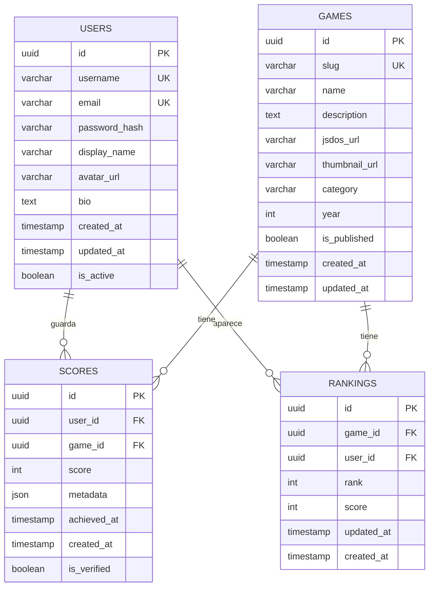

# Esquema y Arquitectura de Base de Datos

Esta documentación describe la arquitectura completa de la base de datos PostgreSQL utilizada en RetroGameCloud, incluyendo el modelo de datos, relaciones, índices, migraciones y estrategias de gestión.

## Visión General

RetroGameCloud utiliza PostgreSQL 14 alojado en Amazon RDS con configuración Multi-AZ para alta disponibilidad. La base de datos gestiona usuarios, juegos, puntuaciones y rankings con un diseño optimizado para consultas de lectura intensiva.

<Note>
La base de datos está compartida entre múltiples microservicios, cada uno accediendo únicamente a las tablas de su dominio específico.
</Note>

## Diagrama del Modelo de Datos



## Gestión de Migraciones

### Herramientas de Migración

RetroGameCloud utiliza **Knex.js** como herramienta principal para la gestión de migraciones de esquema de base de datos.

#### Estructura de Archivos

```

database/
├── migrations/
│   ├── 20231201_001_create_users_table.js
│   ├── 20231201_002_create_games_table.js
│   └── 20231201_003_create_scores_table.js
├── seeds/
│   ├── 01_users.js
│   └── 02_games.js
└── knexfile.js

```

### Creación de Migraciones

#### 1. Generar Nueva Migración

```bash

# Crear migración con timestamp automático
npx knex migrate:make add_user_preferences_table

# Crear migración con nombre específico
npx knex migrate:make add_oauth_providers --timestamp-format YYYYMMDD_HHmm

```

#### 2. Estructura de Migración

```javascript
// migrations/20231215_001_add_user_preferences.js
exports.up = function(knex) {
  return knex.schema.createTable('user_preferences', function(table) {
    table.uuid('id').primary().defaultTo(knex.raw('gen_random_uuid()'));
    table.uuid('user_id').notNullable();
    table.string('theme').defaultTo('dark');
    table.boolean('email_notifications').defaultTo(true);
    table.json('game_settings').defaultTo('{}');
    table.timestamp('created_at').defaultTo(knex.fn.now());
    table.timestamp('updated_at').defaultTo(knex.fn.now());

    // Índices y constrains
    table.foreign('user_id').references('id').inTable('users').onDelete('CASCADE');
    table.index(['user_id']);
  });
};

exports.down = function(knex) {
  return knex.schema.dropTableIfExists('user_preferences');
};

```

### Estrategias para Cambios Breaking

#### Adición de Columnas NOT NULL

* *❌ Incorrecto - Causa downtime:**

```javascript
exports.up = function(knex) {
  return knex.schema.alterTable('users', function(table) {
    table.string('phone').notNullable(); // Error: filas existentes no tienen valor
  });
};

```

* *✅ Correcto - Zero downtime:**

```javascript
// Migración 1: Añadir columna como nullable
exports.up = function(knex) {
  return knex.schema.alterTable('users', function(table) {
    table.string('phone').nullable();
  });
};

// Migración 2: Poblar datos (después del deploy)
exports.up = function(knex) {
  return knex('users')
    .whereNull('phone')
    .update({ phone: 'pending-verification' });
};

// Migración 3: Hacer NOT NULL (próximo deploy)
exports.up = function(knex) {
  return knex.schema.alterTable('users', function(table) {
    table.string('phone').notNullable().alter();
  });
};

```

#### Eliminación de Columnas

```javascript
// Paso 1: Marcar columna como deprecated (comentario)
// Paso 2: Remover uso en código
// Paso 3: Deploy sin uso de la columna
// Paso 4: Migración para eliminar columna
exports.up = function(knex) {
  return knex.schema.alterTable('users', function(table) {
    table.dropColumn('old_field');
  });
};

```

#### Cambios de Tipo de Datos

```javascript
// Para cambios de tipo que pueden fallar
exports.up = async function(knex) {
  // Crear nueva columna
  await knex.schema.alterTable('scores', function(table) {
    table.bigInteger('score_new');
  });

  // Migrar datos con validación
  await knex.raw(`
    UPDATE scores
    SET score_new = CASE
      WHEN score::text ~ '^[0-9]+$' THEN score::bigint
      ELSE 0
    END
  `);

  // En migración posterior: drop old, rename new
  return Promise.resolve();
};

```

### Proceso de Testing

#### 1. Testing Local

```bash

# Resetear base de datos local
npm run db:reset

# Aplicar migraciones
npm run db:migrate

# Verificar con seeds
npm run db:seed

# Ejecutar tests
npm run test:integration

```

#### 2. Testing en Staging

```yaml

# .github/workflows/test-migration.yml
name: Test Database Migration
on:
  pull_request:
    paths: ['database/migrations/**']

jobs:
  test-migration:
    runs-on: ubuntu-latest
    services:
      postgres:
        image: postgres:14
        env:
          POSTGRES_PASSWORD: test
        options: >-
          --health-cmd pg_isready
          --health-interval 10s
          --health-timeout 5s
          --health-retries 5
    steps:
      - uses: actions/checkout@v3
      - name: Test Migration Up
        run: npm run db:migrate
      - name: Seed Test Data
        run: npm run db:seed
      - name: Run Integration Tests
        run: npm run test:integration
      - name: Test Migration Down
        run: npm run db:rollback

```

#### 3. Dry Run en Staging

```javascript
// scripts/migration-dry-run.js
const knex = require('../database/connection');

async function dryRun() {
  const transaction = await knex.transaction();

  try {
    console.log('🧪 Iniciando dry run...');

    // Aplicar migración en transacción
    await transaction.migrate.latest();

    // Verificar integridad
    const healthCheck = await runHealthChecks(transaction);

    if (healthCheck.success) {
      console.log('✅ Migración simulada exitosa');
    } else {
      throw new Error(`Health check failed: ${healthCheck.errors}`);
    }

    // Rollback para no aplicar cambios
    await transaction.rollback();

  } catch (error) {
    console.error('❌ Dry run falló:', error);
    await transaction.rollback();
    process.exit(1);
  }
}

```

### Aplicación en Producción

#### Zero-Downtime Migrations

```javascript
// knexfile.js - Configuración para producción
module.exports = {
  production: {
    client: 'postgresql',
    connection: {
      host: process.env.DB_HOST,
      port: process.env.DB_PORT,
      database: process.env.DB_NAME,
      user: process.env.DB_USER,
      password: process.env.DB_PASSWORD,
      ssl: { rejectUnauthorized: false }
    },
    migrations: {
      tableName: 'knex_migrations',
      directory: './migrations',
      schemaName: 'public'
    },
    pool: {
      min: 2,
      max: 20,
      acquireTimeoutMillis: 30000,
      createTimeoutMillis: 30000,
      destroyTimeoutMillis: 5000,
      idleTimeoutMillis: 30000,
      reapIntervalMillis: 1000,
      createRetryIntervalMillis: 100
    }
  }
};

```

#### Script de Aplicación Automatizada

```bash
#!/bin/bash

# scripts/apply-migration.sh

set -e

echo "🚀 Iniciando aplicación de migración en producción..."

# Verificar conexión
echo "🔍 Verificando conexión a base de datos..."
npm run db:status || exit 1

# Backup automático
echo "💾 Creando backup de seguridad..."
pg_dump $DATABASE_URL > "backup_$(date +%Y%m%d_%H%M%S).sql"

# Dry run
echo "🧪 Ejecutando dry run..."
npm run migration:dry-run || exit 1

# Aplicar migración
echo "⚡ Aplicando migración..."
npm run db:migrate

# Health check post-migración
echo "🏥 Ejecutando health checks..."
npm run health:check || {
  echo "❌ Health check falló - Iniciando rollback automático"
  npm run db:rollback
  exit 1
}

echo "✅ Migración aplicada exitosamente"

```

### Plan de Rollback Automático

#### Configuración de Health Checks

```javascript
// scripts/health-check.js
const knex = require('../database/connection');

async function healthCheck() {
  const checks = [
    {
      name: 'database-connection',
      check: () => knex.raw('SELECT 1')
    },
    {
      name: 'users-table-integrity',
      check: () => knex('users').count('*').first()
    },
    {
      name: 'foreign-key-constraints',
      check: () => knex.raw(`
        SELECT COUNT(*) as violations
        FROM information_schema.table_constraints
        WHERE constraint_type = 'FOREIGN KEY'
        AND constraint_name LIKE '%_violated'
      `)
    }
  ];

  const results = [];

  for (const { name, check } of checks) {
    try {
      await check();
      results.push({ name, status: 'OK' });
    } catch (error) {
      results.push({ name, status: 'FAILED', error: error.message });
    }
  }

  const failed = results.filter(r => r.status === 'FAILED');

  return {
    success: failed.length === 0,
    results,
    errors: failed.map(f => `${f.name}: ${f.error}`)
  };
}

```

#### Rollback Automático

```javascript
// scripts/auto-rollback.js
async function autoRollback() {
  console.log('🔄 Iniciando rollback automático...');

  try {
    // Obtener última migración aplicada
    const [lastBatch] = await knex('knex_migrations')
      .max('batch as batch')
      .first();

    if (lastBatch.batch) {
      // Rollback del último batch
      await knex.migrate.rollback();

      // Verificar que el rollback fue exitoso
      const healthCheck = await runHealthChecks();

      if (healthCheck.success) {
        console.log('✅ Rollback completado exitosamente');

        // Notificar al equipo
        await notifyTeam({
          status: 'rollback-success',
          migration: lastBatch,
          timestamp: new Date()
        });
      } else {
        throw new Error('Health check falló después del rollback');
      }
    }
  } catch (error) {
    console.error('❌ Rollback falló:', error);

    // Notificación crítica
    await notifyTeam({
      status: 'rollback-failed',
      error: error.message,
      timestamp: new Date(),
      priority: 'critical'
    });
  }
}

```

### Checklist Pre-Migración

<Tabs>
<Tab title="Desarrollo">

```markdown

## ✅ Checklist - Desarrollo

### Antes de crear la migración:

- [ ] Analizar impacto en consultas existentes

- [ ] Verificar que no hay breaking changes

- [ ] Documentar cambios en esquema

- [ ] Escribir tests para nueva estructura

### Al escribir la migración:

- [ ] Incluir función `down` para rollback

- [ ] Usar transacciones cuando sea necesario

- [ ] Validar que funciona con datos existentes

- [ ] Añadir índices necesarios

### Testing:

- [ ] Probar migración up/down localmente

- [ ] Ejecutar suite completa de tests

- [ ] Verificar performance de queries afectadas

- [ ] Validar con datos de volumen similar a producción

```

</Tab>

<Tab title="Staging">

```markdown

## ✅ Checklist - Staging

### Preparación:

- [ ] Sincronizar datos con snapshot de producción

- [ ] Verificar versión de PostgreSQL coincida

- [ ] Configurar monitoreo de performance

### Ejecución:

- [ ] Ejecutar dry-run exitosamente

- [ ] Aplicar migración en staging

- [ ] Verificar funcionalidad completa de aplicación

- [ ] Medir tiempo de ejecución de migración

### Validación:

- [ ] Health checks pasan

- [ ] Tests de integración pasan

- [ ] Performance tests dentro de parámetros

- [ ] Rollback funciona correctamente

```

</Tab>

<Tab title="Producción">

```markdown

## ✅ Checklist - Producción

### Pre-migración (24h antes):

- [ ] Coordinar ventana de mantenimiento

- [ ] Notificar a stakeholders

- [ ] Preparar scripts de rollback

- [ ] Verificar espacio en disco para backup

### Pre-migración (inmediato):

- [ ] Crear backup completo de base de datos

- [ ] Verificar conectividad y permisos

- [ ] Confirmar que staging tests pasaron

- [ ] Alertar a equipo de DevOps

### Durante la migración:

- [ ] Monitorear logs en tiempo real

- [ ] Verificar métricas de sistema

- [ ] Confirmar health checks post-migración

- [ ] Validar funcionalidad crítica

### Post-migración:

- [
</Tab>
</Tabs>

```