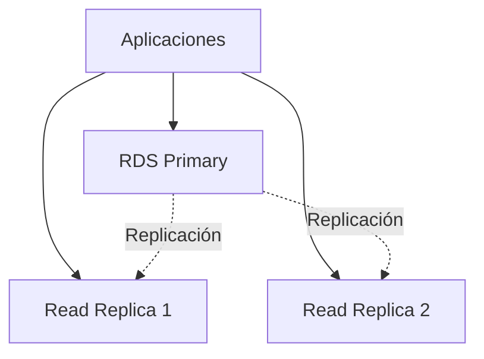

# Base de Datos

Configuración de PostgreSQL en Amazon RDS con replicas de lectura y pool de conexiones.

## Arquitectura



## Configuración de Conexión

```typescript
// src/config/database.ts
import { Sequelize } from 'sequelize';

const sequelize = new Sequelize({
  dialect: 'postgres',
  host: process.env.DB_HOST,
  port: 5432,
  database: process.env.DB_NAME,
  username: process.env.DB_USER,
  password: process.env.DB_PASSWORD,
  pool: {
    max: 20,
    min: 5,
    acquire: 30000,
    idle: 10000
  },
  logging: false
});

export default sequelize;

```

## Pool de Conexiones

```python

# config/database.py
from sqlalchemy import create_engine
from sqlalchemy.pool import QueuePool

engine = create_engine(
    f"postgresql://{user}:{password}@{host}:{port}/{dbname}",
    poolclass=QueuePool,
    pool_size=10,
    max_overflow=20,
    pool_timeout=30,
    pool_recycle=3600
)

```

## Migración con Alembic

```bash

# Crear migración
alembic revision -m "add user table"

# Aplicar migraciones
alembic upgrade head

# Rollback
alembic downgrade -1

```

## Schema Principal

```sql
CREATE TABLE users (
    id UUID PRIMARY KEY DEFAULT gen_random_uuid(),
    username VARCHAR(50) UNIQUE NOT NULL,
    email VARCHAR(255) UNIQUE NOT NULL,
    password_hash VARCHAR(255) NOT NULL,
    created_at TIMESTAMP DEFAULT CURRENT_TIMESTAMP,
    updated_at TIMESTAMP DEFAULT CURRENT_TIMESTAMP
);

CREATE TABLE games (
    id UUID PRIMARY KEY DEFAULT gen_random_uuid(),
    name VARCHAR(100) NOT NULL,
    slug VARCHAR(100) UNIQUE NOT NULL,
    description TEXT,
    release_year INTEGER,
    created_at TIMESTAMP DEFAULT CURRENT_TIMESTAMP
);

CREATE TABLE scores (
    id UUID PRIMARY KEY DEFAULT gen_random_uuid(),
    user_id UUID REFERENCES users(id),
    game_id UUID REFERENCES games(id),
    score INTEGER NOT NULL,
    submitted_at TIMESTAMP DEFAULT CURRENT_TIMESTAMP,
    UNIQUE(user_id, game_id, submitted_at)
);

CREATE INDEX idx_scores_game ON scores(game_id, score DESC);
CREATE INDEX idx_scores_user ON scores(user_id);

```

## Backups

```yaml
RDSInstance:
  BackupRetentionPeriod: 7
  PreferredBackupWindow: "03:00-04:00"
  PreferredMaintenanceWindow: "sun:04:00-sun:05:00"
  EnableCloudwatchLogsExports:
    - postgresql

```

## Monitoreo

```promql

# Conexiones activas
pg_stat_activity_count

# Queries lentas
pg_stat_statements_mean_exec_time

# Tamaño de DB
pg_database_size_bytes

```

- --

PostgreSQL en RDS proporciona alta disponibilidad y escalabilidad.
