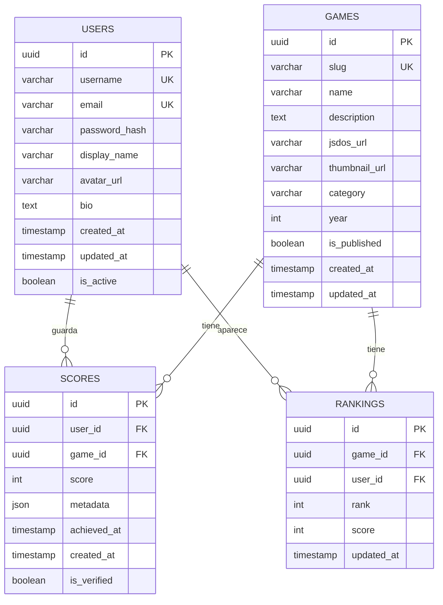

# Esquema y Arquitectura de Base de Datos

Esta documentación describe la arquitectura completa de la base de datos PostgreSQL utilizada en RetroGameCloud, incluyendo el modelo de datos, relaciones, índices y estrategias de gestión.

## Visión General

RetroGameCloud utiliza PostgreSQL 14 alojado en Amazon RDS con configuración Multi-AZ para alta disponibilidad. La base de datos gestiona usuarios, juegos, puntuaciones y rankings con un diseño optimizado para consultas de lectura intensiva.

<Note>
La base de datos está compartida entre múltiples microservicios, cada uno accediendo únicamente a las tablas de su dominio específico.
</Note>

## Diagrama del Modelo de Datos



## Esquema de Tablas

### Tabla `users`

Almacena la información de los usuarios registrados en la plataforma.

<Tabs>
<Tab title="Estructura">
| Campo | Tipo | Restricciones | Descripción |
|-------|------|---------------|-------------|
| `id` | UUID | PRIMARY KEY | Identificador único del usuario |
| `username` | VARCHAR(50) | UNIQUE, NOT NULL | Nombre de usuario único |
| `email` | VARCHAR(255) | UNIQUE, NOT NULL | Correo electrónico |
| `password_hash` | VARCHAR(255) | NOT NULL | Hash de la contraseña (bcrypt) |
| `display_name` | VARCHAR(100) | | Nombre a mostrar públicamente |
| `avatar_url` | VARCHAR(500) | | URL del avatar del usuario |
| `bio` | TEXT | | Biografía del usuario |
| `is_active` | BOOLEAN | DEFAULT true | Estado activo del usuario |
| `created_at` | TIMESTAMP | DEFAULT NOW() | Fecha de creación |
| `updated_at` | TIMESTAMP | DEFAULT NOW() | Fecha de última modificación |
</Tab>
<Tab title="DDL">

```sql
CREATE TABLE users (
    id UUID PRIMARY KEY DEFAULT gen_random_uuid(),
    username VARCHAR(50) UNIQUE NOT NULL,
    email VARCHAR(255) UNIQUE NOT NULL,
    password_hash VARCHAR(255) NOT NULL,
    display_name VARCHAR(100),
    avatar_url VARCHAR(500),
    bio TEXT,
    is_active BOOLEAN DEFAULT true,
    created_at TIMESTAMP DEFAULT NOW(),
    updated_at TIMESTAMP DEFAULT NOW()
);

- - Trigger para actualizar updated_at
CREATE OR REPLACE FUNCTION update_updated_at_column()
RETURNS TRIGGER AS $$
BEGIN
    NEW.updated_at = NOW();
    RETURN NEW;
END;
$$ language 'plpgsql';

CREATE TRIGGER update_users_updated_at
    BEFORE UPDATE ON users
    FOR EACH ROW
    EXECUTE FUNCTION update_updated_at_column();

```

</Tab>
<Tab title="Índices">

```sql

- - Índices adicionales para optimización
CREATE INDEX idx_users_email ON users(email);
CREATE INDEX idx_users_username ON users(username);
CREATE INDEX idx_users_created_at ON users(created_at);
CREATE INDEX idx_users_active ON users(is_active) WHERE is_active = true;

```

</Tab>

```

</Tab>
</Tabs>

### Tabla `games`

Contiene el catálogo de juegos disponibles en la plataforma.

<Tabs>
<Tab title="Estructura">
| Campo | Tipo | Restricciones | Descripción |
|-------|------|---------------|-------------|
| `id` | UUID | PRIMARY KEY | Identificador único del juego |
| `slug` | VARCHAR(100) | UNIQUE, NOT NULL | URL slug único para el juego |
| `name` | VARCHAR(200) | NOT NULL | Nombre del juego |
| `description` | TEXT | | Descripción del juego |
| `jsdos_url` | VARCHAR(500) | | URL del archivo JS-DOS |
| `thumbnail_url` | VARCHAR(500) | | URL de la imagen miniatura |
| `category` | VARCHAR(50) | | Categoría del juego |
| `year` | INTEGER | | Año de lanzamiento |
| `is_published` | BOOLEAN | DEFAULT false | Estado de publicación |
| `created_at` | TIMESTAMP | DEFAULT NOW() | Fecha de creación |
| `updated_at` | TIMESTAMP | DEFAULT NOW() | Fecha de última modificación |
</Tab>
<Tab title="DDL">

```sql
CREATE TABLE games (
    id UUID PRIMARY KEY DEFAULT gen_random_uuid(),
    slug VARCHAR(100) UNIQUE NOT NULL,
    name VARCHAR(200) NOT NULL,
    description TEXT,
    jsdos_url VARCHAR(500),
    thumbnail_url VARCHAR(500),
    category VARCHAR(50),
    year INTEGER,
    is_published BOOLEAN DEFAULT false,
    created_at TIMESTAMP DEFAULT NOW(),
    updated_at TIMESTAMP DEFAULT NOW()
);

CREATE TRIGGER update_games_updated_at
    BEFORE UPDATE ON games
    FOR EACH ROW
    EXECUTE FUNCTION update_updated_at_column();

```

</Tab>
<Tab title="Índices">

```sql
CREATE INDEX idx_games_slug ON games(slug);
CREATE INDEX idx_games_category ON games(category);
CREATE INDEX idx_games_year ON games(year);
CREATE INDEX idx_games_published ON games(is_published) WHERE is_published = true;
CREATE INDEX idx_games_category_year ON games(category, year) WHERE is_published = true;

```

</Tab>

```

</Tab>
</Tabs>

### Tabla `scores`

Registra las puntuaciones obtenidas por los usuarios en cada juego.

<Tabs>
<Tab title="Estructura">
| Campo | Tipo | Restricciones | Descripción |
|-------|------|---------------|-------------|
| `id` | UUID | PRIMARY KEY | Identificador único de la puntuación |
| `user_id` | UUID | NOT NULL, FK | Referencia al usuario |
| `game_id` | UUID | NOT NULL, FK | Referencia al juego |
| `score` | INTEGER | NOT NULL | Puntuación obtenida |
| `metadata` | JSONB | | Metadatos adicionales de la partida |
| `achieved_at` | TIMESTAMP | NOT NULL | Momento en que se logró la puntuación |
| `created_at` | TIMESTAMP | DEFAULT NOW() | Fecha de registro |
| `is_verified` | BOOLEAN | DEFAULT false | Estado de verificación |
</Tab>
<Tab title="DDL">

```sql
CREATE TABLE scores (
    id UUID PRIMARY KEY DEFAULT gen_random_uuid(),
    user_id UUID NOT NULL REFERENCES users(id) ON DELETE CASCADE,
    game_id UUID NOT NULL REFERENCES games(id) ON DELETE CASCADE,
    score INTEGER NOT NULL CHECK (score >= 0),
    metadata JSONB,
    achieved_at TIMESTAMP NOT NULL,
    created_at TIMESTAMP DEFAULT NOW(),
    is_verified BOOLEAN DEFAULT false
);

```

</Tab>
<Tab title="Índices">

```sql
CREATE INDEX idx_scores_user_id ON scores(user_id);
CREATE INDEX idx_scores_game_id ON scores(game_id);
CREATE INDEX idx_scores_game_score ON scores(game_id, score DESC);
CREATE INDEX idx_scores_user_game ON scores(user_id, game_id);
CREATE INDEX idx_scores_achieved_at ON scores(achieved_at);
CREATE INDEX idx_scores_metadata ON scores USING gin(metadata);
CREATE INDEX idx_scores_verified ON scores(is_verified) WHERE is_verified = true;

```

</Tab>

```

</Tab>
</Tabs>

### Tabla `rankings`

Mantiene los rankings actualizados para cada juego (tabla desnormalizada para optimización de consultas).

<Tabs>
<Tab title="Estructura">
| Campo | Tipo | Restricciones | Descripción |
|-------|------|---------------|-------------|
| `id` | UUID | PRIMARY KEY | Identificador único del ranking |
| `game_id` | UUID | NOT NULL, FK | Referencia al juego |
| `user_id` | UUID | NOT NULL, FK | Referencia al usuario |
| `rank` | INTEGER | NOT NULL | Posición en el ranking |
| `score` | INTEGER | NOT NULL | Mejor puntuación del usuario |
| `updated_at` | TIMESTAMP | DEFAULT NOW() | Última actualización |
</Tab>
<Tab title="DDL">

```sql
CREATE TABLE rankings (
    id UUID PRIMARY KEY DEFAULT gen_random_uuid(),
    game_id UUID NOT NULL REFERENCES games(id) ON DELETE CASCADE,
    user_id UUID NOT NULL REFERENCES users(id) ON DELETE CASCADE,
    rank INTEGER NOT NULL,
    score INTEGER NOT NULL,
    updated_at TIMESTAMP DEFAULT NOW(),
    UNIQUE(game_id, user_id),
    UNIQUE(game_id, rank)
);

```

</Tab>
<Tab title="Índices">

```sql
CREATE UNIQUE INDEX idx_rankings_game_user ON rankings(game_id, user_id);
CREATE UNIQUE INDEX idx_rankings_game_rank ON rankings(game_id, rank);
CREATE INDEX idx_rankings_user_id ON rankings(user_id);
CREATE INDEX idx_rankings_score ON rankings(score DESC);

```

</Tab>

```

</Tab>
</Tabs>

## Relaciones y Integridad Referencial

<Card title="Relaciones Principales" icon="link">

- **users → scores**: Un usuario puede tener múltiples puntuaciones (1:N)

- **games → scores**: Un juego puede tener múltiples puntuaciones (1:N)

- **users → rankings**: Un usuario puede aparecer en múltiples rankings (1:N)

- **games → rankings**: Un juego tiene un ranking completo (1:N)
</Card>

### Constraints de Integridad

```sql

- - Verificar que un usuario no tenga múltiples entradas en el mismo ranking
ALTER TABLE rankings ADD CONSTRAINT unique_user_per_game_ranking
    UNIQUE(game_id, user_id);

- - Verificar que las posiciones del ranking sean únicas por juego
ALTER TABLE rankings ADD CONSTRAINT unique_rank_per_game
    UNIQUE(game_id, rank);

- - Verificar que las puntuaciones sean positivas
ALTER TABLE scores ADD CONSTRAINT positive_score
    CHECK (score >= 0);

- - Verificar formato de email
ALTER TABLE users ADD CONSTRAINT valid_email_format
    CHECK (email ~* '^[A-Za-z0-9._%-]+@[A-Za-z0-9.-]+[.][A-Za-z]+$');

```

## Estrategias de Indexación

### Índices de Alto Rendimiento

<Warning>
Los índices compuestos están optimizados para las consultas más frecuentes. Revisar periódicamente con `EXPLAIN ANALYZE`.
</Warning>

```sql

- - Índices para consultas de rankings por juego
CREATE INDEX CONCURRENTLY idx_rankings_game_score
    ON rankings(game_id, score DESC)
    INCLUDE (user_id, rank);

- - Índices para búsqueda de juegos
CREATE INDEX CONCURRENTLY idx_games_search
    ON games USING gin(to_tsvector('spanish', name || ' ' || description))
    WHERE is_published = true;

- - Índices para consultas temporales de puntuaciones
CREATE INDEX CONCURRENTLY idx_scores_recent
    ON scores(game_id, achieved_at DESC)
    WHERE is_verified = true;

```

### Estrategia de Particionado

Para tablas de gran volumen como `scores`, se recomienda particionado por rango temporal:

```sql

- - Crear tabla padre particionada
CREATE TABLE scores_partitioned (
    LIKE scores INCLUDING ALL
) PARTITION BY RANGE (achieved_at);

- - Crear particiones mensuales
CREATE TABLE scores_2024_01 PARTITION OF scores_partitioned
    FOR VALUES FROM ('2024-01-01') TO ('2024-02-01');

CREATE TABLE scores_2024_02 PARTITION OF scores_partitioned
    FOR VALUES FROM ('2024-02-01') TO ('2024-03-01');

```

## Configuración de Amazon RDS

### Especificaciones de Instancia

<Tabs>
<Tab title="Producción">

```yaml
Instancia: db.r6g.xlarge

- vCPU: 4

- RAM: 32 GB

- Almacenamiento: gp3 500 GB

- IOPS: 3000

- Multi-AZ: Habilitado

- Backup automático: 7 días

- Ventana de mantenimiento: Dom 03:00-04:00 UTC

```

</Tab>
<Tab title="Desarrollo">

```yaml
Instancia: db.t3.medium

- vCPU: 2

- RAM: 4 GB

- Almacenamiento: gp2 100 GB

- Multi-AZ: Deshabilitado

- Backup automático: 3 días

```

</Tab>

```

</Tab>
</Tabs>

### Parámetros de Configuración

```sql

- - Configuraciones principales en PostgreSQL
shared_preload_libraries = 'pg_stat_statements,auto_explain'
max_connections = 200
shared_buffers = '8GB'
effective_cache_size = '24GB'
maintenance_work_mem = '2GB'
work_mem = '64MB'
random_page_cost = 1.1
effective_io_concurrency = 200

- - Configuración para logging
log_statement = 'mod'
log_min_duration_statement = 1000
auto_explain.log_min_duration = 5000
auto_explain.log_analyze = on

```

## Migraciones de Base de Datos

### Estructura de Migraciones

Las migraciones se gestionan mediante archivos SQL versionados:

```

migrations/
├── 001_create_users_table.up.sql
├── 001_create_users_table.down.sql
├── 002_create_games_table.up.sql
├── 002_create_games_table.down.sql
├── 003_create_scores_table.up.sql
├── 003_create_scores_table.down.sql
└── 004_create_rankings_table.up.sql

```

### Ejemplo de Migración

<Tabs>
<Tab title="001_create_users_table.up.sql">

```sql

- - Crear extensión para UUIDs
CREATE EXTENSION IF NOT EXISTS "pgcrypto";

- - Crear tabla users
CREATE TABLE users (
    id UUID PRIMARY KEY DEFAULT gen_random_uuid(),
    username VARCHAR(50) UNIQUE NOT NULL,
    email VARCHAR(255) UNIQUE NOT NULL,
    password_hash VARCHAR(255) NOT NULL,
    display_name VARCHAR(100),
    avatar_url VARCHAR(500),
    bio TEXT,
    is_active BOOLEAN DEFAULT true,
    created_at TIMESTAMP DEFAULT NOW(),
    updated_at TIMESTAMP DEFAULT NOW()
);

- - Crear índices
CREATE INDEX idx_users_email ON users(email
</Tab>

```

</Tab>
</Tabs>

```