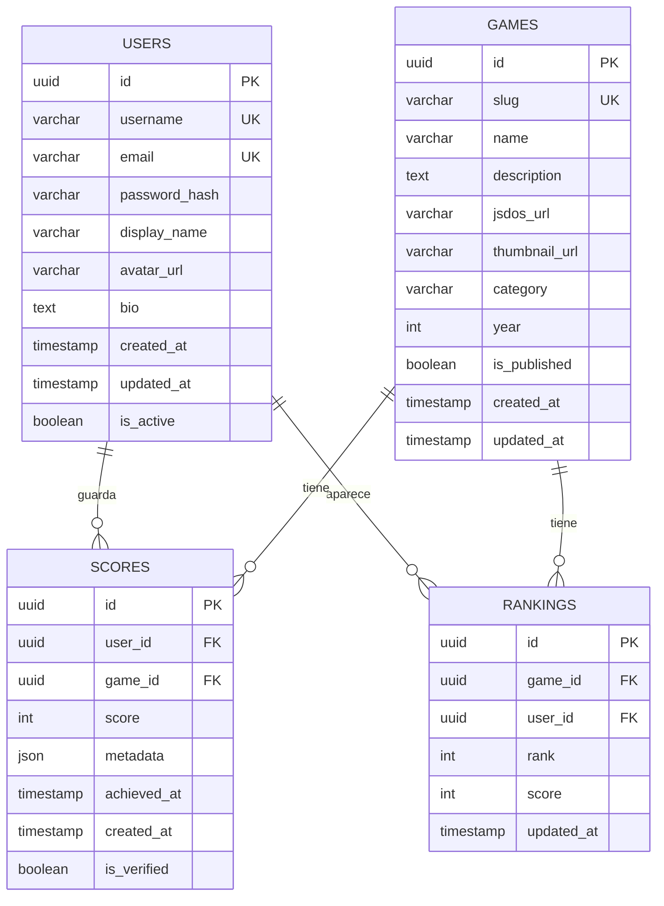

# Esquema y Arquitectura de Base de Datos

Esta documentación describe la arquitectura completa de la base de datos PostgreSQL utilizada en RetroGameCloud, incluyendo el modelo de datos, relaciones, índices, migraciones y estrategias de gestión.

## Visión General

RetroGameCloud utiliza PostgreSQL 14 alojado en Amazon RDS con configuración Multi-AZ para alta disponibilidad. La base de datos gestiona usuarios, juegos, puntuaciones y rankings con un diseño optimizado para consultas de lectura intensiva.

<Note>
La base de datos está compartida entre múltiples microservicios, cada uno accediendo únicamente a las tablas de su dominio específico.
</Note>

## Diagrama del Modelo de Datos



## Esquemas y Tablas

### Tabla `users`

```sql
CREATE TABLE users (
    id UUID PRIMARY KEY DEFAULT gen_random_uuid(),
    username VARCHAR(50) UNIQUE NOT NULL,
    email VARCHAR(255) UNIQUE NOT NULL,
    password_hash VARCHAR(255) NOT NULL,
    display_name VARCHAR(100),
    avatar_url TEXT,
    bio TEXT,
    created_at TIMESTAMP WITH TIME ZONE DEFAULT NOW(),
    updated_at TIMESTAMP WITH TIME ZONE DEFAULT NOW(),
    is_active BOOLEAN DEFAULT true
);
```

### Tabla `games`

```sql
CREATE TABLE games (
    id UUID PRIMARY KEY DEFAULT gen_random_uuid(),
    slug VARCHAR(100) UNIQUE NOT NULL,
    name VARCHAR(200) NOT NULL,
    description TEXT,
    jsdos_url TEXT NOT NULL,
    thumbnail_url TEXT,
    category VARCHAR(50),
    year INTEGER,
    is_published BOOLEAN DEFAULT false,
    created_at TIMESTAMP WITH TIME ZONE DEFAULT NOW(),
    updated_at TIMESTAMP WITH TIME ZONE DEFAULT NOW()
);
```

### Tabla `scores`

```sql
CREATE TABLE scores (
    id UUID PRIMARY KEY DEFAULT gen_random_uuid(),
    user_id UUID NOT NULL REFERENCES users(id) ON DELETE CASCADE,
    game_id UUID NOT NULL REFERENCES games(id) ON DELETE CASCADE,
    score INTEGER NOT NULL,
    metadata JSONB,
    achieved_at TIMESTAMP WITH TIME ZONE NOT NULL,
    created_at TIMESTAMP WITH TIME ZONE DEFAULT NOW(),
    is_verified BOOLEAN DEFAULT false
);
```

### Tabla `rankings`

```sql
CREATE TABLE rankings (
    id UUID PRIMARY KEY DEFAULT gen_random_uuid(),
    game_id UUID NOT NULL REFERENCES games(id) ON DELETE CASCADE,
    user_id UUID NOT NULL REFERENCES users(id) ON DELETE CASCADE,
    rank INTEGER NOT NULL,
    score INTEGER NOT NULL,
    updated_at TIMESTAMP WITH TIME ZONE DEFAULT NOW(),
    UNIQUE(game_id, user_id)
);
```

## Índices y Rendimiento

### Índices Principales

```sql
-- Índices para optimizar consultas frecuentes
CREATE INDEX idx_scores_game_id_score ON scores(game_id, score DESC);
CREATE INDEX idx_scores_user_id_achieved ON scores(user_id, achieved_at DESC);
CREATE INDEX idx_rankings_game_id_rank ON rankings(game_id, rank);
CREATE INDEX idx_games_category_published ON games(category, is_published);
CREATE INDEX idx_users_username_active ON users(username) WHERE is_active = true;

-- Índices para búsqueda de texto
CREATE INDEX idx_games_name_trgm ON games USING gin(name gin_trgm_ops);
CREATE INDEX idx_users_display_name_trgm ON users USING gin(display_name gin_trgm_ops);
```

### Optimizaciones JSONB

```sql
-- Índices GIN para metadata en scores
CREATE INDEX idx_scores_metadata ON scores USING gin(metadata);

-- Ejemplo de consulta optimizada
SELECT * FROM scores 
WHERE metadata @> '{"difficulty": "hard"}'
AND game_id = $1;
```

## Migraciones de Base de Datos

### Herramientas

Utilizamos **Flyway** para el versionado de esquema con migraciones SQL versionadas. Flyway se ejecuta como parte del pipeline de CI/CD y Jobs de Kubernetes.

<Warning>
Todas las migraciones deben ser probadas primero en entornos de desarrollo y staging antes de aplicarse en producción.
</Warning>

### Estructura de Archivos de Migración

```
migrations/
├── V1.0__initial_schema.sql
├── V1.1__add_users_bio_column.sql
├── V1.2__create_rankings_table.sql
├── V2.0__add_games_category_index.sql
├── U1.1__rollback_users_bio_column.sql
└── U1.2__rollback_rankings_table.sql
```

### Proceso de Migración

1. **Crear Script de Migración**
   ```sql
   -- migrations/V2.1__add_games_rating.sql
   ALTER TABLE games ADD COLUMN rating DECIMAL(3,2);
   CREATE INDEX idx_games_rating ON games(rating) WHERE rating IS NOT NULL;
   ```

2. **Probar en Entorno Local**
   ```bash
   # Usar Docker para pruebas locales
   docker-compose up -d postgres
   flyway -url=jdbc:postgresql://localhost:5432/retrogame_dev migrate
   ```

3. **Ejecutar en Staging via Job de Kubernetes**
   ```yaml
   apiVersion: batch/v1
   kind: Job
   metadata:
     name: flyway-migration-v2-1
   spec:
     template:
       spec:
         containers:
         - name: flyway
           image: flyway/flyway:8.5.13
           command: ["flyway", "migrate"]
           env:
           - name: FLYWAY_URL
             value: "jdbc:postgresql://postgres-staging:5432/retrogamecloud"
   ```

4. **Validar Integridad con Tests Automatizados**
   ```bash
   # Tests de integridad post-migración
   npm run test:database:integrity
   npm run test:api:smoke
   ```

5. **Desplegar en Producción con Ventana de Mantenimiento**
   - Programar ventana de mantenimiento
   - Crear backup completo antes de la migración
   - Ejecutar migración con monitoreo
   - Validar funcionamiento de la aplicación

### Estrategias de Rollback

#### Migraciones Reversibles

Para cambios no destructivos, crear scripts de rollback:

```sql
-- migrations/U2.1__rollback_games_rating.sql
DROP INDEX IF EXISTS idx_games_rating;
ALTER TABLE games DROP COLUMN IF EXISTS rating;
```

#### Migraciones Destructivas

<Danger>
Migraciones destructivas (DROP COLUMN, DROP TABLE) requieren proceso especial:
- Ventana de mantenimiento aprobada
- Backup completo verificado
- Plan de rollback detallado
- Validación en staging con datos de producción
</Danger>

**Proceso para cambios destructivos:**

1. **Fase 1:** Deprecar columna (marcar como no utilizada)
2. **Fase 2:** Actualizar código para no usar la columna
3. **Fase 3:** Después de 2 sprints, eliminar columna

```sql
-- Ejemplo: Eliminar columna deprecated
-- V2.2__remove_deprecated_user_legacy_id.sql
ALTER TABLE users DROP COLUMN IF EXISTS legacy_id;
```

### Versionado de Esquema

```sql
-- Tabla para tracking de versiones
CREATE TABLE schema_version (
    version VARCHAR(50) PRIMARY KEY,
    description TEXT,
    applied_at TIMESTAMP WITH TIME ZONE DEFAULT NOW(),
    applied_by VARCHAR(100)
);
```

## Estrategias de Backup y Recuperación

### Backups Automatizados

```yaml
# RDS Configuration
BackupRetentionPeriod: 7
PreferredBackupWindow: "03:00-04:00"
PreferredMaintenanceWindow: "sun:04:00-sun:05:00"
DeletionProtection: true
```

### Snapshots Manuales

```bash
# Crear snapshot antes de migraciones críticas
aws rds create-db-snapshot \
  --db-instance-identifier retrogamecloud-prod \
  --db-snapshot-identifier migration-v2-0-$(date +%Y%m%d)
```

## Monitoreo y Alertas

### Métricas Clave

- **Conexiones activas:** < 80% del máximo
- **CPU utilization:** < 70%
- **Memoria libre:** > 20%
- **Tiempo de respuesta:** < 100ms para queries principales

### Alertas CloudWatch

```yaml
DatabaseCPUAlarm:
  Type: AWS::CloudWatch::Alarm
  Properties:
    MetricName: CPUUtilization
    Threshold: 70
    ComparisonOperator: GreaterThanThreshold
```

## Buenas Prácticas

### Desarrollo

- Usar transacciones para operaciones multi-tabla
- Implementar soft deletes para datos críticos
- Validar constraints a nivel de aplicación y base de datos
- Usar prepared statements para prevenir SQL injection

### Producción

- Monitorear slow queries regularmente
- Mantener estadísticas de tablas actualizadas
- Implementar connection pooling
- Revisar y optimizar índices trimestralmente

### Seguridad

```sql
-- Crear usuarios con permisos mínimos
CREATE USER api_user WITH PASSWORD 'secure_password';
GRANT SELECT, INSERT, UPDATE, DELETE ON users, games, scores, rankings TO api_user;

-- Usuario solo lectura para analytics
CREATE USER analytics_user WITH PASSWORD 'analytics_password';
GRANT SELECT ON ALL TABLES IN SCHEMA public TO analytics_user;
```