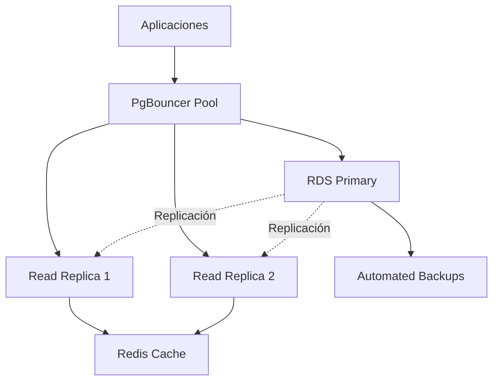

# Base de Datos

Configuración completa de PostgreSQL en Amazon RDS con replicas de lectura, pool de conexiones, migraciones y optimizaciones de rendimiento.

## Arquitectura



## Configuración de Conexión

### TypeScript/Node.js (Sequelize)

```typescript
// src/config/database.ts
import { Sequelize } from 'sequelize';

const sequelize = new Sequelize({
  dialect: 'postgres',
  host: process.env.DB_HOST,
  port: 5432,
  database: process.env.DB_NAME,
  username: process.env.DB_USER,
  password: process.env.DB_PASSWORD,
  pool: {
    max: 20,
    min: 5,
    acquire: 30000,
    idle: 10000
  },
  logging: process.env.NODE_ENV === 'development' ? console.log : false,
  dialectOptions: {
    ssl: process.env.NODE_ENV === 'production' ? {
      require: true,
      rejectUnauthorized: false
    } : false
  }
});

// Configuración de replicas de lectura
const readerSequelize = new Sequelize({
  // ... configuración similar pero apuntando a replica
  host: process.env.DB_READER_HOST,
});

export { sequelize, readerSequelize };

```

### Python (SQLAlchemy)

```python

# config/database.py
from sqlalchemy import create_engine
from sqlalchemy.pool import QueuePool
from sqlalchemy.ext.declarative import declarative_base
from sqlalchemy.orm import sessionmaker
import os

# Motor principal (escritura)
engine = create_engine(
    f"postgresql://{os.getenv('DB_USER')}:{os.getenv('DB_PASSWORD')}@{os.getenv('DB_HOST')}:{os.getenv('DB_PORT', 5432)}/{os.getenv('DB_NAME')}",
    poolclass=QueuePool,
    pool_size=10,
    max_overflow=20,
    pool_timeout=30,
    pool_recycle=3600,
    echo=os.getenv('ENV') == 'development'
)

# Motor de lectura (replica)
reader_engine = create_engine(
    f"postgresql://{os.getenv('DB_USER')}:{os.getenv('DB_PASSWORD')}@{os.getenv('DB_READER_HOST')}:{os.getenv('DB_PORT', 5432)}/{os.getenv('DB_NAME')}",
    poolclass=QueuePool,
    pool_size=15,
    max_overflow=10,
    pool_timeout=30,
    pool_recycle=3600
)

Base = declarative_base()
SessionLocal = sessionmaker(autocommit=False, autoflush=False, bind=engine)
ReaderSession = sessionmaker(autocommit=False, autoflush=False, bind=reader_engine)

```

## Pool de Conexiones con PgBouncer

```ini

# /etc/pgbouncer/pgbouncer.ini
[databases]
production = host=rds-endpoint.amazonaws.com port=5432 dbname=app_db
production_ro = host=rds-replica-endpoint.amazonaws.com port=5432 dbname=app_db

[pgbouncer]
listen_port = 6432
listen_addr = 0.0.0.0
auth_type = md5
auth_file = /etc/pgbouncer/userlist.txt
admin_users = postgres
stats_users = stats, postgres
pool_mode = transaction
server_reset_query = DISCARD ALL
max_client_conn = 200
default_pool_size = 20
max_db_connections = 100

```

## Migraciones y Schema

### Alembic (Python)

```bash

# Inicializar Alembic
alembic init migrations

# Crear migración
alembic revision -m "add user table"

# Aplicar migraciones
alembic upgrade head

# Rollback
alembic downgrade -1

# Ver historial
alembic history

```

```python

# migrations/versions/001_initial_schema.py
from alembic import op
import sqlalchemy as sa
from sqlalchemy.dialects import postgresql

def upgrade():
    op.create_table('users',
        sa.Column('id', postgresql.UUID(), nullable=False, server_default=sa.text('gen_random_uuid()')),
        sa.Column('username', sa.String(50), nullable=False),
        sa.Column('email', sa.String(255), nullable=False),
        sa.Column('password_hash', sa.String(255), nullable=False),
        sa.Column('created_at', sa.TIMESTAMP(), server_default=sa.text('CURRENT_TIMESTAMP')),
        sa.Column('updated_at', sa.TIMESTAMP(), server_default=sa.text('CURRENT_TIMESTAMP')),
        sa.PrimaryKeyConstraint('id'),
        sa.UniqueConstraint('username'),
        sa.UniqueConstraint('email')
    )

def downgrade():
    op.drop_table('users')

```

### Sequelize Migrations (Node.js)

```javascript
// migrations/20240101000000-create-users.js
module.exports = {
  up: async (queryInterface, Sequelize) => {
    await queryInterface.createTable('Users', {
      id: {
        type: Sequelize.UUID,
        defaultValue: Sequelize.UUIDV4,
        primaryKey: true
      },
      username: {
        type: Sequelize.STRING(50),
        allowNull: false,
        unique: true
      },
      email: {
        type: Sequelize.STRING(255),
        allowNull: false,
        unique: true
      },
      passwordHash: {
        type: Sequelize.STRING(255),
        allowNull: false
      },
      createdAt: {
        type: Sequelize.DATE,
        allowNull: false,
        defaultValue: Sequelize.NOW
      },
      updatedAt: {
        type: Sequelize.DATE,
        allowNull: false,
        defaultValue: Sequelize.NOW
      }
    });

    // Índices adicionales
    await queryInterface.addIndex('Users', ['email']);
    await queryInterface.addIndex('Users', ['username']);
  },

  down: async (queryInterface, Sequelize) => {
    await queryInterface.dropTable('Users');
  }
};

```

## Schema Principal

```sql

- - Extensiones necesarias
CREATE EXTENSION IF NOT EXISTS "uuid-ossp";
CREATE EXTENSION IF NOT EXISTS "pg_stat_statements";

- - Tabla de usuarios
CREATE TABLE users (
    id UUID PRIMARY KEY DEFAULT gen_random_uuid(),
    username VARCHAR(50) UNIQUE NOT NULL,
    email VARCHAR(255) UNIQUE NOT NULL,
    password_hash VARCHAR(255) NOT NULL,
    first_name VARCHAR(100),
    last_name VARCHAR(100),
    is_active BOOLEAN DEFAULT true,
    email_verified BOOLEAN DEFAULT false,
    last_login TIMESTAMP,
    created_at TIMESTAMP DEFAULT CURRENT_TIMESTAMP,
    updated_at TIMESTAMP DEFAULT CURRENT_TIMESTAMP
);

- - Tabla de juegos
CREATE TABLE games (
    id UUID PRIMARY KEY DEFAULT gen_random_uuid(),
    name VARCHAR(100) NOT NULL,
    slug VARCHAR(100) UNIQUE NOT NULL,
    description TEXT,
    release_year INTEGER,
    genre VARCHAR(50),
    platform VARCHAR(50),
    price DECIMAL(10,2),
    is_active BOOLEAN DEFAULT true,
    created_at TIMESTAMP DEFAULT CURRENT_TIMESTAMP,
    updated_at TIMESTAMP DEFAULT CURRENT_TIMESTAMP
);

- - Tabla de puntuaciones
CREATE TABLE scores (
    id UUID PRIMARY KEY DEFAULT gen_random_uuid(),
    user_id UUID NOT NULL REFERENCES users(id) ON DELETE CASCADE,
    game_id UUID NOT NULL REFERENCES games(id) ON DELETE CASCADE,
    score INTEGER NOT NULL,
    level INTEGER,
    duration INTEGER, -- en segundos
    created_at TIMESTAMP DEFAULT CURRENT_TIMESTAMP,
    CONSTRAINT unique_user_game_score UNIQUE(user_id, game_id, created_at)
);

- - Índices para optimización
CREATE INDEX idx_users_email ON users(email);
CREATE INDEX idx_users_username ON users(username);
CREATE INDEX idx_users_active ON users(is_active) WHERE is_active = true;
CREATE INDEX idx_games_slug ON games(slug);
CREATE INDEX idx_games_genre ON games(genre);
CREATE INDEX idx_scores_user_id ON scores(user_id);
CREATE INDEX idx_scores_game_id ON scores(game_id);
CREATE INDEX idx_scores_created_at ON scores(created_at DESC);

- - Trigger para updated_at
CREATE OR REPLACE FUNCTION update_updated_at_column()
RETURNS TRIGGER AS $$
BEGIN
    NEW.updated_at = CURRENT_TIMESTAMP;
    RETURN NEW;
END;
$$ language 'plpgsql';

CREATE TRIGGER update_users_updated_at BEFORE UPDATE ON users
    FOR EACH ROW EXECUTE FUNCTION update_updated_at_column();

CREATE TRIGGER update_games_updated_at BEFORE UPDATE ON games
    FOR EACH ROW EXECUTE FUNCTION update_updated_at_column();

```

## Optimizaciones y Monitoreo

### Configuración de PostgreSQL

```sql

- - postgresql.conf optimizaciones
shared_buffers = 256MB
effective_cache_size = 1GB
maintenance_work_mem = 64MB
checkpoint_completion_target = 0.9
wal_buffers = 16MB
default_statistics_target = 100
random_page_cost = 1.1
effective_io_concurrency = 200
work_mem = 4MB
min_wal_size = 1GB
max_wal_size = 4GB

```

### Queries de Monitoreo

```sql

- - Consultas lentas
SELECT query, mean_time, calls, total_time
FROM pg_stat_statements
ORDER BY mean_time DESC
LIMIT 10;

- - Índices no utilizados
SELECT schemaname, tablename, indexname
FROM pg_stat_user_indexes
WHERE idx_scan = 0;

- - Tamaño de tablas
SELECT
    tablename,
    pg_size_pretty(pg_total_relation_size(schemaname||'.'||tablename)) as size
FROM pg_tables
WHERE schemaname = 'public'
ORDER BY pg_total_relation_size(schemaname||'.'||tablename) DESC;

- - Conexiones activas
SELECT state, count(*)
FROM pg_stat_activity
WHERE state is not null
GROUP BY state;

```

### Backup y Restauración

```bash

# Backup completo
pg_dump -h $DB_HOST -U $DB_USER -d $DB_NAME -f backup_$(date +%Y%m%d).sql

# Backup comprimido
pg_dump -h $DB_HOST -U $DB_USER -d $DB_NAME | gzip > backup_$(date +%Y%m%d).sql.gz

# Restauración
psql -h $DB_HOST -U $DB_USER -d $DB_NAME -f backup_20240101.sql

# Backup de solo datos
pg_dump -h $DB_HOST -U $DB_USER -d $DB_NAME --data-only -f data_backup.sql

```

## Variables de Entorno

```bash

# Base de datos principal
DB_HOST=rds-primary.amazonaws.com
DB_PORT=5432
DB_NAME=app_production
DB_USER=app_user
DB_PASSWORD=secure_password

# Replica de lectura
DB_READER_HOST=rds-replica.amazonaws.com

# Pool de conexiones
DB_POOL_MIN=5
DB_POOL_MAX=20
DB_POOL_ACQUIRE_TIMEOUT=30000
DB_POOL_IDLE_TIMEOUT=10000

# SSL
DB_SSL_ENABLED=true
DB_SSL_REJECT_UNAUTHORIZED=false

```

## Mejores Prácticas

### Seguridad

- Usar SSL/TLS para todas las conexiones

- Implementar rotación de credenciales

- Configurar security groups restrictivos

- Habilitar auditoría de queries

### Performance

- Implementar read replicas para consultas de solo lectura

- Usar índices apropiados

- Configurar pool de conexiones adecuado

- Implementar cache para consultas frecuentes

- Monitorear queries lentas regularmente

### Mantenimiento

- Programar backups automáticos diarios

- Configurar alertas de monitoreo

- Implementar proceso de migración robusto

- Documentar schema y cambios

- Realizar vacuum y analyze periódicamente