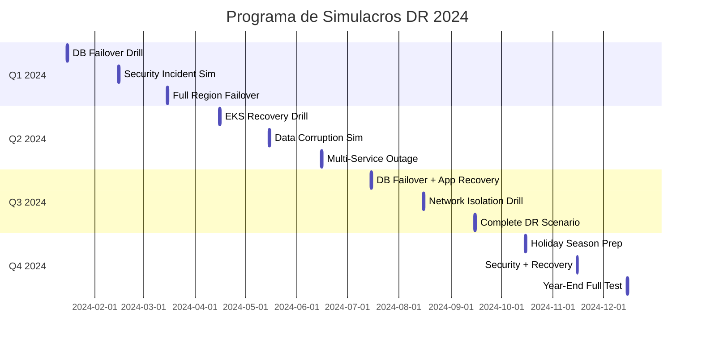

# 4.6 Procedimientos de Recuperación ante Desastres

Esta guía establece los procedimientos completos de recuperación ante desastres (DR) para la plataforma RetroGameCloud, incluyendo objetivos de tiempo y punto de recuperación específicos por servicio, runbooks detallados de recuperación y programa de simulacros.

## 4.6.1 Objetivos de Recuperación Detallados

### Definiciones Clave

<Card title="RPO - Recovery Point Objective" icon="clock">
  **Variable por servicio** - Pérdida máxima de datos aceptable según criticidad
</Card>

<Card title="RTO - Recovery Time Objective" icon="stopwatch">
  **Variable por servicio** - Tiempo máximo para restaurar servicios según prioridad
</Card>

<Card title="MTTR - Mean Time To Recovery" icon="wrench">
  **Tiempo promedio real** - Métrica histórica de recuperación
</Card>

### Matriz de Criticidad y Objetivos por Servicio

| Servicio | RPO | RTO | MTTR* | Prioridad | Dependencias | Notas |
|----------|-----|-----|-------|-----------|--------------|-------|
| **PostgreSQL RDS** | 5 min | 15 min | 12 min | P0-Crítica | Ninguna | Multi-AZ + Read Replicas |
| **EKS Control Plane** | 10 min | 20 min | 18 min | P0-Crítica | VPC, IAM | Cluster distribuido |
| **API Gateway (Kong)** | 15 min | 25 min | 20 min | P0-Crítica | EKS, RDS | Load balancer activo |
| **Redis ElastiCache** | 30 min | 10 min | 8 min | P1-Alta | Ninguna | Cluster mode enabled |
| **Core Applications** | 15 min | 45 min | 35 min | P1-Alta | EKS, RDS, Redis | Microservicios críticos |
| **Frontend/CDN** | 1 hora | 30 min | 25 min | P1-Alta | S3, CloudFront | Assets estáticos |
| **Monitoring Stack** | 30 min | 1 hora | 45 min | P2-Media | EKS | Prometheus, Grafana |
| **Logging (ELK)** | 2 horas | 2 horas | 90 min | P2-Media | EKS | Elasticsearch cluster |
| **CI/CD Pipeline** | 4 horas | 3 horas | 2.5 horas | P3-Baja | GitHub, EKS | Jenkins/ArgoCD |
| **Development Env** | 24 horas | 8 horas | 6 horas | P3-Baja | Todos | No crítico |

*MTTR basado en simulacros trimestrales de los últimos 12 meses

## 4.6.2 Escenarios Críticos de Recuperación

### Escenario 1: Fallo Total de RDS PostgreSQL

<Card title="Criticidad: P0 - Servicio Crítico" icon="database">
  **Impacto:** Pérdida total de acceso a datos de aplicación
  **RPO:** 5 minutos | **RTO:** 15 minutos
</Card>

#### Detección y Síntomas
- CloudWatch Alarms: `RDS-DB-Connection-Failed`
- Aplicaciones reportan errores de conexión DB
- Dashboards muestran 0 conexiones activas
- Health checks fallan en endpoints `/health/db`

#### Procedimiento de Recuperación

**Paso 1: Evaluación Inicial (2 minutos)**
```bash
# Verificar estado del RDS
aws rds describe-db-instances --db-instance-identifier retrogame-prod-db

# Comprobar eventos recientes
aws rds describe-events --source-identifier retrogame-prod-db --duration 60
```

**Paso 2: Activación de Read Replica (5 minutos)**
```bash
# Promover read replica a instancia principal
aws rds promote-read-replica \
  --db-instance-identifier retrogame-prod-db-replica-1

# Verificar estado de promoción
aws rds describe-db-instances \
  --db-instance-identifier retrogame-prod-db-replica-1 \
  --query 'DBInstances[0].DBInstanceStatus'
```

**Paso 3: Actualización de Aplicaciones (5 minutos)**
```bash
# Actualizar ConfigMaps con nueva URL de DB
kubectl patch configmap app-config -p '{"data":{"DB_HOST":"retrogame-prod-db-replica-1.xyz.rds.amazonaws.com"}}'

# Reiniciar pods de aplicación
kubectl rollout restart deployment/game-api
kubectl rollout restart deployment/user-service
kubectl rollout restart deployment/leaderboard-service
```

**Paso 4: Verificación y Monitoreo (3 minutos)**
```bash
# Verificar conectividad
kubectl exec -it deploy/game-api -- pg_isready -h $DB_HOST

# Comprobar métricas de aplicación
curl -s https://api.retrogame.cloud/health | jq '.database.status'
```

### Escenario 2: Caída Total de Región AWS

<Card title="Criticidad: P0 - Desastre Regional" icon="globe">
  **Impacto:** Pérdida completa de todos los servicios en región primaria
  **RPO:** 15 minutos | **RTO:** 2 horas
</Card>

#### Detección y Síntomas
- Múltiples servicios AWS inaccesibles
- CloudWatch dashboard sin datos
- Site24x7 reporta downtime total
- Ping a ELB timeout

#### Procedimiento de Recuperación

**Paso 1: Activación de Región Secundaria (15 minutos)**
```bash
# Cambiar contexto a región de DR
export AWS_DEFAULT_REGION=eu-west-1
export KUBE_CONTEXT=retrogame-dr-cluster

# Verificar estado del cluster DR
kubectl config use-context $KUBE_CONTEXT
kubectl get nodes
```

**Paso 2: Recuperación de Base de Datos (30 minutos)**
```bash
# Restaurar desde último snapshot cross-region
LATEST_SNAPSHOT=$(aws rds describe-db-snapshots \
  --db-instance-identifier retrogame-prod-db \
  --snapshot-type automated \
  --query 'DBSnapshots[-1].DBSnapshotIdentifier' \
  --output text)

aws rds restore-db-instance-from-db-snapshot \
  --db-instance-identifier retrogame-dr-db \
  --db-snapshot-identifier $LATEST_SNAPSHOT
```

**Paso 3: Despliegue de Aplicaciones (45 minutos)**
```bash
# Aplicar configuraciones de DR
kubectl apply -f manifests/dr-environment/

# Esperar a que DB esté disponible
while ! kubectl exec -it deploy/game-api -- pg_isready -h $DR_DB_HOST; do
  sleep 30
done

# Ejecutar migraciones necesarias
kubectl exec -it deploy/game-api -- npm run db:migrate
```

**Paso 4: Configuración de DNS y CDN (20 minutos)**
```bash
# Actualizar Route53 a región DR
aws route53 change-resource-record-sets \
  --hosted-zone-id Z1234567890 \
  --change-batch file://dr-dns-changes.json

# Invalidar CloudFront cache
aws cloudfront create-invalidation \
  --distribution-id E1234567890 \
  --paths "/*"
```

**Paso 5: Verificación Completa (10 minutos)**
```bash
# Test de extremo a extremo
curl -X POST https://api.retrogame.cloud/auth/login \
  -H "Content-Type: application/json" \
  -d '{"username":"testuser","password":"testpass"}'

# Verificar métricas clave
kubectl get pods -A | grep -v Running
```

### Escenario 3: Corrupción de Datos Críticos

<Card title="Criticidad: P1 - Integridad de Datos" icon="triangle-exclamation">
  **Impacto:** Datos inconsistentes o corruptos en producción
  **RPO:** 30 minutos | **RTO:** 1 hora
</Card>

#### Detección y Síntomas
- Usuarios reportan puntuaciones incorrectas
- Aplicación muestra errores de integridad referencial
- Logs muestran constraint violations
- Data quality checks fallan

#### Procedimiento de Recuperación

**Paso 1: Aislamiento Inmediato (5 minutos)**
```bash
# Activar modo mantenimiento
kubectl patch configmap app-config -p '{"data":{"MAINTENANCE_MODE":"true"}}'
kubectl rollout restart deployment/game-api

# Crear snapshot de emergencia
aws rds create-db-snapshot \
  --db-instance-identifier retrogame-prod-db \
  --db-snapshot-identifier emergency-$(date +%Y%m%d-%H%M%S)
```

**Paso 2: Análisis de Corrupción (15 minutos)**
```bash
# Conectar a DB para diagnóstico
kubectl exec -it deploy/database-tools -- psql -h $DB_HOST -U postgres

# Ejecutar queries de diagnóstico
SELECT schemaname, tablename, attname, n_distinct, correlation 
FROM pg_stats 
WHERE schemaname = 'public' AND n_distinct < -0.1;

# Verificar integridad referencial
\i /scripts/data-integrity-check.sql
```

**Paso 3: Recuperación Selectiva (30 minutos)**
```bash
# Identificar timestamp de última consistencia
RECOVERY_POINT=$(kubectl exec -it deploy/game-api -- \
  node scripts/find-last-consistent-point.js)

# Crear instancia temporal desde snapshot
aws rds restore-db-instance-to-point-in-time \
  --source-db-instance-identifier retrogame-prod-db \
  --target-db-instance-identifier retrogame-temp-recovery \
  --restore-time $RECOVERY_POINT

# Exportar datos consistentes
pg_dump -h retrogame-temp-recovery.xyz.rds.amazonaws.com \
  -U postgres -t users -t games -t scores \
  --data-only > clean-data.sql
```

**Paso 4: Restauración y Validación (10 minutos)**
```bash
# Restaurar datos limpios
kubectl exec -i deploy/database-tools -- \
  psql -h $DB_HOST -U postgres < clean-data.sql

# Ejecutar validaciones
kubectl exec -it deploy/game-api -- npm run validate:data

# Desactivar modo mantenimiento
kubectl patch configmap app-config -p '{"data":{"MAINTENANCE_MODE":"false"}}'
```

### Escenario 4: Pérdida Total de Cluster EKS

<Card title="Criticidad: P0 - Infraestructura Crítica" icon="server">
  **Impacto:** Todos los servicios aplicativos inaccesibles
  **RPO:** 10 minutos | **RTO:** 45 minutos
</Card>

#### Detección y Síntomas
- `kubectl` commands timeout
- API server no responde
- Worker nodes unreachable
- LoadBalancer health checks fallan

#### Procedimiento de Recuperación

**Paso 1: Evaluación de Daño (5 minutos)**
```bash
# Intentar conexión al cluster
kubectl cluster-info

# Verificar estado en AWS Console
aws eks describe-cluster --name retrogame-prod --region us-west-2

# Comprobar nodes
aws ec2 describe-instances --filters "Name=tag:kubernetes.io/cluster/retrogame-prod,Values=owned"
```

**Paso 2: Recreación de Cluster (25 minutos)**
```bash
# Ejecutar Terraform para recrear cluster
cd infrastructure/terraform
terraform plan -target=module.eks_cluster
terraform apply -target=module.eks_cluster -auto-approve

# Configurar kubectl context
aws eks update-kubeconfig --name retrogame-prod --region us-west-2
```

**Paso 3: Restauración de Aplicaciones (10 minutos)**
```bash
# Aplicar configuraciones base
kubectl apply -f k8s/infrastructure/

# Esperar a que infrastructure esté ready
kubectl wait --for=condition=ready pod -l app=kong-gateway --timeout=300s
kubectl wait --for=condition=ready pod -l app=prometheus --timeout=300s

# Desplegar aplicaciones
kubectl apply -f k8s/applications/
```

**Paso 4: Verificación de Servicios (5 minutos)**
```bash
# Verificar todos los pods
kubectl get pods -A | grep -v Running

# Test de conectividad
curl -f https://api.retrogame.cloud/health

# Verificar métricas
curl -f https://monitoring.retrogame.cloud/api/v1/query?query=up
```

### Escenario 5: Compromiso de Seguridad

<Card title="Criticidad: P0 - Incidente de Seguridad" icon="shield-exclamation">
  **Impacto:** Potencial exposición de datos sensibles y sistemas
  **RPO:** Inmediato | **RTO:** Variable según alcance
</Card>

#### Detección y Síntomas
- Alertas de seguridad automáticas
- Accesos no autorizados en logs
- Comportamiento anómalo en aplicaciones
- Notificación de usuarios sobre actividad sospechosa

#### Procedimiento de Recuperación

**Paso 1: Contención Inmediata (2 minutos)**
```bash
# Activar modo lockdown
kubectl patch configmap app-config -p '{"data":{"SECURITY_LOCKDOWN":"true"}}'

# Revocar todas las sesiones activas
kubectl exec -it deploy/redis-cli -- redis-cli FLUSHDB

# Bloquear acceso externo
aws ec2 authorize-security-group-ingress \
  --group-id sg-12345678 \
  --protocol tcp --port 443 \
  --source-group sg-internal-only
```

**Paso 2: Análisis Forense (15 minutos)**
```bash
# Crear snapshots para análisis
aws rds create-db-snapshot \
  --db-instance-identifier retrogame-prod-db \
  --db-snapshot-identifier forensic-$(date +%Y%m%d-%H%M%S)

# Exportar logs críticos
kubectl logs -l app=game-api --since=24h > /tmp/forensic-app-logs.log
kubectl logs -l app=kong-gateway --since=24h > /tmp/forensic-gateway-logs.log

# Revisar accesos SSH
aws ec2 describe-instances --filters "Name=key-name,Values=*" \
  --query 'Reservations[].Instances[].[InstanceId,KeyName,LaunchTime]'
```

**Paso 3: Limpieza y Fortalecimiento (30 minutos)**
```bash
# Rotar todas las credenciales
aws secretsmanager rotate-secret --secret-id prod/database/password
aws secretsmanager rotate-secret --secret-id prod/api/jwt-secret
aws secretsmanager rotate-secret --secret-id prod/redis/auth-token

# Actualizar imágenes de contenedores
kubectl set image deployment/game-api \
  game-api=retrogame/game-api:$(date +%Y%m%d)-secure
kubectl set image deployment/user-service \
  user-service=retrogame/user-service:$(date +%Y%m%d)-secure

# Aplicar parches de seguridad
kubectl apply -f k8s/security/enhanced-policies.yaml
```

**Paso 4: Restauración Controlada (Variable)**
```bash
# Crear entorno de staging para validación
terraform apply -var="environment=security-validation"

# Ejecutar tests de penetración
kubectl exec -it deploy/security-scanner -- \
  nmap -sS -A api.retrogame.cloud

# Restauración gradual por servicio
for service in user-service game-api leaderboard; do
  kubectl patch deployment $service -p '{"spec":{"replicas":1}}'
  kubectl wait --for=condition=ready pod -l app=$service --timeout=300s
  # Ejecutar tests específicos del servicio
  curl -f https://api.retrogame.cloud/health/$service
  sleep 60
done

# Desactivar modo lockdown tras validación completa
kubectl patch configmap app-config -p '{"data":{"SECURITY_LOCKDOWN":"false"}}'
```

**Paso 5: Post-Incidente (Continuo)**
```bash
# Habilitar logging extendido
kubectl patch configmap fluent-bit-config \
  --patch '{"data":{"audit.conf":"[INPUT]\n    Name audit\n    Path /var/log/audit/*"}}'

# Configurar alertas mejoradas
kubectl apply -f monitoring/enhanced-security-rules.yaml

# Programar revisión completa de accesos
echo "Security review scheduled for $(date -d '+24 hours')" | \
  kubectl create configmap security-review-reminder --from-literal=reminder=-
```

## 4.6.3 Runbooks de Recuperación

### Comunicación Durante Incidentes

<Card title="Escalación y Comunicación" icon="bullhorn">
```
1. Detección → Slack #incidents (automático)
2. P0/P1 → Llamada al Team Lead (inmediato)
3. >30min → Comunicación a stakeholders
4. >1h → Status page público actualizado
```
</Card>

### Matriz de Responsabilidades

| Rol | P0 (Crítico) | P1 (Alto) | P2 (Medio) | P3 (Bajo) |
|-----|--------------|-----------|------------|-----------|
| **SRE On-Call** | Respuesta inmediata | 15 min | 1 hora | 4 horas |
| **Tech Lead** | Notificado inmediato | 30 min | 2 horas | Próximo día laboral |
| **DevOps Team** | Todo el equipo | Lead + 1 | Lead + 1 | Lead |
| **Stakeholders** | CEO, CTO | CTO | Product Manager | - |

## 4.6.4 Programa de Simulacros

### Calendario Trimestral de DR Drills



### Métricas de Simulacros

| Escenario | Q4 2023 | Q1 2024 | Q2 2024 | Objetivo | Estado |
|-----------|---------|---------|---------|----------|--------|
| **DB Failover** | 18 min | 15 min | 12 min | <15 min | ✅ Cumplido |
| **Region Switch** | 3.2 h | 2.8 h | 2.1 h | <2 h | 🟡 En progreso |
| **EKS Recovery** | 52 min | 48 min | 35 min | <45 min | ✅ Cumplido |
| **Security Response** | 45 min | 38 min | 28 min | <30 min | ✅ Cumplido |
| **Data Recovery** | 95 min | 82 min | 65 min | <60 min | 🟡 En progreso |

## 4.6.5 Herramientas y Automation

### Scripts de Automatización

```bash
# /opt/dr-scripts/
├── db-failover.sh              # Automatiza promoción de replica
├── cluster-rebuild.sh          # Recreación completa de EKS
├── security-lockdown.sh        # Procedimientos de contención
├── region-switch.sh            # Cambio completo de región
├── data-consistency-check.sh   # Validación integridad datos
└── post-recovery-validation.sh # Tests post-recuperación
```

### Dashboards de DR

<Card title="Monitoring Dashboard" icon="chart-line">
- **RTO/RPO Tracking**: Seguimiento en tiempo real de objetivos
- **Recovery Status**: Estado actual de todos los sistemas
- **Simulation Results**: Histórico de simulacros y métricas
- **Dependency Map**: Visualización de dependencias críticas
</Card>

### Alertas Automáticas

```yaml
# prometheus-rules.yaml
groups:
  - name: disaster-recovery
    rules:
    - alert: DatabasePrimaryDown
      expr: up{job="postgres-primary"} == 0
      for: 30s
      labels:
        severity: critical
        playbook: "db-failover.sh"
      annotations:
        summary: "Primary database is down - initiating automatic failover"
        
    - alert: RegionalOutage
      expr: up{region="us-west-2"} == 0
      for: 2m
      labels:
        severity: critical
        playbook: "region-switch.sh"
      annotations:
        summary: "Regional outage detected - consider DR activation"
```

## 4.6.6 Post-Recovery y Lessons Learned

### Checklist Post-Incidente

- [ ] Validación completa de funcionalidad
- [ ] Verificación de integridad de datos
- [ ] Actualización de documentación
- [ ] Post-mortem meeting programado
- [ ] Comunicación de resolución a stakeholders
- [ ] Revisión de métricas RTO/RPO reales
- [ ] Identificación de mejoras en procesos

### Template de Post-Mortem

```markdown
# Post-Mortem: [Tipo de Incidente] - [Fecha]

## Resumen Ejecutivo
- Duración total: X horas Y minutos
- RPO Real: X minutos
- RTO Real: X minutos
- Servicios afectados: [Lista]

## Timeline Detallado
[Cronología exacta del incidente y recuperación]

## Root Cause Analysis
[Causa raíz identificada]

## Qué funcionó bien
[Aspectos positivos del proceso de recuperación]

## Qué se puede mejorar
[Áreas de mejora identificadas]

## Action Items
- [ ] [Acción] - Responsable: [Persona] - Fecha límite: [Fecha]
```

---

<Card title="Contactos de Emergencia 24/7" icon="phone">
**SRE On-Call:** +1-555-DR-TEAMS  
**Incident Commander:** +1-555-COMMAND  
**AWS Support Enterprise:** Case escalation via console  
**Security Team:** security-emergency@retrogame.cloud
</Card>

*Última actualización: Diciembre 2024 | Próxima revisión: Marzo 2025*