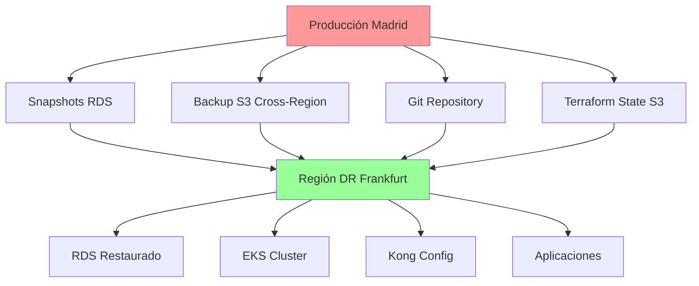

# Procedimientos de Recuperación ante Desastres

Esta guía establece los procedimientos completos de recuperación ante desastres (DR) para la plataforma RetroGameCloud, incluyendo objetivos de tiempo y punto de recuperación, procedimientos detallados y validaciones.

## Objetivos de Recuperación

### Definiciones Clave

<Card title="RPO - Recovery Point Objective" icon="clock">
  **1 hora** - Pérdida máxima de datos aceptable
</Card>

<Card title="RTO - Recovery Time Objective" icon="stopwatch">
  **4 horas** - Tiempo máximo para restaurar servicios
</Card>

### Matriz de Criticidad

| Componente | RPO | RTO | Prioridad |
|------------|-----|-----|-----------|
| Base de Datos (PostgreSQL) | 1 hora | 30 min | Crítica |
| Aplicaciones (EKS) | 1 hora | 2 horas | Alta |
| Configuración Kong | 1 hora | 1 hora | Alta |
| CDN/Frontend | 4 horas | 1 hora | Media |

## Arquitectura de Backup



## Procedimiento de Disaster Recovery

### Fase 1: Evaluación y Activación

<Tabs>
  <Tab title="Evaluación Inicial">
    ```bash
    # Verificar estado de la región primaria
    aws ec2 describe-regions --region eu-west-1
    aws rds describe-db-instances --region eu-west-1
    aws eks describe-cluster --name retrogame-prod --region eu-west-1

    # Comprobar último snapshot disponible
    aws rds describe-db-snapshots \
      --db-instance-identifier retrogame-prod \
      --snapshot-type automated \
      --max-items 5
    ```

  </Tab>

  <Tab title="Activación DR">
    ```bash
    # 1. Declarar incidente DR
    echo "DR-$(date +%Y%m%d-%H%M%S)" > /tmp/incident_id

    # 2. Notificar al equipo
    curl -X POST $SLACK_WEBHOOK \
      -H 'Content-type: application/json' \
      --data '{"text":"🚨 DR ACTIVADO - Incidente: '$(cat /tmp/incident_id)'"}'

    # 3. Cambiar a región de DR
    export AWS_DEFAULT_REGION=eu-central-1
    ```

  </Tab>

```

</Tabs>

### Fase 2: Restauración de Base de Datos

<Warning>
La restauración de RDS es crítica y debe ejecutarse primero
</Warning>

```bash
#!/bin/bash

# restore-database.sh

# Obtener el último snapshot automático
LATEST_SNAPSHOT=$(aws rds describe-db-snapshots \
  --db-instance-identifier retrogame-prod \
  --snapshot-type automated \
  --region eu-west-1 \
  --query 'DBSnapshots[0].DBSnapshotIdentifier' \
  --output text)

# Restaurar RDS en región de DR
aws rds restore-db-instance-from-db-snapshot \
  --db-instance-identifier retrogame-dr \
  --db-snapshot-identifier $LATEST_SNAPSHOT \
  --db-instance-class db.r5.large \
  --availability-zone eu-central-1a \
  --region eu-central-1

# Esperar a que esté disponible
aws rds wait db-instance-available \
  --db-instance-identifier retrogame-dr \
  --region eu-central-1

# Obtener endpoint de conexión
DB_ENDPOINT=$(aws rds describe-db-instances \
  --db-instance-identifier retrogame-dr \
  --query 'DBInstances[0].Endpoint.Address' \
  --output text)

echo "Base de datos restaurada en: $DB_ENDPOINT"

```

### Fase 3: Recreación de Infraestructura EKS

```bash
#!/bin/bash

# restore-infrastructure.sh

# Clonar repositorio de infraestructura
git clone https://github.com/retrogame/infrastructure.git
cd infrastructure/terraform/dr

# Configurar variables para región DR
cat > terraform.tfvars << EOF
region = "eu-central-1"
environment = "dr"
db_endpoint = "$DB_ENDPOINT"
cluster_name = "retrogame-dr"
node_instance_types = ["m5.large"]
desired_capacity = 3
max_capacity = 10
min_capacity = 1
EOF

# Aplicar infraestructura
terraform init
terraform plan -var-file=terraform.tfvars
terraform apply -var-file=terraform.tfvars -auto-approve

# Configurar kubectl
aws eks update-kubeconfig --name retrogame-dr --region eu-central-1

```

### Fase 4: Despliegue de Aplicaciones

<Tabs>
  <Tab title="Kong Gateway">
    ```bash
    # Instalar Kong
    helm repo add kong https://charts.konghq.com
    helm repo update

    helm install kong kong/kong \
      --namespace kong-system \
      --create-namespace \
      --values kong-dr-values.yaml

    # Restaurar configuración desde S3
    aws s3 cp s3://retrogame-backups/kong/latest-config.yaml ./kong-config.yaml
    kubectl apply -f kong-config.yaml
    ```

  </Tab>

  <Tab title="Aplicaciones">
    ```bash
    # Clonar repositorio de aplicaciones
    git clone https://github.com/retrogame/k8s-manifests.git
    cd k8s-manifests

    # Crear namespaces
    kubectl apply -f namespaces/

    # Aplicar configuraciones base
    kubectl apply -f configmaps/
    kubectl apply -f secrets/

    # Desplegar servicios por orden de dependencia
    kubectl apply -f auth-service/
    kubectl apply -f user-service/
    kubectl apply -f game-catalog-service/
    kubectl apply -f score-service/
    kubectl apply -f ranking-service/

    # Verificar despliegues
    kubectl get pods --all-namespaces
    ```

  </Tab>

  <Tab title="Frontend">
    ```bash
    # Construir y desplegar frontend
    cd frontend/

    # Actualizar configuración para endpoints DR
    cat > .env.production << EOF
    REACT_APP_API_URL=https://api-dr.retrogamecloud.com
    REACT_APP_CDN_URL=https://cdn-dr.retrogamecloud.com
    EOF

    # Build y despliegue
    npm run build
    aws s3 sync dist/ s3://retrogame-frontend-dr/

    # Invalidar caché CloudFront
    aws cloudfront create-invalidation \
      --distribution-id E3QXAMPLE67890 \
      --paths "/*"
    ```

  </Tab>

```

</Tabs>

### Fase 5: Configuración DNS y Routing

```bash
#!/bin/bash

# update-dns.sh

# Obtener nuevo load balancer endpoint
LB_ENDPOINT=$(kubectl get svc kong-kong-proxy -n kong-system \
  -o jsonpath='{.status.loadBalancer.ingress[0].hostname}')

# Actualizar registros Route53
aws route53 change-resource-record-sets \
  --hosted-zone-id Z3M3LMPEXAMPLE \
  --change-batch '{
    "Changes": [{
      "Action": "UPSERT",
      "ResourceRecordSet": {
        "Name": "api.retrogamecloud.com",
        "Type": "CNAME",
        "TTL": 60,
        "ResourceRecords": [{"Value": "'$LB_ENDPOINT'"}]
      }
    }]
  }'

echo "DNS actualizado: api.retrogamecloud.com -> $LB_ENDPOINT"

```

## Validación Post-Recovery

### Checklist de Verificación

<Note>
Ejecutar todas las verificaciones antes de declarar la recuperación completa
</Note>

#### ✅ Infraestructura Base

- [ ] Cluster EKS operativo

- [ ] Nodos de trabajo disponibles

- [ ] Load balancers funcionando

- [ ] Conectividad de red establecida

#### ✅ Base de Datos

```bash

# Test de conectividad a BD
kubectl run postgres-test --rm -i --tty --restart=Never \
  --image=postgres:13 -- psql -h $DB_ENDPOINT -U retrogame_user -d retrogame_db -c "\dt"

# Verificar integridad de datos
kubectl exec -it auth-service-xxxx -- npm run db:health-check

```

#### ✅ Servicios de Aplicación

```bash

# Health checks de microservicios
services=("auth-service" "user-service" "game-catalog-service" "score-service" "ranking-service")

for service in "${services[@]}"; do
  echo "Verificando $service..."
  kubectl get pods -l app=$service
  kubectl logs -l app=$service --tail=10

  # Health check endpoint
  kubectl port-forward svc/$service 8080:80 &
  curl -f http://localhost:8080/health || echo "❌ $service no responde"
  pkill -f "port-forward.*$service"
done

```

#### ✅ API Gateway

```bash

# Verificar Kong
kubectl get pods -n kong-system
kubectl get svc -n kong-system

# Test de routing
curl -H "Host: api.retrogamecloud.com" http://$LB_ENDPOINT/health
curl -H "Host: api.retrogamecloud.com" http://$LB_ENDPOINT/auth/status

```

#### ✅ Frontend y CDN

```bash

# Verificar distribución CloudFront
aws cloudfront get-distribution --id E3QXAMPLE67890

# Test de carga del frontend
curl -I https://retrogamecloud.com
curl -I https://cdn.retrogamecloud.com/js/main.js

```

### Tests Funcionales

```javascript
// e2e-dr-tests.js
const tests = [
  {
    name: "Registro de usuario",
    endpoint: "/auth/register",
    method: "POST",
    payload: { email: "test@example.com", password: "test123" }
  },
  {
    name: "Login de usuario",
    endpoint: "/auth/login",
    method: "POST",
    payload: { email: "test@example.com", password: "test123" }
  },
  {
    name: "Listado de juegos",
    endpoint: "/games",
    method: "GET"
  },
  {
    name: "Subir puntuación",
    endpoint: "/scores",
    method: "POST",
    payload: { gameId: 1, score: 1000 }
  }
];

// Ejecutar tests
tests.forEach(async (test) => {
  try {
    const response = await fetch(`https://api.retrogamecloud.com${test.endpoint}`, {
      method: test.method,
      headers: { 'Content-Type': 'application/json' },
      body: test.payload ? JSON.stringify(test.payload) : undefined
    });

    console.log(`✅ ${test.name}: ${response.status}`);
  } catch (error) {
    console.log(`❌ ${test.name}: ${error.message}`);
  }
});

```

## Simulacros de Disaster Recovery

### Calendario de Simulacros

| Tipo | Frecuencia | Duración | Alcance |
|------|------------|----------|---------|
| Simulacro Parcial | Mensual | 2 horas | Un servicio |
| Simulacro Completo | Trimestral | 1 día | Toda la plataforma |
| Test de Comunicación | Semanal | 30 min | Equipo DR |

### Procedimiento de Simulacro

<Tabs>
  <Tab title="Planificación">
    ```yaml
    # simulacro-plan.yaml
    simulacro:
      id: "DR-SIM-2024Q1"
      fecha: "2024-03-15"
      tipo: "completo"
      duracion: "6 horas"

    participantes:
      - "Equipo DevOps"
      - "Desarrolladores Backend"
      - "QA Team"
      - "Product Owner"

    escenario:
      descripcion: "Caída completa de región eu-west-1"
      impacto: "Pérdida total de servicios"
      tiempo_deteccion: "15 minutos"

    objetivos:
      - "Restaurar servicios en < 4 horas"
      - "Pérdida de datos < 1 hora"
      - "Validar comunicación de equipo"
    ```

  </Tab>

  <Tab title="Ejecución">
    ```bash
    #!/bin/bash
    # ejecutar-simulacro.sh

    SIMULACRO_ID="DR-SIM-$(date +%Y%m%d)"
    START_TIME=$(date +%s)

    echo "🔥 INICIANDO SIMULACRO: $SIMULACRO_ID"

    # Simular caída (redirigir tráfico a página de mantenimiento)
    aws route53 change-resource-record-sets \
      --hosted-zone-id Z3M3LMPEXAMPLE \
      --change-batch file://maintenance-mode.json

    # Cronometrar procedimiento DR
    echo "⏱️  Cronómetro iniciado: $(date)"

    # Ejecutar procedimiento completo
    ./restore-database.sh
    ./restore-infrastructure.sh
    ./update-dns.sh

    # Validaciones
    ./validate-recovery.sh

    END_TIME=$(date +%s)
    DURATION=$((END_TIME - START_TIME))

    echo "✅ Simulacro completado en $((DURATION/60)) minutos"
    ```

  </Tab>

  <Tab title="Evaluación">
    ```markdown
    # Informe de Simulacro DR-SIM-20240315

    ## Resumen Ejecutivo
    - **Duración Total**: 3h 45min (objetivo: 4h) ✅
    - **RPO Alcanzado**: 45 minutos (objetivo: 1h) ✅
    - **Servicios Restaurados**: 5/5 ✅

    ## Métricas
    - Tiempo detección: 8 minutos
    - Tiempo activación DR: 15 minutos
    - Restauración BD: 25 minutos
    - Despliegue apps: 2h 30min
    - Validación: 35 minutos

    ## Problemas Identificados
    1. Demora en restauración Kong (30min extra)
</Tab>

```

</Tabs>

```
```