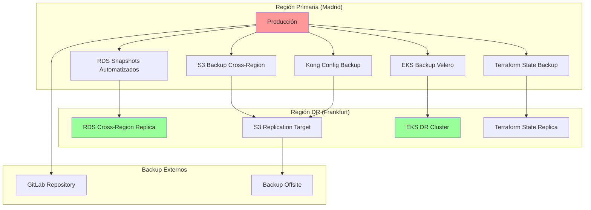

# Procedimientos de Recuperación ante Desastres

Esta guía establece los procedimientos completos de recuperación ante desastres (DR) para la plataforma RetroGameCloud, incluyendo clasificación de servicios, objetivos de tiempo y punto de recuperación, procedimientos detallados por escenario y validaciones post-recovery.

## Clasificación de Servicios por Criticidad

### Servicios Críticos
<Card title="Servicios de Misión Crítica" icon="exclamation-triangle" color="red">
- **Autenticación (Auth Service)**
- **Base de Datos Principal (PostgreSQL)**
- **Kong Gateway**
- **Monitoreo y Alertas**
</Card>

### Servicios Importantes
<Card title="Servicios de Alta Prioridad" icon="exclamation" color="orange">
- **Sistema de Puntuaciones (Scores Service)**
- **Gestión de Salas**
- **API Backend Principal**
- **Redis Cache**
</Card>

### Servicios Normales
<Card title="Servicios de Prioridad Estándar" icon="info" color="blue">
- **CDN y Frontend**
- **Servicios de Métricas**
- **Logs Centralizados**
- **Servicios de Notificaciones**
</Card>

## Objetivos de Recuperación por Criticidad

### Definiciones Clave

<Card title="RPO - Recovery Point Objective" icon="clock">
  Pérdida máxima de datos aceptable por servicio
</Card>

<Card title="RTO - Recovery Time Objective" icon="stopwatch">
  Tiempo máximo para restaurar servicios por criticidad
</Card>

### Matriz de Criticidad Detallada

| Servicio | Criticidad | RPO | RTO | SLA Recovery |
|----------|------------|-----|-----|--------------|
| **Autenticación** | Crítico | 1 hora | 30 min | 99.9% |
| **Base de Datos Principal** | Crítico | 1 hora | 30 min | 99.9% |
| **Kong Gateway** | Crítico | 1 hora | 45 min | 99.9% |
| **Monitoreo** | Crítico | 2 horas | 1 hora | 99.5% |
| **Scores Service** | Importante | 4 horas | 2 horas | 99.0% |
| **Gestión de Salas** | Importante | 4 horas | 2 horas | 99.0% |
| **API Backend** | Importante | 4 horas | 1.5 horas | 99.0% |
| **Redis Cache** | Importante | 8 horas | 1 hora | 98.5% |
| **CDN/Frontend** | Normal | 8 horas | 3 horas | 98.0% |
| **Logs** | Normal | 24 horas | 4 horas | 95.0% |

## Estrategias de Backup Automatizado

### Arquitectura de Respaldo



### Configuración de Backups Automatizados

<Tabs>
  <Tab title="RDS Snapshots">
    ```bash
    # Configuración de snapshots automatizados
    aws rds modify-db-instance \
      --db-instance-identifier retrogame-prod \
      --backup-retention-period 30 \
      --preferred-backup-window "03:00-04:00" \
      --preferred-maintenance-window "sun:04:00-sun:05:00"

    # Crear snapshot manual antes de cambios críticos
    aws rds create-db-snapshot \
      --db-instance-identifier retrogame-prod \
      --db-snapshot-identifier retrogame-pre-deploy-$(date +%Y%m%d-%H%M%S)

    # Verificar snapshots disponibles
    aws rds describe-db-snapshots \
      --db-instance-identifier retrogame-prod \
      --max-items 10
    ```
  </Tab>

  <Tab title="Velero EKS Backup">
    ```yaml
    # velero-backup-schedule.yaml
    apiVersion: velero.io/v1
    kind: Schedule
    metadata:
      name: retrogame-daily-backup
    spec:
      schedule: "0 2 * * *"  # Daily at 2 AM
      template:
        includedNamespaces:
          - retrogame-prod
          - retrogame-auth
          - retrogame-scores
        excludedResources:
          - pods
          - events
        storageLocation: aws-s3-backup
        ttl: 720h0m0s  # 30 days
    ```
  </Tab>

  <Tab title="Cross-Region Replication">
    ```bash
    # Configurar replicación cross-region para RDS
    aws rds create-db-instance-read-replica \
      --db-instance-identifier retrogame-dr-replica \
      --source-db-instance-identifier retrogame-prod \
      --db-instance-class db.t3.medium \
      --destination-region eu-central-1

    # Configurar replicación S3
    aws s3api put-bucket-replication \
      --bucket retrogame-backups-prod \
      --replication-configuration file://replication-config.json
    ```
  </Tab>
</Tabs>

## Runbooks por Escenario de Desastre

### Escenario 1: Fallo Total de Región AWS

<Tabs>
  <Tab title="Detección y Evaluación">
    ```bash
    #!/bin/bash
    # dr-region-failure-detection.sh

    echo "=== EVALUACIÓN DE FALLO DE REGIÓN ==="
    
    # Verificar conectividad a región primaria
    PRIMARY_REGION="eu-west-1"
    DR_REGION="eu-central-1"
    
    echo "Verificando región primaria: $PRIMARY_REGION"
    aws ec2 describe-regions --region $PRIMARY_REGION || {
        echo "❌ FALLO: Región primaria no accesible"
        exit 1
    }
    
    # Verificar servicios críticos
    echo "Verificando RDS..."
    aws rds describe-db-instances \
      --db-instance-identifier retrogame-prod \
      --region $PRIMARY_REGION || echo "❌ RDS no accesible"
    
    echo "Verificando EKS..."
    aws eks describe-cluster \
      --name retrogame-prod \
      --region $PRIMARY_REGION || echo "❌ EKS no accesible"
    
    echo "Verificando último snapshot disponible..."
    LATEST_SNAPSHOT=$(aws rds describe-db-snapshots \
      --db-instance-identifier retrogame-prod \
      --region $PRIMARY_REGION \
      --query 'DBSnapshots[0].DBSnapshotIdentifier' \
      --output text 2>/dev/null)
    
    if [ "$LATEST_SNAPSHOT" != "None" ]; then
        echo "✅ Último snapshot: $LATEST_SNAPSHOT"
    else
        echo "⚠️  Verificando snapshots en región DR..."
    fi
    ```
  </Tab>

  <Tab title="Activación DR">
    ```bash
    #!/bin/bash
    # dr-region-failover.sh

    echo "=== INICIANDO PROCEDIMIENTO DE DISASTER RECOVERY ==="
    
    DR_REGION="eu-central-1"
    TIMESTAMP=$(date +%Y%m%d-%H%M%S)
    
    # 1. Promocionar replica de RDS
    echo "Promoviendo replica RDS a master..."
    aws rds promote-read-replica \
      --db-instance-identifier retrogame-dr-replica \
      --region $DR_REGION
    
    # Esperar hasta que esté disponible
    echo "Esperando promoción de RDS..."
    aws rds wait db-instance-available \
      --db-instance-identifier retrogame-dr-replica \
      --region $DR_REGION
    
    # 2. Desplegar EKS en región DR
    echo "Desplegando EKS cluster en región DR..."
    cd terraform/disaster-recovery
    terraform workspace select dr-frankfurt
    terraform apply -auto-approve
    
    # 3. Restaurar aplicaciones
    echo "Restaurando aplicaciones desde backup..."
    velero restore create retrogame-dr-restore-$TIMESTAMP \
      --from-backup retrogame-daily-backup-latest \
      --wait
    
    # 4. Actualizar DNS
    echo "Actualizando registros DNS..."
    aws route53 change-resource-record-sets \
      --hosted-zone-id Z1D633PJN98FT9 \
      --change-batch file://dns-failover-batch.json
    
    echo "✅ Disaster Recovery completado"
    echo "🔍 Iniciando validaciones..."
    ```
  </Tab>

  <Tab title="Validación Post-Recovery">
    ```bash
    #!/bin/bash
    # dr-validation.sh

    echo "=== VALIDACIÓN POST-RECOVERY ==="
    
    DR_ENDPOINT="https://retrogame-dr.cloud"
    
    # Test de conectividad básica
    echo "Verificando conectividad web..."
    curl -f $DR_ENDPOINT/health || {
        echo "❌ Endpoint web no accesible"
        exit 1
    }
    
    # Test de autenticación
    echo "Verificando servicio de autenticación..."
    curl -f $DR_ENDPOINT/api/auth/health || {
        echo "❌ Servicio de auth no disponible"
        exit 1
    }
    
    # Test de base de datos
    echo "Verificando conexión a BD..."
    kubectl exec -n retrogame-prod deployment/api -- \
      pg_isready -h retrogame-dr-replica.cluster.eu-central-1.rds.amazonaws.com || {
        echo "❌ Base de datos no accesible"
        exit 1
    }
    
    # Test funcional básico
    echo "Ejecutando tests funcionales..."
    npm run test:e2e:critical
    
    echo "✅ Validación completada exitosamente"
    ```
  </Tab>
</Tabs>

### Escenario 2: Corrupción de Base de Datos

<Tabs>
  <Tab title="Detección">
    ```bash
    #!/bin/bash
    # db-corruption-detection.sh

    echo "=== DETECCIÓN DE CORRUPCIÓN DE BD ==="
    
    # Verificar integridad de BD
    kubectl exec -n retrogame-prod deployment/api -- psql -c "
    SELECT 
        schemaname, 
        tablename, 
        pg_size_pretty(pg_total_relation_size(schemaname||'.'||tablename)) as size,
        pg_stat_get_live_tuples(c.oid) as live_tuples,
        pg_stat_get_dead_tuples(c.oid) as dead_tuples
    FROM pg_tables t
    JOIN pg_class c ON c.relname = t.tablename
    WHERE schemaname = 'public'
    ORDER BY pg_total_relation_size(schemaname||'.'||tablename) DESC;
    "
    
    # Verificar logs de errores
    aws rds describe-db-log-files \
      --db-instance-identifier retrogame-prod \
      --filename-contains error
    
    # Test de queries críticas
    kubectl exec -n retrogame-prod deployment/api -- psql -c "
    SELECT COUNT(*) FROM users WHERE created_at > NOW() - INTERVAL '1 hour';
    SELECT COUNT(*) FROM scores WHERE created_at > NOW() - INTERVAL '1 hour';
    "
    ```
  </Tab>

  <Tab title="Recuperación">
    ```bash
    #!/bin/bash
    # db-corruption-recovery.sh

    echo "=== RECUPERACIÓN DE CORRUPCIÓN DE BD ==="
    
    RECOVERY_TIMESTAMP=$(date +%Y%m%d-%H%M%S)
    
    # 1. Detener aplicaciones para evitar más corrupción
    echo "Deteniendo aplicaciones..."
    kubectl scale deployment api --replicas=0 -n retrogame-prod
    kubectl scale deployment auth-service --replicas=0 -n retrogame-prod
    
    # 2. Crear snapshot del estado actual (para forense)
    echo "Creando snapshot del estado corrupto..."
    aws rds create-db-snapshot \
      --db-instance-identifier retrogame-prod \
      --db-snapshot-identifier corrupted-state-$RECOVERY_TIMESTAMP
    
    # 3. Identificar último snapshot válido
    echo "Identificando último snapshot válido..."
    VALID_SNAPSHOT=$(aws rds describe-db-snapshots \
      --db-instance-identifier retrogame-prod \
      --query 'DBSnapshots[?Status==`available`] | [0].DBSnapshotIdentifier' \
      --output text)
    
    echo "Usando snapshot: $VALID_SNAPSHOT"
    
    # 4. Restaurar desde snapshot
    echo "Restaurando BD desde snapshot..."
    aws rds restore-db-instance-from-db-snapshot \
      --db-instance-identifier retrogame-recovered-$RECOVERY_TIMESTAMP \
      --db-snapshot-identifier $VALID_SNAPSHOT \
      --db-instance-class db.t3.large
    
    # 5. Esperar hasta que esté disponible
    aws rds wait db-instance-available \
      --db-instance-identifier retrogame-recovered-$RECOVERY_TIMESTAMP
    
    echo "✅ BD restaurada exitosamente"
    ```
  </Tab>
</Tabs>

### Escenario 3: Ataque de Ransomware

<Tabs>
  <Tab title="Contención">
    ```bash
    #!/bin/bash
    # ransomware-containment.sh

    echo "=== CONTENCIÓN DE RANSOMWARE ==="
    
    # 1. Aislamiento inmediato
    echo "Aislando sistemas comprometidos..."
    
    # Revocar tokens de acceso activos
    kubectl delete secret aws-credentials -n retrogame-prod
    kubectl delete secret database-credentials -n retrogame-prod
    
    # Deshabilitar acceso SSH
    aws ec2 modify-instance-attribute \
      --instance-id i-1234567890abcdef0 \
      --groups sg-emergency-lockdown
    
    # Detener servicios no críticos
    kubectl scale deployment --all --replicas=0 -n retrogame-prod
</Tab>
</Tabs>
```