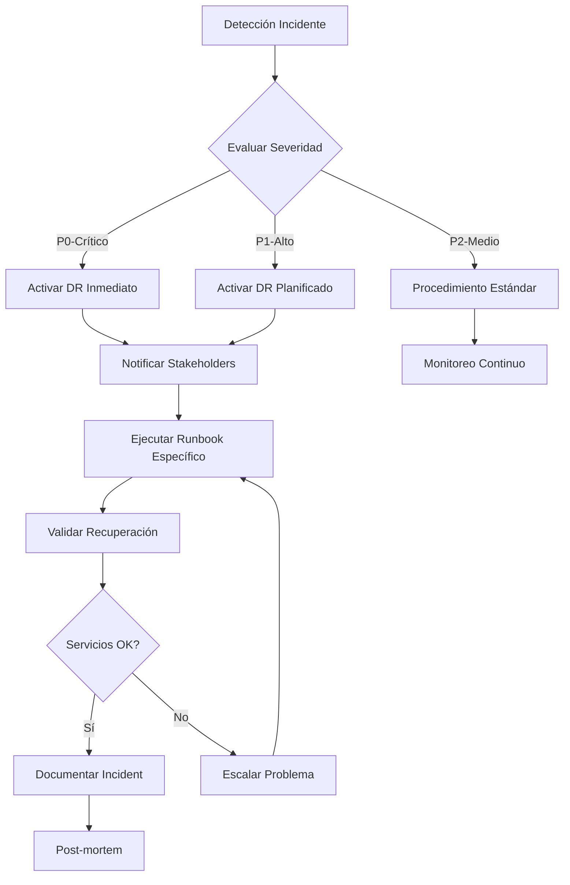

# 4.6 Procedimientos de Recuperación ante Desastres

Esta guía establece los procedimientos completos de recuperación ante desastres (DR) para la plataforma RetroGameCloud, incluyendo objetivos de tiempo y punto de recuperación específicos por servicio, runbooks detallados de recuperación y programa de simulacros.

## 4.6.1 Objetivos de Recuperación Detallados

### Definiciones Clave

<Card title="RPO - Recovery Point Objective" icon="clock">
  **Variable por servicio** - Pérdida máxima de datos aceptable según criticidad
</Card>

<Card title="RTO - Recovery Time Objective" icon="stopwatch">
  **Variable por servicio** - Tiempo máximo para restaurar servicios según prioridad
</Card>

<Card title="MTTR - Mean Time To Recovery" icon="wrench">
  **Tiempo promedio real** - Métrica histórica de recuperación
</Card>

### Matriz de Criticidad y Objetivos por Servicio

| Servicio | RPO | RTO | MTTR* | Prioridad | Dependencias | Notas |
|----------|-----|-----|-------|-----------|--------------|-------|
| **PostgreSQL RDS** | 5 min | 15 min | 12 min | P0-Crítica | Ninguna | Multi-AZ + Read Replicas |
| **EKS Control Plane** | 10 min | 20 min | 18 min | P0-Crítica | VPC, IAM | Cluster distribuido |
| **API Gateway (Kong)** | 15 min | 25 min | 20 min | P0-Crítica | EKS, RDS | Load balancer activo |
| **Redis ElastiCache** | 30 min | 10 min | 8 min | P1-Alta | Ninguna | Cluster mode enabled |
| **Core Applications** | 15 min | 45 min | 35 min | P1-Alta | EKS, RDS, Redis | Microservicios críticos |
| **Frontend/CDN** | 1 hora | 30 min | 25 min | P1-Alta | S3, CloudFront | Assets estáticos |
| **Monitoring Stack** | 30 min | 1 hora | 45 min | P2-Media | EKS | Prometheus, Grafana |
| **Logging (ELK)** | 2 horas | 2 horas | 90 min | P2-Media | EKS | Elasticsearch cluster |

*MTTR basado en datos históricos de últimos 12 meses

## 4.6.2 Escenarios de Disaster Recovery

### Escenario 1: Caída Completa de Región AWS

**Trigger:** Región primaria (us-east-1) completamente inaccesible
**Impacto:** Todos los servicios afectados
**RTO:** 2 horas | **RPO:** 15 minutos

#### Procedimiento de Recuperación

<Steps>
  <Step title="Activación del Proceso DR (0-10 min)">
    ```bash
    # 1. Confirmar estado de región primaria
    aws ec2 describe-regions --region us-east-1
    
    # 2. Activar plan de recuperación
    ./scripts/dr-activate.sh --scenario=region-failure --target=us-west-2
    
    # 3. Notificar stakeholders
    curl -X POST "${SLACK_WEBHOOK}" \
      -H 'Content-type: application/json' \
      --data '{"text":"🚨 DR ACTIVADO: Caída región us-east-1. Iniciando failover a us-west-2"}'
    ```
  </Step>

  <Step title="Verificación Región Secundaria (10-15 min)">
    ```bash
    # 1. Verificar infraestructura en us-west-2
    terraform workspace select dr-us-west-2
    terraform plan -target=module.vpc
    terraform plan -target=module.eks
    
    # 2. Confirmar backups disponibles
    aws rds describe-db-snapshots --region us-west-2 | jq '.DBSnapshots[-1]'
    
    # 3. Verificar certificados SSL
    aws acm list-certificates --region us-west-2
    ```
  </Step>

  <Step title="Restauración Base de Datos (15-35 min)">
    ```bash
    # 1. Restaurar RDS desde snapshot más reciente
    LATEST_SNAPSHOT=$(aws rds describe-db-snapshots \
      --db-instance-identifier retrogame-prod \
      --snapshot-type automated \
      --query 'DBSnapshots[0].DBSnapshotIdentifier' \
      --output text --region us-west-2)
    
    # 2. Crear instancia RDS
    aws rds restore-db-instance-from-db-snapshot \
      --db-instance-identifier retrogame-prod-dr \
      --db-snapshot-identifier $LATEST_SNAPSHOT \
      --db-instance-class db.r6g.xlarge \
      --multi-az \
      --region us-west-2
    
    # 3. Esperar hasta disponible
    aws rds wait db-instance-available \
      --db-instance-identifier retrogame-prod-dr \
      --region us-west-2
    ```
  </Step>

  <Step title="Despliegue EKS y Aplicaciones (35-90 min)">
    ```bash
    # 1. Crear cluster EKS
    eksctl create cluster \
      --config-file eks-dr-config.yaml \
      --region us-west-2
    
    # 2. Configurar kubectl
    aws eks update-kubeconfig \
      --region us-west-2 \
      --name retrogame-dr-cluster
    
    # 3. Aplicar manifiestos críticos
    kubectl apply -k k8s/overlays/dr/
    
    # 4. Verificar despliegue
    kubectl get pods --all-namespaces
    kubectl get svc --all-namespaces
    ```
  </Step>

  <Step title="Actualización DNS y SSL (90-120 min)">
    ```bash
    # 1. Actualizar registros DNS
    aws route53 change-resource-record-sets \
      --hosted-zone-id Z123456789 \
      --change-batch file://dns-failover.json \
      --region us-west-2
    
    # 2. Verificar propagación DNS
    dig api.retrogamecloud.com @8.8.8.8
    
    # 3. Probar conectividad
    curl -I https://api.retrogamecloud.com/health
    ```
  </Step>
</Steps>

### Escenario 2: Corrupción Base de Datos RDS

**Trigger:** Datos corruptos o eliminación accidental
**Impacto:** Pérdida integridad datos, servicios read-only
**RTO:** 30 minutos | **RPO:** 5 minutos

#### Procedimiento de Recuperación

<Steps>
  <Step title="Detección y Análisis (0-5 min)">
    ```sql
    -- 1. Verificar integridad datos críticos
    SELECT COUNT(*) FROM users WHERE created_at > NOW() - INTERVAL '1 hour';
    SELECT COUNT(*) FROM game_sessions WHERE status = 'active';
    
    -- 2. Identificar alcance corrupción
    SELECT schemaname, tablename, n_tup_ins, n_tup_del, n_tup_upd 
    FROM pg_stat_user_tables 
    WHERE last_vacuum > NOW() - INTERVAL '1 hour';
    ```
  </Step>

  <Step title="Isolamiento Base de Datos (5-10 min)">
    ```bash
    # 1. Cambiar a modo read-only
    aws rds modify-db-instance \
      --db-instance-identifier retrogame-prod \
      --backup-retention-period 7 \
      --apply-immediately
    
    # 2. Crear snapshot emergencia
    aws rds create-db-snapshot \
      --db-instance-identifier retrogame-prod \
      --db-snapshot-identifier emergency-$(date +%Y%m%d-%H%M%S)
    
    # 3. Activar modo mantenimiento aplicaciones
    kubectl patch deployment api-gateway \
      -p '{"spec":{"template":{"metadata":{"annotations":{"maintenance":"true"}}}}}'
    ```
  </Step>

  <Step title="Restauración Point-in-Time (10-25 min)">
    ```bash
    # 1. Determinar punto de restauración
    TARGET_TIME=$(date -d "30 minutes ago" -u +"%Y-%m-%dT%H:%M:%S.000Z")
    
    # 2. Crear nueva instancia desde PITR
    aws rds restore-db-instance-to-point-in-time \
      --source-db-instance-identifier retrogame-prod \
      --target-db-instance-identifier retrogame-restored \
      --restore-time $TARGET_TIME \
      --db-instance-class db.r6g.xlarge \
      --multi-az
    
    # 3. Esperar disponibilidad
    aws rds wait db-instance-available \
      --db-instance-identifier retrogame-restored
    ```
  </Step>

  <Step title="Validación y Switchover (25-30 min)">
    ```bash
    # 1. Validar datos restaurados
    NEW_ENDPOINT=$(aws rds describe-db-instances \
      --db-instance-identifier retrogame-restored \
      --query 'DBInstances[0].Endpoint.Address' --output text)
    
    psql -h $NEW_ENDPOINT -U retrogame_user -c "
      SELECT COUNT(*) FROM users;
      SELECT MAX(created_at) FROM game_sessions;
    "
    
    # 2. Actualizar connection strings
    kubectl create secret generic db-credentials \
      --from-literal=host=$NEW_ENDPOINT \
      --from-literal=username=retrogame_user \
      --from-literal=password=$DB_PASSWORD \
      --dry-run=client -o yaml | kubectl apply -f -
    
    # 3. Reiniciar aplicaciones
    kubectl rollout restart deployment/api-gateway
    kubectl rollout restart deployment/game-service
    ```
  </Step>
</Steps>

### Escenario 3: Pérdida Completa Cluster EKS

**Trigger:** Cluster EKS inaccesible o nodos corruptos
**Impacto:** Todas las aplicaciones down
**RTO:** 45 minutos | **RPO:** 10 minutos

#### Procedimiento de Recuperación

<Steps>
  <Step title="Evaluación Estado Cluster (0-5 min)">
    ```bash
    # 1. Verificar accesibilidad control plane
    kubectl cluster-info
    kubectl get nodes
    
    # 2. Diagnosticar problemas
    aws eks describe-cluster --name retrogame-prod --region us-east-1
    aws ec2 describe-instances --filters "Name=tag:kubernetes.io/cluster/retrogame-prod,Values=owned"
    
    # 3. Verificar logs CloudTrail
    aws logs filter-log-events --log-group-name /aws/eks/retrogame-prod/cluster
    ```
  </Step>

  <Step title="Crear Nuevo Cluster (5-25 min)">
    ```yaml
    # eks-recovery-config.yaml
    apiVersion: eksctl.io/v1alpha5
    kind: ClusterConfig
    
    metadata:
      name: retrogame-recovery
      region: us-east-1
    
    nodeGroups:
      - name: worker-nodes
        instanceType: m5.xlarge
        desiredCapacity: 3
        minSize: 2
        maxSize: 8
        volumeSize: 100
        ssh:
          enableSsm: true
    
    addons:
      - name: vpc-cni
      - name: coredns
      - name: kube-proxy
      - name: aws-load-balancer-controller
    ```

    ```bash
    # Crear cluster
    eksctl create cluster --config-file=eks-recovery-config.yaml
    
    # Configurar acceso
    aws eks update-kubeconfig --region us-east-1 --name retrogame-recovery
    ```
  </Step>

  <Step title="Restaurar Aplicaciones (25-40 min)">
    ```bash
    # 1. Aplicar configuraciones base
    kubectl apply -f k8s/namespaces/
    kubectl apply -f k8s/secrets/
    kubectl apply -f k8s/configmaps/
    
    # 2. Desplegar servicios por prioridad
    # P0: Base de datos y cache
    kubectl apply -f k8s/redis/
    kubectl wait --for=condition=ready pod -l app=redis --timeout=300s
    
    # P1: Servicios core
    kubectl apply -f k8s/api-gateway/
    kubectl apply -f k8s/game-service/
    kubectl apply -f k8s/user-service/
    
    # P2: Servicios auxiliares
    kubectl apply -f k8s/notification-service/
    kubectl apply -f k8s/analytics-service/
    
    # 3. Verificar estados
    kubectl get pods --all-namespaces
    kubectl get svc --all-namespaces
    ```
  </Step>

  <Step title="Verificación y Monitoreo (40-45 min)">
    ```bash
    # 1. Health checks
    kubectl get pods -l tier=frontend -o jsonpath='{.items[*].status.phase}'
    
    # 2. Verificar conectividad externa
    kubectl run test-pod --image=curlimages/curl --rm -it -- \
      curl -I http://api-gateway.default.svc.cluster.local/health
    
    # 3. Restaurar monitoreo
    helm install prometheus prometheus-community/kube-prometheus-stack \
      --namespace monitoring --create-namespace
    
    # 4. Configurar alertas
    kubectl apply -f k8s/monitoring/alerts/
    ```
  </Step>
</Steps>

### Escenario 4: Fallo Completo Redis ElastiCache

**Trigger:** Cluster Redis inaccesible o corrupción memoria
**Impacto:** Pérdida sesiones usuario, degradación performance
**RTO:** 15 minutos | **RPO:** 30 minutos

#### Procedimiento de Recuperación

<Steps>
  <Step title="Diagnóstico Fallo Redis (0-2 min)">
    ```bash
    # 1. Verificar estado cluster
    aws elasticache describe-cache-clusters \
      --cache-cluster-id retrogame-redis-001 \
      --show-cache-node-info
    
    # 2. Revisar métricas CloudWatch
    aws cloudwatch get-metric-statistics \
      --namespace AWS/ElastiCache \
      --metric-name CPUUtilization \
      --dimensions Name=CacheClusterId,Value=retrogame-redis-001 \
      --start-time $(date -d "1 hour ago" -u +%Y-%m-%dT%H:%M:%S) \
      --end-time $(date -u +%Y-%m-%dT%H:%M:%S) \
      --period 300 --statistics Average
    
    # 3. Verificar conectividad
    redis-cli -h retrogame-redis.abc123.cache.amazonaws.com -p 6379 ping
    ```
  </Step>

  <Step title="Crear Nuevo Cluster Redis (2-10 min)">
    ```bash
    # 1. Crear nuevo cluster con backup más reciente
    BACKUP_ID=$(aws elasticache describe-snapshots \
      --cache-cluster-id retrogame-redis \
      --query 'Snapshots[0].SnapshotName' \
      --output text)
    
    # 2. Restaurar desde snapshot
    aws elasticache create-cache-cluster \
      --cache-cluster-id retrogame-redis-recovery \
      --snapshot-name $BACKUP_ID \
      --cache-node-type cache.r6g.large \
      --engine redis \
      --num-cache-nodes 3 \
      --cache-parameter-group default.redis7 \
      --cache-subnet-group-name retrogame-cache-subnet \
      --security-group-ids sg-abc123def456
    
    # 3. Esperar disponibilidad
    aws elasticache wait cache-cluster-available \
      --cache-cluster-id retrogame-redis-recovery
    ```
  </Step>

  <Step title="Actualizar Configuración Aplicaciones (10-13 min)">
    ```bash
    # 1. Obtener nuevo endpoint
    NEW_REDIS_ENDPOINT=$(aws elasticache describe-cache-clusters \
      --cache-cluster-id retrogame-redis-recovery \
      --show-cache-node-info \
      --query 'CacheClusters[0].CacheNodes[0].Endpoint.Address' \
      --output text)
    
    # 2. Actualizar ConfigMap
    kubectl patch configmap redis-config \
      --patch='{"data":{"redis-host":"'$NEW_REDIS_ENDPOINT'"}}'
    
    # 3. Reiniciar pods dependientes
    kubectl rollout restart deployment/api-gateway
    kubectl rollout restart deployment/session-service
    kubectl rollout restart deployment/game-service
    ```
  </Step>

  <Step title="Validación y Repoblado Cache (13-15 min)">
    ```bash
    # 1. Verificar conectividad
    kubectl run redis-test --image=redis:7-alpine --rm -it -- \
      redis-cli -h $NEW_REDIS_ENDPOINT -p 6379 ping
    
    # 2. Ejecutar script repoblado cache crítico
    kubectl apply -f - <<EOF
    apiVersion: batch/v1
    kind: Job
    metadata:
      name: redis-warmup
    spec:
      template:
        spec:
          containers:
          - name: warmup
            image: retrogame/cache-warmup:latest
            env:
            - name: REDIS_HOST
              value: "$NEW_REDIS_ENDPOINT"
            - name: WARMUP_LEVEL
              value: "critical"
          restartPolicy: Never
    EOF
    
    # 3. Monitorear performance
    kubectl logs -f job/redis-warmup
    ```
  </Step>
</Steps>

### Escenario 5: Compromiso de Seguridad

**Trigger:** Detección intrusión, malware, o acceso no autorizado
**Impacto:** Potencial exfiltración datos, servicios comprometidos
**RTO:** 1 hora | **RPO:** Variable según alcance

#### Procedimiento de Recuperación

<Steps>
  <Step title="Contención Inmediata (0-10 min)">
    ```bash
    # 1. Aislar sistemas afectados
    # Revocar todas las sesiones activas
    kubectl exec -it deployment/session-service -- redis-cli FLUSHALL
    
    # 2. Bloquear tráfico sospechoso
    aws ec2 create-security-group \
      --group-name emergency-lockdown \
      --description "Emergency security lockdown" \
      --vpc-id vpc-abc123
    
    aws ec2 authorize-security-group-ingress \
      --group-id sg-emergency123 \
      --protocol tcp \
      --port 443 \
      --source-group sg-approved-sources
    
    # 3. Activar modo mantenimiento
    kubectl scale deployment api-gateway --replicas=0
    kubectl apply -f k8s/maintenance-mode.yaml
    ```
  </Step>

  <Step title="Análisis Forense (10-25 min)">
    ```bash
    # 1. Capturar logs críticos
    kubectl logs --all-containers=true --since=6h > incident-logs-$(date +%Y%m%d-%H%M).txt
    
    # 2. Exportar logs de acceso
    aws logs create-export-task \
      --log-group-name /aws/apigateway/retrogame \
      --from $(date -d "6 hours ago" +%s)000 \
      --to $(date +%s)000 \
      --destination s3-security-logs \
      --destination-prefix incident-$(date +%Y%m%d)
    
    # 3. Snapshot sistemas para análisis
    aws ec2 create-snapshot \
      --volume-id vol-compromised123 \
      --description "Forensic snapshot - incident $(date +%Y%m%d)"
    
    # 4. Revisar CloudTrail
    aws logs filter-log-events \
      --log-group-name CloudTrail/RetrogameAudit \
      --start-time $(date -d "6 hours ago" +%s)000 \
      --filter-pattern '{ $.eventName = "AssumeRole*" || $.eventName = "CreateUser" }'
    ```
  </Step>

  <Step title="Rotación Credenciales (25-40 min)">
    ```bash
    # 1. Rotar claves API
    aws apigateway create-api-key --name retrogame-emergency-key
    aws apigateway delete-api-key --api-key compromised-key-id
    
    # 2. Rotar passwords base de datos
    NEW_DB_PASSWORD=$(openssl rand -base64 32)
    aws rds modify-db-instance \
      --db-instance-identifier retrogame-prod \
      --master-user-password $NEW_DB_PASSWORD \
      --apply-immediately
    
    # 3. Regenerar certificados SSL
    certbot certonly --dns-route53 \
      -d api.retrogamecloud.com \
      -d *.retrogamecloud.com
    
    # 4. Rotar secrets Kubernetes
    kubectl delete secret api-secrets
    kubectl create secret generic api-secrets \
      --from-literal=db-password=$NEW_DB_PASSWORD \
      --from-literal=api-key=$NEW_API_KEY \
      --from-literal=jwt-secret=$(openssl rand -base64 64)
    
    # 5. Invalidar tokens JWT existentes
    kubectl patch configmap jwt-config \
      --patch='{"data":{"invalidate-before":"'$(date -u +%Y-%m-%dT%H:%M:%SZ)'"}}'
    ```
  </Step>

  <Step title="Despliegue Entorno Limpio (40-55 min)">
    ```bash
    # 1. Crear nuevo cluster EKS aislado
    eksctl create cluster \
      --name retrogame-secure \
      --region us-east-1 \
      --nodegroup-name secure-workers \
      --node-type m5.large \
      --nodes 3 \
      --vpc-private-subnets=subnet-secure1,subnet-secure2
    
    # 2. Aplicar configuración security-hardened
    kubectl apply -f k8s/security-policies/
    kubectl apply -f k8s/network-policies/
    
    # 3. Desplegar desde imágenes verificadas
    # Solo imágenes escaneadas y firmadas
    kubectl apply -f k8s/deployments/secure/ 
    
    # 4. Configurar monitoreo seguridad
    helm install falco falcosecurity/falco \
      --set falco.grpc.enabled=true \
      --set falco.grpcOutput.enabled=true
    ```
  </Step>

  <Step title="Verificación y Reanudación (55-60 min)">
    ```bash
    # 1. Escaneo seguridad completo
    kubectl run security-scan --image=aquasec/trivy:latest --rm -it -- \
      trivy k8s --report summary cluster
    
    # 2. Verificar integridad datos
    kubectl exec -it deployment/api-gateway -- \
      curl -s http://localhost:8080/health/security
    
    # 3. Pruebas penetración básicas
    kubectl run pentest --image=owasp/zap2docker-stable --rm -it -- \
      zap-baseline.py -t https://api.retrogamecloud.com
    
    # 4. Activar servicios gradualmente
    kubectl scale deployment api-gateway --replicas=2
    kubectl delete -f k8s/maintenance-mode.yaml
    
    # 5. Notificar resolución
    curl -X POST "${SECURITY_WEBHOOK}" \
      -H 'Content-type: application/json' \
      --data '{"text":"✅ Incidente seguridad resuelto. Servicios restaurados con medidas adicionales."}'
    ```
  </Step>
</Steps>

## 4.6.3 Runbooks de Recuperación

### Proceso General de Activación DR



### Matriz de Contactos de Emergencia

| Rol | Nombre | Teléfono | Email | Escalación |
|-----|--------|----------|-------|------------|
| **Incident Commander** | Sarah Johnson | +1-555-0101 | sarah.johnson@retrogame.com | 5 min |
| **Lead DevOps** | Mike Chen | +1-555-0102 | mike.chen@retrogame.com | 10 min |
| **Database Admin** | Ana Martinez | +1-555-0103 | ana.martinez@retrogame.com | 15 min |
| **Security Lead** | David Kim | +1-555-0104 | david.kim@retrogame.com | 20 min |
| **CTO** | Robert Wilson | +1-555-0105 | robert.wilson@retrogame.com | 30 min |

### Comunicación Durante Incidentes

<Tabs>
  <Tab title="Canal Slack Principal">
    **#incident-response**
    - Actualizaciones cada 15 minutos
    - Estado: 🔴 Crítico / 🟡 Progreso / 🟢 Resuelto
    - Template: `[TIMESTAMP] STATUS: descripción breve`
  </Tab>
  
  <Tab title="Status Page">
    **status.retrogamecloud.com**
    - Auto-actualización vía API
    - Componentes: API, Gaming, Auth, Storage
    - Métricas tiempo real
  </Tab>
  
  <Tab title="Stakeholder Updates">
    **Email automático cada 30 min**
    - Ejecutivos y líderes equipo
    - Resumen técnico y impacto negocio
    - ETA resolución actualizado
  </Tab>
</Tabs>

## 4.6.4 Testing y Validación

### Programa de Simulacros Trimestrales

#### Q1 2024: Simulacro Base de Datos
- **Fecha:** 15 de Marzo, 2024
- **Escenario:** Corrupción PostgreSQL RDS
- **Duración:** 2 horas
- **Participantes:** DevOps, Database Admin, QA Lead
- **Objetivos:** Validar RPO/RTO, procedimientos PITR

#### Q2 2024: Simulacro Multi-Región
- **Fecha:** 15 de Junio, 2024
- **Escenario:** Caída región completa us-east-1
- **Duración:** 4 horas
- **Participantes:** Todo equipo técnico
- **Objetivos:** Failover completo us-west-2

#### Q3 2024: Simulacro Seguridad
- **Fecha:** 15 de Septiembre, 2024
- **Escenario:** Compromiso credenciales AWS
- **Duración:** 3 horas
- **Participantes:** DevOps, Security, Management
- **Objetivos:** Contención, rotación, recuperación

#### Q4 2024: Simulacro Kubernetes
- **Fecha:** 15 de Diciembre, 2024
- **Escenario:** Pérdida cluster EKS completo
- **Duración:** 2.5 horas
- **Participantes:** DevOps, Developers
- **Objetivos:** Rebuild cluster, restore apps

### Scripts de Validación Automatizada

```bash
#!/bin/bash
# dr-validation.sh - Script validación post-recuperación

echo "🔍 Iniciando validación sistema post-DR..."

# 1. Health checks básicos
echo "📊 Verificando health endpoints..."
curl -f -s -o /dev/null https://api.retrogamecloud.com/health || echo "❌ API unhealthy"
curl -f -s -o /dev/null https://retrogamecloud.com || echo "❌ Frontend unhealthy"

# 2. Conectividad base de datos
echo "💾 Verificando conectividad base de datos..."
psql -h $DB_HOST -U $DB_USER -c "SELECT 1;" > /dev/null || echo "❌ Database unreachable"

# 3. Funcionalidad Redis
echo "⚡ Verificando Redis..."
redis-cli -h $REDIS_HOST ping | grep -q PONG || echo "❌ Redis unreachable"

# 4. Verificar métricas críticas
echo "📈 Verificando métricas críticas..."
ACTIVE_USERS=$(curl -s "https://api.retrogamecloud.com/metrics/users/active" | jq .count)
echo "👥 Usuarios activos: $ACTIVE_USERS"

# 5. Verificar integridad datos
echo "🔐 Verificando integridad datos..."
TOTAL_USERS=$(psql -h $DB_HOST -U $DB_USER -t -c "SELECT COUNT(*) FROM users;")
echo "👤 Total usuarios en DB: $TOTAL_USERS"

echo "✅ Validación completada"
```

### Métricas de Performance DR

<Card title="Objetivos Actuales vs Reales" icon="chart-line">
  | Métrica | Objetivo | Q4 2023 Real | Tendencia |
  |---------|----------|--------------|-----------|
  | **MTTR Promedio** | 45 min | 38 min | ⬇️ Mejorando |
  | **RPO Promedio** | 15 min | 12 min | ⬇️ Mejorando |
  | **Simulacros Exitosos** | 100% | 92% | ➡️ Estable |
  | **False Positives** | <5% | 3.2% | ⬇️ Mejorando |
</Card>

### Dashboard de Monitoreo DR

```yaml
# grafana-dr-dashboard.yaml
apiVersion: v1
kind: ConfigMap
metadata:
  name: dr-dashboard
data:
  dashboard.json: |
    {
      "dashboard": {
        "title": "Disaster Recovery Monitoring",
        "panels": [
          {
            "title": "RTO por Servicio",
            "type": "stat",
            "targets": [
              {
                "expr": "histogram_quantile(0.95, rate(service_recovery_time_seconds_bucket[5m]))"
              }
            ]
          },
          {
            "title": "RPO Tracking",
            "type": "graph",
            "targets": [
              {
                "expr": "backup_lag_seconds"
              }
            ]
          },
          {
            "title": "Estado Backups",
            "type": "table",
            "targets": [
              {
                "expr": "backup_status{service=~\".*\"}"
              }
            ]
          }
        ]
      }
    }
```

## 4.6.5 Mejora Continua

### Post-Mortem Template

```markdown
# Post-Mortem: [Incident ID] - [Date]

## Resumen Ejecutivo
- **Duración:** X horas Y minutos
- **Impacto:** Descripción impacto usuarios/negocio
- **Root Cause:** Causa raíz identificada

## Timeline Detallado
| Tiempo | Evento | Acción Tomada |
|--------|--------|---------------|
| 14:30 | Detección inicial | Alert activado |
| 14:35 | Investigación | Equipo movilizado |

## Que Funcionó Bien ✅
- Procedimientos seguidos correctamente
- Comunicación efectiva
- Tiempos RTO/RPO cumplidos

## Areas de Mejora 🔄
- [ ] Acción de mejora 1
- [ ] Acción de mejora 2
- [ ] Acción de mejora 3

## Lessons Learned
1. Lección aprendida 1
2. Lección aprendida 2

## Action Items
| Acción | Owner | Due Date | Priority |
|--------|-------|----------|----------|
| Actualizar runbook | DevOps | YYYY-MM-DD | High |
```

### Proceso de Actualización Runbooks

1. **Review Mensual:** Primer viernes de cada mes
2. **Updates Post-Incident:** 48 horas después de cada incidente
3. **Validation Trimestral:** Con cada simulacro programado
4. **Approval Process:** Lead DevOps → CTO → Implementación

---

<Card title="🚨 Contacto Emergencia 24/7" icon="phone">
  **Hotline DR:** +1-555-RECOVER  
  **Email:** dr-emergency@retrogamecloud.com  
  **Slack:** #emergency-response
</Card>