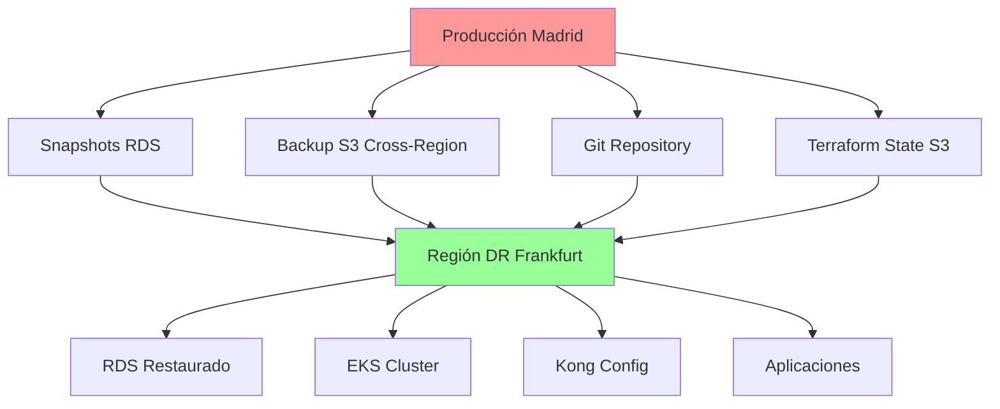

# 4.6 Procedimientos de Recuperación ante Desastres

Esta guía establece los procedimientos completos de recuperación ante desastres (DR) para la plataforma RetroGameCloud, incluyendo objetivos de tiempo y punto de recuperación, procedimientos detallados, escenarios específicos y validaciones.

## 4.6.1 Objetivos de Recuperación

### Definiciones Clave

<Card title="RPO - Recovery Point Objective" icon="clock">
  **1 hora** - Pérdida máxima de datos aceptable
</Card>

<Card title="RTO - Recovery Time Objective" icon="stopwatch">
  **4 horas** - Tiempo máximo para restaurar servicios
</Card>

### Matriz de Criticidad Extendida

| Componente | RPO | RTO | Prioridad | Objetivo Específico |
|------------|-----|-----|-----------|-------------------|
| Base de Datos (PostgreSQL) | 15 min | 20 min | Crítica | 99.9% disponibilidad |
| Aplicaciones Core (EKS) | 30 min | 1 hora | Crítica | Servicios esenciales |
| API Gateway (Kong) | 30 min | 30 min | Crítica | Acceso a servicios |
| Aplicaciones Secundarias | 1 hora | 2 horas | Alta | Funciones no críticas |
| CDN/Frontend | 2 horas | 45 min | Alta | Experiencia usuario |
| Redis Cache | 4 horas | 15 min | Media | Rendimiento |
| Logs y Métricas | 4 horas | 1 hora | Media | Observabilidad |
| Documentación | 24 horas | 2 horas | Baja | Soporte operacional |

### Niveles de Servicio por Escenario

<Tabs>
<Tab title="Nivel 1 - Degradado">

- **Tiempo objetivo:** 15 minutos

- **Funcionalidad:** Solo servicios críticos

- **Capacidad:** 25% del tráfico normal
</Tab>

<Tab title="Nivel 2 - Parcial">

- **Tiempo objetivo:** 1 hora

- **Funcionalidad:** Servicios principales

- **Capacidad:** 60% del tráfico normal
</Tab>

<Tab title="Nivel 3 - Completo">

- **Tiempo objetivo:** 4 horas

- **Funcionalidad:** Todos los servicios

- **Capacidad:** 100% del tráfico normal
</Tab>
</Tabs>

## 4.6.2 Arquitectura de Backup



### Componentes de Backup

<Card title="Backup de Base de Datos" icon="database">

- **Snapshots automáticos RDS:** Cada 6 horas

- **Backup continuo:** Point-in-time recovery

- **Replicación cross-region:** Frankfurt (eu-central-1)

- **Retención:** 30 días para snapshots automáticos

- **Validación:** Tests de restauración semanales
</Card>

<Card title="Backup de Aplicaciones" icon="cube">

- **Imágenes Docker:** Replicadas en ECR multi-región

- **Configuraciones Kubernetes:** Backup via Velero

- **Secrets y ConfigMaps:** Encriptados en S3

- **Helm Charts:** Versionado en repositorio Git
</Card>

<Card title="Backup de Configuración" icon="cog">

- **Kong Configuration:** Export automático diario

- **Terraform State:** Replicación cross-region S3

- **Variables de entorno:** Backup encriptado semanal

- **Certificados SSL:** Backup automático en Vault
</Card>

## 4.6.3 Procedimientos de Test Trimestral

### Calendario de Simulacros DR

<Card title="Programa de Tests 2024" icon="calendar">

* *Q1 2024 - Marzo:**

- Tipo: Test parcial de base de datos

- Duración: 2 horas

- Horario: Sábado 9:00-11:00 GMT

* *Q2 2024 - Junio:**

- Tipo: Simulacro completo

- Duración: 4 horas

- Horario: Domingo 6:00-10:00 GMT

* *Q3 2024 - Septiembre:**

- Tipo: Test de aplicaciones

- Duración: 3 horas

- Horario: Sábado 8:00-11:00 GMT

* *Q4 2024 - Diciembre:**

- Tipo: Simulacro integral

- Duración: 6 horas

- Horario: Domingo 5:00-11:00 GMT
</Card>

### Procedimientos de Test por Trimestre

<Tabs>
<Tab title="Test Trimestre 1">

* *Objetivo:** Validar backup y restauración de base de datos

* *Pasos:**
1. Crear snapshot manual de RDS
2. Restaurar en región DR (Frankfurt)
3. Validar integridad de datos
4. Medir tiempo de restauración
5. Documentar métricas obtenidas

* *Criterios de Éxito:**

- Restauración completada < 20 minutos

- 0% pérdida de datos críticos

- Todas las tablas íntegras
</Tab>

<Tab title="Test Trimestre 2">

* *Objetivo:** Simulacro completo de DR

* *Pasos:**
1. Declarar escenario de desastre
2. Activar team de respuesta DR
3. Ejecutar failover completo
4. Restaurar todos los servicios
5. Validar funcionamiento end-to-end
6. Realizar rollback controlado

* *Criterios de Éxito:**

- RTO < 4 horas cumplido

- RPO < 1 hora cumplido

- Todos los servicios operativos
</Tab>

<Tab title="Test Trimestre 3">

* *Objetivo:** Validar recuperación de aplicaciones

* *Pasos:**
1. Simular fallo del cluster EKS
2. Restaurar desde backups Velero
3. Redeployar aplicaciones críticas
4. Validar configuraciones Kong
5. Verificar conectividad de servicios

* *Criterios de Éxito:**

- Aplicaciones críticas < 1 hora

- Configuración Kong < 30 minutos

- Tráfico fluye correctamente
</Tab>

<Tab title="Test Trimestre 4">

* *Objetivo:** Simulacro integral con todos los componentes

* *Pasos:**
1. Simular desastre regional completo
2. Activar procedimientos de emergencia
3. Coordinar equipos de respuesta
4. Ejecutar recuperación por fases
5. Validar cada nivel de servicio
6. Documentar lecciones aprendidas

* *Criterios de Éxito:**

- Cumplimiento de todos los RTO/RPO

- Coordinación efectiva de equipos

- Comunicación clara con stakeholders
</Tab>
</Tabs>

### Métricas de Seguimiento

```yaml
metricas_dr:
  tiempo_deteccion:
    objetivo: "< 5 minutos"
    medicion: "Tiempo desde incidente hasta alerta"

  tiempo_activacion:
    objetivo: "< 15 minutos"
    medicion: "Desde alerta hasta inicio de DR"

  tiempo_restauracion_db:
    objetivo: "< 20 minutos"
    medicion: "RDS snapshot restore completo"

  tiempo_restauracion_apps:
    objetivo: "< 60 minutos"
    medicion: "Aplicaciones críticas funcionando"

  perdida_datos:
    objetivo: "< 1 hora"
    medicion: "Última transacción perdida"

  disponibilidad_post_dr:
    objetivo: "> 99.9%"
    medicion: "Uptime 72h post-recuperación"

```

## 4.6.4 Checklist de Validación Post-Recuperación

### Validación Técnica

<Card title="Base de Datos" icon="database">

* *Verificaciones Obligatorias:**

- [ ] Conexión a RDS establecida correctamente

- [ ] Integridad referencial de todas las tablas

- [ ] Usuarios y permisos configurados

- [ ] Backups automáticos reconfigurados

- [ ] Réplicas de lectura funcionando

- [ ] Métricas de performance normalizadas

- [ ] Logs de transacciones sin errores

- [ ] Tests de escritura/lectura exitosos

* *Queries de Validación:**

```sql

- - Verificar integridad de datos críticos
SELECT COUNT(*) FROM users WHERE created_at > NOW() - INTERVAL '2 hours';
SELECT COUNT(*) FROM game_sessions WHERE status = 'active';
SELECT COUNT(*) FROM payment_transactions WHERE processed_at IS NULL;

- - Validar constraints y foreign keys
SELECT constraint_name, table_name
FROM information_schema.table_constraints
WHERE constraint_type = 'FOREIGN KEY'
AND constraint_schema = 'public';

```

</Card>

<Card title="Aplicaciones Kubernetes" icon="cube">

* *Verificaciones de Deployments:**

- [ ] Todos los pods en estado Ready

- [ ] Services expuestos correctamente

- [ ] Ingress controllers funcionando

- [ ] Persistent Volumes montados

- [ ] ConfigMaps y Secrets cargados

- [ ] Health checks respondiendo

- [ ] Resource limits aplicados

- [ ] Network policies activas

* *Comandos de Validación:**

```bash

# Verificar estado del cluster
kubectl get nodes -o wide
kubectl get pods --all-namespaces | grep -v Running

# Validar deployments críticos
kubectl rollout status deployment/game-api -n production
kubectl rollout status deployment/user-service -n production
kubectl rollout status deployment/payment-service -n production

# Verificar conectividad entre servicios
kubectl exec -it deployment/game-api -n production -- \
  curl http://user-service:8080/health

```

</Card>

<Card title="API Gateway Kong" icon="network-wired">

* *Verificaciones de Kong:**

- [ ] Admin API accesible

- [ ] Servicios registrados correctamente

- [ ] Rutas configuradas y activas

- [ ] Plugins funcionando (auth, rate-limit, etc.)

- [ ] Upstream services saludables

- [ ] SSL/TLS certificates válidos

- [ ] Rate limiting operativo

- [ ] Logs de proxy sin errores críticos

* *Tests de Conectividad:**

```bash

# Verificar servicios Kong
curl -i http://kong-admin:8001/services

# Validar rutas principales
curl -i https://api.retrogamecloud.com/v1/health
curl -i https://api.retrogamecloud.com/v1/games
curl -i https://api.retrogamecloud.com/v1/users/profile

# Verificar plugins activos
curl -s http://kong-admin:8001/plugins | jq '.data[].name'

```

</Card>

### Validación Funcional

<Card title="Tests End-to-End" icon="vial">

* *Escenarios Críticos de Usuario:**

- [ ] Registro de nuevo usuario

- [ ] Login con credenciales existentes

- [ ] Carga de lista de juegos

- [ ] Inicio de sesión de juego

- [ ] Guardado de progreso

- [ ] Procesamiento de pago

- [ ] Descarga de archivo de juego

- [ ] Sincronización entre dispositivos

* *Scripts de Validación:**

```javascript
// Test crítico de flujo de usuario
describe('DR Validation - Critical User Flow', () => {
  test('User can register, login and play game', async () => {
    // Registro
    const user = await registerUser({
      email: 'dr-test@example.com',
      password: 'TestPass123!'
    });
    expect(user.id).toBeDefined();

    // Login
    const session = await loginUser(user.email, user.password);
    expect(session.token).toBeDefined();

    // Cargar juegos
    const games = await fetchGames(session.token);
    expect(games.length).toBeGreaterThan(0);

    // Iniciar juego
    const gameSession = await startGame(games[0].id, session.token);
    expect(gameSession.status).toBe('active');

    // Guardar progreso
    const saveResult = await saveProgress(gameSession.id, {
      level: 1,
      score: 100
    });
    expect(saveResult.success).toBe(true);
  });
});

```

</Card>

<Card title="Tests de Performance" icon="tachometer-alt">

* *Métricas de Performance:**

- [ ] Tiempo de respuesta API < 200ms

- [ ] Throughput > 1000 req/min

- [ ] Error rate < 0.1%

- [ ] CPU utilization < 70%

- [ ] Memory utilization < 80%

- [ ] Database connections < 80% pool

- [ ] Redis hit ratio > 95%

- [ ] CDN cache hit > 90%

* *Monitoring Dashboard:**

```yaml
performance_alerts:
  response_time:
    threshold: 200ms
    duration: 5m
    action: "Investigar performance"

  error_rate:
    threshold: 0.1%
    duration: 2m
    action: "Alertar equipo técnico"

  throughput:
    threshold: 1000rpm
    duration: 10m
    action: "Validar capacidad"

```

</Card>

### Validación de Seguridad

<Card title="Security Checklist" icon="shield-alt">

* *Verificaciones de Seguridad:**

- [ ] Certificados SSL válidos y renovados

- [ ] Secrets de Kubernetes actualizados

- [ ] API keys funcionando correctamente

- [ ] Políticas de red aplicadas

- [ ] Firewall rules configuradas

- [ ] VPN connections establecidas

- [ ] IAM roles y policies correctas

- [ ] Encryption at rest habilitado

- [ ] Logs de seguridad sin anomalías

- [ ] Vulnerability scanning completado

* *Tests de Penetración Básicos:**

```bash

# Verificar SSL/TLS
nmap --script ssl-enum-ciphers -p 443 api.retrogamecloud.com

# Validar headers de seguridad
curl -I https://api.retrogamecloud.com | grep -i security

# Test de autenticación
curl -X POST https://api.retrogamecloud.com/v1/login \
  -H "Content-Type: application/json" \
  -d '{"email":"invalid","password":"test"}'

```

</Card>

### Checklist de Comunicación

<Card title="Stakeholder Communication" icon="bullhorn">

* *Comunicaciones Obligatorias:**

- [ ] Notificar inicio de procedimiento DR

- [ ] Actualizar status page con progreso

- [ ] Informar a equipos técnicos del estado

- [ ] Comunicar a
</Card>