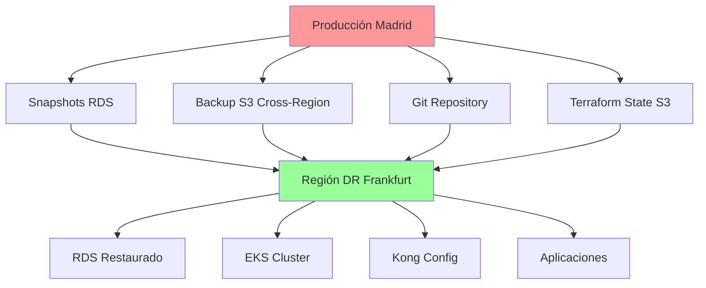

# Procedimientos de Recuperación ante Desastres

Esta guía establece los procedimientos completos de recuperación ante desastres (DR) para la plataforma RetroGameCloud, incluyendo objetivos de tiempo y punto de recuperación, procedimientos detallados, escenarios específicos y validaciones.

## Objetivos de Recuperación

### Definiciones Clave

<Card title="RPO - Recovery Point Objective" icon="clock">
  **1 hora** - Pérdida máxima de datos aceptable
</Card>

<Card title="RTO - Recovery Time Objective" icon="stopwatch">
  **4 horas** - Tiempo máximo para restaurar servicios
</Card>

### Matriz de Criticidad

| Componente | RPO | RTO | Prioridad |
|------------|-----|-----|-----------|
| Base de Datos (PostgreSQL) | 1 hora | 30 min | Crítica |
| Aplicaciones (EKS) | 1 hora | 2 horas | Alta |
| Configuración Kong | 1 hora | 1 hora | Alta |
| CDN/Frontend | 4 horas | 1 hora | Media |
| Redis Cache | 4 horas | 30 min | Media |

## Arquitectura de Backup



## Escenarios de Desastre

### Escenario 1: Pérdida Total de Región AWS

<Card title="Pérdida Región AWS Madrid (eu-west-1)" icon="cloud-exclamation">

**Síntomas:**
- Todos los servicios AWS en eu-west-1 inaccesibles
- Timeout en conexiones a RDS, EKS, y S3
- Dashboard AWS muestra región indisponible

**Impacto:** Sistema completamente inoperativo

**Procedimiento de Recuperación:**

<Tabs>
  <Tab title="1. Activación DR">
    ```bash
    # Activar región de disaster recovery
    export DR_REGION="eu-central-1"
    export PRIMARY_REGION="eu-west-1"

    # Verificar conectividad a región DR
    aws ec2 describe-regions --region $DR_REGION

    # Activar infraestructura DR con Terraform
    cd terraform/disaster-recovery
    terraform workspace select dr-frankfurt
    terraform apply -auto-approve
    ```
  </Tab>

  <Tab title="2. Restaurar Base de Datos">
    ```bash
    # Encontrar último snapshot cross-region
    LATEST_SNAPSHOT=$(aws rds describe-db-snapshots \
      --region $DR_REGION \
      --db-instance-identifier retrogame-prod \
      --query 'DBSnapshots[0].DBSnapshotIdentifier' \
      --output text)

    # Restaurar RDS desde snapshot
    aws rds restore-db-instance-from-db-snapshot \
      --db-instance-identifier retrogame-dr \
      --db-snapshot-identifier $LATEST_SNAPSHOT \
      --region $DR_REGION
    ```
  </Tab>

  <Tab title="3. Desplegar Aplicaciones">
    ```bash
    # Configurar kubectl para cluster DR
    aws eks update-kubeconfig \
      --region $DR_REGION \
      --name retrogame-dr

    # Desplegar aplicaciones desde GitOps
    kubectl apply -f k8s/production/
    
    # Verificar pods en ejecución
    kubectl get pods -A
    ```
  </Tab>
</Tabs>

**RTO Esperado:** 3-4 horas
**RPO Esperado:** 1 hora máximo

</Card>

### Escenario 2: Corrupción de Base de Datos

<Card title="Corrupción BBDD PostgreSQL" icon="database">

**Síntomas:**
- Errores de conexión a base de datos
- Consultas SQL fallan con errores de corrupción
- Logs muestran errores de integridad de datos

**Impacto:** Pérdida de funcionalidad dependiente de BBDD

**Procedimiento de Recuperación:**

<Tabs>
  <Tab title="1. Diagnóstico">
    ```bash
    # Verificar estado de RDS
    aws rds describe-db-instances \
      --db-instance-identifier retrogame-prod

    # Revisar logs de PostgreSQL
    aws logs get-log-events \
      --log-group-name /aws/rds/instance/retrogame-prod/postgresql

    # Test de conectividad básica
    psql -h $DB_ENDPOINT -U retrogame_user -d retrogame_db -c "\l"
    ```
  </Tab>

  <Tab title="2. Point-in-Time Recovery">
    ```bash
    # Identificar timestamp antes de la corrupción
    RECOVERY_TIME="2024-01-15T10:30:00Z"

    # Crear nueva instancia desde point-in-time
    aws rds restore-db-instance-to-point-in-time \
      --source-db-instance-identifier retrogame-prod \
      --target-db-instance-identifier retrogame-recovery \
      --restore-time $RECOVERY_TIME
    ```
  </Tab>

  <Tab title="3. Validación y Switchover">
    ```bash
    # Validar integridad de datos restaurados
    psql -h $RECOVERY_ENDPOINT -c "SELECT COUNT(*) FROM users;"
    psql -h $RECOVERY_ENDPOINT -c "SELECT COUNT(*) FROM games;"

    # Actualizar configuración de aplicaciones
    kubectl patch configmap db-config \
      --patch '{"data":{"DB_HOST":"'$RECOVERY_ENDPOINT'"}}'

    # Reiniciar pods para aplicar cambios
    kubectl rollout restart deployment/retrogame-api
    ```
  </Tab>
</Tabs>

**RTO Esperado:** 30-60 minutos
**RPO Esperado:** Variable según timestamp de recovery

</Card>

### Escenario 3: Compromiso de Seguridad

<Card title="Compromiso de Seguridad / Breach" icon="shield-exclamation">

**Síntomas:**
- Actividad sospechosa en logs
- Acceso no autorizado detectado
- Alertas de seguridad en AWS GuardDuty

**Impacto:** Sistema comprometido, datos en riesgo

**Procedimiento de Recuperación:**

<Tabs>
  <Tab title="1. Contención Inmediata">
    ```bash
    # Aislar cluster EKS
    aws eks update-cluster-config \
      --name retrogame-prod \
      --resources-vpc-config endpointConfigPrivateAccess=true,endpointConfigPublicAccess=false

    # Rotar todas las credenciales
    aws iam create-access-key --user-name retrogame-service
    aws secretsmanager rotate-secret --secret-id retrogame/db-credentials

    # Revisar y revocar sesiones activas
    aws sts get-caller-identity
    ```
  </Tab>

  <Tab title="2. Análisis Forense">
    ```bash
    # Exportar logs para análisis
    aws logs create-export-task \
      --log-group-name /aws/eks/retrogame-prod/cluster \
      --from-time $(date -d '24 hours ago' +%s)000 \
      --to $(date +%s)000 \
      --destination retrogame-security-logs

    # Snapshot de instancias para preservar evidencia
    aws ec2 create-snapshot \
      --volume-id vol-xxxxx \
      --description "Security incident forensic snapshot"
    ```
  </Tab>

  <Tab title="3. Reconstrucción Limpia">
    ```bash
    # Desplegar infraestructura limpia en región DR
    cd terraform/disaster-recovery
    terraform apply -var="security_incident=true"

    # Restaurar datos desde backup verificado limpio
    CLEAN_SNAPSHOT="retrogame-clean-backup-$(date -d '48 hours ago' +%Y%m%d)"
    aws rds restore-db-instance-from-db-snapshot \
      --db-snapshot-identifier $CLEAN_SNAPSHOT
    ```
  </Tab>
</Tabs>

**RTO Esperado:** 4-6 horas
**RPO Esperado:** Hasta 48 horas (último backup verificado limpio)

</Card>

### Escenario 4: Fallo del Cluster EKS

<Card title="Fallo Cluster EKS" icon="layer-group">

**Síntomas:**
- Nodes del cluster no responden
- API Server de Kubernetes inaccesible
- Pods en estado "Unknown" o "NotReady"

**Impacto:** Aplicaciones no disponibles

**Procedimiento de Recuperación:**

<Tabs>
  <Tab title="1. Diagnóstico del Cluster">
    ```bash
    # Verificar estado del cluster
    aws eks describe-cluster --name retrogame-prod

    # Revisar nodes
    kubectl get nodes -o wide

    # Verificar eventos del cluster
    kubectl get events --sort-by='.lastTimestamp' -A
    ```
  </Tab>

  <Tab title="2. Recuperación de Nodes">
    ```bash
    # Reiniciar node groups
    aws eks update-nodegroup-config \
      --cluster-name retrogame-prod \
      --nodegroup-name retrogame-workers \
      --scaling-config minSize=0,maxSize=10,desiredSize=0

    # Escalar de nuevo
    aws eks update-nodegroup-config \
      --cluster-name retrogame-prod \
      --nodegroup-name retrogame-workers \
      --scaling-config minSize=2,maxSize=10,desiredSize=3
    ```
  </Tab>

  <Tab title="3. Redeployment de Aplicaciones">
    ```bash
    # Forzar recreación de deployments
    kubectl delete deployment --all -n default
    kubectl apply -f k8s/production/

    # Verificar estado de pods
    kubectl get pods -A
    kubectl describe pods -l app=retrogame-api
    ```
  </Tab>
</Tabs>

**RTO Esperado:** 1-2 horas
**RPO Esperado:** Mínimo (datos en RDS intactos)

</Card>

### Escenario 5: Pérdida de Datos Redis

<Card title="Pérdida Cache Redis / ElastiCache" icon="memory">

**Síntomas:**
- Conexiones Redis fallan
- Performance degradado por falta de cache
- Logs muestran errores de conexión a Redis

**Impacto:** Degradación de performance, algunas funcionalidades limitadas

**Procedimiento de Recuperación:**

<Tabs>
  <Tab title="1. Evaluación de Redis">
    ```bash
    # Verificar estado del cluster Redis
    aws elasticache describe-cache-clusters \
      --cache-cluster-id retrogame-redis

    # Test conectividad
    redis-cli -h $REDIS_ENDPOINT ping

    # Verificar snapshots disponibles
    aws elasticache describe-snapshots \
      --cache-cluster-id retrogame-redis
    ```
  </Tab>

  <Tab title="2. Restauración desde Snapshot">
    ```bash
    # Crear nuevo cluster desde snapshot
    LATEST_SNAPSHOT=$(aws elasticache describe-snapshots \
      --query 'Snapshots[0].SnapshotName' --output text)

    aws elasticache create-cache-cluster \
      --cache-cluster-id retrogame-redis-recovery \
      --snapshot-name $LATEST_SNAPSHOT \
      --cache-node-type cache.r6g.large
    ```
  </Tab>

  <Tab title="3. Failover y Warming">
    ```bash
    # Actualizar configuración de aplicaciones
    kubectl patch configmap redis-config \
      --patch '{"data":{"REDIS_HOST":"'$NEW_REDIS_ENDPOINT'"}}'

    # Reiniciar aplicaciones
    kubectl rollout restart deployment/retrogame-api

    # Script de warming de cache
    kubectl apply -f k8s/jobs/cache-warming-job.yaml
    ```
  </Tab>
</Tabs>

**RTO Esperado:** 30 minutos
**RPO Esperado:** Última backup automática (máximo 24h)

</Card>

## Procedimiento General de Disaster Recovery

### Fase 1: Evaluación y Activación

<Tabs>
  <Tab title="Evaluación Inicial">
    ```bash
    # Verificar estado de la región primaria
    aws ec2 describe-regions --region eu-west-1
    aws rds describe-db-instances --region eu-west-1
    aws eks describe-cluster --name retrogame-prod --region eu-west-1

    # Comprobar último snapshot disponible
    aws rds describe-db-snapshots \
      --db-instance-identifier retrogame-prod \
      --snapshot-type automated \
      --query 'DBSnapshots[0]'
    ```
  </Tab>

  <Tab title="Decisión de Activación">
    ```bash
    # Checklist de activación DR
    echo "1. ¿Región primaria completamente inaccesible? [y/n]"
    echo "2. ¿RTO/RPO en riesgo de no cumplirse? [y/n]"
    echo "3. ¿Equipo DR notificado y disponible? [y/n]"
    echo "4. ¿Stakeholders informados? [y/n]"

    # Si todas las respuestas son 'y', proceder con DR
    ```
  </Tab>

  <Tab title="Comunicación">
    ```bash
    # Notificar inicio de procedimiento DR
    curl -X POST $SLACK_WEBHOOK \
      -d '{"text":"🚨 DISASTER RECOVERY ACTIVATED - Incident #DR-001"}'

    # Actualizar página de status
    curl -X POST "https://api.statuspage.io/v1/pages/xxx/incidents" \
      -H "Authorization: OAuth xxx" \
      -d '{"incident": {"name": "Service Disruption - DR in Progress"}}'
    ```
  </Tab>
</Tabs>

### Fase 2: Recuperación de Infraestructura

<Tabs>
  <Tab title="Terraform DR">
    ```bash
    # Cambiar a workspace de DR
    cd infrastructure/terraform
    terraform workspace select disaster-recovery

    # Aplicar configuración DR
    terraform apply \
      -var="enable_dr=true" \
      -var="snapshot_id=$LATEST_SNAPSHOT_ID" \
      -auto-approve

    # Verificar recursos creados
    terraform output
    ```
  </Tab>

  <Tab title="Base de Datos">
    ```bash
    # Esperar a que RDS esté disponible
    aws rds wait db-instance-available \
      --db-instance-identifier retrogame-dr

    # Actualizar security groups
    aws ec2 authorize-security-group-ingress \
      --group-id $DR_SG_ID \
      --protocol tcp \
      --port 5
</Tab>
</Tabs>
```