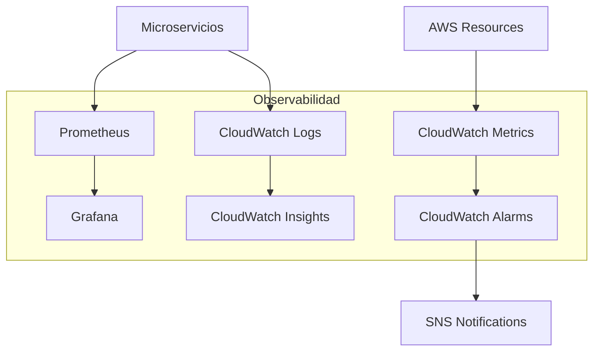
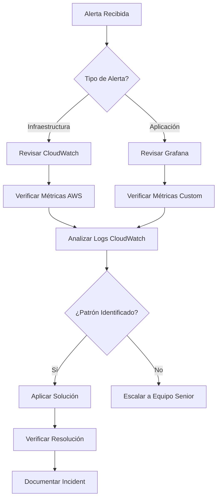

# Monitorización y Observabilidad

Esta documentación detalla el stack completo de observabilidad de RetroGameCloud, incluyendo métricas clave, configuración de alertas, dashboards y acceso centralizado a logs.

## Arquitectura de Observabilidad

<Note>
Nuestro stack de observabilidad combina herramientas de AWS con soluciones open-source para proporcionar visibilidad completa de la plataforma.
</Note>



## Stack de Tecnologías

<Tabs>
  <Tab title="Métricas">
    - **Prometheus**: Recolección de métricas de aplicación
    - **Grafana**: Visualización y dashboards
    - **CloudWatch Metrics**: Métricas de infraestructura AWS
  </Tab>
  <Tab title="Logs">
    - **CloudWatch Logs**: Agregación centralizada
    - **Fluent Bit**: Envío de logs desde pods
    - **CloudWatch Insights**: Consultas y análisis
  </Tab>
  <Tab title="Alertas">
    - **CloudWatch Alarms**: Alertas de infraestructura
    - **Grafana Alerts**: Alertas de aplicación
    - **SNS**: Notificaciones por email/Slack
  </Tab>
</Tabs>

## Métricas por Servicio

### Servicio de Autenticación

<Card title="auth-service" icon="shield">

* *Métricas de Negocio:**

- `auth_login_requests_total`: Total de intentos de login

- `auth_login_success_rate`: Tasa de éxito de logins

- `auth_token_generation_duration`: Tiempo de generación de tokens

- `auth_failed_attempts_total`: Intentos fallidos por usuario

* *Umbrales Críticos:**

- Tasa de éxito < 95%

- Latencia p95 > 500ms

- Intentos fallidos > 10/min por IP

</Card>

```yaml

# Ejemplo de configuración Prometheus

- name: auth_service_rules
  rules:
  - alert: AuthHighFailureRate
    expr: (auth_login_requests_total{status="error"} / auth_login_requests_total) > 0.05
    for: 5m
    labels:
      severity: critical
    annotations:
      summary: "Alta tasa de fallos en autenticación"

```

### Servicio de Usuario

<Card title="user-service" icon="user">

* *Métricas de Negocio:**

- `user_registrations_total`: Nuevos registros

- `user_profile_updates_total`: Actualizaciones de perfil

- `user_active_sessions`: Sesiones activas

- `user_api_request_duration`: Latencia de API

* *Umbrales Críticos:**

- Latencia p95 > 300ms

- Tasa de error > 3%

- Memoria > 80%

</Card>

### Catálogo de Juegos

<Card title="game-catalog-service" icon="gamepad">

* *Métricas de Negocio:**

- `games_search_requests_total`: Búsquedas realizadas

- `games_download_requests_total`: Descargas de ROMs

- `games_most_played`: Juegos más jugados

- `games_catalog_sync_duration`: Tiempo de sincronización

* *Umbrales Críticos:**

- Tiempo de búsqueda > 1s

- Fallos de descarga > 2%

- Sincronización > 5min

</Card>

### Sistema de Puntuaciones

<Card title="score-service" icon="trophy">

* *Métricas de Negocio:**

- `scores_submissions_total`: Puntuaciones enviadas

- `scores_validation_duration`: Tiempo de validación

- `scores_leaderboard_requests`: Consultas de ranking

- `scores_personal_best_updates`: Nuevos records personales

* *Umbrales Críticos:**

- Validación > 200ms

- Tasa de rechazo > 1%

- Queue depth > 1000

</Card>

### Sistema de Rankings

<Card title="ranking-service" icon="ranking-star">

* *Métricas de Negocio:**

- `rankings_calculations_total`: Cálculos de ranking

- `rankings_global_updates`: Actualizaciones globales

- `rankings_cache_hit_ratio`: Ratio de cache hits

- `rankings_query_duration`: Tiempo de consulta

* *Umbrales Críticos:**

- Cache hit ratio < 90%

- Cálculo > 30s

- Queries > 500ms

</Card>

## Métricas de Infraestructura

### Clúster EKS

<Warning>
Estas métricas son críticas para la estabilidad de la plataforma y requieren monitorización 24/7.
</Warning>

```yaml

# Métricas clave del clúster
cluster_metrics:
  nodes:
    - node_cpu_utilization (umbral: 80%)
    - node_memory_utilization (umbral: 85%)
    - node_disk_utilization (umbral: 90%)
    - node_ready_status

  pods:
    - pod_cpu_usage
    - pod_memory_usage
    - pod_restart_count (umbral: 5 restarts/hour)
    - pod_ready_status

  network:
    - ingress_requests_per_second
    - ingress_response_time_p95 (umbral: 2s)
    - network_errors_total

```

### Base de Datos (RDS PostgreSQL)

```yaml
database_metrics:
  performance:
    - db_connections_active (umbral: 80% del máximo)
    - db_cpu_utilization (umbral: 70%)
    - db_free_memory (mínimo: 20%)
    - db_query_duration_p95 (umbral: 1s)

  storage:
    - db_free_storage_space (mínimo: 20%)
    - db_iops_utilization (umbral: 80%)

  availability:
    - db_connection_failures
    - db_deadlocks_total

```

### Kong API Gateway

```yaml
gateway_metrics:
  traffic:
    - kong_requests_per_second
    - kong_response_time_p95 (umbral: 1s)
    - kong_error_rate (umbral: 2%)

  security:
    - kong_oauth_token_validations
    - kong_rate_limit_exceeded
    - kong_blocked_requests

```

## Dashboards de Grafana

### Dashboard Principal

<Tabs>
  <Tab title="Vista General">
    - Health check global de servicios
    - Tráfico total de la plataforma
    - Usuarios activos en tiempo real
    - Tasa de error agregada
    - Latencia p95 por servicio
  </Tab>
  <Tab title="Microservicios">
    - CPU/Memoria por servicio
    - Request rate y latencia
    - Métricas específicas de negocio
    - Health checks individuales
  </Tab>
  <Tab title="Infraestructura">
    - Estado del clúster EKS
    - Métricas de base de datos
    - Utilización de recursos AWS
    - Costes por servicio
  </Tab>
  <Tab title="Negocio">
    - Usuarios registrados/activos
    - Juegos más populares
    - Distribución de puntuaciones
    - Tendencias de uso
  </Tab>
</Tabs>

### Configuración de Dashboards

```json
{
  "dashboard": {
    "title": "RetroGameCloud - Overview",
    "panels": [
      {
        "title": "Request Rate",
        "type": "graph",
        "targets": [
          {
            "expr": "sum(rate(http_requests_total[5m])) by (service)",
            "legendFormat": "{{service}}"
          }
        ]
      },
      {
        "title": "Error Rate",
        "type": "singlestat",
        "targets": [
          {
            "expr": "sum(rate(http_requests_total{status=~\"5.*\"}[5m])) / sum(rate(http_requests_total[5m]))"
          }
        ],
        "thresholds": "0.01,0.05"
      }
    ]
  }
}

```

## Configuración de Alertas Críticas

### CloudWatch Alarms

<Card title="Alertas de RDS" icon="database">

```yaml
RDS_Alarms:
  - name: "RDS-HighConnections"
    metric: "DatabaseConnections"
    threshold: 80
    comparison: "GreaterThanThreshold"
    evaluation_periods: 2
    period: 300

  - name: "RDS-HighCPU"
    metric: "CPUUtilization"
    threshold: 70
    comparison: "GreaterThanThreshold"
    evaluation_periods: 3
    period: 300

```

</Card>

<Card title="Alertas de EKS" icon="dharmachakra">

```yaml
EKS_Alarms:
  - name: "EKS-NodeNotReady"
    metric: "cluster_failed_node_count"
    threshold: 1
    comparison: "GreaterThanOrEqualToThreshold"
    evaluation_periods: 1
    period: 60

  - name: "EKS-PodRestartHigh"
    metric: "kube_pod_container_status_restarts_total"
    threshold: 5
    comparison: "GreaterThanThreshold"
    evaluation_periods: 1
    period: 300

```

</Card>

### Alertas de Aplicación (Grafana)

```yaml
grafana_alerts:
  - name: "High Error Rate"
    condition: "sum(rate(http_requests_total{status=~\"5.*\"}[5m])) / sum(rate(http_requests_total[5m])) > 0.05"
    for: "5m"
    severity: "critical"

  - name: "Service Down"
    condition: "up{job=~\".*-service\"} == 0"
    for: "30s"
    severity: "critical"

  - name: "High Response Time"
    condition: "histogram_quantile(0.95, rate(http_request_duration_seconds_bucket[5m])) > 2"
    for: "10m"
    severity: "warning"

```

## Acceso a Logs Centralizados

### CloudWatch Logs

<Note>
Todos los logs de los microservicios se envían automáticamente a CloudWatch Logs mediante Fluent Bit.
</Note>

* *Grupos de Logs por Servicio:**

- `/aws/eks/retrogame/auth-service`

- `/aws/eks/retrogame/user-service`

- `/aws/eks/retrogame/game-catalog-service`

- `/aws/eks/retrogame/score-service`

- `/aws/eks/retrogame/ranking-service`

### Acceso mediante kubectl

```bash

# Ver logs en tiempo real de un pod específico
kubectl logs -f deployment/auth-service -n retrogame

# Ver logs de todos los pods de un servicio
kubectl logs -f -l app=auth-service -n retrogame --max-log-requests=10

# Ver logs con contexto temporal
kubectl logs --since=1h deployment/game-catalog-service -n retrogame

# Logs de eventos del clúster
kubectl get events --sort-by=.metadata.creationTimestamp -n retrogame

```

### CloudWatch Insights - Consultas Útiles

<Tabs>
  <Tab title="Errores por Servicio">

```sql
fields @timestamp, @message, service
| filter @message like /ERROR/
| stats count() by service
| sort count desc

```

  </Tab>
  <Tab title="Requests Lentos">

```sql
fields @timestamp, @message, response_time
| filter response_time > 1000
| sort @timestamp desc
| limit 100

```

  </Tab>
  <Tab title="Autenticación Fallida">

```sql
fields @timestamp, @message, user_id, ip_address
| filter @message like /authentication failed/
| stats count() by ip_address
| sort count desc

```

  </Tab>
  <Tab title="Análisis de Patrones">

```sql
fields @timestamp, @message
| filter @message like /game_download/
| parse @message "game_id=* user_id=* duration=*" as game_id, user_id, duration
| stats avg(duration), count() by game_id
| sort count desc

```

  </Tab>
</Tabs>

## Procedimientos de Troubleshooting

### Flujo de Investigación de Incidentes



### Comandos de Diagnóstico Rápido

<Warning>
Estos comandos deben ejecutarse desde una terminal con acceso al clúster EKS y permisos adecuados.
</Warning>

```bash
#!/bin/bash

# Script de diagnóstico rápido

echo "=== Estado General del Clúster ==="
kubectl get nodes
kubectl get pods -n retrogame --show-labels

echo "=== Top Pods por CPU ==="
kubectl top pods -n retrogame --sort-by=cpu

echo "=== Top Pods por Memoria ==="
kubectl top pods -n retrogame --sort-by=memory

echo "=== Eventos Recientes ==="
kubectl get events --sort-by=.metadata.creationTimestamp -n retrogame | tail -10

echo "=== Estado de Servicios ==="
kubectl get svc -n retrogame
kubectl get ingress -n retrogame

echo "=== Verificación de Conectividad BD ==="
kubectl exec -it deployment/auth-service -n retrogame -- pg_isready -h $DB_HOST -p $DB_PORT

```

## Métricas SLA y KPIs

### Indicadores Clave de Rendimiento

<Card title="SLA Objetivos" icon="target">

- **Disponibilidad**: 99.9% uptime

- **Latencia**: p95 < 500ms para APIs críticas

- **Tasa de Error**: < 0.1% para flujos principales

- **Tiempo de Recuperación**: < 5 minutos para incidentes críticos

</Card>

### Dashboard de SLA

```yaml
sla_metrics:
  availability:

```