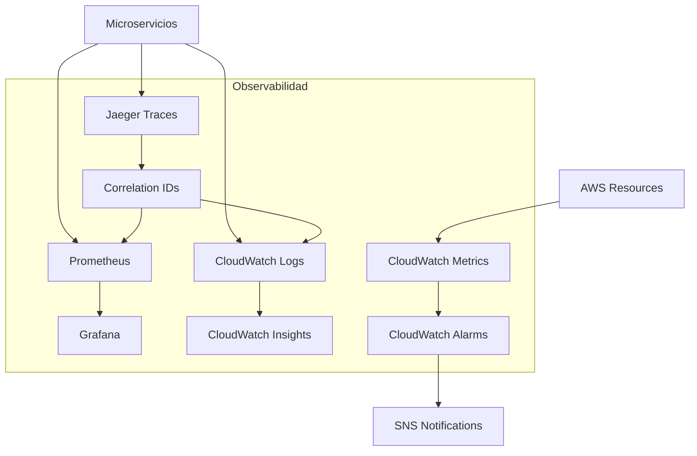

# Monitorización y Observabilidad

Esta documentación detalla el stack completo de observabilidad de RetroGameCloud, incluyendo Golden Signals, umbrales críticos, dashboards recomendados y correlación de logs-métricas-traces para debugging efectivo.

## Arquitectura de Observabilidad

<Note>
Nuestro stack de observabilidad combina herramientas de AWS con soluciones open-source para proporcionar visibilidad completa de la plataforma usando los principios de Golden Signals y distributed tracing.
</Note>



## Stack de Tecnologías

<Tabs>
  <Tab title="Métricas">
    - **Prometheus**: Recolección de métricas de aplicación
    - **Grafana**: Visualización y dashboards
    - **CloudWatch Metrics**: Métricas de infraestructura AWS
    - **Custom Metrics**: Golden Signals por servicio
  </Tab>
  <Tab title="Logs">
    - **CloudWatch Logs**: Agregación centralizada
    - **Fluent Bit**: Envío de logs desde pods
    - **CloudWatch Insights**: Consultas y análisis
    - **Structured Logging**: JSON con correlation IDs
  </Tab>
  <Tab title="Alertas">
    - **CloudWatch Alarms**: Alertas de infraestructura
    - **Grafana Alerts**: Alertas de aplicación
    - **SNS**: Notificaciones por email/Slack
    - **PagerDuty**: Escalación de incidentes críticos
  </Tab>
  <Tab title="Tracing">
    - **Jaeger**: Distributed tracing
    - **OpenTelemetry**: Instrumentación estándar
    - **Correlation IDs**: Trazabilidad cross-service
  </Tab>
</Tabs>

## Golden Signals por Servicio

### Servicio de Autenticación

<Card title="auth-service" icon="shield">

* *Golden Signals:**

* *Latencia:**

- `auth_request_duration_seconds`: Histograma de latencia de requests

- `auth_token_generation_duration_seconds`: Tiempo de generación de tokens

- `auth_db_query_duration_seconds`: Latencia de consultas a base de datos

* *Tráfico:**

- `auth_requests_per_second`: Rate de requests por segundo

- `auth_login_attempts_total`: Total de intentos de login

- `auth_token_validations_total`: Validaciones de token

* *Errores:**

- `auth_error_rate`: Porcentaje de errores (4xx/5xx)

- `auth_failed_logins_total`: Logins fallidos

- `auth_invalid_tokens_total`: Tokens inválidos

* *Saturación:**

- `auth_active_connections`: Conexiones activas

- `auth_cpu_usage_percent`: Uso de CPU

- `auth_memory_usage_percent`: Uso de memoria

* *Umbrales Críticos:**

- Latencia p95 > 500ms

- Error rate > 1%

- CPU usage > 80%

- Failed login rate > 5%

</Card>

### Servicio de Juegos

<Card title="game-service" icon="gamepad">

* *Golden Signals:**

* *Latencia:**

- `game_session_start_duration_seconds`: Tiempo de inicio de sesión

- `game_save_duration_seconds`: Tiempo de guardado

- `game_load_duration_seconds`: Tiempo de carga de ROMs

* *Tráfico:**

- `game_sessions_active`: Sesiones activas concurrentes

- `game_requests_per_second`: Rate de requests

- `game_rom_downloads_total`: Descargas de ROMs

* *Errores:**

- `game_session_failures_total`: Fallos al iniciar sesión

- `game_save_errors_total`: Errores de guardado

- `game_emulation_crashes_total`: Crashes del emulador

* *Saturación:**

- `game_emulator_instances`: Instancias de emulador activas

- `game_storage_usage_percent`: Uso de almacenamiento

- `game_network_bandwidth_usage`: Uso de ancho de banda

* *Umbrales Críticos:**

- Session start time p95 > 3s

- Save failure rate > 0.5%

- Active sessions > 1000

- Emulation crashes > 0.1%

</Card>

### Servicio de Usuarios

<Card title="user-service" icon="users">

* *Golden Signals:**

* *Latencia:**

- `user_profile_query_duration_seconds`: Consultas de perfil

- `user_settings_update_duration_seconds`: Actualizaciones de configuración

* *Tráfico:**

- `user_profile_requests_per_second`: Requests de perfil

- `user_active_sessions`: Sesiones de usuario activas

* *Errores:**

- `user_profile_not_found_total`: Perfiles no encontrados

- `user_update_failures_total`: Fallos de actualización

* *Saturación:**

- `user_db_connections`: Conexiones a DB

- `user_cache_hit_rate`: Tasa de aciertos de caché

* *Umbrales Críticos:**

- Profile query p95 > 200ms

- Update failure rate > 0.5%

- Cache hit rate < 90%

</Card>

## Dashboards Grafana Recomendados

### Dashboard de Overview del Cluster

<Accordion>
  <AccordionItem title="Métricas Incluidas">
    ```yaml
    panels:
      - cluster_cpu_usage_percent
      - cluster_memory_usage_percent
      - cluster_network_io
      - cluster_disk_io
      - kubernetes_pods_running
      - kubernetes_nodes_ready
      - overall_request_rate
      - overall_error_rate
      - overall_latency_p95

    alerts:
      - Cluster CPU > 75%
      - Cluster Memory > 80%
      - Nodes Not Ready > 0
      - Overall Error Rate > 2%
    ```

  </AccordionItem>
</Accordion>

### Dashboard por Servicio

<Accordion>
  <AccordionItem title="Template Variables">
    ```yaml
    variables:
      - service: [auth-service, game-service, user-service]
      - environment: [production, staging, development]
      - time_range: [5m, 15m, 1h, 6h, 24h]

    panels:
      - Request Rate (por servicio)
      - Error Rate (por servicio)
      - Latency Distribution (P50, P95, P99)
      - Active Connections
      - Resource Usage (CPU, Memory)
      - Top Errors (últimas 24h)
    ```

  </AccordionItem>
</Accordion>

### Dashboard de Business Metrics

<Accordion>
  <AccordionItem title="KPIs de Negocio">
    ```yaml
    panels:
      - Daily Active Users (DAU)
      - Game Sessions per Hour
      - User Retention Rate
      - Popular Games Ranking
      - Revenue Metrics
      - Geographic Distribution
      - Device/Browser Stats
      - User Journey Funnel
    ```

  </AccordionItem>
</Accordion>

## Structured Logging con Correlation IDs

### Formato de Log Estándar

```json
{
  "timestamp": "2024-01-15T10:30:00.123Z",
  "level": "INFO",
  "service": "auth-service",
  "correlation_id": "req-abc123-def456",
  "trace_id": "trace-789xyz",
  "span_id": "span-456def",
  "user_id": "user-12345",
  "session_id": "sess-67890",
  "message": "User login successful",
  "context": {
    "endpoint": "/api/v1/auth/login",
    "method": "POST",
    "ip": "192.168.1.100",
    "user_agent": "Mozilla/5.0...",
    "duration_ms": 245
  },
  "metadata": {
    "version": "1.2.3",
    "environment": "production",
    "pod": "auth-service-7d8f9g-h2j3k"
  }
}

```

### Correlation ID Strategy

<Tabs>
  <Tab title="Generación">
    ```javascript
    // Generación de Correlation ID
    const correlationId = `req-${Date.now()}-${Math.random().toString(36).substr(2, 9)}`;

    // Headers HTTP
    const headers = {
      'X-Correlation-ID': correlationId,
      'X-Request-ID': correlationId,
      'X-Trace-ID': traceId
    };
    ```

  </Tab>
  <Tab title="Propagación">
    ```javascript
    // Middleware para propagar correlation IDs
    app.use((req, res, next) => {
      req.correlationId = req.headers['x-correlation-id'] || generateCorrelationId();
      res.setHeader('X-Correlation-ID', req.correlationId);

      // Añadir a contexto de logging
      req.logContext = {
        correlationId: req.correlationId,
        service: 'auth-service',
        endpoint: req.path,
        method: req.method
      };

      next();
    });
    ```

  </Tab>
  <Tab title="Consulta">
    ```bash
    # CloudWatch Insights query
    fields @timestamp, level, message, context
    | filter correlation_id = "req-abc123-def456"
    | sort @timestamp desc
    | limit 100
    ```

  </Tab>
</Tabs>

## Correlación para Debugging

### Flujo de Debugging de Errores

<Steps>
  <Step title="Identificar el Error">
    1. Alerta recibida por Grafana/CloudWatch
    2. Identificar correlation_id del error
    3. Obtener trace_id asociado
  </Step>
  <Step title="Análisis de Logs">
    ```bash
    # Buscar todos los logs relacionados
    aws logs start-query \
      --log-group-name "/aws/eks/retrogame/auth-service" \
      --start-time 1705312200 \
      --end-time 1705315800 \
      --query-string 'fields @timestamp, @message | filter correlation_id = "req-abc123-def456"'
    ```

  </Step>
  <Step title="Análisis de Métricas">
    ```promql
    # Métricas durante el período del error
    increase(auth_error_rate[5m]) # Incremento de errores
    histogram_quantile(0.95, auth_request_duration_seconds) # Latencia
    auth_active_connections # Carga del sistema
    ```

  </Step>
  <Step title="Análisis de Traces">
    - Abrir Jaeger UI
    - Buscar por trace_id
    - Analizar spans y dependencias
    - Identificar el servicio que falló
  </Step>
</Steps>

### Queries de Debugging Comunes

<CodeGroup>
  <CodeBlock title="Error Rate por Endpoint" language="promql">
    ```promql
    # Error rate por endpoint en los últimos 5 minutos
    rate(http_requests_total{status=~"5.."}[5m]) /
    rate(http_requests_total[5m]) * 100
    ```

  </CodeBlock>
  <CodeBlock title="Slow Queries" language="sql">
    ```sql
    -- CloudWatch Insights: Queries lentas
    fields @timestamp, duration_ms, endpoint, correlation_id
    | filter duration_ms > 1000
    | sort @timestamp desc
    | limit 20
    ```

  </CodeBlock>
  <CodeBlock title="Error Correlation" language="sql">
    ```sql
    -- Correlación de errores por usuario
    fields @timestamp, user_id, message, correlation_id
    | filter level = "ERROR"
    | stats count() by user_id
    | sort count() desc
    ```

  </CodeBlock>
</CodeGroup>

## Retention Policies

### Configuración de Retención

<Card title="Políticas de Retención" icon="clock">

* *Logs:**

- Production: 30 días

- Staging: 14 días

- Development: 7 días

- Critical Errors: 90 días (exportados a S3)

* *Métricas:**

- High Resolution (1s): 3 horas

- Standard (1m): 90 días

- Aggregated (1h): 1 año

- Business KPIs: 3 años

* *Traces:**

- Production: 7 días

- Staging: 3 días

- Sample Rate: 10% (100% para errores)

* *Configuración CloudWatch:**

```bash

# Configurar retención de logs
aws logs put-retention-policy \
  --log-group-name "/aws/eks/retrogame/auth-service" \
  --retention-in-days 30

# Configurar exportación a S3 para archivado
aws logs create-export-task \
  --log-group-name "/aws/eks/retrogame/auth-service" \
  --from 1704067200 \
  --to 1704153600 \
  --destination "retrogame-logs-archive"

```

</Card>

## Alerting Strategy

### Niveles de Severidad

<Tabs>
  <Tab title="Critical (P0)">
    - Service Down (> 50% error rate)
    - Database Unavailable
    - Authentication System Down
    - Payment Processing Failed

    **Escalación:** Inmediata PagerDuty
  </Tab>
  <Tab title="High (P1)">
    - High Error Rate (> 5%)
    - High Latency (p95 > 2s)
    - Resource Exhaustion (> 90%)

    **Escalación:** Slack + Email
  </Tab>
  <Tab title="Medium (P2)">
    - Moderate Error Rate (> 1%)
    - Elevated Latency (p95 > 1s)
    - Resource Warning (> 80%)

    **Escalación:** Slack
  </Tab>
  <Tab title="Low (P3)">
    - Performance Degradation
    - Capacity Planning Warnings
    - Non-Critical Failures

    **Escalación:** Email daily digest
  </Tab>
</Tabs>

### Configuración de Alertas

```yaml

# Grafana Alert Rules
groups:
  - name: auth-service-alerts
    rules:
      - alert: AuthServiceHighErrorRate
        expr: rate(http_requests_total{service="auth-service",status=~"5.."}[5m]) > 0.01
        for: 2m
        labels:
          severity: critical
          service: auth-service
        annotations:
          summary: "High error rate in auth service"
          description: "Error rate is {{ $value }}% for the last 5 minutes"
          correlation_query: 'fields @timestamp, @message | filter service = "auth-service" and level = "

```