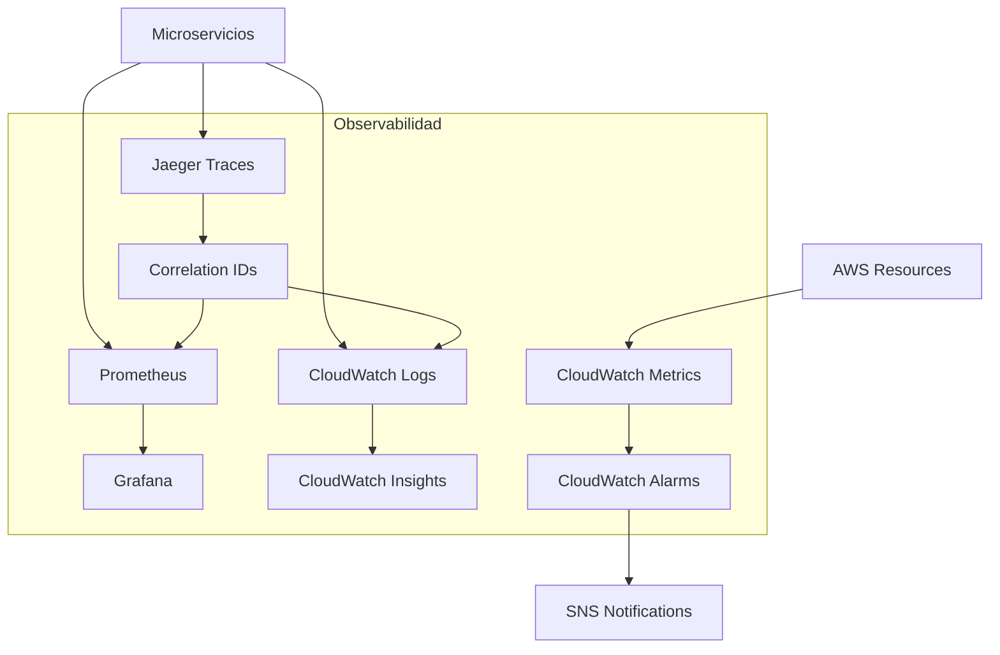

# Monitorización y Observabilidad

Esta documentación detalla el stack completo de observabilidad de RetroGameCloud, incluyendo Golden Signals, umbrales críticos, dashboards recomendados y correlación de logs-métricas-traces para debugging efectivo.

## Arquitectura de Observabilidad

<Note>
Nuestro stack de observabilidad combina herramientas de AWS con soluciones open-source para proporcionar visibilidad completa de la plataforma usando los principios de Golden Signals y distributed tracing.
</Note>



## Stack de Tecnologías

<Tabs>
  <Tab title="Métricas">
    - **Prometheus**: Recolección de métricas de aplicación
    - **Grafana**: Visualización y dashboards
    - **CloudWatch Metrics**: Métricas de infraestructura AWS
    - **Custom Metrics**: Golden Signals por servicio
  </Tab>
  <Tab title="Logs">
    - **CloudWatch Logs**: Agregación centralizada
    - **Fluent Bit**: Envío de logs desde pods
    - **CloudWatch Insights**: Consultas y análisis
    - **Structured Logging**: JSON con correlation IDs
  </Tab>
  <Tab title="Alertas">
    - **CloudWatch Alarms**: Alertas de infraestructura
    - **Grafana Alerts**: Alertas de aplicación
    - **SNS**: Notificaciones por email/Slack
    - **PagerDuty**: Escalación de incidentes críticos
  </Tab>
  <Tab title="Tracing">
    - **Jaeger**: Distributed tracing
    - **OpenTelemetry**: Instrumentación estándar
    - **Correlation IDs**: Seguimiento de requests
  </Tab>
</Tabs>

## Configuración del Stack

### Prometheus

```yaml
# prometheus-config.yaml
global:
  scrape_interval: 15s
  evaluation_interval: 15s

rule_files:
  - "alerts.yml"

scrape_configs:
  - job_name: 'kubernetes-pods'
    kubernetes_sd_configs:
      - role: pod
    relabel_configs:
      - source_labels: [__meta_kubernetes_pod_annotation_prometheus_io_scrape]
        action: keep
        regex: true
      - source_labels: [__meta_kubernetes_pod_annotation_prometheus_io_path]
        action: replace
        target_label: __metrics_path__
        regex: (.+)

alerting:
  alertmanagers:
    - static_configs:
        - targets:
          - alertmanager:9093
```

### Grafana Dashboards

<CardGroup cols={2}>
  <Card title="API Gateway Dashboard" icon="chart-line">
    Métricas de latencia, throughput y errores del API Gateway
  </Card>
  <Card title="Game Engine Dashboard" icon="gamepad">
    Performance del motor de juegos y recursos utilizados
  </Card>
  <Card title="Database Dashboard" icon="database">
    Conexiones, queries lentas y métricas de rendimiento
  </Card>
  <Card title="Infrastructure Dashboard" icon="server">
    CPU, memoria, disco y red de la infraestructura
  </Card>
</CardGroup>

## Golden Signals por Servicio

### API Gateway

<Tabs>
  <Tab title="Latencia">
    ```prometheus
    # P95 Latency
    histogram_quantile(0.95, 
      rate(http_request_duration_seconds_bucket{service="api-gateway"}[5m])
    )
    
    # SLI: < 200ms para el 95% de requests
    # SLO: 99.5% de availability
    ```
  </Tab>
  <Tab title="Tráfico">
    ```prometheus
    # Requests por segundo
    rate(http_requests_total{service="api-gateway"}[5m])
    
    # Throughput por endpoint
    rate(http_requests_total{service="api-gateway", endpoint!=""}[5m]) by (endpoint)
    ```
  </Tab>
  <Tab title="Errores">
    ```prometheus
    # Error rate (4xx + 5xx)
    rate(http_requests_total{service="api-gateway", status=~"4..|5.."}[5m]) / 
    rate(http_requests_total{service="api-gateway"}[5m])
    
    # SLI: < 1% error rate
    ```
  </Tab>
  <Tab title="Saturación">
    ```prometheus
    # CPU Usage
    rate(process_cpu_seconds_total{service="api-gateway"}[5m]) * 100
    
    # Memory Usage
    process_resident_memory_bytes{service="api-gateway"} / 1024 / 1024
    
    # Active Connections
    gateway_active_connections{service="api-gateway"}
    ```
  </Tab>
</Tabs>

### Game Engine Service

<Tabs>
  <Tab title="Latencia">
    ```prometheus
    # Game session start time
    histogram_quantile(0.95,
      rate(game_session_start_duration_seconds_bucket[5m])
    )
    
    # Input lag
    histogram_quantile(0.99,
      rate(game_input_latency_seconds_bucket[1m])
    )
    ```
  </Tab>
  <Tab title="Tráfico">
    ```prometheus
    # Active game sessions
    game_sessions_active
    
    # New sessions per minute
    rate(game_sessions_started_total[1m]) * 60
    ```
  </Tab>
  <Tab title="Errores">
    ```prometheus
    # Game crashes
    rate(game_crashes_total[5m])
    
    # Failed game loads
    rate(game_load_failures_total[5m]) / 
    rate(game_load_attempts_total[5m])
    ```
  </Tab>
  <Tab title="Saturación">
    ```prometheus
    # Emulation CPU usage
    game_emulation_cpu_percent
    
    # Memory per game instance
    game_instance_memory_bytes / 1024 / 1024
    
    # Concurrent game instances
    game_instances_running
    ```
  </Tab>
</Tabs>

### User Management Service

<Tabs>
  <Tab title="Latencia">
    ```prometheus
    # Authentication time
    histogram_quantile(0.95,
      rate(auth_request_duration_seconds_bucket[5m])
    )
    
    # User profile load time
    histogram_quantile(0.95,
      rate(user_profile_load_duration_seconds_bucket[5m])
    )
    ```
  </Tab>
  <Tab title="Tráfico">
    ```prometheus
    # Login attempts per minute
    rate(auth_attempts_total[1m]) * 60
    
    # Active users
    auth_active_sessions
    ```
  </Tab>
  <Tab title="Errores">
    ```prometheus
    # Failed logins
    rate(auth_failures_total[5m]) / 
    rate(auth_attempts_total[5m])
    
    # JWT validation errors
    rate(jwt_validation_errors_total[5m])
    ```
  </Tab>
  <Tab title="Saturación">
    ```prometheus
    # Session store usage
    auth_session_store_usage_percent
    
    # Database connections
    user_db_connections_active / user_db_connections_max
    ```
  </Tab>
</Tabs>

## Logging Estructurado

### Formato JSON Estándar

```json
{
  "timestamp": "2024-01-15T10:30:00.123Z",
  "level": "INFO",
  "service": "api-gateway",
  "traceId": "abc123def456",
  "spanId": "789ghi012jkl",
  "userId": "user_12345",
  "endpoint": "/api/v1/games",
  "method": "GET",
  "statusCode": 200,
  "duration": 145,
  "message": "Request processed successfully",
  "metadata": {
    "userAgent": "RetroGameClient/1.2.0",
    "ip": "192.168.1.100",
    "gameId": "mario_bros_1985"
  }
}
```

### CloudWatch Insights Queries

<Tabs>
  <Tab title="Error Analysis">
    ```sql
    fields @timestamp, service, traceId, message, metadata.endpoint
    | filter level = "ERROR"
    | stats count() by service, metadata.endpoint
    | sort count desc
    ```
  </Tab>
  <Tab title="Performance Issues">
    ```sql
    fields @timestamp, service, traceId, duration, metadata.endpoint
    | filter duration > 1000
    | sort @timestamp desc
    | limit 100
    ```
  </Tab>
  <Tab title="User Journey">
    ```sql
    fields @timestamp, service, message, metadata.endpoint
    | filter userId = "user_12345"
    | sort @timestamp asc
    ```
  </Tab>
  <Tab title="Game Session Tracking">
    ```sql
    fields @timestamp, service, message, metadata.gameId, metadata.sessionId
    | filter metadata.gameId exists
    | stats count() by metadata.gameId
    | sort count desc
    ```
  </Tab>
</Tabs>

## Distributed Tracing con Jaeger

### Instrumentación OpenTelemetry

```javascript
// Node.js example
const { trace, context } = require('@opentelemetry/api');
const tracer = trace.getTracer('retrogame-api');

async function processGameRequest(req, res) {
  const span = tracer.startSpan('process_game_request');
  const traceId = span.spanContext().traceId;
  
  try {
    span.setAttributes({
      'user.id': req.userId,
      'game.id': req.params.gameId,
      'http.method': req.method,
      'http.url': req.url
    });
    
    // Log con trace context
    logger.info('Processing game request', {
      traceId,
      spanId: span.spanContext().spanId,
      userId: req.userId,
      gameId: req.params.gameId
    });
    
    const result = await gameService.processRequest(req.params.gameId);
    
    span.setStatus({ code: SpanStatusCode.OK });
    return result;
  } catch (error) {
    span.recordException(error);
    span.setStatus({ 
      code: SpanStatusCode.ERROR, 
      message: error.message 
    });
    throw error;
  } finally {
    span.end();
  }
}
```

### Configuración Jaeger

```yaml
# jaeger-deployment.yaml
apiVersion: apps/v1
kind: Deployment
metadata:
  name: jaeger
spec:
  replicas: 1
  template:
    spec:
      containers:
      - name: jaeger
        image: jaegertracing/all-in-one:latest
        env:
        - name: COLLECTOR_OTLP_ENABLED
          value: "true"
        ports:
        - containerPort: 16686  # UI
        - containerPort: 14250  # gRPC
        - containerPort: 4317   # OTLP gRPC
        - containerPort: 4318   # OTLP HTTP
```

## Correlación para Debugging

### Ejemplo de Debugging Completo

<Steps>
  <Step title="Identificar el Problema">
    **Alerta recibida**: "High latency in API Gateway"
    
    ```prometheus
    # Query Grafana
    histogram_quantile(0.95, 
      rate(http_request_duration_seconds_bucket{service="api-gateway"}[5m])
    ) > 0.5
    ```
  </Step>
  
  <Step title="Analizar Métricas">
    ```prometheus
    # Identificar endpoint problemático
    histogram_quantile(0.95,
      rate(http_request_duration_seconds_bucket{
        service="api-gateway"
      }[5m])
    ) by (endpoint)
    ```
    
    **Resultado**: `/api/v1/games/start` tiene latencia > 2s
  </Step>
  
  <Step title="Buscar Traces">
    En Jaeger UI:
    - Service: `api-gateway`
    - Operation: `POST /api/v1/games/start`
    - Duration: `> 2s`
    - Time range: últimos 30 minutos
    
    **Encontrar trace ID**: `abc123def456789`
  </Step>
  
  <Step title="Correlacionar Logs">
    ```sql
    # CloudWatch Insights
    fields @timestamp, service, message, duration
    | filter traceId = "abc123def456789"
    | sort @timestamp asc
    ```
    
    **Resultado**: Timeout en llamada a `game-engine-service`
  </Step>
  
  <Step title="Investigar Servicio Downstream">
    ```prometheus
    # Métricas del game-engine
    histogram_quantile(0.95,
      rate(game_engine_processing_duration_seconds_bucket[5m])
    )
    ```
    
    ```sql
    # Logs del game-engine con el mismo traceId
    fields @timestamp, message, metadata
    | filter traceId = "abc123def456789" and service = "game-engine"
    ```
  </Step>
</Steps>

## Dashboards Grafana Específicos

### Dashboard API Gateway

```json
{
  "dashboard": {
    "title": "API Gateway Monitoring",
    "panels": [
      {
        "title": "Request Rate",
        "type": "graph",
        "targets": [
          {
            "expr": "rate(http_requests_total{service=\"api-gateway\"}[5m])",
            "legendFormat": "{{endpoint}}"
          }
        ]
      },
      {
        "title": "Response Time P95",
        "type": "graph",
        "targets": [
          {
            "expr": "histogram_quantile(0.95, rate(http_request_duration_seconds_bucket{service=\"api-gateway\"}[5m]))",
            "legendFormat": "P95 Latency"
          }
        ],
        "yAxes": [
          {
            "unit": "s",
            "max": 1
          }
        ]
      },
      {
        "title": "Error Rate",
        "type": "singlestat",
        "targets": [
          {
            "expr": "rate(http_requests_total{service=\"api-gateway\",status=~\"4..|5..\"}[5m]) / rate(http_requests_total{service=\"api-gateway\"}[5m]) * 100"
          }
        ],
        "valueName": "current",
        "format": "percent",
        "thresholds": "1,5"
      }
    ]
  }
}
```

### Dashboard Game Engine

<Accordion>
  <AccordionItem title="Performance Metrics">
    - **Active Sessions**: Número de sesiones de juego
</Accordion>