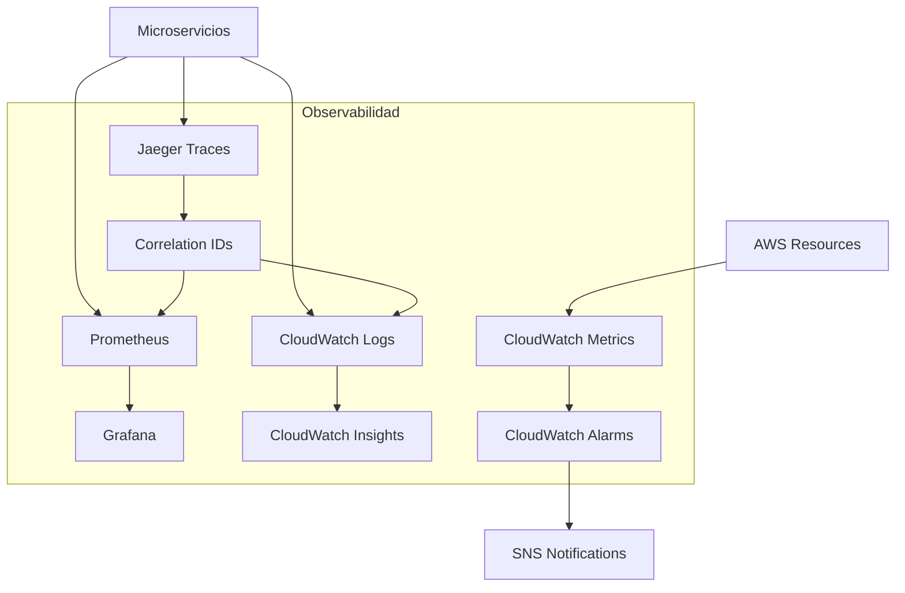

# 4.6 Monitorización y Observabilidad

Esta documentación detalla el stack completo de observabilidad de RetroGameCloud, incluyendo Golden Signals, umbrales críticos, dashboards recomendados y correlación de logs-métricas-traces para debugging efectivo.

## 4.6.1 Arquitectura de Observabilidad

<Note>
Nuestro stack de observabilidad combina herramientas de AWS con soluciones open-source para proporcionar visibilidad completa de la plataforma usando los principios de Golden Signals y distributed tracing.
</Note>



## 4.6.2 Stack de Tecnologías

<Tabs>
  <Tab title="Métricas">
    - **Prometheus**: Recolección de métricas de aplicación
    - **Grafana**: Visualización y dashboards
    - **CloudWatch Metrics**: Métricas de infraestructura AWS
    - **Custom Metrics**: Golden Signals por servicio
  </Tab>
  <Tab title="Logs">
    - **CloudWatch Logs**: Agregación centralizada
    - **Fluent Bit**: Envío de logs desde pods
    - **CloudWatch Insights**: Consultas y análisis
    - **Structured Logging**: JSON con correlation IDs
  </Tab>
  <Tab title="Alertas">
    - **CloudWatch Alarms**: Alertas de infraestructura
    - **Grafana Alerts**: Alertas de aplicación
    - **SNS**: Notificaciones por email/Slack
    - **PagerDuty**: Escalación de incidentes críticos
  </Tab>
  <Tab title="Tracing">
    - **Jaeger**: Distributed tracing
    - **OpenTelemetry**: Instrumentación estándar
    - **Correlation IDs**: Seguimiento cross-service
    - **Span Context**: Propagación de contexto
  </Tab>
</Tabs>

## 4.6.3 Golden Signals

### 4.6.3.1 Latency (Latencia)

<Card title="Definición y Umbrales" icon="clock">
Tiempo que toma procesar una request, distinguiendo entre requests exitosos y fallidos.

**Umbrales críticos:**
- P50 < 200ms (requests normales)
- P95 < 500ms (experiencia de usuario)
- P99 < 1s (casos extremos)
</Card>

```yaml
# Configuración Prometheus
- alert: HighLatency
  expr: histogram_quantile(0.95, rate(http_request_duration_seconds_bucket[5m])) > 0.5
  for: 2m
  labels:
    severity: warning
  annotations:
    summary: "High latency detected on {{ $labels.service }}"
    description: "95th percentile latency is {{ $value }}s"
```

### 4.6.3.2 Traffic (Tráfico)

<Card title="Medición de Demanda" icon="activity">
Medida de la demanda en el sistema, típicamente requests por segundo.

**Métricas clave:**
- RPS por endpoint
- Distribución por método HTTP
- Patrones de uso por hora/día
</Card>

```prometheus
# Queries importantes
rate(http_requests_total[5m])
sum(rate(http_requests_total[5m])) by (method, endpoint)
increase(http_requests_total[1h])
```

### 4.6.3.3 Errors (Errores)

<Card title="Tasa de Fallos" icon="alert-triangle">
Tasa de requests que fallan, expresada como fracción de todas las requests.

**Categorías:**
- HTTP 4xx (errores de cliente)
- HTTP 5xx (errores de servidor)
- Timeouts y circuit breaker trips
</Card>

```yaml
- alert: HighErrorRate
  expr: |
    (
      sum(rate(http_requests_total{status=~"5.."}[5m])) by (service)
      /
      sum(rate(http_requests_total[5m])) by (service)
    ) > 0.01
  for: 2m
  labels:
    severity: critical
  annotations:
    summary: "High error rate on {{ $labels.service }}"
    description: "Error rate is {{ $value | humanizePercentage }}"
```

### 4.6.3.4 Saturation (Saturación)

<Card title="Utilización de Recursos" icon="cpu">
Medida de la "plenitud" del servicio. Recursos más limitados como memoria, I/O, conexiones.

**Recursos monitoreados:**
- CPU utilization
- Memory usage
- Database connections
- Queue depth
</Card>

## 4.6.4 Configuración de Logs Estructurados

### 4.6.4.1 Formato Estándar

```json
{
  "timestamp": "2024-01-15T10:30:00.123Z",
  "level": "INFO",
  "service": "user-service",
  "version": "1.2.3",
  "correlation_id": "abc123-def456-ghi789",
  "trace_id": "xyz789-uvw456-rst123",
  "span_id": "span123",
  "user_id": "user_456",
  "endpoint": "/api/users/profile",
  "method": "GET",
  "status_code": 200,
  "duration_ms": 145,
  "message": "User profile retrieved successfully",
  "metadata": {
    "cache_hit": true,
    "db_queries": 2
  }
}
```

### 4.6.4.2 Configuración Fluent Bit

```yaml
apiVersion: v1
kind: ConfigMap
metadata:
  name: fluent-bit-config
data:
  fluent-bit.conf: |
    [INPUT]
        Name tail
        Path /var/log/containers/*.log
        Parser docker
        Tag kube.*
        Refresh_Interval 5
        Mem_Buf_Limit 50MB
        Skip_Long_Lines On
        Skip_Empty_Lines On

    [FILTER]
        Name kubernetes
        Match kube.*
        Keep_Log Off
        Annotations On
        Labels On

    [FILTER]
        Name parser
        Match kube.*
        Key_Name log
        Parser json
        Reserve_Data On

    [OUTPUT]
        Name cloudwatch_logs
        Match kube.*
        region us-east-1
        log_group_name /aws/eks/retrogame/application
        log_stream_prefix application-
        auto_create_group true
```

## 4.6.5 Dashboards Esenciales

### 4.6.5.1 Dashboard de Golden Signals

```json
{
  "dashboard": {
    "title": "RetroGameCloud - Golden Signals",
    "panels": [
      {
        "title": "Request Rate",
        "type": "stat",
        "targets": [
          {
            "expr": "sum(rate(http_requests_total[5m]))",
            "legendFormat": "RPS"
          }
        ]
      },
      {
        "title": "Latency Distribution",
        "type": "heatmap",
        "targets": [
          {
            "expr": "rate(http_request_duration_seconds_bucket[5m])",
            "legendFormat": "{{le}}"
          }
        ]
      },
      {
        "title": "Error Rate",
        "type": "stat",
        "targets": [
          {
            "expr": "sum(rate(http_requests_total{status=~\"5..\"}[5m])) / sum(rate(http_requests_total[5m]))",
            "legendFormat": "Error Rate"
          }
        ]
      },
      {
        "title": "Saturation",
        "type": "gauge",
        "targets": [
          {
            "expr": "avg(rate(container_cpu_usage_seconds_total[5m]))",
            "legendFormat": "CPU"
          },
          {
            "expr": "avg(container_memory_usage_bytes / container_spec_memory_limit_bytes)",
            "legendFormat": "Memory"
          }
        ]
      }
    ]
  }
}
```

### 4.6.5.2 Dashboard de Business Metrics

<Tabs>
  <Tab title="Gaming Metrics">
    ```prometheus
    # Sesiones activas de juego
    gaming_active_sessions_total

    # Latencia de input lag
    histogram_quantile(0.95, rate(gaming_input_latency_seconds_bucket[5m]))

    # Calidad de stream
    avg(gaming_stream_quality_score) by (game_type)

    # Desconexiones por problemas de red
    rate(gaming_disconnections_total{reason="network"}[5m])
    ```
  </Tab>
  <Tab title="User Experience">
    ```prometheus
    # Tiempo de carga de juegos
    histogram_quantile(0.95, rate(game_loading_duration_seconds_bucket[5m]))

    # Satisfacción del usuario
    avg(user_rating_score) by (game_id)

    # Abandono de sesiones
    rate(session_abandonments_total[5m])

    # Uso de features premium
    rate(premium_feature_usage_total[1h]) by (feature)
    ```
  </Tab>
  <Tab title="Infrastructure">
    ```prometheus
    # Utilización GPU
    avg(gpu_utilization_percent) by (instance)

    # Throughput de red
    rate(node_network_transmit_bytes_total[5m])

    # Storage IOPS
    rate(aws_ebs_volume_read_ops[5m]) + rate(aws_ebs_volume_write_ops[5m])

    # Costo por hora
    aws_billing_estimated_charges by (service)
    ```
  </Tab>
</Tabs>

## 4.6.6 Distributed Tracing

### 4.6.6.1 Configuración Jaeger

```yaml
apiVersion: apps/v1
kind: Deployment
metadata:
  name: jaeger-all-in-one
spec:
  replicas: 1
  selector:
    matchLabels:
      app: jaeger
  template:
    metadata:
      labels:
        app: jaeger
    spec:
      containers:
      - name: jaeger
        image: jaegertracing/all-in-one:1.41
        env:
        - name: COLLECTOR_OTLP_ENABLED
          value: "true"
        - name: SPAN_STORAGE_TYPE
          value: elasticsearch
        - name: ES_SERVER_URLS
          value: "https://elasticsearch.monitoring.svc.cluster.local:9200"
        ports:
        - containerPort: 16686
          name: ui
        - containerPort: 14250
          name: grpc
        - containerPort: 4317
          name: otlp-grpc
        - containerPort: 4318
          name: otlp-http
```

### 4.6.6.2 Instrumentación OpenTelemetry

<Tabs>
  <Tab title="Node.js">
    ```javascript
    const { NodeSDK } = require('@opentelemetry/sdk-node');
    const { getNodeAutoInstrumentations } = require('@opentelemetry/auto-instrumentations-node');
    const { JaegerExporter } = require('@opentelemetry/exporter-jaeger');

    const jaegerExporter = new JaegerExporter({
      endpoint: 'http://jaeger-collector:14268/api/traces',
    });

    const sdk = new NodeSDK({
      traceExporter: jaegerExporter,
      instrumentations: [getNodeAutoInstrumentations()],
      serviceName: 'user-service',
      serviceVersion: '1.0.0',
    });

    sdk.start();

    // Instrumentación manual
    const { trace } = require('@opentelemetry/api');

    async function processUserData(userId) {
      const tracer = trace.getTracer('user-service');
      
      return tracer.startActiveSpan('process-user-data', async (span) => {
        try {
          span.setAttributes({
            'user.id': userId,
            'operation.type': 'data-processing'
          });

          const userData = await fetchUserFromDB(userId);
          span.addEvent('user-data-fetched', { 
            'user.type': userData.type 
          });

          const processed = await processData(userData);
          span.setStatus({ code: SpanStatusCode.OK });
          
          return processed;
        } catch (error) {
          span.recordException(error);
          span.setStatus({ 
            code: SpanStatusCode.ERROR, 
            message: error.message 
          });
          throw error;
        } finally {
          span.end();
        }
      });
    }
    ```
  </Tab>
  <Tab title="Go">
    ```go
    package main

    import (
        "context"
        "log"
        
        "go.opentelemetry.io/otel"
        "go.opentelemetry.io/otel/attribute"
        "go.opentelemetry.io/otel/exporters/jaeger"
        "go.opentelemetry.io/otel/sdk/resource"
        "go.opentelemetry.io/otel/sdk/trace"
        semconv "go.opentelemetry.io/otel/semconv/v1.17.0"
    )

    func initTracer() {
        exp, err := jaeger.New(jaeger.WithCollectorEndpoint(
            jaeger.WithEndpoint("http://jaeger-collector:14268/api/traces"),
        ))
        if err != nil {
            log.Fatal(err)
        }

        tp := trace.NewTracerProvider(
            trace.WithBatcher(exp),
            trace.WithResource(resource.NewWithAttributes(
                semconv.SchemaURL,
                semconv.ServiceNameKey.String("gaming-service"),
                semconv.ServiceVersionKey.String("1.0.0"),
            )),
        )
        
        otel.SetTracerProvider(tp)
    }

    func processGameSession(ctx context.Context, sessionID string) error {
        tracer := otel.Tracer("gaming-service")
        
        ctx, span := tracer.Start(ctx, "process-game-session")
        defer span.End()
        
        span.SetAttributes(
            attribute.String("session.id", sessionID),
            attribute.String("operation.type", "game-processing"),
        )
        
        // Procesar lógica de juego
        if err := startGameEngine(ctx, sessionID); err != nil {
            span.RecordError(err)
            return err
        }
        
        span.AddEvent("game-engine-started")
        return nil
    }
    ```
  </Tab>
  <Tab title="Python">
    ```python
    from opentelemetry import trace
    from opentelemetry.sdk.trace import TracerProvider
    from opentelemetry.sdk.trace.export import BatchSpan
</Tab>
</Tabs>
```