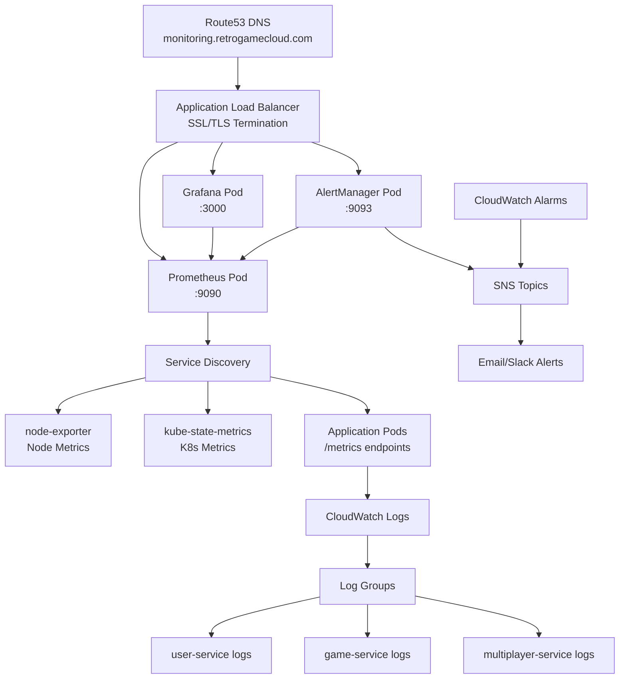

## Stack de Monitoreo y Observabilidad

Retro Game Hub utiliza un stack híbrido combinando Prometheus + Grafana para métricas en tiempo real y CloudWatch para logging y alertas críticas.

<CardGroup cols={4}>
  <Card title="Prometheus" icon="chart-line">
    **Métricas**

    Recolección y almacenamiento de métricas de aplicación
  </Card>

  <Card title="Grafana" icon="chart-area">
    **Visualización**

    Dashboards interactivos y análisis
  </Card>

  <Card title="CloudWatch" icon="cloud">
    **AWS Native**

    Logs centralizados y alertas críticas
  </Card>

  <Card title="AlertManager" icon="bell">
    **Notificaciones**

    Gestión y routing de alertas
  </Card>
</CardGroup>

## Arquitectura de Observabilidad



## Instalación con Helm

### Prerrequisitos

```bash
# Instalar Helm
curl https://raw.githubusercontent.com/helm/helm/main/scripts/get-helm-3 | bash

# Agregar repositorio de Prometheus
helm repo add prometheus-community https://prometheus-community.github.io/helm-charts
helm repo add grafana https://grafana.github.io/helm-charts
helm repo update
```

### Instalar kube-prometheus-stack

<Steps>
  <Step title="Crear namespace">
    ```bash
    kubectl create namespace monitoring
    ```
  </Step>

  <Step title="Crear values.yaml">
    ```yaml
    # values-prometheus.yaml
    prometheus:
      prometheusSpec:
        storageSpec:
          volumeClaimTemplate:
            spec:
              accessModes: ["ReadWriteOnce"]
              resources:
                requests:
                  storage: 50Gi
              storageClassName: gp3

        retention: 15d
        retentionSize: "45GB"
        
        resources:
          requests:
            memory: "2Gi"
            cpu: "1000m"
          limits:
            memory: "4Gi"
            cpu: "2000m"

        serviceMonitorSelectorNilUsesHelmValues: false
        podMonitorSelectorNilUsesHelmValues: false

    grafana:
      adminPassword: "secure-password-here"
      ingress:
        enabled: true
        hosts:
          - monitoring.retrogamecloud.com
        tls:
          - secretName: monitoring-tls
            hosts:
              - monitoring.retrogamecloud.com

      datasources:
        datasources.yaml:
          apiVersion: 1
          datasources:
            - name: Prometheus
              type: prometheus
              url: http://prometheus-server
              access: proxy
              isDefault: true

    alertmanager:
      config:
        global:
          smtp_smarthost: 'localhost:587'
          smtp_from: 'alerts@retrogamecloud.com'
        
        route:
          group_by: ['alertname']
          group_wait: 10s
          group_interval: 10s
          repeat_interval: 1h
          receiver: 'web.hook'

        receivers:
          - name: 'web.hook'
            email_configs:
              - to: 'ops-team@retrogamecloud.com'
                subject: 'Retro Game Hub Alert: {{ .GroupLabels.alertname }}'
    ```
  </Step>

  <Step title="Instalar stack">
    ```bash
    helm install prometheus-stack prometheus-community/kube-prometheus-stack \
      --namespace monitoring \
      --values values-prometheus.yaml
    ```
  </Step>
</Steps>

## Métricas Clave por Servicio

### User Service

<AccordionGroup>
  <Accordion title="Métricas de Negocio">
    - **user_registrations_total**: Contador de registros de usuarios
    - **user_logins_total**: Contador de inicios de sesión
    - **active_users_gauge**: Usuarios activos en tiempo real
    - **user_profile_updates_total**: Actualizaciones de perfil
  </Accordion>

  <Accordion title="Métricas Técnicas">
    - **http_requests_duration_seconds**: Latencia de requests HTTP
    - **http_requests_total**: Total de requests por endpoint
    - **database_connections_active**: Conexiones activas a base de datos
    - **jwt_token_validations_total**: Validaciones de tokens
  </Accordion>
</AccordionGroup>

### Game Service

<AccordionGroup>
  <Accordion title="Métricas de Negocio">
    - **games_played_total**: Contador de partidas iniciadas
    - **games_completed_total**: Contador de partidas completadas
    - **game_session_duration_seconds**: Duración de sesiones de juego
    - **popular_games_ranking**: Ranking de juegos más jugados
  </Accordion>

  <Accordion title="Métricas Técnicas">
    - **game_rom_loading_duration_seconds**: Tiempo de carga de ROMs
    - **emulator_memory_usage_bytes**: Uso de memoria del emulador
    - **save_state_operations_total**: Operaciones de guardado
    - **game_crashes_total**: Crashes de emulador
  </Accordion>
</AccordionGroup>

### Multiplayer Service

<AccordionGroup>
  <Accordion title="Métricas de Negocio">
    - **multiplayer_rooms_active**: Salas activas
    - **multiplayer_players_connected**: Jugadores conectados
    - **multiplayer_matches_total**: Partidas multijugador
    - **multiplayer_latency_p95**: Percentil 95 de latencia
  </Accordion>

  <Accordion title="Métricas Técnicas">
    - **websocket_connections_active**: Conexiones WebSocket activas
    - **message_queue_size**: Tamaño de cola de mensajes
    - **sync_events_total**: Eventos de sincronización
    - **connection_drops_total**: Desconexiones
  </Accordion>
</AccordionGroup>

## Configuración de CloudWatch Logs

### Estructura de Log Groups

```bash
# Crear log groups
aws logs create-log-group --log-group-name /retro-game-hub/user-service
aws logs create-log-group --log-group-name /retro-game-hub/game-service
aws logs create-log-group --log-group-name /retro-game-hub/multiplayer-service
aws logs create-log-group --log-group-name /retro-game-hub/nginx-ingress

# Configurar retención
aws logs put-retention-policy \
  --log-group-name /retro-game-hub/user-service \
  --retention-in-days 30
```

### Fluent Bit Configuration

```yaml
apiVersion: v1
kind: ConfigMap
metadata:
  name: fluent-bit-config
  namespace: amazon-cloudwatch
data:
  fluent-bit.conf: |
    [SERVICE]
        Flush                     5
        Grace                     30
        Log_Level                 info
        Daemon                    off
        Parsers_File              parsers.conf
        HTTP_Server               On
        HTTP_Listen               0.0.0.0
        HTTP_Port                 2020

    [INPUT]
        Name                tail
        Path                /var/log/containers/user-service*.log
        multiline.parser    docker, cri
        Tag                 user-service.*
        Refresh_Interval    5

    [INPUT]
        Name                tail
        Path                /var/log/containers/game-service*.log
        multiline.parser    docker, cri
        Tag                 game-service.*
        Refresh_Interval    5

    [OUTPUT]
        Name                cloudwatch_logs
        Match               user-service.*
        region              us-east-1
        log_group_name      /retro-game-hub/user-service
        log_stream_prefix   pod/
        auto_create_group   true

    [OUTPUT]
        Name                cloudwatch_logs
        Match               game-service.*
        region              us-east-1
        log_group_name      /retro-game-hub/game-service
        log_stream_prefix   pod/
        auto_create_group   true
```

## CloudWatch Alarms Críticos

### Alarms de Infraestructura

<Tabs>
  <Tab title="EKS Cluster">
    ```bash
    # Nodos no saludables
    aws cloudwatch put-metric-alarm \
      --alarm-name "EKS-UnhealthyNodes" \
      --alarm-description "EKS nodes unhealthy" \
      --metric-name "cluster_unhealthy_nodes" \
      --namespace "ContainerInsights" \
      --statistic Sum \
      --period 300 \
      --threshold 1 \
      --comparison-operator GreaterThanOrEqualToThreshold \
      --evaluation-periods 2
    ```
  </Tab>

  <Tab title="RDS Database">
    ```bash
    # Conexiones de base de datos
    aws cloudwatch put-metric-alarm \
      --alarm-name "RDS-HighConnectionCount" \
      --alarm-description "RDS connection count high" \
      --metric-name "DatabaseConnections" \
      --namespace "AWS/RDS" \
      --statistic Average \
      --period 300 \
      --threshold 80 \
      --comparison-operator GreaterThanThreshold \
      --evaluation-periods 3 \
      --dimensions Name=DBInstanceIdentifier,Value=retro-game-db
    ```
  </Tab>

  <Tab title="Application Load Balancer">
    ```bash
    # Tasa de errores 5xx
    aws cloudwatch put-metric-alarm \
      --alarm-name "ALB-High5xxErrorRate" \
      --alarm-description "High 5xx error rate" \
      --metric-name "HTTPCode_Target_5XX_Count" \
      --namespace "AWS/ApplicationELB" \
      --statistic Sum \
      --period 300 \
      --threshold 10 \
      --comparison-operator GreaterThanThreshold \
      --evaluation-periods 2
    ```
  </Tab>
</Tabs>

### Alarms de Aplicación

```yaml
# prometheus-alerts.yaml
apiVersion: v1
kind: ConfigMap
metadata:
  name: prometheus-alerts
  namespace: monitoring
data:
  alerts.yml: |
    groups:
      - name: retro-game-hub.alerts
        rules:
          - alert: HighErrorRate
            expr: rate(http_requests_total{code=~"5.."}[5m]) > 0.05
            for: 5m
            labels:
              severity: critical
            annotations:
              summary: "High error rate detected"
              description: "Error rate is above 5% for 5 minutes"

          - alert: HighLatency
            expr: histogram_quantile(0.95, http_request_duration_seconds) > 2
            for: 10m
            labels:
              severity: warning
            annotations:
              summary: "High latency detected"
              description: "95th percentile latency is above 2 seconds"

          - alert: LowActiveUsers
            expr: active_users_gauge < 10
            for: 15m
            labels:
              severity: warning
            annotations:
              summary: "Low user activity"
              description: "Active users below threshold"

          - alert: GameServiceDown
            expr: up{job="game-service"} == 0
            for: 1m
            labels:
              severity: critical
            annotations:
              summary: "Game service is down"
              description: "Game service has been down for more than 1 minute"
```

## Dashboards de Grafana

### Dashboard Principal

```json
{
  "dashboard": {
    "title": "Retro Game Hub - Overview",
    "panels": [
      {
        "title": "Active Users",
        "type": "stat",
        "targets": [
          {
            "expr": "active_users_gauge",
            "legendFormat": "Active Users"
          }
        ]
      },
      {
        "title": "Games Played (Last 24h)",
        "type": "stat",
        "targets": [
          {
            "expr": "increase(games_played_total[24h])",
            "legendFormat": "Games Played"
          }
        ]
      },
      {
        "title": "Request Rate",
        "type": "graph",
        "targets": [
          {
            "expr": "rate(http_requests_total[5m])",
            "legendFormat": "{{service}} - {{method}} {{endpoint}}"
          }
        ]
      },
      {
        "title": "Error Rate",
        "type": "graph",
        "targets": [
          {
            "expr": "rate(http_requests_total{code=~'5..'}[5m]) / rate(http_requests_total[5m]) * 100",
            "legendFormat": "Error Rate %"
          }
        ]
      }
    ]
  }
}
```

### Dashboard por Servicio

<CodeGroup>
```json User Service Dashboard
{
  "dashboard": {
    "title": "User Service Metrics",
    "panels": [
      {
        "title": "User Registrations",
        "type": "graph",
        "targets": [
          {
            "expr": "rate(user_registrations_total[1h])",
            "legendFormat": "Registrations/hour"
          }
        ]
      },
      {
        "title": "Login Success Rate",
        "type": "stat",
        "targets": [
          {
            "expr": "rate(user_logins_total{status='success'}[5m]) / rate(user_logins_total[5m]) * 100",
            "legendFormat": "Success Rate %"
          }
        ]
      }
    ]
  }
}
```

```json Game Service Dashboard
{
  "dashboard": {
    "title": "Game Service Metrics",
    "panels": [
      {
        "title": "Most Popular Games",
        "type": "table",
        "targets": [
          {
            "expr": "topk(10, rate(games_played_total[24h]))",
            "legendFormat": "{{game_name}}"
          }
        ]
      },
      {
        "title": "Game Loading Time",
        "type": "heatmap",
        "targets": [
          {
            "expr": "rate(game_rom_loading_duration_seconds_bucket[5m])",
            "legendFormat": "Loading Time"
          }
        ]
      }
    ]
  }
}
```
</CodeGroup>

## Procedimientos de Acceso a Logs

### Acceso