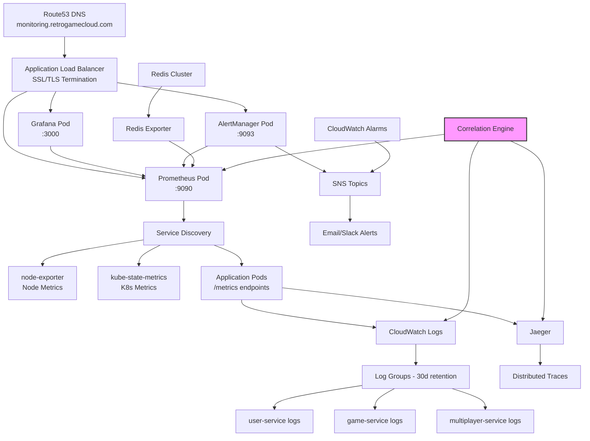

## Stack de Monitoreo y Observabilidad

Retro Game Hub implementa observabilidad completa siguiendo las mejores prácticas SRE con Golden Signals, logging estructurado y correlación distribuida para debugging eficiente.

<CardGroup cols={4}>
  <Card title="Prometheus" icon="chart-line">
    **Métricas**

    Recolección y almacenamiento de métricas de aplicación y Golden Signals
  </Card>

  <Card title="Grafana" icon="chart-area">
    **Visualización**

    Dashboards SLI/SLO y análisis de correlación
  </Card>

  <Card title="CloudWatch" icon="cloud">
    **AWS Native**

    Logs estructurados centralizados con retention policies
  </Card>

  <Card title="AlertManager" icon="bell">
    **Notificaciones**

    Alertas inteligentes basadas en umbrales críticos
  </Card>
</CardGroup>

## Arquitectura de Observabilidad



## Golden Signals por Servicio

### 1. Latencia (Latency)

<CodeGroup>

```yaml user-service

# User Service - Latency SLIs
http_request_duration_seconds:
  p95_threshold: 200ms    # Crítico: > 500ms
  p99_threshold: 500ms    # Crítico: > 1s

login_duration_seconds:
  p95_threshold: 300ms    # Crítico: > 800ms

jwt_validation_duration:
  p95_threshold: 50ms     # Crítico: > 100ms

```

```yaml game-service

# Game Service - Latency SLIs
game_search_duration_seconds:
  p95_threshold: 150ms    # Crítico: > 400ms

game_metadata_fetch_duration:
  p95_threshold: 100ms    # Crítico: > 250ms

save_state_duration_seconds:
  p95_threshold: 200ms    # Crítico: > 600ms

```

```yaml multiplayer-service

# Multiplayer Service - Latency SLIs
websocket_message_latency:
  p95_threshold: 50ms     # Crítico: > 100ms

room_join_duration:
  p95_threshold: 300ms    # Crítico: > 800ms

game_sync_latency:
  p95_threshold: 30ms     # Crítico: > 80ms

```

</CodeGroup>

### 2. Tráfico (Traffic)

<CodeGroup>

```yaml requests-per-second

# Tráfico - RPS por servicio
user_service_rps:
  normal: 50-200 RPS
  peak: 500-1000 RPS
  alert_threshold: > 1500 RPS

game_service_rps:
  normal: 100-400 RPS
  peak: 1000-2000 RPS
  alert_threshold: > 3000 RPS

multiplayer_active_connections:
  normal: 200-800 connections
  peak: 2000-4000 connections
  alert_threshold: > 5000 connections

```

```yaml business-metrics

# Métricas de Negocio
concurrent_games:
  normal: 50-200 games
  peak: 500-1000 games
  alert_threshold: > 1500 games

daily_active_users:
  target: > 1000 DAU
  alert_threshold: < 500 DAU

room_utilization:
  target: 60-80%
  alert_threshold: > 90%

```

</CodeGroup>

### 3. Errores (Errors)

<CodeGroup>

```yaml error-rates

# Error Rate SLIs - Por servicio
http_error_rate:
  target: < 0.1% (99.9% success)
  warning: > 0.5%
  critical: > 1%

authentication_error_rate:
  target: < 0.05%
  warning: > 0.2%
  critical: > 0.5%

game_load_error_rate:
  target: < 0.1%
  warning: > 0.3%
  critical: > 1%

```

```yaml redis-errors

# Redis/Cache Errors
redis_connection_errors:
  warning: > 5 errors/min
  critical: > 20 errors/min

cache_miss_rate:
  normal: 5-15%
  warning: > 30%
  critical: > 50%

session_timeout_rate:
  warning: > 2%
  critical: > 5%

```

</CodeGroup>

### 4. Saturación (Saturation)

<CodeGroup>

```yaml resource-saturation

# Saturación de Recursos
cpu_utilization:
  target: 50-70%
  warning: > 80%
  critical: > 90%

memory_utilization:
  target: 60-80%
  warning: > 85%
  critical: > 95%

pod_cpu_throttling:
  warning: > 5%
  critical: > 15%

```

```yaml storage-saturation

# Almacenamiento y I/O
disk_utilization:
  warning: > 80%
  critical: > 90%

redis_memory_usage:
  warning: > 70%
  critical: > 85%

connection_pool_usage:
  warning: > 80%
  critical: > 95%

```

</CodeGroup>

## Dashboards Grafana Recomendados

### 1. Overview Dashboard - Cluster Health

<Frame>

```json
{
  "dashboard": {
    "title": "Retro Game Hub - Cluster Overview",
    "panels": [
      {
        "title": "Golden Signals Summary",
        "targets": [
          "rate(http_requests_total[5m])",
          "histogram_quantile(0.95, rate(http_request_duration_seconds_bucket[5m]))",
          "rate(http_requests_total{status=~\"5..\"}[5m])",
          "avg(rate(container_cpu_usage_seconds_total[5m]))"
        ]
      },
      {
        "title": "Active Users & Games",
        "targets": [
          "active_users_total",
          "concurrent_games_total",
          "multiplayer_connections_total"
        ]
      },
      {
        "title": "Resource Utilization",
        "targets": [
          "avg(rate(container_cpu_usage_seconds_total[5m])) * 100",
          "avg(container_memory_usage_bytes / container_spec_memory_limit_bytes) * 100"
        ]
      }
    ]
  }
}

```

</Frame>

### 2. Service-Specific Dashboard

<CodeGroup>

```json user-service-dashboard
{
  "title": "User Service - Detailed Metrics",
  "panels": [
    {
      "title": "Login Performance",
      "targets": [
        "histogram_quantile(0.95, rate(login_duration_seconds_bucket[5m]))",
        "rate(login_attempts_total[5m])",
        "rate(login_failures_total[5m])"
      ]
    },
    {
      "title": "JWT Operations",
      "targets": [
        "histogram_quantile(0.95, rate(jwt_validation_duration_seconds_bucket[5m]))",
        "rate(jwt_validation_errors_total[5m])"
      ]
    },
    {
      "title": "Database Connections",
      "targets": [
        "postgres_connections_active",
        "postgres_connections_idle",
        "rate(postgres_queries_total[5m])"
      ]
    }
  ]
}

```

```json multiplayer-dashboard
{
  "title": "Multiplayer Service - Real-time Metrics",
  "panels": [
    {
      "title": "WebSocket Performance",
      "targets": [
        "websocket_connections_active",
        "histogram_quantile(0.95, rate(websocket_message_duration_seconds_bucket[5m]))",
        "rate(websocket_errors_total[5m])"
      ]
    },
    {
      "title": "Game Room Metrics",
      "targets": [
        "game_rooms_active",
        "avg(players_per_room)",
        "rate(room_join_events_total[5m])"
      ]
    }
  ]
}

```

</CodeGroup>

### 3. User Journey Dashboard

```json user-journey-dashboard
{
  "title": "User Journey - End-to-End Experience",
  "panels": [
    {
      "title": "User Flow Funnel",
      "targets": [
        "rate(page_visits_total{page=\"landing\"}[5m])",
        "rate(user_registrations_total[5m])",
        "rate(game_launches_total[5m])",
        "rate(multiplayer_joins_total[5m])"
      ]
    },
    {
      "title": "User Experience Metrics",
      "targets": [
        "histogram_quantile(0.95, rate(page_load_duration_seconds_bucket[5m]))",
        "histogram_quantile(0.95, rate(game_start_duration_seconds_bucket[5m]))",
        "avg(user_session_duration_seconds)"
      ]
    }
  ]
}

```

## Logging Estructurado y Correlation IDs

### Implementación de Structured Logging

<CodeGroup>

```javascript user-service-logging
// user-service/src/utils/logger.js
const winston = require('winston');
const { v4: uuidv4 } = require('uuid');

const logger = winston.createLogger({
  format: winston.format.combine(
    winston.format.timestamp(),
    winston.format.json(),
    winston.format.printf(info => {
      return JSON.stringify({
        timestamp: info.timestamp,
        level: info.level,
        service: 'user-service',
        correlationId: info.correlationId || 'unknown',
        userId: info.userId,
        action: info.action,
        message: info.message,
        duration: info.duration,
        error: info.error,
        metadata: info.metadata
      });
    })
  ),
  transports: [
    new winston.transports.Console(),
    new winston.transports.CloudWatchLogs({
      logGroupName: '/retrogamehub/user-service',
      logStreamName: process.env.HOSTNAME || 'local'
    })
  ]
});

// Middleware para correlation ID
const correlationMiddleware = (req, res, next) => {
  req.correlationId = req.headers['x-correlation-id'] || uuidv4();
  res.set('x-correlation-id', req.correlationId);
  next();
};

module.exports = { logger, correlationMiddleware };

```

```javascript game-service-logging
// game-service/src/middleware/logging.js
const { logger } = require('../utils/logger');

const logGameOperation = (operation) => {
  return (req, res, next) => {
    const startTime = Date.now();

    logger.info({
      correlationId: req.correlationId,
      userId: req.user?.id,
      action: `${operation}_start`,
      gameId: req.params.gameId,
      metadata: {
        userAgent: req.get('User-Agent'),
        ip: req.ip
      }
    });

    res.on('finish', () => {
      const duration = Date.now() - startTime;

      logger.info({
        correlationId: req.correlationId,
        userId: req.user?.id,
        action: `${operation}_complete`,
        gameId: req.params.gameId,
        duration,
        statusCode: res.statusCode,
        metadata: {
          success: res.statusCode < 400
        }
      });
    });

    next();
  };
};

module.exports = { logGameOperation };

```

```javascript multiplayer-logging
// multiplayer-service/src/utils/socketLogger.js
const { logger } = require('./logger');

class SocketLogger {
  static logConnection(socket, userId) {
    logger.info({
      correlationId: socket.correlationId,
      userId,
      action: 'websocket_connection',
      socketId: socket.id,
      metadata: {
        origin: socket.handshake.headers.origin,
        userAgent: socket.handshake.headers['user-agent']
      }
    });
  }

  static logRoomJoin(socket, userId, roomId) {
    logger.info({
      correlationId: socket.correlationId,
      userId,
      action: 'room_join',
      roomId,
      socketId: socket.id,
      metadata: {
        timestamp: new Date().toISOString()
      }
    });
  }

  static logGameEvent(socket, userId, event, data) {
    logger.info({
      correlationId: socket.correlationId,
      userId,
      action: 'game_event',
      event,
      socketId: socket.id,
      metadata: {
        eventData: data,
        timestamp: new Date().toISOString()
      }
    });
  }
}

module.exports = { SocketLogger };

```

</CodeGroup>

## Correlación Logs-Métricas-Traces para Debugging

### Flujo de Debugging Distribuido

<Steps>
  <Step title="1. Identificación del Problema">
    ```bash
    # Usuario reporta: "No puedo unirme a partidas multijugador"
    # Correlation ID del error: corr-123e4567-e89b-12d3-a456-426614174000

    # Buscar en CloudWatch Logs
    aws logs filter-log-events \
      --log-group-name "/retrogamehub/multiplayer-service" \
      --filter-pattern "corr-123e4567-e89b-12d3-a456-426614174000"
    ```

  </Step>

  <Step title="2. Análisis de Métricas Correlacionadas">
    ```promql
    # Verificar métricas en el momento del error
    # Timestamp del error: 2024-01-15T14:30:00Z

    # Latencia de conexión WebSocket
    histogram_quantile
</Steps>
</Step>

```