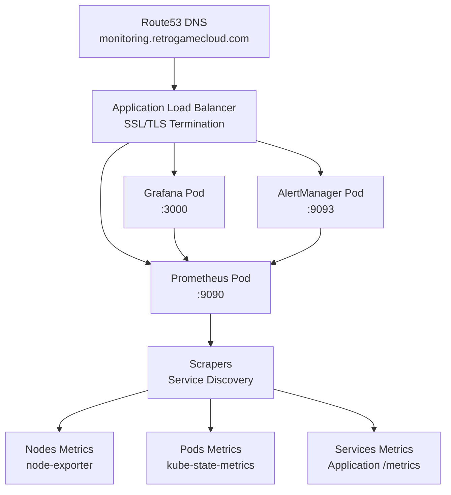

## Stack de Monitoreo

RetroGame Cloud utiliza el stack de Prometheus + Grafana para monitoreo y visualización en tiempo real.

<CardGroup cols={3}>
  <Card title="Prometheus" icon="chart-line">
    **Métricas**
    
    Recolección y almacenamiento de métricas
  </Card>
  
  <Card title="Grafana" icon="chart-area">
    **Visualización**
    
    Dashboards interactivos
  </Card>
  
  <Card title="AlertManager" icon="bell">

    **Alertas**
    
    Notificaciones de incidentes
  </Card>
</CardGroup>

## Arquitectura



## Instalación con Helm

### Prerrequisitos

```bash
# Instalar Helm
curl https://raw.githubusercontent.com/helm/helm/main/scripts/get-helm-3 | bash

# Agregar repositorio de Prometheus
helm repo add prometheus-community https://prometheus-community.github.io/helm-charts
helm repo update
```

### Instalar kube-prometheus-stack

<Steps>
  <Step title="Crear namespace">
    ```bash
    kubectl create namespace monitoring
    ```
  </Step>
  
  <Step title="Crear values.yaml">
    ```yaml
    # values-prometheus.yaml
    prometheus:
      prometheusSpec:
        storageSpec:
          volumeClaimTemplate:
            spec:
              accessModes: ["ReadWriteOnce"]
              resources:
                requests:
                  storage: 50Gi
              storageClassName: gp3
        
        retention: 15d
        retentionSize: "45GB"
        
        resources:
          requests:
            cpu: 500m
            memory: 2Gi
          limits:
            cpu: 1000m
            memory: 4Gi
        
        # Scrape interval
        scrapeInterval: 30s
        evaluationInterval: 30s
    
    grafana:
      enabled: true
      adminPassword: "CAMBIAR_EN_PRODUCCION"
      
      persistence:
        enabled: true
        size: 10Gi
        storageClassName: gp3
      
      # GitHub OAuth
      grafana.ini:
        server:
          root_url: "https://monitoring.retrogamecloud.com/grafana"
          serve_from_sub_path: true
        
        auth.github:
          enabled: true
          allow_sign_up: true
          client_id: "${GH_CLIENT_ID}"
          client_secret: "${GH_CLIENT_SECRET}"
          scopes: "user:email,read:org"
          auth_url: "https://github.com/login/oauth/authorize"
          token_url: "https://github.com/login/oauth/access_token"
          api_url: "https://api.github.com/user"
          allowed_organizations: "retrogamecloud"
      
      resources:
        requests:
          cpu: 250m
          memory: 512Mi
        limits:
          cpu: 500m
          memory: 1Gi
      
      # Dashboards precargados
      dashboardProviders:
        dashboardproviders.yaml:
          apiVersion: 1
          providers:
            - name: 'default'
              orgId: 1
              folder: ''
              type: file
              disableDeletion: false
              editable: true
              options:
                path: /var/lib/grafana/dashboards/default
      
      dashboards:
        default:
          node-exporter:
            gnetId: 1860
            revision: 27
            datasource: Prometheus
          kubernetes-cluster:
            gnetId: 7249
            revision: 1
            datasource: Prometheus
          nginx-ingress:
            gnetId: 9614
            revision: 1
            datasource: Prometheus
    
    alertmanager:
      enabled: true
      
      config:
        global:
          resolve_timeout: 5m
        
        route:
          group_by: ['alertname', 'cluster', 'service']
          group_wait: 10s
          group_interval: 10s
          repeat_interval: 12h
          receiver: 'slack'
          routes:
            - match:
                severity: critical
              receiver: 'slack-critical'
        
        receivers:
          - name: 'slack'
            slack_configs:
              - api_url: "${SLACK_WEBHOOK_URL}"
                channel: '#retrogame-alerts'
                title: '{{ .GroupLabels.alertname }}'
                text: '{{ range .Alerts }}{{ .Annotations.description }}{{ end }}'
          
          - name: 'slack-critical'
            slack_configs:
              - api_url: "${SLACK_WEBHOOK_URL}"
                channel: '#retrogame-critical'
                title: '🚨 CRITICAL: {{ .GroupLabels.alertname }}'
                text: '{{ range .Alerts }}{{ .Annotations.description }}{{ end }}'
      
      persistence:
        enabled: true
        size: 10Gi
        storageClassName: gp3
    
    # Node Exporter (métricas de nodos)
    nodeExporter:
      enabled: true
    
    # Kube State Metrics (métricas de K8s)
    kubeStateMetrics:
      enabled: true
    
    # Service Monitors para nuestros servicios
    additionalServiceMonitors:
      - name: retrogame-services
        selector:
          matchLabels:
            monitoring: "true"
        namespaceSelector:
          matchNames:
            - retrogame
        endpoints:
          - port: metrics
            interval: 30s
            path: /metrics
    ```
  </Step>
  
  <Step title="Instalar con Helm">
    ```bash
    helm install prometheus prometheus-community/kube-prometheus-stack \
      --namespace monitoring \
      --values values-prometheus.yaml \
      --version 51.0.0
    
    # Verificar instalación
    kubectl get pods -n monitoring
    ```
    
    <Note>
      La instalación tarda 2-3 minutos. Espera hasta que todos los pods estén **Running**.
    </Note>
  </Step>
  
  <Step title="Configurar Ingress/ALB">
    ```yaml
    # ingress-monitoring.yaml
    apiVersion: networking.k8s.io/v1
    kind: Ingress
    metadata:
      name: monitoring
      namespace: monitoring
      annotations:
        alb.ingress.kubernetes.io/scheme: internet-facing
        alb.ingress.kubernetes.io/target-type: ip
        alb.ingress.kubernetes.io/listen-ports: '[{"HTTP": 80}, {"HTTPS": 443}]'
        alb.ingress.kubernetes.io/certificate-arn: arn:aws:acm:eu-west-1:ACCOUNT:certificate/CERT_ID
        alb.ingress.kubernetes.io/ssl-redirect: '443'
    spec:
      ingressClassName: alb
      rules:
        - host: monitoring.retrogamecloud.com
          http:
            paths:
              - path: /grafana
                pathType: Prefix
                backend:
                  service:
                    name: prometheus-grafana
                    port:
                      number: 80
              
              - path: /prometheus
                pathType: Prefix
                backend:
                  service:
                    name: prometheus-kube-prometheus-prometheus
                    port:
                      number: 9090
              
              - path: /alertmanager
                pathType: Prefix
                backend:
                  service:
                    name: prometheus-kube-prometheus-alertmanager
                    port:
                      number: 9093
    ```
    
    ```bash
    kubectl apply -f ingress-monitoring.yaml
    
    # Obtener ALB DNS
    kubectl get ingress -n monitoring
    ```
  </Step>
  
  <Step title="Configurar Route53">
    En la consola de AWS o con Terraform:
    
    ```hcl
    resource "aws_route53_record" "monitoring" {
      zone_id = data.aws_route53_zone.main.zone_id
      name    = "monitoring.retrogamecloud.com"
      type    = "A"
      
      alias {
        name                   = data.kubernetes_ingress.monitoring.status.0.load_balancer.0.ingress.0.hostname
        zone_id                = data.aws_elb_hosted_zone_id.main.id
        evaluate_target_health = true
      }
    }
    ```
  </Step>
</Steps>

## Configuración de GitHub OAuth

<Steps>
  <Step title="Crear OAuth App en GitHub">
    1. Ve a **GitHub → Settings → Developer settings → OAuth Apps**
    2. Click en **New OAuth App**
    3. Configuración:
       - **Application name**: `RetroGame Monitoring`
       - **Homepage URL**: `https://monitoring.retrogamecloud.com`
       - **Authorization callback URL**: `https://monitoring.retrogamecloud.com/grafana/login/github`
    4. Guarda **Client ID** y **Client Secret**
  </Step>
  
  <Step title="Actualizar secrets en values.yaml">
    ```yaml
    grafana:
      grafana.ini:
        auth.github:
          client_id: "TU_CLIENT_ID_AQUI"
          client_secret: "TU_CLIENT_SECRET_AQUI"
          allowed_organizations: "retrogamecloud"  # Solo tu org
    ```
  </Step>
  
  <Step title="Actualizar instalación">
    ```bash
    helm upgrade prometheus prometheus-community/kube-prometheus-stack \
      --namespace monitoring \
      --values values-prometheus.yaml
    ```
  </Step>
</Steps>

## Métricas de Aplicaciones

### Instrumentar Servicios Node.js

Instala `prom-client` en cada microservicio:

```bash
npm install prom-client
```

<CodeGroup>
```javascript src/metrics.js
const promClient = require('prom-client');

// Crear registro
const register = new promClient.Registry();

// Métricas por defecto (CPU, memoria, etc.)
promClient.collectDefaultMetrics({ register });

// Métricas personalizadas
const httpRequestDuration = new promClient.Histogram({
  name: 'http_request_duration_seconds',
  help: 'Duration of HTTP requests in seconds',
  labelNames: ['method', 'route', 'status_code'],
  buckets: [0.01, 0.05, 0.1, 0.5, 1, 5]
});

const httpRequestTotal = new promClient.Counter({
  name: 'http_requests_total',
  help: 'Total number of HTTP requests',
  labelNames: ['method', 'route', 'status_code']
});

const activeConnections = new promClient.Gauge({
  name: 'active_connections',
  help: 'Number of active connections'
});

// Registrar métricas
register.registerMetric(httpRequestDuration);
register.registerMetric(httpRequestTotal);
register.registerMetric(activeConnections);

module.exports = {
  register,
  httpRequestDuration,
  httpRequestTotal,
  activeConnections
};
```

```javascript src/index.js
const express = require('express');
const { register, httpRequestDuration, httpRequestTotal } = require('./metrics');

const app = express();

// Middleware para métricas
app.use((req, res, next) => {
  const start = Date.now();
  
  res.on('finish', () => {
    const duration = (Date.now() - start) / 1000;
    const route = req.route ? req.route.path : req.path;
    
    httpRequestDuration
      .labels(req.method, route, res.statusCode)
      .observe(duration);
    
    httpRequestTotal
      .labels(req.method, route, res.statusCode)
      .inc();
  });
  
  next();
});

// Endpoint de métricas
app.get('/metrics', async (req, res) => {
  res.set('Content-Type', register.contentType);
  res.end(await register.metrics());
});

// ... resto de tu aplicación

app.listen(3001, () => {
  console.log('Auth service running on port 3001');
  console.log('Metrics available at /metrics');
});
```
</CodeGroup>

### Exponer métricas en Kubernetes

```yaml
apiVersion: v1
kind: Service
metadata:
  name: auth-service
  namespace: retrogame
  labels:
    app: auth-service
    monitoring: "true"  # Para ServiceMonitor
spec:
  selector:
    app: auth-service
  ports:
    - name: http
      port: 3001
      targetPort: 3001
    - name: metrics  # Puerto de métricas
      port: 3001
      targetPort: 3001
```

Prometheus automáticamente descubrirá y scrapeará este servicio gracias al label `monitoring: "true"`.

## Dashboards de Grafana

### Dashboard: Visión General del Cluster

Importa el dashboard `7249` en Grafana:

**Métricas incluidas:**
- CPU y memoria de nodos
- Uso de disco
- Network I/O
- Pods por estado
- Eventos de Kubernetes

### Dashboard: Microservicios

Crea un dashboard personalizado con queries PromQL:

<CodeGroup>
```promql Request Rate
# Requests por segundo por servicio
sum(rate(http_requests_total[5m])) by (service)
```

```promql Latencia P95
# Latencia percentil 95 por ruta
histogram_quantile(0.95, 
  sum(rate(http_request_duration_seconds_bucket[5m])) by (route, le)
)
```

```promql Error Rate
# Porcentaje de errores 5xx
sum(rate(http_requests_total{status_code=~"5.."}[5m])) by (service)
/
sum(rate(http_requests_total[5m])) by (service)
* 100
```

```promql Disponibilidad
# Uptime del servicio (últimas 24h)
avg_over_time(up{job="retrogame-services"}[24h]) * 100
```
</CodeGroup>

### Dashboard JSON

<Accordion title="Ver dashboard completo (JSON)">
```json
{
  "dashboard": {
    "title": "RetroGame Services",
    "panels": [
      {
        "title": "Request Rate",
        "targets": [
          {
            "expr": "sum(rate(http_requests_total[5m])) by (service)",
            "legendFormat": "{{ service }}"
          }
        ],
        "type": "graph"
      },
      {
        "title": "P95 Latency",
        "targets": [
          {
            "expr": "histogram_quantile(0.95, sum(rate(http_request_duration_seconds_bucket[5m])) by (route, le))",
            "legendFormat": "{{ route }}"
          }
        ],
        "type": "graph"
      },
      {
        "title": "Error Rate %",
        "targets": [
          {
            "expr": "sum(rate(http_requests_total{status_code=~\"5..\"}[5m])) by (service) / sum(rate(http_requests_total[5m])) by (service) * 100",
            "legendFormat": "{{ service }}"
          }
        ],
        "type": "graph"
      }
    ]
  }
}
```
</Accordion>

## Alertas

### Reglas de Alerta Personalizadas

```yaml
# prometheus-rules.yaml
apiVersion: monitoring.coreos.com/v1
kind: PrometheusRule
metadata:
  name: retrogame-alerts
  namespace: monitoring
spec:
  groups:
    - name: retrogame
      interval: 30s
      rules:
        # Alta latencia
        - alert: HighLatency
          expr: histogram_quantile(0.95, sum(rate(http_request_duration_seconds_bucket[5m])) by (service, le)) > 1
          for: 5m
          labels:
            severity: warning
          annotations:
            summary: "Alta latencia en {{ $labels.service }}"
            description: "P95 latency is {{ $value }}s (threshold: 1s)"
        
        # Alto error rate
        - alert: HighErrorRate
          expr: |
            sum(rate(http_requests_total{status_code=~"5.."}[5m])) by (service)
            /
            sum(rate(http_requests_total[5m])) by (service)
            > 0.05
          for: 5m
          labels:
            severity: critical
          annotations:
            summary: "Alto error rate en {{ $labels.service }}"
            description: "Error rate is {{ $value | humanizePercentage }} (threshold: 5%)"
        
        # Servicio caído
        - alert: ServiceDown
          expr: up{job="retrogame-services"} == 0
          for: 1m
          labels:
            severity: critical
          annotations:
            summary: "Servicio {{ $labels.service }} está caído"
            description: "El servicio no responde hace más de 1 minuto"
        
        # Pod crasheando
        - alert: PodCrashLooping
          expr: rate(kube_pod_container_status_restarts_total[15m]) > 0
          for: 5m
          labels:
            severity: warning
          annotations:
            summary: "Pod {{ $labels.pod }} crasheando"
            description: "Pod has restarted {{ $value }} times in 15 minutes"
        
        # Disco lleno
        - alert: DiskSpaceRunningOut
          expr: |
            (node_filesystem_avail_bytes{mountpoint="/"} / node_filesystem_size_bytes{mountpoint="/"}) * 100 < 15
          for: 10m
          labels:
            severity: warning
          annotations:
            summary: "Disco en nodo {{ $labels.instance }} casi lleno"
            description: "Solo {{ $value }}% de espacio disponible"
        
        # Alta memoria
        - alert: HighMemoryUsage
          expr: |
            (1 - (node_memory_MemAvailable_bytes / node_memory_MemTotal_bytes)) * 100 > 90
          for: 10m
          labels:
            severity: warning
          annotations:
            summary: "Alta memoria en nodo {{ $labels.instance }}"
            description: "Uso de memoria: {{ $value }}%"
```

Aplicar:
```bash
kubectl apply -f prometheus-rules.yaml
```

### Verificar Alertas

```bash
# Ver alertas activas
kubectl port-forward -n monitoring svc/prometheus-kube-prometheus-prometheus 9090:9090

# Abrir http://localhost:9090/alerts
```

## Logging con CloudWatch

### Instalar Fluent Bit

```bash
# Crear namespace
kubectl create namespace amazon-cloudwatch

# Instalar con Helm
helm repo add aws https://aws.github.io/eks-charts
helm install aws-for-fluent-bit aws/aws-for-fluent-bit \
  --namespace amazon-cloudwatch \
  --set cloudWatch.region=eu-west-1 \
  --set cloudWatch.logGroupName=/aws/eks/retrogame-cluster/logs \
  --set serviceAccount.create=true \
  --set serviceAccount.annotations."eks\.amazonaws\.com/role-arn"=arn:aws:iam::ACCOUNT:role/FluentBitRole
```

### IAM Role para Fluent Bit

```hcl
# iam-fluent-bit.tf
resource "aws_iam_role" "fluent_bit" {
  name = "${var.cluster_name}-fluent-bit-role"

  assume_role_policy = jsonencode({
    Version = "2012-10-17"
    Statement = [{
      Action = "sts:AssumeRoleWithWebIdentity"
      Effect = "Allow"
      Principal = {
        Federated = module.eks.oidc_provider_arn
      }
      Condition = {
        StringEquals = {
          "${replace(module.eks.cluster_oidc_issuer_url, "https://", "")}:sub": "system:serviceaccount:amazon-cloudwatch:aws-for-fluent-bit"
        }
      }
    }]
  })
}

resource "aws_iam_role_policy_attachment" "fluent_bit_cloudwatch" {
  role       = aws_iam_role.fluent_bit.name
  policy_arn = "arn:aws:iam::aws:policy/CloudWatchAgentServerPolicy"
}
```

### Ver Logs en CloudWatch

```bash
# AWS CLI
aws logs tail /aws/eks/retrogame-cluster/logs --follow

# Filtrar por servicio
aws logs tail /aws/eks/retrogame-cluster/logs --follow \
  --filter-pattern "auth-service"
```

O usa CloudWatch Logs Insights en la consola de AWS.

## Costos de Monitoreo

<Table>
  <thead>
    <tr>
      <th>Componente</th>
      <th>Recurso</th>
      <th>Costo/Mes</th>
    </tr>
  </thead>
  <tbody>
    <tr>
      <td>**Prometheus**</td>
      <td>50GB EBS gp3</td>
      <td>**$4**</td>
    </tr>
    <tr>
      <td>**Grafana**</td>
      <td>10GB EBS gp3</td>
      <td>**$0.80**</td>
    </tr>
    <tr>
      <td>**AlertManager**</td>
      <td>10GB EBS gp3</td>
      <td>**$0.80**</td>
    </tr>
    <tr>
      <td>**CloudWatch Logs**</td>
      <td>5GB ingest + 5GB storage</td>
      <td>**$3.03**</td>
    </tr>
    <tr>
      <td>**Data Transfer**</td>
      <td>Mínimo</td>
      <td>**$1**</td>
    </tr>
    <tr>
      <td>**TOTAL**</td>
      <td>-</td>
      <td>**~$10/mes**</td>
    </tr>
  </tbody>
</Table>

<Info>
  El monitoreo representa ~8% del costo total de infraestructura.
</Info>

## Acceso a Grafana

<Steps>
  <Step title="Abrir navegador">
    ```
    https://monitoring.retrogamecloud.com/grafana
    ```
  </Step>
  
  <Step title="Login con GitHub">
    Click en **Sign in with GitHub**
    
    Autoriza la aplicación OAuth
  </Step>
  
  <Step title="Explorar dashboards">
    - **General → Home**: Visión general
    - **Kubernetes / Compute Resources**: Pods, nodes
    - **RetroGame Services**: Tus microservicios
  </Step>
</Steps>

## Troubleshooting

<AccordionGroup>
  <Accordion title="Prometheus no scraping métricas">
    ```bash
    # Ver targets en Prometheus
    kubectl port-forward -n monitoring svc/prometheus-kube-prometheus-prometheus 9090:9090
    # Abrir http://localhost:9090/targets
    
    # Verificar ServiceMonitor
    kubectl get servicemonitor -n monitoring
    kubectl describe servicemonitor retrogame-services -n monitoring
    
    # Verificar labels en servicios
    kubectl get svc -n retrogame --show-labels
    ```
  </Accordion>
  
  <Accordion title="Grafana no muestra datos">
    ```bash
    # Verificar datasource
    kubectl exec -it -n monitoring deployment/prometheus-grafana -- \
      grafana-cli admin reset-admin-password admin
    
    # Login y verificar en Configuration → Data Sources
    # Debe aparecer Prometheus con URL: http://prometheus-kube-prometheus-prometheus:9090
    
    # Test de conectividad
    kubectl run test --image=curlimages/curl -it --rm -- \
      curl http://prometheus-kube-prometheus-prometheus.monitoring:9090/-/healthy
    ```
  </Accordion>
  
  <Accordion title="AlertManager no envía notificaciones">
    ```bash
    # Ver configuración
    kubectl get secret -n monitoring alertmanager-prometheus-kube-prometheus-alertmanager \
      -o jsonpath='{.data.alertmanager\.yaml}' | base64 -d
    
    # Ver estado
    kubectl port-forward -n monitoring svc/prometheus-kube-prometheus-alertmanager 9093:9093
    # Abrir http://localhost:9093
    
    # Test manual de Slack webhook
    curl -X POST -H 'Content-type: application/json' \
      --data '{"text":"Test from AlertManager"}' \
      YOUR_SLACK_WEBHOOK_URL
    ```
  </Accordion>
  
  <Accordion title="CloudWatch no recibe logs">
    ```bash
    # Ver pods de Fluent Bit
    kubectl get pods -n amazon-cloudwatch
    
    # Ver logs de Fluent Bit
    kubectl logs -n amazon-cloudwatch -l app.kubernetes.io/name=aws-for-fluent-bit
    
    # Verificar IAM role
    kubectl describe sa aws-for-fluent-bit -n amazon-cloudwatch
    # Debe tener annotation: eks.amazonaws.com/role-arn
    
    # Test de permisos
    aws logs describe-log-groups --log-group-name-prefix /aws/eks/
    ```
  </Accordion>
</AccordionGroup>

## Best Practices

<CardGroup cols={2}>
  <Card title="Retención de Datos" icon="clock">
    - Prometheus: 15 días
    - CloudWatch Logs: 30 días
    - Grafana snapshots: Según necesidad
  </Card>
  
  <Card title="Alertas Inteligentes" icon="brain">
    - Evita "alert fatigue"
    - Agrupa alertas relacionadas
    - Define severidad apropiada
  </Card>
  
  <Card title="Dashboards Efectivos" icon="chart-simple">
    - No más de 8 paneles por dashboard
    - Usa colores consistentes
    - Agrega descripciones
  </Card>
  
  <Card title="Seguridad" icon="shield">
    - OAuth obligatorio (GitHub)
    - HTTPS always
    - Revisa permisos de teams
  </Card>
</CardGroup>

## Próximos Pasos

<CardGroup cols={2}>
  <Card title="Servicios" icon="cubes" href="/services/auth-service">
    Documenta los microservicios
  </Card>
  
  <Card title="Infraestructura" icon="server" href="/infrastructure/overview">
    Vista general de la infra
  </Card>
  
  <Card title="Cluster EKS" icon="dharmachakra" href="/infrastructure/eks-cluster">
    Configuración de Kubernetes
  </Card>
  
  <Card title="Networking" icon="network-wired" href="/infrastructure/networking">
    VPC y seguridad de red
  </Card>
</CardGroup>
