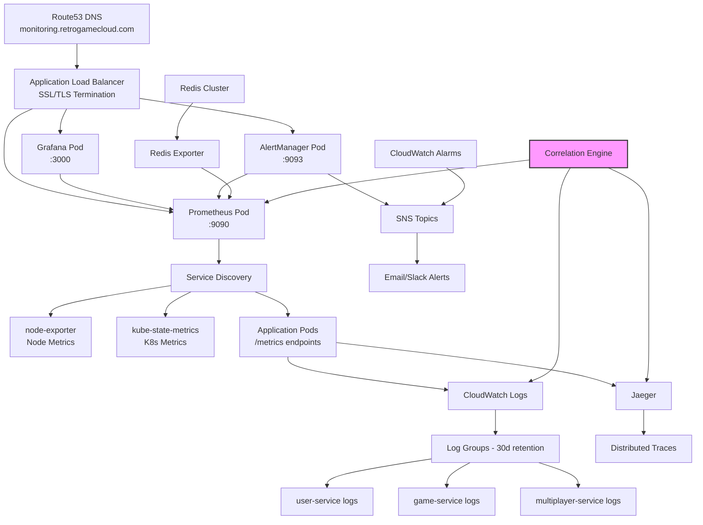

## 4.7.1. Stack de Monitoreo y Observabilidad

Retro Game Hub implementa observabilidad completa siguiendo las mejores prácticas SRE con Golden Signals, logging estructurado y correlación distribuida para debugging eficiente.

<CardGroup cols={4}>
  <Card title="Prometheus" icon="chart-line">
    **Métricas**

    Recolección y almacenamiento de métricas de aplicación y Golden Signals
  </Card>

  <Card title="Grafana" icon="chart-area">
    **Visualización**

    Dashboards SLI/SLO y análisis de correlación
  </Card>

  <Card title="CloudWatch" icon="cloud">
    **AWS Native**

    Logs estructurados centralizados con retention policies
  </Card>

  <Card title="AlertManager" icon="bell">
    **Notificaciones**

    Alertas inteligentes basadas en umbrales críticos
  </Card>
</CardGroup>

## 4.7.2. Arquitectura de Observabilidad



## 4.7.3. Golden Signals Implementation

### 4.7.3.1. Latencia (Latency)
```yaml
# prometheus-rules.yaml
groups:
  - name: golden-signals-latency
    rules:
      - record: retrogame:request_duration_seconds:rate5m
        expr: |
          histogram_quantile(0.95, 
            sum(rate(http_request_duration_seconds_bucket[5m])) 
            by (service, method, le)
          )

      - alert: HighLatency
        expr: |
          retrogame:request_duration_seconds:rate5m > 0.5
        for: 2m
        labels:
          severity: warning
          team: sre
        annotations:
          summary: "High latency on {{ $labels.service }}"
          description: "95th percentile latency is {{ $value }}s"
```

### 4.7.3.2. Tráfico (Traffic)
```yaml
  - name: golden-signals-traffic
    rules:
      - record: retrogame:request_rate:rate5m
        expr: |
          sum(rate(http_requests_total[5m])) 
          by (service, method, status)

      - alert: TrafficSpike
        expr: |
          (
            retrogame:request_rate:rate5m > 
            (retrogame:request_rate:rate1h offset 1h) * 2
          )
        for: 5m
        labels:
          severity: info
```

### 4.7.3.3. Errores (Errors)
```yaml
  - name: golden-signals-errors
    rules:
      - record: retrogame:error_rate:rate5m
        expr: |
          sum(rate(http_requests_total{status=~"5.."}[5m])) 
          by (service) / 
          sum(rate(http_requests_total[5m])) 
          by (service)

      - alert: HighErrorRate
        expr: retrogame:error_rate:rate5m > 0.05
        for: 2m
        labels:
          severity: critical
```

### 4.7.3.4. Saturación (Saturation)
```yaml
  - name: golden-signals-saturation
    rules:
      - alert: HighCPU
        expr: |
          avg(rate(container_cpu_usage_seconds_total[5m])) 
          by (pod) > 0.8
        for: 5m

      - alert: HighMemory
        expr: |
          container_memory_usage_bytes / 
          container_spec_memory_limit_bytes > 0.85
        for: 2m
```

## 4.7.4. Instrumentación de Microservicios

### 4.7.4.1. Node.js Prometheus Client
```javascript
// src/shared/monitoring/prometheus.js
const prometheus = require('prom-client');
const logger = require('./logger');

class PrometheusMetrics {
  constructor() {
    // Registry personalizado
    this.register = new prometheus.Registry();
    
    // Métricas por defecto
    prometheus.collectDefaultMetrics({
      register: this.register,
      prefix: 'retrogame_',
      gcDurationBuckets: [0.001, 0.01, 0.1, 1, 2, 5]
    });

    // Custom metrics
    this.httpDuration = new prometheus.Histogram({
      name: 'retrogame_http_request_duration_seconds',
      help: 'Duration of HTTP requests in seconds',
      labelNames: ['service', 'method', 'route', 'status'],
      buckets: [0.1, 0.3, 0.5, 0.7, 1, 3, 5, 7, 10],
      registers: [this.register]
    });

    this.httpRequests = new prometheus.Counter({
      name: 'retrogame_http_requests_total',
      help: 'Total number of HTTP requests',
      labelNames: ['service', 'method', 'route', 'status'],
      registers: [this.register]
    });

    this.activeConnections = new prometheus.Gauge({
      name: 'retrogame_active_connections',
      help: 'Number of active WebSocket connections',
      labelNames: ['service'],
      registers: [this.register]
    });

    this.businessMetrics = {
      gamesPlayed: new prometheus.Counter({
        name: 'retrogame_games_played_total',
        help: 'Total games played',
        labelNames: ['game_type', 'mode'],
        registers: [this.register]
      }),

      usersOnline: new prometheus.Gauge({
        name: 'retrogame_users_online',
        help: 'Current users online',
        registers: [this.register]
      }),

      matchmakingTime: new prometheus.Histogram({
        name: 'retrogame_matchmaking_duration_seconds',
        help: 'Time taken for matchmaking',
        buckets: [1, 2, 5, 10, 30, 60],
        registers: [this.register]
      })
    };
  }

  middleware() {
    return (req, res, next) => {
      const start = Date.now();
      
      res.on('finish', () => {
        const duration = (Date.now() - start) / 1000;
        
        const labels = {
          service: process.env.SERVICE_NAME,
          method: req.method,
          route: req.route?.path || 'unknown',
          status: res.statusCode
        };

        this.httpDuration.observe(labels, duration);
        this.httpRequests.inc(labels);
      });

      next();
    };
  }

  trackBusinessMetric(metric, labels = {}, value = 1) {
    try {
      if (this.businessMetrics[metric]) {
        if (this.businessMetrics[metric].inc) {
          this.businessMetrics[metric].inc(labels, value);
        } else {
          this.businessMetrics[metric].set(labels, value);
        }
      }
    } catch (error) {
      logger.error('Error tracking business metric', { metric, error });
    }
  }

  getMetrics() {
    return this.register.metrics();
  }
}

module.exports = new PrometheusMetrics();
```

### 4.7.4.2. Middleware Express
```javascript
// src/shared/monitoring/middleware.js
const prometheusMetrics = require('./prometheus');
const logger = require('./logger');
const { v4: uuidv4 } = require('uuid');

const monitoringMiddleware = (req, res, next) => {
  // Correlation ID
  req.correlationId = req.headers['x-correlation-id'] || uuidv4();
  res.setHeader('X-Correlation-ID', req.correlationId);

  // Request logging
  logger.info('Request started', {
    correlationId: req.correlationId,
    method: req.method,
    url: req.url,
    userAgent: req.headers['user-agent'],
    ip: req.ip
  });

  // Response logging
  const originalSend = res.send;
  res.send = function(data) {
    logger.info('Request completed', {
      correlationId: req.correlationId,
      status: res.statusCode,
      responseTime: Date.now() - req.startTime
    });
    
    return originalSend.call(this, data);
  };

  req.startTime = Date.now();
  next();
};

module.exports = {
  monitoring: monitoringMiddleware,
  prometheus: prometheusMetrics.middleware()
};
```

## 4.7.5. Distributed Tracing con Jaeger

### 4.7.5.1. Configuración OpenTelemetry
```javascript
// src/shared/tracing/tracer.js
const { NodeSDK } = require('@opentelemetry/sdk-node');
const { getNodeAutoInstrumentations } = require('@opentelemetry/auto-instrumentations-node');
const { JaegerExporter } = require('@opentelemetry/exporter-jaeger');
const { Resource } = require('@opentelemetry/resources');
const { SemanticResourceAttributes } = require('@opentelemetry/semantic-conventions');

const jaegerExporter = new JaegerExporter({
  endpoint: process.env.JAEGER_ENDPOINT || 'http://jaeger:14268/api/traces',
});

const sdk = new NodeSDK({
  resource: new Resource({
    [SemanticResourceAttributes.SERVICE_NAME]: process.env.SERVICE_NAME,
    [SemanticResourceAttributes.SERVICE_VERSION]: process.env.SERVICE_VERSION,
    [SemanticResourceAttributes.DEPLOYMENT_ENVIRONMENT]: process.env.NODE_ENV,
  }),
  traceExporter: jaegerExporter,
  instrumentations: [
    getNodeAutoInstrumentations({
      '@opentelemetry/instrumentation-redis': {
        enabled: true,
      },
      '@opentelemetry/instrumentation-http': {
        enabled: true,
        requestHook: (span, request) => {
          span.setAttributes({
            'http.request.correlation_id': request.headers['x-correlation-id']
          });
        }
      }
    })
  ],
});

sdk.start();

module.exports = sdk;
```

### 4.7.5.2. Custom Spans
```javascript
// src/shared/tracing/spans.js
const { trace, context } = require('@opentelemetry/api');
const tracer = trace.getTracer('retrogame-tracer');

class TracingHelper {
  static async executeWithSpan(name, operation, attributes = {}) {
    return tracer.startActiveSpan(name, { attributes }, async (span) => {
      try {
        const result = await operation(span);
        span.setStatus({ code: 2 }); // OK
        return result;
      } catch (error) {
        span.recordException(error);
        span.setStatus({ code: 2, message: error.message }); // ERROR
        throw error;
      } finally {
        span.end();
      }
    });
  }

  static getCurrentSpan() {
    return trace.getActiveSpan();
  }

  static addEvent(name, attributes = {}) {
    const span = this.getCurrentSpan();
    if (span) {
      span.addEvent(name, attributes);
    }
  }
}

module.exports = TracingHelper;
```

## 4.7.6. Logging Estructurado

### 4.7.6.1. Winston Logger
```javascript
// src/shared/monitoring/logger.js
const winston = require('winston');
const { CloudWatchLogsTransport } = require('winston-aws-cloudwatch');

const logger = winston.createLogger({
  level: process.env.LOG_LEVEL || 'info',
  format: winston.format.combine(
    winston.format.timestamp(),
    winston.format.errors({ stack: true }),
    winston.format.json(),
    winston.format.printf(({ timestamp, level, message, ...meta }) => {
      return JSON.stringify({
        timestamp,
        level,
        service: process.env.SERVICE_NAME,
        version: process.env.SERVICE_VERSION,
        environment: process.env.NODE_ENV,
        message,
        ...meta
      });
    })
  ),
  transports: [
    new winston.transports.Console({
      format: winston.format.combine(
        winston.format.colorize(),
        winston.format.simple()
      )
    }),
    
    new CloudWatchLogsTransport({
      logGroupName: `/retrogame/${process.env.SERVICE_NAME}`,
      logStreamName: `${process.env.SERVICE_NAME}-${new Date().getTime()}`,
      awsRegion: process.env.AWS_REGION,
      retentionInDays: 30
    })
  ]
});

module.exports = logger;
```

## 4.7.7. Dashboards Grafana

### 4.7.7.1. Service Overview Dashboard
```json
{
  "dashboard": {
    "title": "Retro Game Hub - Service Overview",
    "panels": [
      {
        "title": "Request Rate",
        "type": "stat",
        "targets": [
          {
            "expr": "sum(rate(retrogame_http_requests_total[5m]))",
            "legendFormat": "RPS"
          }
        ],
        "fieldConfig": {
          "defaults": {
            "unit": "reqps"
          }
        }
      },
      {
        "title": "Error Rate",
        "type": "stat",
        "targets": [
          {
            "expr": "sum(rate(retrogame_http_requests_total{status=~\"5..\"}[5m])) / sum(rate(retrogame_http_requests_total[5m]))",
            "legendFormat": "Error %"
          }
        ],
        "fieldConfig": {
          "defaults": {
            "unit": "percent",
            "thresholds": {
              "steps": [
                { "color": "green", "value": null },
                { "color": "yellow", "value": 0.01 },
                { "color": "red", "value": 0.05
```