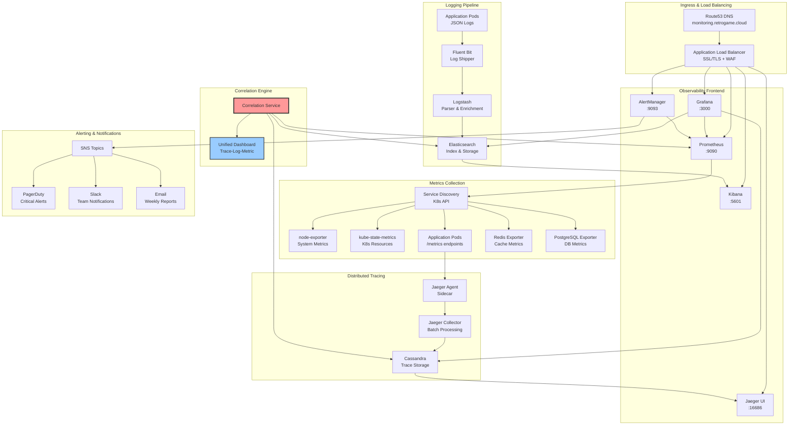

## Stack de Monitoreo y Observabilidad

Retro Game Hub implementa observabilidad completa siguiendo las mejores prácticas SRE con Golden Signals, logging estructurado, distributed tracing y correlación automatizada para debugging eficiente y resolución rápida de incidentes.

<CardGroup cols={4}>
  <Card title="Prometheus" icon="chart-line">
    **Métricas & SLIs**

    Recolección de Golden Signals y métricas de negocio con retention de 15 días
  </Card>

  <Card title="Grafana" icon="chart-area">
    **Dashboards & SLOs**

    Visualización unificada con alertas basadas en Service Level Objectives
  </Card>

  <Card title="ELK Stack" icon="magnifying-glass">
    **Logs Estructurados**

    Elasticsearch, Logstash y Kibana para análisis centralizado de logs JSON
  </Card>

  <Card title="Jaeger" icon="project-diagram">
    **Distributed Tracing**

    Correlación de requests distribuidos con sampling inteligente
  </Card>
</CardGroup>

## Arquitectura de Observabilidad Completa



## Golden Signals por Servicio

### User Service - Métricas SLI

<Tabs>
  <Tab title="Latencia">
    ```promql
    # P95 Response Time
    histogram_quantile(0.95, 
      rate(http_request_duration_seconds_bucket{
        service="user-service"
      }[5m])
    )

    # SLO: P95 < 200ms
    # Threshold: P95 > 300ms = Critical Alert
    ```
  </Tab>

  <Tab title="Tráfico">
    ```promql
    # Requests per Second
    sum(rate(http_requests_total{
      service="user-service"
    }[1m])) by (endpoint, method)

    # Peak Traffic: 10,000 RPS
    # Normal Traffic: 1,500-3,000 RPS
    ```
  </Tab>

  <Tab title="Errores">
    ```promql
    # Error Rate %
    sum(rate(http_requests_total{
      service="user-service",
      status=~"5..|4.."
    }[5m])) / 
    sum(rate(http_requests_total{
      service="user-service"
    }[5m])) * 100

    # SLO: Error Rate < 0.1%
    # Alert: Error Rate > 1%
    ```
  </Tab>

  <Tab title="Saturación">
    ```promql
    # CPU Utilization
    avg(rate(container_cpu_usage_seconds_total{
      pod=~"user-service-.*"
    }[5m])) * 100

    # Memory Usage %
    avg(container_memory_usage_bytes{
      pod=~"user-service-.*"
    }) / avg(container_spec_memory_limit_bytes{
      pod=~"user-service-.*"
    }) * 100

    # Alert: CPU > 80% or Memory > 85%
    ```
  </Tab>
</Tabs>

### Game Service - Métricas de Negocio

```promql
# Game Sessions Activas
sum(game_sessions_active{service="game-service"})

# ROM Downloads por Minuto
rate(rom_downloads_total[1m]) * 60

# WebRTC Connections Quality
avg(webrtc_connection_quality{service="multiplayer"})

# Leaderboard Update Latency
histogram_quantile(0.95, 
  rate(leaderboard_update_duration_seconds_bucket[5m])
)
```

## Dashboards Grafana Específicos

### 1. Service Overview Dashboard

<Frame>
  
</Frame>

**Panels incluidos:**
- **Service Health Matrix:** Estado de todos los servicios en grid
- **Golden Signals:** Latencia, Tráfico, Errores, Saturación por servicio
- **SLO Burn Rate:** Tendencia de consumo del error budget
- **Top Endpoints:** Ranking por latencia y volumen de requests

### 2. Kubernetes Infrastructure Dashboard

<Frame>
  
</Frame>

**Métricas clave:**
```promql
# Node Resource Usage
100 - (avg(irate(node_cpu_seconds_total{mode="idle"}[5m])) * 100)

# Pod Memory Usage by Namespace
sum(container_memory_usage_bytes{container!="POD"}) by (namespace)

# Persistent Volume Usage
(kubelet_volume_stats_used_bytes / kubelet_volume_stats_capacity_bytes) * 100
```

### 3. Business Metrics Dashboard

<Frame>
  
</Frame>

**KPIs principales:**
- **Daily Active Users (DAU):** Usuarios únicos últimas 24h
- **Game Session Duration:** Tiempo promedio de juego
- **Revenue per User:** Métricas de monetización
- **Feature Adoption:** Uso de nuevas funcionalidades

## Logging Estructurado y Parsing

### Formato JSON Estandardizado

```json
{
  "timestamp": "2024-01-15T10:30:45.123Z",
  "level": "INFO",
  "service": "user-service",
  "version": "v1.2.3",
  "traceId": "a1b2c3d4e5f6g7h8",
  "spanId": "x1y2z3a4b5c6",
  "userId": "usr_12345",
  "endpoint": "/api/users/profile",
  "method": "GET",
  "statusCode": 200,
  "duration": 45.2,
  "message": "User profile retrieved successfully",
  "metadata": {
    "userAgent": "RetroGameHub-iOS/1.5.0",
    "clientIp": "192.168.1.100",
    "region": "us-east-1"
  }
}
```

### Logstash Parsing Configuration

```ruby
filter {
  if [kubernetes][container][name] =~ /.*-service$/ {
    json {
      source => "message"
      target => "app"
    }
    
    date {
      match => [ "[app][timestamp]", "ISO8601" ]
    }
    
    if [app][traceId] {
      mutate {
        add_field => { "trace_correlation" => "%{[app][traceId]}" }
      }
    }
    
    if [app][level] == "ERROR" {
      mutate {
        add_tag => [ "alert_worthy" ]
      }
    }
  }
}
```

### Kibana Search Patterns

```json
// Buscar errores por traceId
{
  "query": {
    "bool": {
      "must": [
        {"term": {"app.traceId": "a1b2c3d4e5f6g7h8"}},
        {"range": {"@timestamp": {"gte": "now-1h"}}}
      ]
    }
  }
}

// Top errores por servicio
{
  "aggs": {
    "error_by_service": {
      "terms": {"field": "app.service"},
      "aggs": {
        "error_count": {
          "filter": {"term": {"app.level": "ERROR"}}
        }
      }
    }
  }
}
```

## Distributed Tracing con Jaeger

### Configuración de Sampling

```yaml
# jaeger-config.yaml
apiVersion: v1
kind: ConfigMap
metadata:
  name: jaeger-sampling-config
data:
  sampling_strategies.json: |
    {
      "service_strategies": [
        {
          "service": "user-service",
          "type": "probabilistic",
          "param": 0.1
        },
        {
          "service": "game-service", 
          "type": "ratelimiting",
          "max_traces_per_second": 100
        }
      ],
      "default_strategy": {
        "type": "adaptive",
        "param": 0.05
      }
    }
```

### Instrumentación de Código

<Tabs>
  <Tab title="Node.js">
    ```javascript
    const opentelemetry = require('@opentelemetry/api');
    const tracer = opentelemetry.trace.getTracer('user-service', '1.0.0');

    async function getUserProfile(userId) {
      const span = tracer.startSpan('get_user_profile', {
        attributes: {
          'user.id': userId,
          'operation.name': 'database.query'
        }
      });
      
      try {
        const user = await db.users.findById(userId);
        span.setAttributes({
          'user.found': !!user,
          'user.plan': user?.subscription?.plan || 'free'
        });
        return user;
      } catch (error) {
        span.recordException(error);
        span.setStatus({
          code: opentelemetry.SpanStatusCode.ERROR,
          message: error.message
        });
        throw error;
      } finally {
        span.end();
      }
    }
    ```
  </Tab>

  <Tab title="Go">
    ```go
    import (
        "go.opentelemetry.io/otel"
        "go.opentelemetry.io/otel/attribute"
    )

    func GetGameSession(ctx context.Context, sessionID string) (*GameSession, error) {
        tracer := otel.Tracer("game-service")
        ctx, span := tracer.Start(ctx, "get_game_session",
            trace.WithAttributes(
                attribute.String("session.id", sessionID),
                attribute.String("operation", "redis.get"),
            ),
        )
        defer span.End()

        session, err := redisClient.Get(ctx, sessionID).Result()
        if err != nil {
            span.RecordError(err)
            span.SetStatus(codes.Error, err.Error())
            return nil, err
        }

        span.SetAttributes(
            attribute.Bool("session.found", session != ""),
            attribute.String("session.game", parseGameType(session)),
        )

        return parseSession(session), nil
    }
    ```
  </Tab>
</Tabs>

## Correlación Cross-Service para Debugging

### Ejemplo de Debugging: Latencia Alta en Game Loading

**1. Detectar anomalía en Grafana:**
```promql
# Query que detectó el problema
histogram_quantile(0.95, 
  rate(http_request_duration_seconds_bucket{
    endpoint="/api/games/load",
    service="game-service"
  }[5m])
) > 2.0  # SLO violated: >2s response time
```

**2. Buscar trazas afectadas en Jaeger:**
- **Service:** `game-service`
- **Operation:** `load_game_rom`  
- **Min Duration:** `2s`
- **Time Range:** Últimos 15 minutos

<Frame>
  
</Frame>

**3. Correlacionar logs por traceId en Kibana:**
```json
{
  "query": {
    "bool": {
      "must": [
        {"term": {"app.traceId": "trace_abc123def456"}},
        {"range": {"@timestamp": {"gte": "now-15m"}}}
      ]
    }
  },
  "sort": [{"@timestamp": "asc"}]
}
```

**4. Identificar root cause:**
```json
// Log que reveló el problema
{
  "timestamp": "2024-01-15T14:30:22.156Z",
  "level": "WARN", 
  "service": "cdn-service",
  "traceId": "trace_abc123def456",
  "message": "S3 download timeout exceeded",
  "metadata": {
    "bucket": "retro-roms-us-east-1",
    "key": "nintendo/super-mario-bros.nes",
    "timeout": "30s",
    "actual_duration": "45.2s"
  }
}
```

### Unified Correlation Dashboard

<Frame>
  
</Frame>

**Variables de correlación:**
- `$traceId`: ID de traza para filtrar logs y spans relacionados
- `$service`: Servicio específico para análisis focused  
- `$timeRange`: Ventana temporal sincronizada entre todas las fuentes
- `$userId`: Filtro por usuario afectado para debugging personalizado

## Alertas Configuradas y Runbooks

### AlertManager Rules

```yaml
# alert-rules.yaml
groups:
- name: golden
```