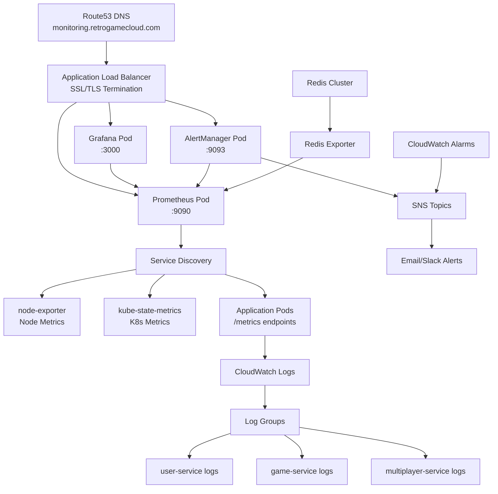

## Stack de Monitoreo y Observabilidad

Retro Game Hub utiliza un stack híbrido combinando Prometheus + Grafana para métricas en tiempo real y CloudWatch para logging y alertas críticas.

<CardGroup cols={4}>
  <Card title="Prometheus" icon="chart-line">
    **Métricas**

    Recolección y almacenamiento de métricas de aplicación
  </Card>

  <Card title="Grafana" icon="chart-area">
    **Visualización**

    Dashboards interactivos y análisis
  </Card>

  <Card title="CloudWatch" icon="cloud">
    **AWS Native**

    Logs centralizados y alertas críticas
  </Card>

  <Card title="AlertManager" icon="bell">
    **Notificaciones**

    Gestión y routing de alertas
  </Card>
</CardGroup>

## Arquitectura de Observabilidad



## Instalación con Helm

### Prerrequisitos

```bash
# Instalar Helm
curl https://raw.githubusercontent.com/helm/helm/main/scripts/get-helm-3 | bash

# Agregar repositorio de Prometheus
helm repo add prometheus-community https://prometheus-community.github.io/helm-charts
helm repo add grafana https://grafana.github.io/helm-charts
helm repo update
```

### Instalar kube-prometheus-stack

<Steps>
  <Step title="Crear namespace">
    ```bash
    kubectl create namespace monitoring
    ```
  </Step>

  <Step title="Configurar valores del stack">
    ```yaml
    # values-prometheus-stack.yaml
    prometheus:
      prometheusSpec:
        retention: 30d
        storageSpec:
          volumeClaimTemplate:
            spec:
              storageClassName: gp3
              resources:
                requests:
                  storage: 50Gi

    grafana:
      adminPassword: "secure-password"
      persistence:
        enabled: true
        size: 10Gi
      
    alertmanager:
      config:
        global:
          slack_api_url: 'YOUR_SLACK_WEBHOOK_URL'
        route:
          group_by: ['alertname']
          receiver: 'web.hook'
        receivers:
        - name: 'web.hook'
          slack_configs:
          - channel: '#alerts-retrogame'
            title: 'Retro Game Hub Alert'
    ```
  </Step>

  <Step title="Instalar el stack">
    ```bash
    helm install prometheus-stack prometheus-community/kube-prometheus-stack \
      --namespace monitoring \
      --values values-prometheus-stack.yaml
    ```
  </Step>
</Steps>

### Configurar Redis Exporter

```yaml
# redis-exporter.yaml
apiVersion: apps/v1
kind: Deployment
metadata:
  name: redis-exporter
  namespace: monitoring
spec:
  replicas: 1
  selector:
    matchLabels:
      app: redis-exporter
  template:
    metadata:
      labels:
        app: redis-exporter
    spec:
      containers:
      - name: redis-exporter
        image: oliver006/redis_exporter:latest
        env:
        - name: REDIS_ADDR
          value: "redis://redis-cluster:6379"
        - name: REDIS_PASSWORD
          valueFrom:
            secretKeyRef:
              name: redis-auth
              key: password
        ports:
        - containerPort: 9121
---
apiVersion: v1
kind: Service
metadata:
  name: redis-exporter
  namespace: monitoring
  labels:
    app: redis-exporter
spec:
  ports:
  - port: 9121
    targetPort: 9121
  selector:
    app: redis-exporter
```

## Métricas Clave para Gaming

### Métricas de Aplicación

<Tabs>
  <Tab title="Gaming Metrics">
    ```yaml
    # Métricas específicas de juegos
    - active_game_sessions_total
    - game_completion_rate
    - player_score_distribution
    - leaderboard_update_latency
    - matchmaking_queue_time
    ```
  </Tab>

  <Tab title="Redis Metrics">
    ```yaml
    # Métricas de Redis para rankings
    - redis_connected_clients
    - redis_used_memory_bytes
    - redis_keyspace_hits_total
    - redis_keyspace_misses_total
    - redis_commands_processed_total
    - redis_evicted_keys_total
    ```
  </Tab>

  <Tab title="Infrastructure Metrics">
    ```yaml
    # Métricas de infraestructura
    - node_cpu_usage_percent
    - node_memory_usage_percent
    - pod_restart_count
    - ingress_request_duration
    - database_connection_pool_usage
    ```
  </Tab>
</Tabs>

## Dashboards de Grafana

### Dashboard de Gaming Overview

```json
{
  "dashboard": {
    "title": "Retro Game Hub - Gaming Overview",
    "panels": [
      {
        "title": "Active Players",
        "type": "stat",
        "targets": [
          {
            "expr": "sum(active_game_sessions_total)"
          }
        ]
      },
      {
        "title": "Game Completion Rate",
        "type": "gauge",
        "targets": [
          {
            "expr": "rate(game_completion_rate[5m]) * 100"
          }
        ]
      },
      {
        "title": "Redis Rankings Performance",
        "type": "graph",
        "targets": [
          {
            "expr": "redis_commands_processed_total{cmd=\"zrevrange\"}"
          }
        ]
      }
    ]
  }
}
```

### Dashboard de Redis Monitoring

```json
{
  "dashboard": {
    "title": "Redis Cluster - Rankings System",
    "panels": [
      {
        "title": "Memory Usage",
        "type": "graph",
        "targets": [
          {
            "expr": "redis_used_memory_bytes / redis_config_maxmemory * 100"
          }
        ]
      },
      {
        "title": "Cache Hit Rate",
        "type": "stat",
        "targets": [
          {
            "expr": "redis_keyspace_hits_total / (redis_keyspace_hits_total + redis_keyspace_misses_total) * 100"
          }
        ]
      },
      {
        "title": "Evicted Keys",
        "type": "graph",
        "targets": [
          {
            "expr": "rate(redis_evicted_keys_total[5m])"
          }
        ]
      }
    ]
  }
}
```

## Alertas Críticas

### Alertas de Redis

```yaml
# redis-alerts.yaml
groups:
- name: redis.rules
  rules:
  - alert: RedisDown
    expr: redis_up == 0
    for: 5m
    labels:
      severity: critical
    annotations:
      summary: "Redis instance is down"
      description: "Redis instance {{ $labels.instance }} has been down for more than 5 minutes."

  - alert: RedisMemoryHigh
    expr: redis_used_memory_bytes / redis_config_maxmemory * 100 > 85
    for: 5m
    labels:
      severity: warning
    annotations:
      summary: "Redis memory usage is high"
      description: "Redis memory usage is above 85% on {{ $labels.instance }}"

  - alert: RedisEvictionHigh
    expr: rate(redis_evicted_keys_total[5m]) > 10
    for: 2m
    labels:
      severity: critical
    annotations:
      summary: "High Redis key eviction rate"
      description: "Redis is evicting keys at a high rate, rankings may be lost"

  - alert: RedisCacheHitRateLow
    expr: redis_keyspace_hits_total / (redis_keyspace_hits_total + redis_keyspace_misses_total) * 100 < 70
    for: 10m
    labels:
      severity: warning
    annotations:
      summary: "Redis cache hit rate is low"
      description: "Cache hit rate is below 70%, consider investigating cache strategy"
```

### Alertas de Gaming

```yaml
# gaming-alerts.yaml
groups:
- name: gaming.rules
  rules:
  - alert: HighGameSessionFailures
    expr: rate(game_session_failures_total[5m]) > 0.1
    for: 5m
    labels:
      severity: warning
    annotations:
      summary: "High game session failure rate"

  - alert: LeaderboardUpdateSlow
    expr: leaderboard_update_latency > 2
    for: 5m
    labels:
      severity: warning
    annotations:
      summary: "Leaderboard updates are slow"
      description: "Leaderboard updates taking more than 2 seconds"

  - alert: MatchmakingQueueTooLong
    expr: matchmaking_queue_time > 30
    for: 2m
    labels:
      severity: critical
    annotations:
      summary: "Matchmaking queue time too long"
      description: "Players waiting more than 30 seconds for matches"
```

## Troubleshooting de Redis

### Problema: Rankings Desactualizados

**Síntomas**: Los rankings muestran datos antiguos incluso después de nuevos scores.

**Diagnóstico**:

<Steps>
  <Step title="Verificar conexiones Redis">
    ```bash
    # Verificar conexiones activas
    kubectl exec -it redis-0 -- redis-cli INFO clients
    
    # Revisar comandos de ranking recientes
    kubectl exec -it redis-0 -- redis-cli MONITOR | grep -i "zadd\|zrevrange"
    ```
  </Step>

  <Step title="Verificar cache eviction">
    ```bash
    # Revisar política de evicción
    kubectl exec -it redis-0 -- redis-cli CONFIG GET maxmemory-policy
    
    # Verificar keys evictadas
    kubectl exec -it redis-0 -- redis-cli INFO stats | grep evicted
    ```
  </Step>

  <Step title="Verificar persistencia">
    ```bash
    # Verificar último save
    kubectl exec -it redis-0 -- redis-cli LASTSAVE
    
    # Verificar configuración de persistencia
    kubectl exec -it redis-0 -- redis-cli CONFIG GET save
    kubectl exec -it redis-0 -- redis-cli CONFIG GET appendonly
    ```
  </Step>
</Steps>

**Soluciones Comunes**:

<Tabs>
  <Tab title="Memory Issues">
    ```yaml
    # Ajustar límites de memoria
    apiVersion: v1
    kind: ConfigMap
    metadata:
      name: redis-config
    data:
      redis.conf: |
        maxmemory 2gb
        maxmemory-policy allkeys-lru
        # No evictar keys de rankings
        maxmemory-samples 10
    ```
  </Tab>

  <Tab title="Connection Limits">
    ```yaml
    # Incrementar límites de conexión
    data:
      redis.conf: |
        maxclients 10000
        tcp-keepalive 300
        timeout 0
    ```
  </Tab>

  <Tab title="Persistence Config">
    ```yaml
    # Configurar persistencia híbrida
    data:
      redis.conf: |
        # RDB para snapshots
        save 900 1
        save 300 10
        save 60 10000
        
        # AOF para durabilidad
        appendonly yes
        appendfsync everysec
        no-appendfsync-on-rewrite no
    ```
  </Tab>
</Tabs>

### Problema: Conexiones Redis Agotadas

**Síntomas**: Errores de "max number of clients reached" en logs.

**Diagnóstico y Solución**:

```bash
# Verificar conexiones actuales
kubectl exec -it redis-0 -- redis-cli INFO clients

# Identificar clientes conectados
kubectl exec -it redis-0 -- redis-cli CLIENT LIST

# Configurar connection pooling en aplicación
apiVersion: v1
kind: ConfigMap
metadata:
  name: app-redis-config
data:
  REDIS_POOL_SIZE: "20"
  REDIS_MAX_CONNECTIONS: "100"
  REDIS_CONNECTION_TIMEOUT: "5000"
```

### Problema: Cluster vs Standalone Decision

**Para Rankings System**:

<Tabs>
  <Tab title="Standalone (Recomendado)">
    ```yaml
    # Mejor para rankings debido a:
    # - Operaciones ZREVRANGE más eficientes
    # - No hay redistribución de shards
    # - Menor latencia para leaderboards globales
    
    apiVersion: apps/v1
    kind: StatefulSet
    metadata:
      name: redis-standalone
    spec:
      serviceName: redis
      replicas: 1
      template:
        spec:
          containers:
          - name: redis
            image: redis:7-alpine
            resources:
              requests:
                memory: "2Gi"
                cpu: "1"
              limits:
                memory: "4Gi"
                cpu: "2"
    ```
  </Tab>

  <Tab title="Cluster (Para Escala)">
    ```yaml
    # Usar solo si >100k usuarios activos
    # Considerar particionamiento por juego
    
    apiVersion: v1
    kind: ConfigMap
    metadata:
      name: redis-cluster-config
    data:
      redis.conf: |
        cluster-enabled yes
        cluster-config-file nodes.conf
        cluster-node-timeout 5000
        # Partition rankings por game_id
        cluster-require-full-coverage no
    ```
  </Tab>
</Tabs>

## CloudWatch Integration

### Log Groups Configuration

```yaml
apiVersion: v1
kind: ConfigMap
metadata:
  name: fluentbit-config
data:
  fluent-bit.conf: |
    [SERVICE]
        Flush         1
        Log_Level     info
        Daemon        off

    [INPUT]
        Name              tail
        Path              /var/log/containers/*retrogame*.log
        Parser            docker
        Tag               kube.*
        Refresh_Interval  5

    [OUTPUT]
        Name                cloudwatch_logs
        Match               kube.*
        region              us-east-1
        log_group_name      /aws/eks/retrogame-hub
        log_stream_prefix   ${HOSTNAME}-
        auto_create_group   true
```

### CloudWatch Al