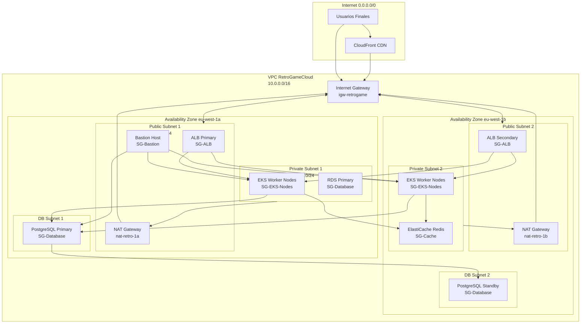

# 6.10. Diagrama de Red Detallado de VPC con Security Groups

Esta documentación detalla la configuración completa de red de la infraestructura AWS de RetroGameCloud, incluyendo configuración de VPC, subnets, security groups, route tables y flujo de tráfico.

## Visión General de la Arquitectura de Red

<Card title="Configuración de VPC Principal" icon="cloud">
**VPC CIDR**: `10.0.0.0/16` (65,536 IPs disponibles)

**Distribución por Availability Zones**:
- **AZ eu-west-1a**: Subnets públicas y privadas
- **AZ eu-west-1b**: Subnets públicas y privadas para alta disponibilidad
</Card>

## Diagrama de Topología de Red



## Configuración Detallada de Subnets

<Tabs>
<Tab title="Subnets Públicas">
### Subnets Públicas

| Subnet | CIDR | AZ | Propósito | IPs Disponibles |
|--------|------|----|-----------|--------------------|
| `subnet-public-1a` | `10.0.1.0/24` | eu-west-1a | ALB, NAT Gateway, Bastion | 251 |
| `subnet-public-1b` | `10.0.2.0/24` | eu-west-1b | ALB, NAT Gateway | 251 |

**Características**:
- **Auto-assign Public IP**: Habilitado
- **Route Table**: Ruta por defecto hacia Internet Gateway
- **NACL**: Default (permite todo el tráfico)
</Tab>
<Tab title="Subnets Privadas">
### Subnets Privadas

| Subnet | CIDR | AZ | Propósito | IPs Disponibles |
|--------|------|----|-----------|--------------------|
| `subnet-private-1a` | `10.0.10.0/24` | eu-west-1a | EKS Worker Nodes | 251 |
| `subnet-private-1b` | `10.0.20.0/24` | eu-west-1b | EKS Worker Nodes, Redis | 251 |

**Características**:
- **Auto-assign Public IP**: Deshabilitado
- **Route Table**: Ruta por defecto hacia NAT Gateway
- **NACL**: Custom (restringido según security groups)
</Tab>
<Tab title="Subnets de Base de Datos">
### Subnets de Base de Datos

| Subnet | CIDR | AZ | Propósito | IPs Disponibles |
|--------|------|----|-----------|--------------------|
| `subnet-db-1a` | `10.0.100.0/24` | eu-west-1a | RDS PostgreSQL Primary | 251 |
| `subnet-db-1b` | `10.0.101.0/24` | eu-west-1b | RDS PostgreSQL Standby | 251 |

**Características**:
- **Auto-assign Public IP**: Deshabilitado
- **Route Table**: Sin ruta a Internet (aisladas)
- **NACL**: Restrictivo (sólo tráfico de base de datos)
</Tab>
</Tabs>

## Security Groups Detallados

### SG-ALB (Application Load Balancer)

<Note>
Security Group para el Application Load Balancer que maneja el tráfico HTTP/HTTPS público.
</Note>

| Dirección | Protocolo | Puerto | Origen/Destino | Propósito |
|-----------|-----------|--------|----------------|-----------|
| **Inbound** | TCP | 80 | 0.0.0.0/0 | HTTP público |
| **Inbound** | TCP | 443 | 0.0.0.0/0 | HTTPS público |
| **Outbound** | TCP | 8000-8010 | SG-EKS-Nodes | Tráfico a microservicios |
| **Outbound** | TCP | 80 | 0.0.0.0/0 | Health checks |
| **Outbound** | TCP | 443 | 0.0.0.0/0 | Health checks HTTPS |

### SG-EKS-Nodes (Nodos de EKS)

<Warning>
Este security group controla el acceso a los nodos de EKS. Es crítico para la seguridad de los microservicios.
</Warning>

| Dirección | Protocolo | Puerto | Origen/Destino | Propósito |
|-----------|-----------|--------|----------------|-----------|
| **Inbound** | TCP | 8000 | SG-ALB | auth-service |
| **Inbound** | TCP | 8001 | SG-ALB | user-service |
| **Inbound** | TCP | 8002 | SG-ALB | game-catalog-service |
| **Inbound** | TCP | 8003 | SG-ALB | score-service |
| **Inbound** | TCP | 8004 | SG-ALB | ranking-service |
| **Inbound** | TCP | 22 | SG-Bastion | SSH management |
| **Inbound** | TCP | 10250 | SG-EKS-Control | kubelet API |
| **Inbound** | TCP | 30000-32767 | SG-ALB | NodePort services |
| **Outbound** | TCP | 5432 | SG-Database | PostgreSQL |
| **Outbound** | TCP | 6379 | SG-Cache | Redis |
| **Outbound** | TCP | 443 | 0.0.0.0/0 | HTTPS externo |
| **Outbound** | TCP | 80 | 0.0.0.0/0 | HTTP externo |

### SG-Database (PostgreSQL RDS)

| Dirección | Protocolo | Puerto | Origen/Destino | Propósito |
|-----------|-----------|--------|----------------|-----------|
| **Inbound** | TCP | 5432 | SG-EKS-Nodes | Conexiones de app |
| **Inbound** | TCP | 5432 | SG-Bastion | Admin access |
| **Outbound** | TCP | 5432 | SG-Database | Replicación |

### SG-Cache (ElastiCache Redis)

| Dirección | Protocolo | Puerto | Origen/Destino | Propósito |
|-----------|-----------|--------|----------------|-----------|
| **Inbound** | TCP | 6379 | SG-EKS-Nodes | Cache access |
| **Inbound** | TCP | 6379 | SG-Bastion | Admin monitoring |

### SG-Bastion (Bastion Host)

| Dirección | Protocolo | Puerto | Origen/Destino | Propósito |
|-----------|-----------|--------|----------------|-----------|
| **Inbound** | TCP | 22 | IP-Admin/32 | SSH admin access |
| **Outbound** | TCP | 22 | SG-EKS-Nodes | SSH a nodos |
| **Outbound** | TCP | 5432 | SG-Database | DB admin |
| **Outbound** | TCP | 6379 | SG-Cache | Cache admin |
| **Outbound** | TCP | 443 | 0.0.0.0/0 | Updates |

## Route Tables Detalladas

<Tabs>
<Tab title="Public Route Table">
### Route Table Públicas

**Nombre**: `rt-public-retrogame`
**Asociado con**: subnet-public-1a, subnet-public-1b

| Destino | Target | Propósito |
|---------|--------|-----------|
| `10.0.0.0/16` | Local | Tráfico interno VPC |
| `0.0.0.0/0` | igw-retrogame | Internet access |

```yaml
# terraform/route-tables.tf
resource "aws_route_table" "public" {
  vpc_id = aws_vpc.main.id
  
  route {
    cidr_block = "0.0.0.0/0"
    gateway_id = aws_internet_gateway.main.id
  }
  
  tags = {
    Name = "rt-public-retrogame"
    Environment = "production"
  }
}
```
</Tab>
<Tab title="Private Route Tables">
### Route Tables Privadas

**Nombre AZ1**: `rt-private-1a-retrogame`
**Asociado con**: subnet-private-1a

| Destino | Target | Propósito |
|---------|--------|-----------|
| `10.0.0.0/16` | Local | Tráfico interno VPC |
| `0.0.0.0/0` | nat-retro-1a | Internet via NAT |

**Nombre AZ2**: `rt-private-1b-retrogame`
**Asociado con**: subnet-private-1b

| Destino | Target | Propósito |
|---------|--------|-----------|
| `10.0.0.0/16` | Local | Tráfico interno VPC |
| `0.0.0.0/0` | nat-retro-1b | Internet via NAT |

```yaml
# terraform/route-tables.tf
resource "aws_route_table" "private_1a" {
  vpc_id = aws_vpc.main.id
  
  route {
    cidr_block = "0.0.0.0/0"
    nat_gateway_id = aws_nat_gateway.main_1a.id
  }
  
  tags = {
    Name = "rt-private-1a-retrogame"
    Environment = "production"
  }
}
```
</Tab>
<Tab title="Database Route Tables">
### Route Tables de Base de Datos

**Nombre**: `rt-database-retrogame`
**Asociado con**: subnet-db-1a, subnet-db-1b

| Destino | Target | Propósito |
|---------|--------|-----------|
| `10.0.0.0/16` | Local | Tráfico interno VPC únicamente |

<Note>
Las subnets de base de datos NO tienen acceso a Internet por seguridad.
</Note>

```yaml
# terraform/route-tables.tf
resource "aws_route_table" "database" {
  vpc_id = aws_vpc.main.id
  
  # Solo ruta local - sin acceso a Internet
  tags = {
    Name = "rt-database-retrogame"
    Environment = "production"
    Purpose = "isolated-database"
  }
}
```
</Tab>
</Tabs>

## NACLs (Network Access Control Lists)

### NACL para Subnets Públicas

<Warning>
Las NACLs actúan como firewall a nivel de subnet. Son stateless y se evalúan antes que los security groups.
</Warning>

| Regla | Tipo | Protocolo | Puerto | Origen/Destino | Acción |
|-------|------|-----------|--------|----------------|--------|
| 100 | Inbound | TCP | 80 | 0.0.0.0/0 | ALLOW |
| 110 | Inbound | TCP | 443 | 0.0.0.0/0 | ALLOW |
| 120 | Inbound | TCP | 22 | IP-Admin/32 | ALLOW |
| 130 | Inbound | TCP | 1024-65535 | 0.0.0.0/0 | ALLOW |
| * | Inbound | ALL | ALL | 0.0.0.0/0 | DENY |
| 100 | Outbound | TCP | 80 | 0.0.0.0/0 | ALLOW |
| 110 | Outbound | TCP | 443 | 0.0.0.0/0 | ALLOW |
| 120 | Outbound | TCP | 1024-65535 | 0.0.0.0/0 | ALLOW |
| * | Outbound | ALL | ALL | 0.0.0.0/0 | DENY |

###