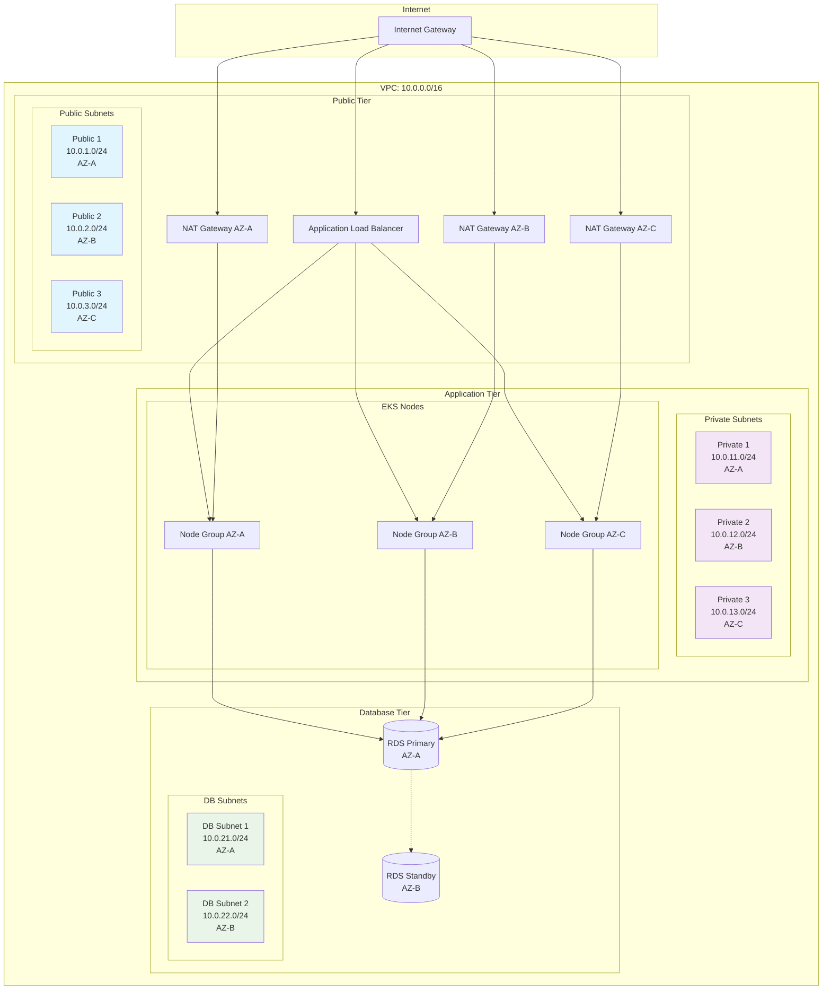

## 4.4.1. Arquitectura de Red

Retro Game Hub utiliza una VPC dedicada con subnets públicas y privadas distribuidas en 3 zonas de disponibilidad para alta disponibilidad.

## 4.4.2. Configuración de VPC

<CardGroup cols={3}>
  <Card title="CIDR Block" icon="network-wired">
    **10.0.0.0/16**

    65,536 IPs disponibles
  </Card>

  <Card title="Zonas" icon="server">
    **3 AZs**

    Alta disponibilidad
  </Card>

  <Card title="Subnets" icon="diagram-project">
    **6 Subnets**

    3 públicas + 3 privadas
  </Card>
</CardGroup>

## 4.4.3. Topología de Red

<Frame>



</Frame>

## 4.4.4. Security Groups

### Application Load Balancer

```json
{
  "name": "alb-security-group",
  "ingress": [
    {
      "protocol": "tcp",
      "port": 443,
      "source": "0.0.0.0/0"
    },
    {
      "protocol": "tcp",
      "port": 80,
      "source": "0.0.0.0/0"
    }
  ],
  "egress": [
    {
      "protocol": "tcp",
      "port": 80,
      "destination": "eks-nodes-sg"
    }
  ]
}

```

### EKS Nodes

```json
{
  "name": "eks-nodes-security-group",
  "ingress": [
    {
      "protocol": "tcp",
      "port": 80,
      "source": "alb-security-group"
    },
    {
      "protocol": "tcp",
      "ports": "1025-65535",
      "source": "self"
    }
  ],
  "egress": [
    {
      "protocol": "tcp",
      "port": 5432,
      "destination": "rds-security-group"
    }
  ]
}

```

### RDS Database

```json
{
  "name": "rds-security-group",
  "ingress": [
    {
      "protocol": "tcp",
      "port": 5432,
      "source": "eks-nodes-sg"
    }
  ],
  "egress": []
}

```

## 4.4.5. Routing Tables

<CardGroup cols={2}>
  <Card title="Public Route Table" icon="route">
    - **Destino**: 10.0.0.0/16 → Local
    - **Destino**: 0.0.0.0/0 → Internet Gateway
  </Card>

  <Card title="Private Route Tables" icon="route">
    - **Destino**: 10.0.0.0/16 → Local
    - **Destino**: 0.0.0.0/0 → NAT Gateway (por AZ)
  </Card>
</CardGroup>

## 4.4.6. Network ACLs

### Default NACL Rules

```yaml
inbound_rules:
  - rule: 100
    protocol: tcp
    port_range: 80
    cidr: 10.0.0.0/16
    action: allow

  - rule: 110
    protocol: tcp
    port_range: 443
    cidr: 10.0.0.0/16
    action: allow

  - rule: 120
    protocol: tcp
    port_range: 1024-65535
    cidr: 0.0.0.0/0
    action: allow

outbound_rules:
  - rule: 100
    protocol: tcp
    port_range: 80
    cidr: 0.0.0.0/0
    action: allow

  - rule: 110
    protocol: tcp
    port_range: 443
    cidr: 0.0.0.0/0
    action: allow

```

## 4.4.7. DNS y Service Discovery

<Info>
La VPC tiene **DNS Resolution** y **DNS Hostnames** habilitados para permitir la resolución de nombres dentro de la red.
</Info>

### Route 53 Private Hosted Zone

- **Zona**: `retro-game-hub.local`

- **Registros**:
  - `rds.retro-game-hub.local` → RDS Endpoint
  - `redis.retro-game-hub.local` → ElastiCache Endpoint

### EKS Service Discovery
Los servicios de Kubernetes utilizan **CoreDNS** para resolución interna:

- `user-service.default.svc.cluster.local`

- `game-service.default.svc.cluster.local`

- `notification-service.default.svc.cluster.local`

## 4.4.8. Monitoreo de Red

### VPC Flow Logs

```yaml
flow_logs:
  destination: CloudWatch Logs
  traffic_type: ALL
  log_format: "${srcaddr} ${dstaddr} ${srcport} ${dstport} ${protocol} ${packets} ${bytes} ${start} ${end} ${action}"
  retention: 30 days

```

### Métricas Clave
<CardGroup cols={3}>
  <Card title="Latencia" icon="clock">
    **< 50ms**

    Entre servicios internos
  </Card>

  <Card title="Throughput" icon="gauge-high">
    **10 Gbps**

    Capacidad máxima de red
  </Card>

  <Card title="Availability" icon="shield-check">
    **99.99%**

    Uptime objetivo de red
  </Card>
</CardGroup>