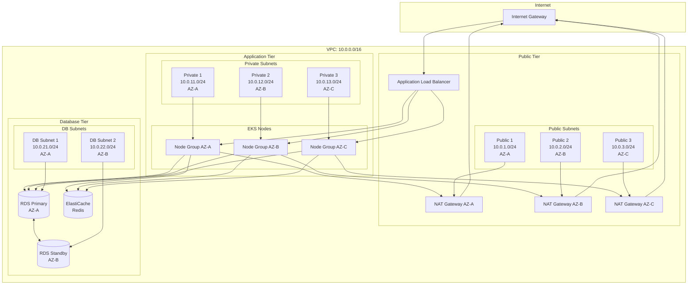
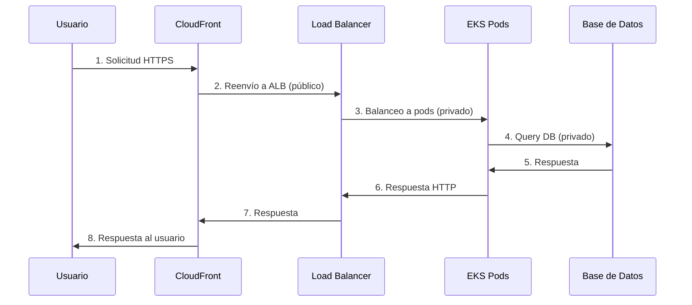
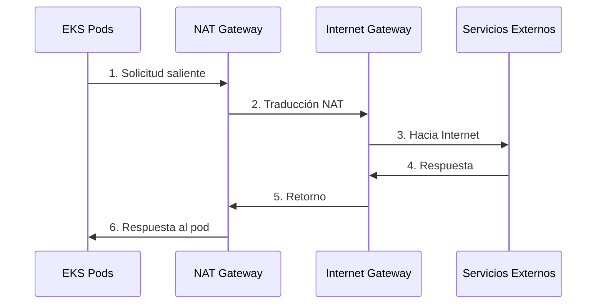

## Arquitectura de Red

Retro Game Hub utiliza una VPC dedicada con subnets públicas y privadas distribuidas en 3 zonas de disponibilidad para alta disponibilidad.

## Configuración de VPC

<CardGroup cols={3}>
  <Card title="CIDR Block" icon="network-wired">
    **10.0.0.0/16**

    65,536 IPs disponibles
  </Card>

  <Card title="Zonas" icon="server">
    **3 AZs**

    Alta disponibilidad
  </Card>

  <Card title="Subnets" icon="diagram-project">
    **6 Subnets**

    3 públicas + 3 privadas
  </Card>
</CardGroup>

## Topología de Red

<Frame>

</Frame>

## Diseño de Subnets

### Subnets Públicas

Tienen acceso directo a Internet vía Internet Gateway.

<Table>
  <thead>
    <tr>
      <th>Subnet</th>
      <th>CIDR</th>
      <th>AZ</th>
      <th>Uso</th>
    </tr>
  </thead>
  <tbody>
    <tr>
      <td>**Public 1**</td>
      <td>10.0.1.0/24</td>
      <td>eu-west-1a</td>
      <td>ALB, NAT Gateway</td>
    </tr>
    <tr>
      <td>**Public 2**</td>
      <td>10.0.2.0/24</td>
      <td>eu-west-1b</td>
      <td>ALB, NAT Gateway</td>
    </tr>
    <tr>
      <td>**Public 3**</td>
      <td>10.0.3.0/24</td>
      <td>eu-west-1c</td>
      <td>ALB, NAT Gateway</td>
    </tr>
  </tbody>
</Table>

**Recursos en subnets públicas:**
- Application Load Balancer (ALB)
- NAT Gateway (uno por AZ)
- Bastion Host (opcional)

### Subnets Privadas

Sin acceso directo a Internet - salen a través del NAT Gateway.

<Table>
  <thead>
    <tr>
      <th>Subnet</th>
      <th>CIDR</th>
      <th>AZ</th>
      <th>Uso</th>
    </tr>
  </thead>
  <tbody>
    <tr>
      <td>**Private 1**</td>
      <td>10.0.11.0/24</td>
      <td>eu-west-1a</td>
      <td>EKS nodes</td>
    </tr>
    <tr>
      <td>**Private 2**</td>
      <td>10.0.12.0/24</td>
      <td>eu-west-1b</td>
      <td>EKS nodes</td>
    </tr>
    <tr>
      <td>**Private 3**</td>
      <td>10.0.13.0/24</td>
      <td>eu-west-1c</td>
      <td>EKS nodes</td>
    </tr>
  </tbody>
</Table>

### Subnets de Base de Datos

<Table>
  <thead>
    <tr>
      <th>Subnet</th>
      <th>CIDR</th>
      <th>AZ</th>
      <th>Uso</th>
    </tr>
  </thead>
  <tbody>
    <tr>
      <td>**DB 1**</td>
      <td>10.0.21.0/24</td>
      <td>eu-west-1a</td>
      <td>RDS primary, ElastiCache</td>
    </tr>
    <tr>
      <td>**DB 2**</td>
      <td>10.0.22.0/24</td>
      <td>eu-west-1b</td>
      <td>RDS standby</td>
    </tr>
  </tbody>
</Table>

## Flujo de Tráfico

### Tráfico Entrante

<Frame>

</Frame>

### Tráfico Saliente

<Frame>

</Frame>

## Security Groups

### ALB Security Group

<Accordion title="alb-security-group">
```yaml
Inbound Rules:
  - Port: 80
    Protocol: HTTP
    Source: 0.0.0.0/0
    Description: "HTTP from anywhere"
  
  - Port: 443
    Protocol: HTTPS
    Source: 0.0.0.0/0
    Description: "HTTPS from anywhere"

Outbound Rules:
  - Port: 8080
    Protocol: HTTP
    Destination: eks-nodes-sg
    Description: "To EKS nodes"
```
</Accordion>

### EKS Nodes Security Group

<Accordion title="eks-nodes-security-group">
```yaml
Inbound Rules:
  - Port: 8080
    Protocol: HTTP
    Source: alb-security-group
    Description: "From ALB"
  
  - Port: 443
    Protocol: HTTPS
    Source: eks-control-plane-sg
    Description: "From EKS control plane"
  
  - Ports: 1025-65535
    Protocol: TCP
    Source: self
    Description: "Inter-node communication"

Outbound Rules:
  - Port: 443
    Protocol: HTTPS
    Destination: 0.0.0.0/0
    Description: "HTTPS to anywhere"
  
  - Port: 5432
    Protocol: TCP
    Destination: rds-security-group
    Description: "To PostgreSQL"
  
  - Port: 6379
    Protocol: TCP
    Destination: redis-security-group
    Description: "To Redis"
```
</Accordion>

### RDS Security Group

<Accordion title="rds-security-group">
```yaml
Inbound Rules:
  - Port: 5432
    Protocol: TCP
    Source: eks-nodes-sg
    Description: "From EKS nodes"

Outbound Rules:
  - None (managed by AWS)
```
</Accordion>

### Redis Security Group

<Accordion title="redis-security-group">
```yaml
Inbound Rules:
  - Port: 6379
    Protocol: TCP
    Source: eks-nodes-sg
    Description: "From EKS nodes"

Outbound Rules:
  - None (managed by AWS)
```
</Accordion>

## Network ACLs

### Subnet Pública - NACL

<Table>
  <thead>
    <tr>
      <th>Regla</th>
      <th>Tipo</th>
      <th>Protocolo</th>
      <th>Puerto</th>
      <th>Origen/Destino</th>
      <th>Acción</th>
    </tr>
  </thead>
  <tbody>
    <tr>
      <td>100</td>
      <td>Inbound</td>
      <td>TCP</td>
      <td>80</td>
      <td>0.0.0.0/0</td>
      <td>ALLOW</td>
    </tr>
    <tr>
      <td>110</td>
      <td>Inbound</td>
      <td>TCP</td>
      <td>443</td>
      <td>0.0.0.0/0</td>
      <td>ALLOW</td>
    </tr>
    <tr>
      <td>120</td>
      <td>Inbound</td>
      <td>TCP</td>
      <td>1024-65535</td>
      <td>0.0.0.0/0</td>
      <td>ALLOW</td>
    </tr>
    <tr>
      <td>100</td>
      <td>Outbound</td>
      <td>TCP</td>
      <td>8080</td>
      <td>10.0.0.0/16</td>
      <td>ALLOW</td>
    </tr>
    <tr>
      <td>110</td>
      <td>Outbound</td>
      <td>TCP</td>
      <td>1024-65535</td>
      <td>0.0.0.0/0</td>
      <td>ALLOW</td>
    </tr>
  </tbody>
</Table>

### Subnet Privada - NACL

<Table>
  <thead>
    <tr>
      <th>Regla</th>
      <th>Tipo</th>
      <th>Protocolo</th>
      <th>Puerto</th>
      <th>Origen/Destino</th>
      <th>Acción</th>
    </tr>
  </thead>
  <tbody>
    <tr>
      <td>100</td>
      <td>Inbound</td>
      <td>TCP</td>
      <td>8080</td>
      <td>10.0.0.0/16</td>
      <td>ALLOW</td>
    </tr>
    <tr>
      <td>110</td>
      <td>Inbound</td>
      <td>TCP</td>
      <td>443</td>
      <td>10.0.0.0/16</td>
      <td>ALLOW</td>
    </tr>
    <tr>
      <td>120</td>
      <td>Inbound</td>
      <td>TCP</td>
      <td>1024-65535</td>
      <td>0.0.0.0/0</td>
      <td>ALLOW</td>
    </tr>
    <tr>
      <td>100</td>
      <td>Outbound</td>
      <td>TCP</td>
      <td>443</td>
      <td>0.0.0.0/0</td>
      <td>ALLOW</td>
    </tr>
    <tr>
      <td>110</td>
      <td>Outbound</td>
      <td>TCP</td>
      <td>5432</td>
      <td>10.0.0.0/16</td>
      <td>ALLOW</td>
    </tr>
    <tr>
      <td>120</td>
      <td>Outbound</td>
      <td>TCP</td>
      <td>6379</td>
      <td>10.0.0.0/16</td>
      <td>ALLOW</td>
    </tr>
  </tbody>
</Table>

## Configuración de Routing

### Route Tables

<Tabs>
  <Tab title="Public Route Table">
    ```yaml
    Routes:
      - Destination: 10.0.0.0/16
        Target: local
        Description: "VPC internal routing"
      
      - Destination: 0.0.0.0/0
        Target: igw-xxx
        Description: "Internet Gateway
</Tab>
</Tabs>
```