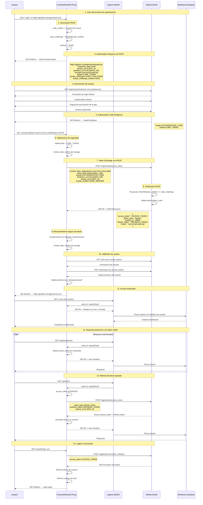
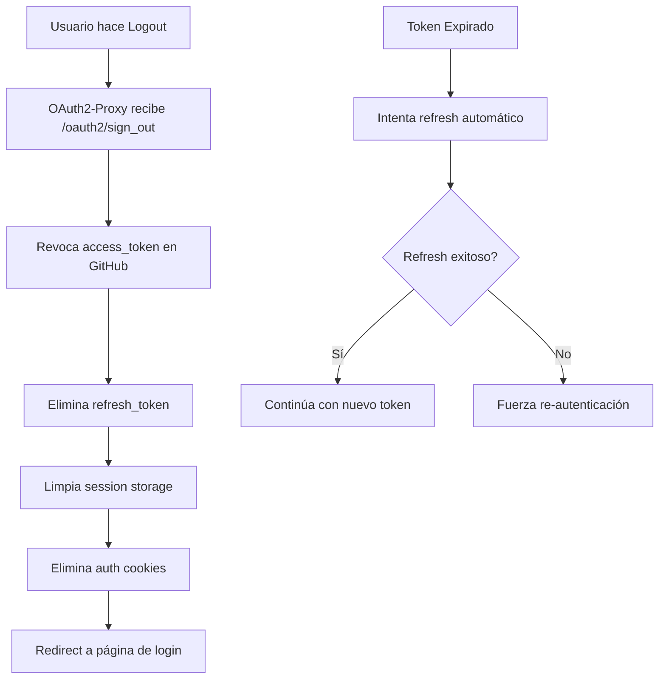

## Arquitectura de Autenticación

Retro Game Hub protege el acceso a Grafana, Prometheus y AlertManager usando **OAuth2-Proxy** con autenticación de GitHub, permitiendo solo usuarios autorizados de la organización `retrogamecloud`.

<CardGroup cols={3}>
  <Card title="OAuth2-Proxy" icon="shield-halved">
    **Capa de Auth**

    Intercepta requests
  </Card>

  <Card title="GitHub OAuth" icon="github">
    **Identity Provider**

    Valida usuarios
  </Card>

  <Card title="Ingress NGINX" icon="route">
    **Routing**

    Annotations para auth
  </Card>
</CardGroup>

## Flujo OAuth2 Authorization Code Grant con PKCE

### Flujo Completo de Autenticación



### Detalles de Implementación PKCE

<CardGroup cols={2}>
  <Card title="Code Verifier" icon="key">
    ```bash
    # Genera string aleatorio de 128 caracteres
    code_verifier=$(openssl rand -base64 96 | tr -d "=+/" | cut -c1-128)
    ```
  </Card>

  <Card title="Code Challenge" icon="lock">
    ```bash
    # SHA256 del verifier, codificado en base64url
    code_challenge=$(echo -n $code_verifier | sha256sum | cut -d' ' -f1 | xxd -r -p | base64 | tr -d "=" | tr '/+' '_-')
    ```
  </Card>
</CardGroup>

## Configuración OAuth2-Proxy

### ConfigMap con PKCE habilitado

```yaml
apiVersion: v1
kind: ConfigMap
metadata:
  name: oauth2-proxy-config
  namespace: monitoring
data:
  oauth2_proxy.cfg: |
    provider = "github"
    github_org = "retrogamecloud"
    
    # PKCE Configuration
    code_challenge_method = "S256"
    force_code_challenge_method = true
    
    # GitHub OAuth App
    client_id = "your-github-app-client-id"
    
    # Security
    cookie_secure = true
    cookie_httponly = true
    cookie_samesite = "lax"
    cookie_expire = "8h"
    
    # Token refresh
    refresh_token = true
    
    # Scopes necesarios
    scope = "user:email read:org"
    
    # URLs
    redirect_url = "https://grafana.retrogamehub.com/oauth2/callback"
    
    # Session storage
    session_store_type = "redis"
    redis_connection_url = "redis://redis-service:6379"
```

### Ingress con Annotations de Auth

```yaml
apiVersion: networking.k8s.io/v1
kind: Ingress
metadata:
  name: grafana-ingress
  annotations:
    # OAuth2-Proxy Authentication
    nginx.ingress.kubernetes.io/auth-url: "http://oauth2-proxy.monitoring.svc.cluster.local:4180/oauth2/auth"
    nginx.ingress.kubernetes.io/auth-signin: "http://oauth2-proxy.monitoring.svc.cluster.local:4180/oauth2/start"
    nginx.ingress.kubernetes.io/auth-response-headers: "X-Auth-Request-User,X-Auth-Request-Email,X-Auth-Request-Access-Token"
    
    # Security headers
    nginx.ingress.kubernetes.io/configuration-snippet: |
      auth_request_set $auth_user $upstream_http_x_auth_request_user;
      auth_request_set $auth_email $upstream_http_x_auth_request_email;
      proxy_set_header X-User $auth_user;
      proxy_set_header X-Email $auth_email;
spec:
  rules:
  - host: grafana.retrogamehub.com
    http:
      paths:
      - path: /
        pathType: Prefix
        backend:
          service:
            name: grafana-service
            port:
              number: 3000
```

## Seguridad y Mejores Prácticas

### Validaciones de Seguridad

<CardGroup cols={2}>
  <Card title="PKCE Protection" icon="shield-check">
    - **Code Verifier**: String aleatorio de 128 caracteres
    - **Code Challenge**: SHA256 hash del verifier
    - **Verificación**: GitHub valida que SHA256(verifier) = challenge
    - **Previene**: Intercepción de authorization codes
  </Card>

  <Card title="State Parameter" icon="fingerprint">
    - **CSRF Token**: Previene ataques CSRF
    - **Validación**: Estado debe coincidir en callback
    - **Entropía**: Valor aleatorio único por request
    - **Almacenamiento**: Session storage temporal
  </Card>
</CardGroup>

### Manejo de Tokens

```yaml
# Token Storage en Redis
apiVersion: v1
kind: Secret
metadata:
  name: oauth2-proxy-tokens
type: Opaque
data:
  # Configuración de expiración
  access-token-ttl: "28800"  # 8 horas
  refresh-token-ttl: "2592000"  # 30 días
  
  # Rotation policy
  token-rotation-enabled: "true"
  refresh-threshold: "900"  # 15 minutos antes de expirar
```

### Revocación y Logout



Este flujo OAuth2 con PKCE proporciona una capa robusta de seguridad para el acceso a las herramientas de monitoreo, asegurando que solo miembros autorizados de la organización puedan acceder a información sensible del sistema.