## Arquitectura de Autenticación

Retro Game Hub protege el acceso a Grafana, Prometheus y AlertManager usando **OAuth2-Proxy** con autenticación de GitHub, permitiendo solo usuarios autorizados de la organización `retrogamecloud`.

<CardGroup cols={3}>
  <Card title="OAuth2-Proxy" icon="shield-halved">
    **Capa de Auth**

    Intercepta requests
  </Card>

  <Card title="GitHub OAuth" icon="github">
    **Identity Provider**

    Valida usuarios
  </Card>

  <Card title="Ingress NGINX" icon="route">
    **Routing**

    Annotations para auth
  </Card>
</CardGroup>

## Diagrama de Flujo OAuth2

### Flujo de Autenticación Completo

```mermaid
sequenceDiagram
    participant U as Usuario
    participant B as Browser
    participant N as Ingress NGINX
    participant O as OAuth2-Proxy
    participant G as GitHub OAuth
    participant M as Monitoreo (Grafana)

    Note over U,M: Primera visita sin autenticación

    U->>B: Accede a https://grafana.retrogamehub.com
    B->>N: GET /

    Note over N: Ingress annotation: nginx.ingress.kubernetes.io/auth-url
    N->>O: auth-url: /oauth2/auth
    O-->>N: 401 Unauthorized (no cookie)
    N-->>B: 302 Redirect → /oauth2/start

    Note over U,G: Proceso de autenticación GitHub

    B->>O: GET /oauth2/start
    O-->>B: 302 Redirect → GitHub OAuth
    Note right of O: https://github.com/login/oauth/authorize<br/>?client_id=xxx&redirect_uri=xxx&scope=user:email

    B->>G: GET /login/oauth/authorize
    G-->>B: Formulario de login
    U->>B: Credenciales GitHub
    B->>G: POST /login/oauth/authorize
    G-->>B: Página de autorización
    U->>B: Autoriza aplicación

    Note over G,O: Intercambio de código por token

    G-->>B: 302 Redirect → /oauth2/callback?code=AUTHORIZATION_CODE
    B->>O: GET /oauth2/callback?code=AUTHORIZATION_CODE
    O->>G: POST /login/oauth/access_token
    Note right of O: client_id, client_secret, code
    G-->>O: Access Token

    Note over O: Validación de usuario y organización

    O->>G: GET /user (con access token)
    G-->>O: User info
    O->>G: GET /user/orgs (con access token)
    G-->>O: User organizations
    O->>O: Verificar membership en 'retrogamecloud'

    alt Usuario autorizado
        O-->>B: Set-Cookie: _oauth2_proxy=xxx + 302 Redirect → /
        Note over U,M: Acceso autorizado a la aplicación
        B->>N: GET / (con cookie)
        N->>O: auth-url: /oauth2/auth (con cookie)
        O->>O: Validar cookie/sesión
        O-->>N: 200 OK + Headers (X-Auth-Request-User, X-Auth-Request-Email)
        N->>M: Forward request + auth headers
        M-->>N: Grafana Dashboard
        N-->>B: Dashboard response
        B-->>U: Muestra Grafana
    else Usuario no autorizado
        O-->>B: 403 Forbidden
        Note right of O: No es miembro de retrogamecloud
    end

```



### Diagrama de Arquitectura OAuth2


## Configuraciones Requeridas

### GitHub OAuth App

<Steps>
  <Step title="Crear OAuth App en GitHub">
    1. Ve a GitHub Settings → Developer settings → OAuth Apps
    2. Click "New OAuth App"
    3. Completa el formulario:
       - **Application name**: `Retro Game Hub Monitoring`
       - **Homepage URL**: `https://retrogamehub.com`
       - **Authorization callback URL**: `https://grafana.retrogamehub.com/oauth2/callback`
  </Step>

  <Step title="Obtener credenciales">
    ```bash
    # Anotar estos valores
    CLIENT_ID="Ghp_xxxxxxxxxxxx"
    CLIENT_SECRET="gho_xxxxxxxxxxxx"
    ```

  </Step>

  <Step title="Configurar organización">
    ```yaml
    # En oauth2-proxy config
    github-org: "retrogamecloud"
    email-domains: "*"  # Permitir cualquier email de la org
    ```

  </Step>
</Steps>

### OAuth2-Proxy Configuration

```yaml
apiVersion: v1
kind: ConfigMap
metadata:
  name: oauth2-proxy-config
  namespace: monitoring
data:
  oauth2_proxy.cfg: |
    # OAuth Provider
    provider = "github"
    github_org = "retrogamecloud"

    # URLs
    http_address = "0.0.0.0:4180"
    redirect_url = "https://grafana.retrogamehub.com/oauth2/callback"

    # Upstream
    upstreams = [
      "http://grafana.monitoring.svc.cluster.local:3000"
    ]

    # Security
    cookie_secure = true
    cookie_httponly = true
    cookie_samesite = "lax"
    cookie_domains = [".retrogamehub.com"]

    # Sessions
    cookie_expire = "168h"  # 7 days
    cookie_refresh = "1h"

    # Email validation
    email_domains = ["*"]

    # Logging
    request_logging = true
    auth_logging = true

```

### Ingress Annotations

```yaml
apiVersion: networking.k8s.io/v1
kind: Ingress
metadata:
  name: grafana-ingress
  namespace: monitoring
  annotations:
    # OAuth2 Proxy annotations
    nginx.ingress.kubernetes.io/auth-url: "http://oauth2-proxy.monitoring.svc.cluster.local:4180/oauth2/auth"
    nginx.ingress.kubernetes.io/auth-signin: "https://grafana.retrogamehub.com/oauth2/start"
    nginx.ingress.kubernetes.io/auth-response-headers: "X-Auth-Request-User,X-Auth-Request-Email"

    # SSL
    cert-manager.io/cluster-issuer: "letsencrypt-prod"
    nginx.ingress.kubernetes.io/ssl-redirect: "true"
spec:
  tls:
    - hosts:
        - grafana.retrogamehub.com
      secretName: grafana-tls
  rules:
    - host: grafana.retrogamehub.com
      http:
        paths:
          - path: /oauth2
            pathType: Prefix
            backend:
              service:
                name: oauth2-proxy
                port:
                  number: 4180
          - path: /
            pathType: Prefix
            backend:
              service:
                name: grafana
                port:
                  number: 3000

```

## Seguridad y Mejores Prácticas

<CardGroup cols={2}>
  <Card title="Cookies Seguras" icon="cookie">
    ```yaml
    cookie_secure: true
    cookie_httponly: true
    cookie_samesite: "lax"
    ```

  </Card>

  <Card title="Validación de Organización" icon="building">
    ```yaml
    github_org: "retrogamecloud"
    # Solo miembros de la org
    ```

  </Card>

  <Card title="Headers de Auth" icon="header">
    ```yaml
    auth-response-headers:
      - X-Auth-Request-User
      - X-Auth-Request-Email
    ```

  </Card>

  <Card title="Renovación de Tokens" icon="refresh">
    ```yaml
    cookie_refresh: "1h"
    cookie_expire: "168h"
    ```

  </Card>
</CardGroup>

## Troubleshooting

### Problemas Comunes

<AccordionGroup>
  <Accordion title="Error 403: Forbidden después de login">
    **Causa**: Usuario no es miembro de la organización `retrogamecloud`

    **Solución**:
    ```bash
    # Verificar membership
    curl -H "Authorization: token $GITHUB_TOKEN" \
      https://api.github.com/orgs/retrogamecloud/members/USERNAME

    # Agregar usuario a la organización
    # Via GitHub UI: Settings → Member privileges
    ```

  </Accordion>

  <Accordion title="Redirect loop infinito">
    **Causa**: Misconfiguration en redirect URLs

    **Solución**:
    ```yaml
    # Verificar URLs en oauth2-proxy
    redirect_url: "https://grafana.retrogamehub.com/oauth2/callback"

    # Y en GitHub OAuth App
    Authorization callback URL: https://grafana.retrogamehub.com/oauth2/callback
    ```

  </Accordion>

  <Accordion title="Cookie not secure warnings">
    **Causa**: HTTPS no configurado correctamente

    **Solución**:
    ```yaml
    # Forzar HTTPS en ingress
    nginx.ingress.kubernetes.io/ssl-redirect: "true"

    # Cookie segura en oauth2-proxy
    cookie_secure: true
    ```

  </Accordion>
</AccordionGroup>

### Logs Útiles

```bash

# Logs oauth2-proxy
kubectl logs -f deployment/oauth2-proxy -n monitoring

# Logs ingress-nginx
kubectl logs -f deployment/ingress-nginx-controller -n ingress-nginx

# Debug auth headers
kubectl exec -it oauth2-proxy-pod -- curl -v http://localhost:4180/oauth2/auth

```