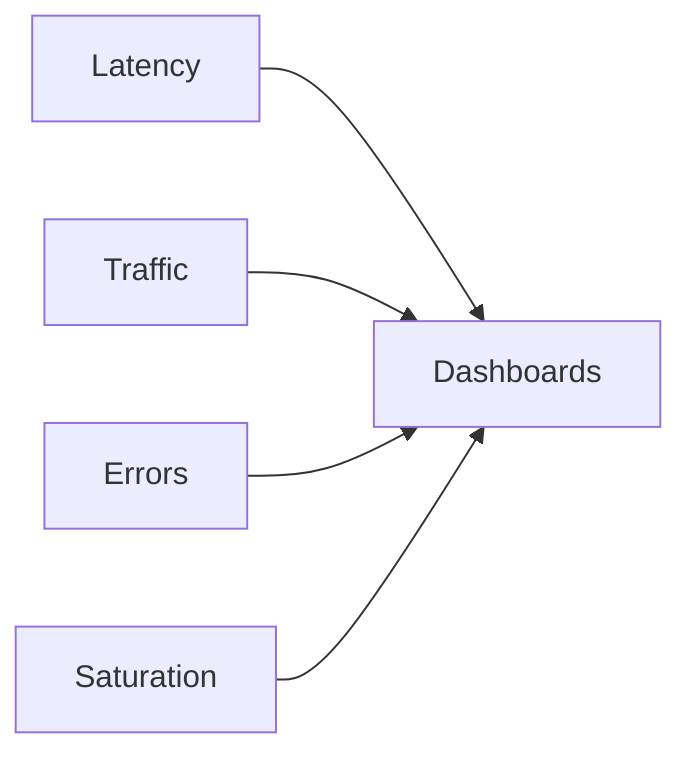

# Observabilidad

Stack completo de observabilidad con métricas, logs y traces distribuidos.

## Pilares de Observabilidad

<CardGroup cols={3}>
  <Card title="Métricas" icon="chart-bar">
    Prometheus + Grafana
  </Card>

  <Card title="Logs" icon="file-lines">
    CloudWatch Logs
  </Card>

  <Card title="Traces" icon="route">
    AWS X-Ray
  </Card>
</CardGroup>

## Golden Signals



## Dashboards Principales

### Sistema Overview

```yaml
panels:
  - title: Request Rate
    query: rate(http_requests_total[5m])

  - title: Error Rate
    query: rate(http_requests_total{status=~"5.."}[5m])

  - title: P95 Latency
    query: histogram_quantile(0.95, http_request_duration_seconds_bucket)

  - title: CPU Usage
    query: rate(container_cpu_usage_seconds_total[5m])

```

## Distributed Tracing

### Configuración X-Ray

```javascript
const AWSXRay = require('aws-xray-sdk');
const express = require('express');

const app = express();
app.use(AWSXRay.express.openSegment('GameCatalogService'));

app.get('/games/:id', (req, res) => {
  const segment = AWSXRay.getSegment();
  const subsegment = segment.addNewSubsegment('database-query');

  // Query database
  subsegment.close();

  res.json({ game: data });
});

app.use(AWSXRay.express.closeSegment());

```

## Métricas Custom

```typescript
import { Counter, Histogram } from 'prom-client';

const scoreSubmissions = new Counter({
  name: 'score_submissions_total',
  help: 'Total score submissions',
  labelNames: ['game_id', 'status']
});

const scoreProcessingDuration = new Histogram({
  name: 'score_processing_duration_seconds',
  help: 'Score processing duration',
  buckets: [0.1, 0.5, 1, 2, 5]
});

// Uso
score Submissions.labels(gameId, 'success').inc();
scoreProcessingDuration.observe(duration);

```

- --

La observabilidad completa permite detectar y resolver problemas rápidamente.
