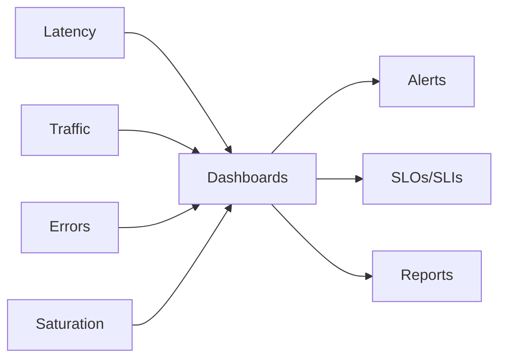
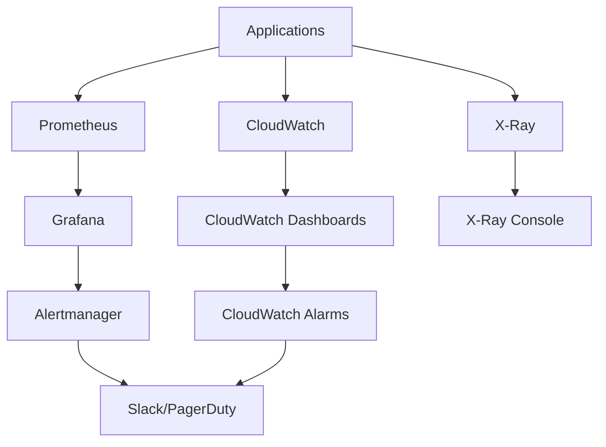

# Observabilidad

Stack completo de observabilidad con métricas, logs y traces distribuidos para monitoreo integral de la plataforma gaming.

## Pilares de Observabilidad

<CardGroup cols={3}>
  <Card title="Métricas" icon="chart-bar">
    Prometheus + Grafana
  </Card>

  <Card title="Logs" icon="file-lines">
    CloudWatch Logs + ELK Stack
  </Card>

  <Card title="Traces" icon="route">
    AWS X-Ray + OpenTelemetry
  </Card>
</CardGroup>

## Golden Signals



## Stack de Monitoreo

### Arquitectura de Observabilidad



### Componentes del Stack

<CardGroup cols={2}>
  <Card title="Métricas" icon="chart-line">
    - **Prometheus**: Recolección y almacenamiento
    - **Grafana**: Visualización y alertas
    - **Node Exporter**: Métricas del sistema
    - **Application Metrics**: Métricas custom
  </Card>

  <Card title="Logs" icon="file-text">
    - **CloudWatch Logs**: Logs centralizados
    - **ELK Stack**: Elasticsearch, Logstash, Kibana
    - **Structured Logging**: JSON format
    - **Log Aggregation**: Multi-service logs
  </Card>

  <Card title="Traces" icon="activity">
    - **AWS X-Ray**: Distributed tracing
    - **OpenTelemetry**: Instrumentación
    - **Trace Analysis**: Performance bottlenecks
    - **Service Map**: Dependencias visuales
  </Card>

  <Card title="Alertas" icon="bell">
    - **Alertmanager**: Prometheus alerts
    - **CloudWatch Alarms**: AWS native alerts
    - **PagerDuty**: Escalación de incidentes
    - **Slack**: Notificaciones en tiempo real
  </Card>
</CardGroup>

## Métricas Prometheus

### Configuración Prometheus

```yaml
# prometheus.yml
global:
  scrape_interval: 15s
  evaluation_interval: 15s

rule_files:
  - "alert_rules.yml"
  - "recording_rules.yml"

alerting:
  alertmanagers:
    - static_configs:
        - targets:
          - alertmanager:9093

scrape_configs:
  - job_name: 'gaming-api'
    static_configs:
      - targets: ['api:3000']
    metrics_path: /metrics
    scrape_interval: 10s

  - job_name: 'game-engine'
    static_configs:
      - targets: ['engine:8080']

  - job_name: 'user-service'
    static_configs:
      - targets: ['users:4000']

  - job_name: 'node-exporter'
    static_configs:
      - targets: ['node-exporter:9100']
```

### Métricas Custom de Gaming

```typescript
import { Counter, Histogram, Gauge, register } from 'prom-client';

// Métricas de gameplay
const gameSessionsActive = new Gauge({
  name: 'game_sessions_active_total',
  help: 'Number of active game sessions',
  labelNames: ['game_type', 'difficulty']
});

const scoreSubmissions = new Counter({
  name: 'score_submissions_total',
  help: 'Total score submissions',
  labelNames: ['game_id', 'status', 'player_level']
});

const gameLoadTime = new Histogram({
  name: 'game_load_duration_seconds',
  help: 'Game loading duration',
  labelNames: ['game_id', 'platform'],
  buckets: [0.1, 0.5, 1, 2, 5, 10]
});

const playerMatchmaking = new Histogram({
  name: 'matchmaking_duration_seconds',
  help: 'Time to find a match',
  labelNames: ['game_mode', 'skill_level'],
  buckets: [1, 5, 10, 30, 60, 120]
});

// Métricas de negocio
const revenueCounter = new Counter({
  name: 'revenue_total',
  help: 'Total revenue generated',
  labelNames: ['purchase_type', 'currency']
});

// Uso en el código
export class GameMetrics {
  static recordGameSession(gameType: string, difficulty: string) {
    gameSessionsActive.labels(gameType, difficulty).inc();
  }

  static recordScoreSubmission(gameId: string, status: string, playerLevel: string) {
    scoreSubmissions.labels(gameId, status, playerLevel).inc();
  }

  static recordGameLoad(gameId: string, platform: string, duration: number) {
    gameLoadTime.labels(gameId, platform).observe(duration);
  }

  static recordMatchmaking(gameMode: string, skillLevel: string, duration: number) {
    playerMatchmaking.labels(gameMode, skillLevel).observe(duration);
  }

  static recordRevenue(purchaseType: string, currency: string, amount: number) {
    revenueCounter.labels(purchaseType, currency).inc(amount);
  }
}
```

## Dashboards Grafana

### Gaming Platform Overview

```json
{
  "dashboard": {
    "title": "Gaming Platform Overview",
    "panels": [
      {
        "title": "Active Players",
        "type": "stat",
        "targets": [
          {
            "expr": "sum(game_sessions_active_total)",
            "legendFormat": "Active Sessions"
          }
        ]
      },
      {
        "title": "Request Rate",
        "type": "graph",
        "targets": [
          {
            "expr": "rate(http_requests_total[5m])",
            "legendFormat": "{{method}} {{endpoint}}"
          }
        ]
      },
      {
        "title": "Error Rate",
        "type": "graph",
        "targets": [
          {
            "expr": "rate(http_requests_total{status=~\"5..\"}[5m]) / rate(http_requests_total[5m])",
            "legendFormat": "Error Rate"
          }
        ]
      },
      {
        "title": "Game Performance",
        "type": "heatmap",
        "targets": [
          {
            "expr": "histogram_quantile(0.95, rate(game_load_duration_seconds_bucket[5m]))",
            "legendFormat": "P95 Load Time"
          }
        ]
      }
    ]
  }
}
```

### Dashboard de Gameplay Metrics

```yaml
# Gaming Specific Dashboard
panels:
  - title: "Games by Type"
    query: sum by (game_type) (game_sessions_active_total)
    type: pie

  - title: "Score Submission Rate"
    query: rate(score_submissions_total[5m])
    type: graph

  - title: "Matchmaking Performance"
    query: histogram_quantile(0.95, rate(matchmaking_duration_seconds_bucket[5m]))
    type: stat

  - title: "Revenue Trends"
    query: increase(revenue_total[1h])
    type: graph

  - title: "Player Distribution"
    query: game_sessions_active_total
    type: table
```

## Distributed Tracing

### Configuración X-Ray

```javascript
const AWSXRay = require('aws-xray-sdk');
const express = require('express');

const app = express();
app.use(AWSXRay.express.openSegment('GameCatalogService'));

// Middleware de tracing personalizado
app.use((req, res, next) => {
  const segment = AWSXRay.getSegment();
  segment.addMetadata('request', {
    userId: req.headers['x-user-id'],
    gameId: req.params.gameId,
    platform: req.headers['x-platform']
  });
  next();
});

app.get('/games/:id', async (req, res) => {
  const segment = AWSXRay.getSegment();
  
  // Database query subsegment
  const dbSubsegment = segment.addNewSubsegment('database-query');
  try {
    const gameData = await queryDatabase(req.params.id);
    dbSubsegment.addMetadata('query', {
      gameId: req.params.id,
      queryTime: Date.now()
    });
    dbSubsegment.close();
    
    // Cache check subsegment
    const cacheSubsegment = segment.addNewSubsegment('cache-check');
    const cachedStats = await redis.get(`game:${req.params.id}:stats`);
    cacheSubsegment.close();
    
    res.json({ 
      game: gameData,
      stats: JSON.parse(cachedStats || '{}')
    });
  } catch (error) {
    dbSubsegment.addError(error);
    dbSubsegment.close();
    res.status(500).json({ error: 'Game not found' });
  }
});

app.use(AWSXRay.express.closeSegment());
```

### OpenTelemetry Integration

```typescript
import { NodeSDK } from '@opentelemetry/sdk-node';
import { getNodeAutoInstrumentations } from '@opentelemetry/auto-instrumentations-node';
import { XRayPropagator } from '@opentelemetry/propagator-aws-xray';
import { AWSXRayIdGenerator } from '@opentelemetry/id-generator-aws-xray';

const sdk = new NodeSDK({
  traceExporter: new XRayTraceExporter(),
  instrumentations: [getNodeAutoInstrumentations()],
  textMapPropagator: new XRayPropagator(),
  idGenerator: new AWSXRayIdGenerator(),
});

sdk.start();
```

## Logging Estratégico

### Structured Logging

```typescript
import winston from 'winston';

const logger = winston.createLogger({
  format: winston.format.combine(
    winston.format.timestamp(),
    winston.format.json()
  ),
  transports: [
    new winston.transports.CloudWatchLogs({
      logGroupName: '/aws/lambda/gaming-platform',
      logStreamName: () => {
        const date = new Date().toISOString().split('T')[0];
        return `${date}-${process.env.AWS_LAMBDA_FUNCTION_VERSION}`;
      }
    })
  ]
});

// Gaming specific logging
export class GameLogger {
  static logGameEvent(event: {
    type: 'game_start' | 'game_end' | 'score_submit' | 'achievement';
    userId: string;
    gameId: string;
    metadata: any;
  }) {
    logger.info('game_event', {
      event_type: event.type,
      user_id: event.userId,
      game_id: event.gameId,
      timestamp: Date.now(),
      metadata: event.metadata,
      trace_id: process.env._X_AMZN_TRACE_ID
    });
  }

  static logPerformance(metric: {
    operation: string;
    duration: number;
    success: boolean;
    metadata?: any;
  }) {
    logger.info('performance_metric', {
      operation: metric.operation,
      duration_ms: metric.duration,
      success: metric.success,
      metadata: metric.metadata,
      timestamp: Date.now()
    });
  }
}
```

## Alertas y SLOs

### Reglas de Alertas

```yaml
# alert_rules.yml
groups:
  - name: gaming_platform_alerts
    rules:
      - alert: HighErrorRate
        expr: rate(http_requests_total{status=~"5.."}[5m]) > 0.05
        for: 2m
        labels:
          severity: critical
        annotations:
          summary: "High error rate detected"
          description: "Error rate is {{ $value }} errors per second"

      - alert: SlowGameLoading
        expr: histogram_quantile(0.95, rate(game_load_duration_seconds_bucket[5m])) > 10
        for: 5m
        labels:
          severity: warning
        annotations:
          summary: "Games loading slowly"
          description: "95th percentile load time is {{ $value }} seconds"

      - alert: LowActiveUsers
        expr: sum(game_sessions_active_total) < 100
        for: 10m
        labels:
          severity: info
        annotations:
          summary: "Low user activity"
          description: "Only {{ $value }} active sessions"

      - alert: HighMatchmakingTime
        expr: histogram_quantile(0.90, rate(matchmaking_duration_seconds_bucket[5m])) > 60
        for: 3m
        labels:
          severity: warning
        annotations:
          summary: "Matchmaking taking too long"
          description: "90th percentile matchmaking time is {{ $value }} seconds"
```

### SLI/SLO Definitions

```yaml
slos:
  game_availability:
    sli: "Rate of successful game launches"
    slo: "99.9% of games launch successfully"
    query: "rate(game_launches_total{status='success'}[5m]) / rate(game_launches_total[5m])"
    
  api_latency:
    sli: "API response time"
    slo: "95% of API requests complete within 200ms"
    query: "histogram_quantile(0.95, rate(http_request_duration_seconds_bucket[5m]))"
    
  matchmaking_success:
    sli: "Successful matchmaking rate"
    slo: "98% of matchmaking requests succeed within 30 seconds"
    query: "rate(matchmaking_success_total[5m]) / rate(matchmaking_requests_total[5m])"
```

## Health Checks

### Endpoint de Health

```typescript
app.get('/health', async (req, res) => {
  const health = {
    status: 'healthy',
    timestamp: new Date().toISOString(),
    uptime: process.uptime(),
    checks: {
      database: await checkDatabase(),
      redis: await checkRedis(),
      external_apis: await checkExternalAPIs()
    }
  };
  
  const isHealthy = Object.values(health.checks).every(check => check.status === 'healthy');
  
  res.status(isHealthy ? 200 : 503).json(health);
});

async function checkDatabase() {
  try {
    await db.query('SELECT 1');
    return { status: 'healthy', latency: Date.now() };
  } catch (error) {
    return { status: 'unhealthy', error: error.message };
  }
}
```