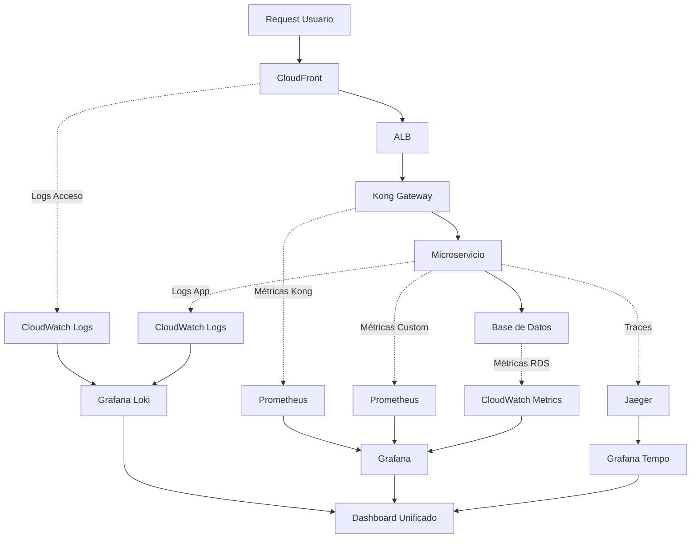

## 4.10.1. Introducción

La observabilidad es fundamental para mantener RetroGameCloud operativo y proporcionar una experiencia de usuario óptima. Esta guía consolida las mejores prácticas para monitorización, alertas y debugging distribuido.

<Note>
La observabilidad comprende tres pilares fundamentales: **métricas**, **logs** y **traces**. La correlación efectiva entre estos tres elementos permite identificar y resolver problemas rápidamente.
</Note>

## 4.10.2. Arquitectura de Observabilidad



## 4.10.3. Golden Signals por Servicio

### 4.10.3.1. Definición de Golden Signals

<Tabs>
<Tab title="Latencia">

* *Latencia**: Tiempo que tarda en procesarse una solicitud

- **P50**: 50% de las solicitudes

- **P95**: 95% de las solicitudes

- **P99**: 99% de las solicitudes

* *Ejemplo de consulta Prometheus**:

```promql
histogram_quantile(0.95,
  sum(rate(http_request_duration_seconds_bucket{service="game-catalog"}[5m])) by (le)
)

```

</Tab>

<Tab title="Tráfico">

* *Tráfico**: Demanda del sistema (RPS, QPM)

- **RPS**: Requests per Second

- **QPM**: Queries per Minute

- **Throughput**: Operaciones por unidad de tiempo

* *Ejemplo de consulta**:

```promql
sum(rate(http_requests_total{service="auth"}[1m]))

```

</Tab>

<Tab title="Errores">

* *Errores**: Tasa de solicitudes fallidas

- **Códigos 4xx**: Errores del cliente

- **Códigos 5xx**: Errores del servidor

- **Timeouts**: Solicitudes que exceden el tiempo límite

* *Ejemplo de consulta**:

```promql
sum(rate(http_requests_total{status=~"5.."}[5m])) /
sum(rate(http_requests_total[5m])) * 100

```

</Tab>

<Tab title="Saturación">

* *Saturación**: Utilización de recursos del sistema

- **CPU**: Porcentaje de uso del procesador

- **Memoria**: Uso de RAM y swap

- **Disco**: I/O y espacio disponible

- **Red**: Ancho de banda utilizado

* *Ejemplo de consulta**:

```promql
100 - (avg(irate(node_cpu_seconds_total{mode="idle"}[5m])) * 100)

```

</Tab>
</Tabs>

### 4.10.3.2. Métricas por Microservicio

<Accordion>
<AccordionItem title="Auth Service">

#### Métricas Específicas

```yaml
metrics:
  - name: "auth_login_attempts_total"
    type: "counter"
    labels: ["method", "status"]
    description: "Total login attempts"

  - name: "auth_token_validation_duration"
    type: "histogram"
    buckets: [0.001, 0.01, 0.1, 1.0]
    description: "Token validation duration"

  - name: "auth_active_sessions"
    type: "gauge"
    description: "Currently active user sessions"

```

#### Umbrales de Alerta

```yaml
alerts:
  - alert: "HighLoginFailureRate"
    expr: "rate(auth_login_attempts_total{status='failed'}[5m]) > 10"
    for: "2m"
    severity: "warning"

  - alert: "AuthServiceDown"
    expr: "up{service='auth'} == 0"
    for: "30s"
    severity: "critical"

```

</AccordionItem>

<AccordionItem title="Game Catalog Service">

#### Métricas Específicas

```yaml
metrics:
  - name: "catalog_games_search_requests"
    type: "counter"
    labels: ["genre", "platform"]
    description: "Game search requests"

  - name: "catalog_game_metadata_cache_hits"
    type: "counter"
    description: "Cache hit rate for game metadata"

  - name: "catalog_database_query_duration"
    type: "histogram"
    description: "Database query execution time"

```

#### Dashboard Queries

```promql

# Top géneros buscados
topk(10,
  sum by (genre) (rate(catalog_games_search_requests[1h]))
)

# Cache hit ratio
sum(rate(catalog_game_metadata_cache_hits[5m])) /
sum(rate(catalog_game_metadata_cache_requests[5m])) * 100

```

</AccordionItem>

<AccordionItem title="User Progress Service">

#### Métricas Específicas

```yaml
metrics:
  - name: "progress_save_operations"
    type: "counter"
    labels: ["game_id", "status"]
    description: "Save game operations"

  - name: "progress_sync_conflicts"
    type: "counter"
    description: "Sync conflicts between devices"

  - name: "progress_storage_size_bytes"
    type: "gauge"
    labels: ["user_id"]
    description: "Storage used per user"

```

#### Alertas de Negocio

```yaml
alerts:
  - alert: "HighSyncConflictRate"
    expr: "rate(progress_sync_conflicts[10m]) > 1"
    for: "5m"
    severity: "warning"

  - alert: "SaveOperationFailures"
    expr: "rate(progress_save_operations{status='failed'}[5m]) > 0.1"
    for: "2m"
    severity: "critical"

```

</AccordionItem>
</Accordion>

## 4.10.4. Configuración de Prometheus

### 4.10.4.1. Configuración Principal

```yaml

# prometheus.yml
global:
  scrape_interval: 15s
  evaluation_interval: 15s

rule_files:
  - "/etc/prometheus/rules/*.yml"

alerting:
  alertmanagers:
    - static_configs:
        - targets:
          - alertmanager:9093

scrape_configs:
  - job_name: 'kubernetes-pods'
    kubernetes_sd_configs:
    - role: pod
    relabel_configs:
    - source_labels: [__meta_kubernetes_pod_annotation_prometheus_io_scrape]
      action: keep
      regex: true
    - source_labels: [__meta_kubernetes_pod_annotation_prometheus_io_path]
      action: replace
      target_label: __metrics_path__
      regex: (.+)

  - job_name: 'kong-gateway'
    static_configs:
    - targets: ['kong-admin:8001']
    metrics_path: '/metrics'

  - job_name: 'redis-cluster'
    static_configs:
    - targets:
      - 'redis-node-1:6379'
      - 'redis-node-2:6379'
      - 'redis-node-3:6379'

```

### 4.10.4.2. Recording Rules

```yaml

# rules/recording-rules.yml
groups:

- name: retrogame.rules
  rules:
  - record: retrogame:http_request_rate5m
    expr: sum(rate(http_requests_total[5m])) by (service, method, status)

  - record: retrogame:http_request_p95_latency
    expr: histogram_quantile(0.95, sum(rate(http_request_duration_seconds_bucket[5m])) by (service, le))

  - record: retrogame:error_rate
    expr: sum(rate(http_requests_total{status=~"5.."}[5m])) by (service) / sum(rate(http_requests_total[5m])) by (service)

```

## 4.10.5. Alerting con AlertManager

### 4.10.5.1. Configuración de AlertManager

```yaml

# alertmanager.yml
global:
  smtp_smarthost: 'localhost:587'
  smtp_from: 'alerts@retrogamecloud.com'
  slack_api_url: 'YOUR_SLACK_WEBHOOK_URL'

route:
  group_by: ['alertname', 'service']
  group_wait: 10s
  group_interval: 10s
  repeat_interval: 1h
  receiver: 'web.hook'
  routes:
  - match:
      severity: critical
    receiver: 'critical-alerts'
    group_wait: 0s
  - match:
      severity: warning
    receiver: 'warning-alerts'

receivers:

- name: 'web.hook'
  webhook_configs:
  - url: 'http://127.0.0.1:5001/'

- name: 'critical-alerts'
  slack_configs:
  - channel: '#alerts-critical'
    title: 'CRITICAL: {{ .GroupLabels.alertname }}'
    text: '{{ range .Alerts }}{{ .Annotations.summary }}{{ end }}'
    send_resolved: true
  email_configs:
  - to: 'oncall@retrogamecloud.com'
    subject: 'CRITICAL Alert: {{ .GroupLabels.alertname }}'

- name: 'warning-alerts'
  slack_configs:
  - channel: '#alerts-warning'
    title: 'WARNING: {{ .GroupLabels.alertname }}'
    text: '{{ range .Alerts }}{{ .Annotations.summary }}{{ end }}'

```

### 4.10.5.2. Reglas de Alertas

```yaml

# rules/alert-rules.yml
groups:

- name: retrogame.alerts
  rules:
  - alert: ServiceDown
    expr: up == 0
    for: 30s
    labels:
      severity: critical
    annotations:
      summary: "Service {{ $labels.instance }} is down"
      description: "{{ $labels.instance }} of job {{ $labels.job }} has been down for more than 30 seconds."

  - alert: HighErrorRate
    expr: retrogame:error_rate > 0.05
    for: 5m
    labels:
      severity: warning
    annotations:
      summary: "High error rate on {{ $labels.service }}"
      description: "Error rate is {{ $value | humanizePercentage }} for {{ $labels.service }}"

  - alert: HighLatency
    expr: retrogame:http_request_p95_latency > 0.5
    for: 2m
    labels:
      severity: warning
    annotations:
      summary: "High latency on {{ $labels.service }}"
      description: "95th percentile latency is {{ $value }}s for {{ $labels.service }}"

  - alert: DatabaseConnectionsHigh
    expr: mysql_global_status_threads_connected / mysql_global_variables_max_connections * 100 > 80
    for: 2m
    labels:
      severity: warning
    annotations:
      summary: "High database connections"
      description: "Database connections are at {{ $value }}% of maximum"

```

## 4.10.6. Logging Estructurado

### 4.10.6.1. Formato de Logs Estándar

```json
{
  "timestamp": "2024-01-20T10:30:00Z",
  "level": "INFO",
  "service": "auth-service",
  "version": "1.2.3",
  "trace_id": "abc123def456",
  "span_id": "789xyz",
  "user_id": "user_12345",
  "request_id": "req_789",
  "message": "User login successful",
  "duration_ms": 150,
  "status_code": 200,
  "method": "POST",
  "path": "/api/v1/login",
  "remote_ip": "192.168.1.100",
  "user_agent": "RetroGameClient/1.0",
  "metadata": {
    "login_method": "oauth",
    "provider": "google"
  }
}

```

### 4.10.6.2. Configuración Fluentd

```yaml

# fluentd.conf
<source>
  @type tail
  path /var/log/containers/*.log
  pos_file /var/log/fluentd-containers.log.pos
  tag kubernetes.*
  read_from_head true
  <parse>
    @type kubernetes
  </parse>
</source>

<filter kubernetes.**>
  @type kubernetes_metadata
</filter>

<filter retrogame.**>
  @type parser
  key_name log
  reserve_data true
  <parse>
    @type json
  </parse>
</filter>

<match retrogame.**>
  @type elasticsearch
  host elasticsearch-logging
  port 9200
  logstash_format true
  logstash_prefix retrogame
  <buffer>
    @type file
    path /var/log/fluentd-buffers/kubernetes.system.buffer
    flush_mode interval
    retry_type exponential_backoff
    flush_thread_count 2
    flush_interval 5s
    retry_forever
    retry_max_interval 30
    chunk_limit_size 2M
    queue_limit_length 8
    overflow_action block
  </buffer>
</match>

```

## 4.10.7. Distributed Tracing

### 4.10.7.1. Configuración Jaeger

```yaml

# jaeger-all-in-one.yml
apiVersion: apps/v1
kind: Deployment
metadata:
  name: jaeger
spec:
  replicas: 1
  selector:
    matchLabels:
      app: jaeger
  template:
    metadata:
      labels:
        app: jaeger
    spec:
      containers:
      - name: jaeger
        image: jaegertracing/all-in-one:latest
        ports:
        - containerPort: 16686
          name: query
        - containerPort: 14268
          name: collector
        - containerPort: 6831
          name: agent-thrift
        - containerPort: 6832
          name: agent-binary
        env:
        - name: COLLECTOR_ZIPKIN_HTTP_PORT
          value: "9411"
        - name: SPAN_STORAGE_TYPE
          value: "elasticsearch"
        - name: ES_SERVER_URLS
          value: "http://elasticsearch:9200"

```

### 4.10.7.2. Instrumentación de Servicios

<Tabs>
<Tab title="Node.js">

```javascript
// tracing.js
const { NodeSDK } = require('@opentelemetry/sdk-
</Tab>
</Tabs>

```