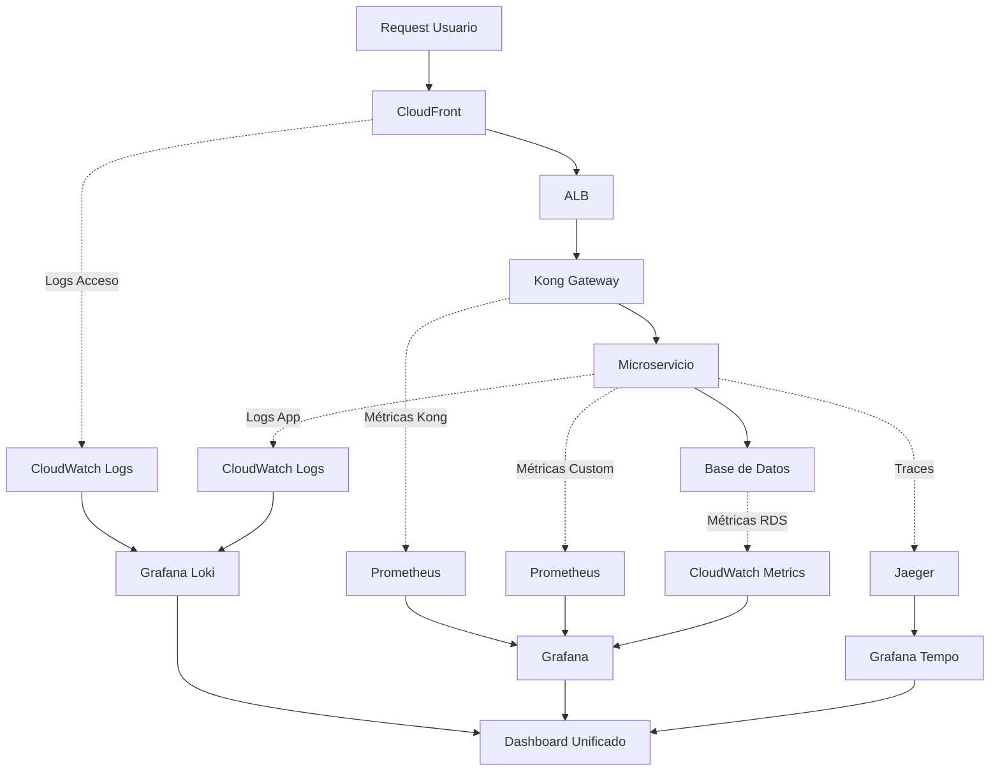

## Introducción

La observabilidad es fundamental para mantener RetroGameCloud operativo y proporcionar una experiencia de usuario óptima. Esta guía consolida las mejores prácticas para monitorización, alertas y debugging distribuido.

<Note>
La observabilidad comprende tres pilares fundamentales: **métricas**, **logs** y **traces**. La correlación efectiva entre estos tres elementos permite identificar y resolver problemas rápidamente.
</Note>

## Arquitectura de Observabilidad



## Golden Signals por Servicio

### Definición de Golden Signals

<Tabs>
<Tab title="Latencia">

* *Latencia**: Tiempo que tarda en procesarse una solicitud

- **P50**: 50% de las solicitudes

- **P95**: 95% de las solicitudes

- **P99**: 99% de las solicitudes

* *Ejemplo de consulta Prometheus**:

```promql
histogram_quantile(0.95,
  sum(rate(http_request_duration_seconds_bucket{service="game-catalog"}[5m])) by (le)
)

```

</Tab>

<Tab title="Tráfico">

* *Tráfico**: Demanda del sistema (RPS, QPM)

- **RPS**: Requests per Second

- **QPM**: Queries per Minute

- **Throughput**: Operaciones por unidad de tiempo

* *Ejemplo de consulta**:

```promql
sum(rate(http_requests_total{service="auth"}[1m]))

```

</Tab>

<Tab title="Errores">

* *Errores**: Tasa de requests que fallan

- **Error Rate**: Porcentaje de errores

- **4xx vs 5xx**: Errores cliente vs servidor

- **Error Budget**: Presupuesto de errores permitidos

* *Ejemplo de consulta**:

```promql
sum(rate(http_requests_total{status=~"5.."}[5m])) /
sum(rate(http_requests_total[5m])) * 100

```

</Tab>

<Tab title="Saturación">

* *Saturación**: Utilización de recursos del sistema

- **CPU**: Porcentaje de uso

- **Memoria**: Utilización RAM

- **Disco**: I/O y espacio

- **Red**: Ancho de banda

* *Ejemplo de consulta**:

```promql
100 * (1 - avg(irate(node_cpu_seconds_total{mode="idle"}[5m])))

```

</Tab>
</Tabs>

### Métricas por Microservicio

<Tabs>
<Tab title="Auth Service">

* *Métricas Críticas**:

```yaml

# Latencia
auth_login_duration_seconds:
  - p95 < 200ms (normal)
  - p95 < 500ms (warning)
  - p95 > 500ms (critical)

# Tráfico
auth_login_requests_per_second:
  - normal: 10-100 RPS
  - alto: > 100 RPS

# Errores
auth_login_error_rate:
  - < 0.1% (normal)
  - 0.1-1% (warning)
  - > 1% (critical)

# Saturación
auth_jwt_cache_hit_ratio:
  - > 95% (normal)
  - 90-95% (warning)
  - < 90% (critical)

```

</Tab>

<Tab title="Game Catalog">

* *Métricas Críticas**:

```yaml

# Latencia
game_search_duration_seconds:
  - p95 < 100ms (normal)
  - p95 < 300ms (warning)
  - p95 > 300ms (critical)

# Tráfico
game_catalog_requests_per_second:
  - normal: 50-500 RPS
  - alto: > 500 RPS

# Errores
game_catalog_error_rate:
  - < 0.5% (normal)
  - 0.5-2% (warning)
  - > 2% (critical)

# Saturación
game_catalog_db_connections:
  - < 70% pool (normal)
  - 70-90% pool (warning)
  - > 90% pool (critical)

```

</Tab>

<Tab title="Score Service">

* *Métricas Críticas**:

```yaml

# Latencia
score_submission_duration_seconds:
  - p95 < 150ms (normal)
  - p95 < 400ms (warning)
  - p95 > 400ms (critical)

# Tráfico
score_submissions_per_minute:
  - normal: 100-1000 QPM
  - alto: > 1000 QPM

# Errores
score_submission_error_rate:
  - < 0.1% (normal)
  - 0.1-0.5% (warning)
  - > 0.5% (critical)

# Saturación
score_leaderboard_cache_usage:
  - < 80% (normal)
  - 80-95% (warning)
  - > 95% (critical)

```

</Tab>
</Tabs>

## Umbrales de Alerta

### Configuración de Alertas Prometheus

<Tabs>
<Tab title="Alertas Críticas">

```yaml
groups:

- name: retrogamecloud.critical
  rules:
  - alert: HighErrorRate
    expr: |
      sum(rate(http_requests_total{status=~"5.."}[5m])) by (service) /
      sum(rate(http_requests_total[5m])) by (service) * 100 > 1
    for: 2m
    labels:
      severity: critical
    annotations:
      summary: "Alto ratio de errores en {{ $labels.service }}"
      description: "Error rate: {{ $value }}% durante 2 minutos"

  - alert: HighLatency
    expr: |
      histogram_quantile(0.95,
        sum(rate(http_request_duration_seconds_bucket[5m])) by (le, service)
      ) > 0.5
    for: 5m
    labels:
      severity: critical
    annotations:
      summary: "Alta latencia en {{ $labels.service }}"
      description: "P95 latencia: {{ $value }}s"

  - alert: DatabaseConnectionsHigh
    expr: |
      pg_stat_activity_count / pg_settings_max_connections * 100 > 90
    for: 5m
    labels:
      severity: critical
    annotations:
      summary: "Conexiones de BD cerca del límite"
      description: "{{ $value }}% de conexiones en uso"

```

</Tab>

<Tab title="Alertas Warning">

```yaml
groups:

- name: retrogamecloud.warning
  rules:
  - alert: ModerateErrorRate
    expr: |
      sum(rate(http_requests_total{status=~"5.."}[5m])) by (service) /
      sum(rate(http_requests_total[5m])) by (service) * 100 > 0.5
    for: 5m
    labels:
      severity: warning
    annotations:
      summary: "Incremento de errores en {{ $labels.service }}"
      description: "Error rate: {{ $value }}%"

  - alert: HighCPUUsage
    expr: |
      100 * (1 - avg by(instance) (irate(node_cpu_seconds_total{mode="idle"}[5m]))) > 80
    for: 10m
    labels:
      severity: warning
    annotations:
      summary: "Alto uso de CPU"
      description: "CPU: {{ $value }}% en {{ $labels.instance }}"

  - alert: LowDiskSpace
    expr: |
      node_filesystem_avail_bytes{fstype!="tmpfs"} / node_filesystem_size_bytes * 100 < 10
    for: 5m
    labels:
      severity: warning
    annotations:
      summary: "Poco espacio en disco"
      description: "{{ $value }}% libre en {{ $labels.instance }}"

```

</Tab>
</Tabs>

## Dashboards Grafana Recomendados

### Dashboard Overview del Cluster

<Tabs>
<Tab title="Panel de Estado General">

```json
{
  "dashboard": {
    "title": "RetroGameCloud - Overview",
    "panels": [
      {
        "title": "Requests por Segundo (Total)",
        "type": "stat",
        "targets": [
          {
            "expr": "sum(rate(http_requests_total[1m]))",
            "legendFormat": "RPS Total"
          }
        ]
      },
      {
        "title": "Error Rate Global",
        "type": "stat",
        "targets": [
          {
            "expr": "sum(rate(http_requests_total{status=~\"5..\"}[5m])) / sum(rate(http_requests_total[5m])) * 100",
            "legendFormat": "Error %"
          }
        ],
        "fieldConfig": {
          "thresholds": {
            "steps": [
              {"color": "green", "value": 0},
              {"color": "yellow", "value": 0.5},
              {"color": "red", "value": 1}
            ]
          }
        }
      }
    ]
  }
}

```

</Tab>

<Tab title="Panel por Servicio">

```json
{
  "panels": [
    {
      "title": "Latencia P95 por Servicio",
      "type": "graph",
      "targets": [
        {
          "expr": "histogram_quantile(0.95, sum(rate(http_request_duration_seconds_bucket[5m])) by (le, service))",
          "legendFormat": "{{service}}"
        }
      ],
      "yAxes": [
        {
          "label": "Segundos",
          "max": 1
        }
      ]
    },
    {
      "title": "Throughput por Servicio",
      "type": "graph",
      "targets": [
        {
          "expr": "sum(rate(http_requests_total[1m])) by (service)",
          "legendFormat": "{{service}}"
        }
      ]
    }
  ]
}

```

</Tab>
</Tabs>

### Dashboard por Microservicio

<Warning>
Cada microservicio debe tener su propio dashboard detallado con métricas específicas de negocio además de las Golden Signals.
</Warning>

<Tabs>
<Tab title="Auth Service Dashboard">

```json
{
  "dashboard": {
    "title": "Auth Service - Detalle",
    "panels": [
      {
        "title": "Login Success Rate",
        "type": "stat",
        "targets": [
          {
            "expr": "sum(rate(auth_login_success_total[5m])) / sum(rate(auth_login_attempts_total[5m])) * 100",
            "legendFormat": "Success %"
          }
        ]
      },
      {
        "title": "JWT Token Generation",
        "type": "graph",
        "targets": [
          {
            "expr": "rate(auth_jwt_generated_total[1m])",
            "legendFormat": "Tokens/sec"
          }
        ]
      },
      {
        "title": "Failed Login Attempts by IP",
        "type": "table",
        "targets": [
          {
            "expr": "topk(10, sum(rate(auth_login_failed_total[5m])) by (client_ip))",
            "format": "table"
          }
        ]
      }
    ]
  }
}

```

</Tab>

<Tab title="Game Catalog Dashboard">

```json
{
  "dashboard": {
    "title": "Game Catalog - Detalle",
    "panels": [
      {
        "title": "Games Cache Hit Ratio",
        "type": "stat",
        "targets": [
          {
            "expr": "rate(game_catalog_cache_hits[5m]) / (rate(game_catalog_cache_hits[5m]) + rate(game_catalog_cache_misses[5m])) * 100",
            "legendFormat": "Hit Ratio %"
          }
        ]
      },
      {
        "title": "Popular Games (Top 10)",
        "type": "bargauge",
        "targets": [
          {
            "expr": "topk(10, sum(rate(game_requests_total[1h])) by (game_id))",
            "legendFormat": "{{game_id}}"
          }
        ]
      },
      {
        "title": "Database Query Performance",
        "type": "graph",
        "targets": [
          {
            "expr": "histogram_quantile(0.95, sum(rate(game_catalog_db_query_duration_seconds_bucket[5m])) by (le))",
            "legendFormat": "P95 DB Query Time"
          }
        ]
      }
    ]
  }
}

```

</Tab>
</Tabs>

## Structured Logging y Correlation IDs

### Configuración de Logs Estructurados

<Tabs>
<Tab title="Formato de Log Estándar">

```json
{
  "timestamp": "2024-01-15T10:30:45.123Z",
  "level": "INFO",
  "service": "auth-service",
  "correlation_id": "req-7f8a9b2c-3d4e-5f6g-7h8i-9j0k1l2m3n4o",
  "trace_id": "1234567890abcdef",
  "span_id": "abcdef1234567890",
  "user_id": "user_123456",
  "session_id": "sess_789abc",
  "method": "POST",
  "path": "/api/auth/login",
  "status_code": 200,
  "duration_ms": 145,
  "client_ip": "192.168.1.100",
  "user_agent": "Mozilla/5.0...",
  "message": "User login successful",
  "metadata": {
    "login_method": "password",
    "mfa_enabled": true
  }
}

```

</Tab>

<Tab title="Implementación en Node.js">

```javascript
const winston = require('winston');
const { v4: uuidv4 } = require('uuid');

// Configuración del logger
const logger = winston.createLogger({
  level: 'info',
  format: winston.format.combine(
    winston.format.timestamp(),
    winston.format.errors({ stack: true }),
    winston.format.
</Tab>
</Tabs>

```